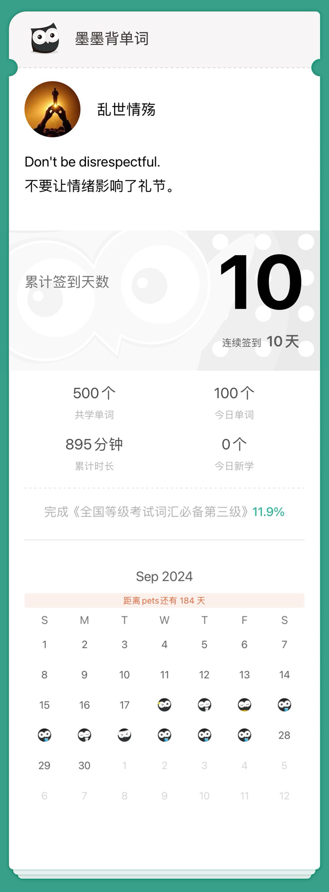

- reputation

- He has a reputation for being lazy.

- skeleton

- I've written the skeleton of my report.

- preserve

- We must preserve our natural resources.

- furious

- There was a furious knocking at the door.

- exclusive

- The two belifs are mutually exclusive.

- radius

- We can compute the circular area with radius.

- rigid

- She was rigid with fear.

- substance

- These is not anything of real substance in their book.

- argument

- She had an argument with her boyfriend.

- aggressive

- An aggressive young man can go far in our firm.

- remote

- It works by remote control.

- finite

- The world's resources are finite.

- cassette

- Cassette tape recorders are out of data now.

- conscious

- The boss is conscious of the risks.

- salute

- I waved to her and she returned the salute.

- opportunity

- The opportunity has not yet arrived.

- disaster

- Wars only brought people disaster.

- criminal

- The criminal was sentenced to prison for theft.

- entertainment

- This hotel is famous for its warm entertainment.

- remark

- Didn't you remark that he was puzzled?

- visa

- Our application for visa was refused.

- expression

- Language is a menas for the expression of thought.

- nest

- a nest of boxes.

- qualify

- This test will qualify you to fly an aircraft.

- dismiss

- We should dismiss all thoughts of revenge.

- ferry

- Please ferry goods to the mainland.

- tractor

- He drove the tractor to his farm.

- dedicate

- I will dedicate myself to science in the future.

- lag

- There is a time lag of about fifteen years.

- boast

- Nobody should boast of his own learning.

- deliver

- The doctor agreed to deliver her baby at home.

- counsel

- I would counsel you not to marry too young.

- overtime

- We were likely to work overtime today.

- shrink

- The jeans will shrink after being washed.

- rot

- The ripe fruit began to rot.

- cease

- The citizens are praying that the war will cease soon.

- marble

- I picked up a marble.

- feedback

- The teacher will give you feedback on the test.

- leisure

- He reads books at his leisure.

- vivid

- The painter paints a vivid picture of his early life.

- couple

- People couple the name of Oxford with the idea of learning.

- appreciate

- Do you appreciate good wine?

- terrific

- He is driving at a terrific speed.

- wound

- Apply medicine to his wound.

- rub

- There is the rub-I don't know whre to begin.

- anchor

- an emotional anchor for her.

- phenomenon

- Earthquake is a phenomenon of nature.

- agony

- The wounded man was in agony.

- enforce

- You can't enforce cooperation between the players.

- contend

- Some scientists contend that there must be life on Mars.

- explicit

- They gave explicit reasons for leaving.

- mission

- They assign a very difficult mission to us.

- resist

- They need to resist this pressure.

- fond

- Some people are fond of light music.

- payment

- They demand prompt payment.

- brass

- God is similar in colour to brass.

- pursuit

- The pursuit of konwledge is a lifelong experience.

- royalty

- This palace was home to French royalty.

- instruction

- If I give you an instruction,you must obey it.

- assert

- They assert that he was innocent.

- acquaint

- Please acquaint us with your plans.

- veto

- The President has the power to veto legislation.

- bother

- I am sorry to bother you.

- wise

- You are wise to remain silent.

- civil

- Ordinary folks are the victims of the civil war.

- cooperate

- They cooperate in perfect harmony.

- abroad

- He hopes to go abroad to study.

- resolution

- You must stand to your resolution.

- frustrate

- The repeated failures really frustrate me.

- clasp

- He gave my hand a warm clasp.

- bud

- Trees begin to bud in the spring.

- council

- He is the spokesman of the council.

- accurate

- His calculations are always accurate.

- survey

- They surveyed the damage caused by the storm.

- damp

- He damped a towel and wrapped it around his leg.

- tempt

- They tempt him to take the drug.

- cite

- to cite someone for murder.

- coherent

- This is a coherent sentence.

- biography

- A biography is a form of narration.

- trifle

- Never trifle with others' affections.

- stomach

- He couldn't stomach such an insult.

- ancient

- He found a piece of fossil of an ancient bird.

- powder

- to powder a woman's face.

- approve

- Please verify and approve the document.

- enormous

- Their losses had been enormous.

- instrument

- The king signed the instrument of abdication.

- dine

- He is going to dine with us tonight.

- decline

- I must regrefully decline your kind invitation.

- patent

- The company applied for patent on its invention.

- eastward

- The river flows eastward into the sea.

- secondary

- It's a question of secondary importance.

- emergency

- The government declared a state of emergency.

- guideline

- The guideline on price and incomes is made by the government.

- technique

- This new technique will boost our food production.

- imply

- Does silence imply agreement?

- infrom

- I informed him that he must start at twelveo'clock.

