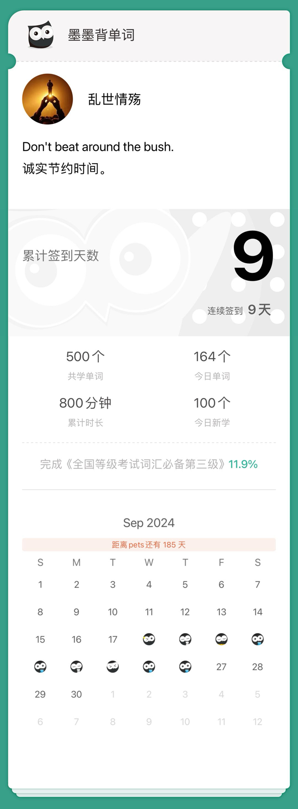

- agenda

- Now let's come to the next item on the agenda.

- phase

- This is just one phase of the subject.

- flush

- She show a flush of joy at his coming.

- curse

- The witch put a curse on her.

- harbour

- It's an offence to harbour the criminals.

- violet

- The violet is a kind of beautiful flower.

- strip

- He shouldn't strip his daughter of the right to be educated.

- tub

- She lay back in the tub.

- parade

- The strikers parade through the city center.

- feast

- The scene was a feast for the eyes.

- competent

- She is competent enough to fill that position.

- detain

- Allow me to detain you for a moment.

- prove

- There wasn't enough evidence to prove him guilty.

- scope

- He has no scope for his ability.

- architecture

- The architecture of this house is very substantial.

- plunge

- There's always a deep breath before a plunge.

- emigrate

- He has decided to emigrate and start a new life in America.

- stuff

- What stuff are the plates made of?

- recruit

- His job was to recruit for the army.

- mist

- Everything was covered in mist.

- cast

- The cobra cast off its old skin.

- specific

- This is speific for cancer.

- consent

- His father could not consent to his leaving school.

- trim

- He went to the barber's for a trim.

- resolve

- His resolve began to waver.

- damp

- He damped a towel and wrapped it around his leg.

- dilemma

- The issue raises a moral dilemma.

- sly

- He cast a sly glance at his bridge partner.

- chancellor

- Chancellor plays a big role on the world stage.

- orient

- to orient oneself to new conditions.

- session

- This year's session of Congress is long.

- envelope

- Please put a stamp on the envelope.

- copper

- Copper conducts electricity better than iron does.

- ambitious

- Only ambitious students get the bese marks.

- consent

- His father could not consent to his leaving school.

- soak

- Water will soak through the earth.

- heritage

- We are proud of our heritage and our culture.

- lag

- These is a time lag of about fifteen years.

- symptom

- The riot is symptom of political instability.

- boast

- Nobody should boast of his own learning.

- narrate

- He continued to narrate his story.

- counsel

- I would counsel you not to marry too young.

- convenient

- It is not convenient for me to ring him up.

- invade

- Don't invade the rights of others.

- approximate

- We approximate the distance as three miles.

- haste

- In my haste I forgot to lock the door.

- diameter

- Measure the diameter of this circle.

- significant

- Economic conditions are significant in many ways.

- capacity

- Her little son has a mind of great capacity.

- cultivate

- lt takes some time to cultivate a new friendship.

- cradle

- the cradle of civilization.

- strengthen

- We must strengthen our unity in the face of powerful enemies.

- evolve

- The dolphin has evolved a highly developed jaw.

- assert

- They assert that he was innocent.

- veto

- The President has the power to veto legislation.

- pretend

- Many people pretend that they understand modern art.

- acid

- These plants prefer an acid soil.

- frustrate

- The repeated failures really frustrate me.

- belief

- The miserable story about him is beyond my belief.

- manual

- Work done by machines has replaced manual labor.

- convict

- The convict confessed his crime.

- tick

- Please tick off what you like the best.

- prospent

- What do you think about the marketing prospent?

- adequate

- His knowledge is adequate to do this job well.

- screw

- The two pieces screw together easily.

- responsibility

- He has no responsibility for that accident.

- fond

- Some people are fond of light music.

- bother

- I am sorry to bother you.

- coherent

- This is a coherent sentence.

- dine

- He is going to dine with us tonight.

- pet

- She's the teacher's pet.

- feedback

- The teacher will give you feedback on the test.

- payment

- They demand prompt payment.

- resolution

- You stand to your resolution.

- licence

- The policeman asked to see his driving licence.

- instrument

- The king signed the instrument of abdication.

- ferry

- Please ferry goods to the mainland.

- leisure

- He reads boods at his leisure.

- historic

- This is a historic occasion.

- period

- We were through the testing period.

- center

- We went into the town center.

- council

- He is the spokesman of the council.

- human

- It's only human to seek a better life.

- dedicate

- I will dedicate myself to science in the future.

- unlike

- Unlike my sister,I am a terrible cook.

- origin

- What's the origin of your anxiety?

- whether

- It is equal to me whether he comes or not.

- clasp

- He gave my hand a warm clasp.

- cite

- to cite someone for murder.

- silence

- The speaker tried to silence the crowd.

- willing

- Nothing is impossible to a willing mind.

- marble

- the marble floor.

- lie

- Don't lie to us!

- royalty

- His income is mainly from royalty.

- cooperate

- They cooperate in perfect harmony.

- survey

- They surveyed the damage caused by the storm.

- anchor

- an emotional anchor for her.

- pursuit

- The pursuit of knowledge is a lifelong experience.

- bud

- the bud of a new idea.

- tempt

- They tempt him to take the drug.

- powder

- to powder a woman's face.

- tail

- to tail after the leader.

- voice

- I voice my opinion.

- wound

- Apply medicine to his wound.

- decline

- I must regretfully decline your kind invitation.

- cease

- The citizens are praying that the war will cease soon.

- agony

- The wounded man was in agony.

- subject

- Our subject for discussion is unemployment.

- enable

- His wits enable him to get a higher position.

- biography

- A biography is a form of narration.

- dismiss

- We should dismiss all thoughts of revenge.

- ancient

- He found a piece of fossil of an anient bird.

- deliver

- The doctor agreed to deliver her baby at home.

- terrific

- What a terrific idea!

- instruction

- If I give you an instruction,you must obey it.

- wise

- You are wise to remain silent.

- furthermore

- I don't want to go there,and furthermore,I have no time.

- pear

- Wound you like a pear?

- nest

- a nest of boxes.

- contend

- Some scientists contend that there must be life on Mars.

- abroad

- He hopes to go abroad to study.

- lifetime

- Learning is the enterprise of a lifetime.

- oiginal

- Her translation sticks closely to the original.

- vivid

- The painter paints a vivid picture of his early life.

- explicit

- They gave explicit reasons for leaving.

- patent

- The company applied for a patent on its invention.

- tractor

- He drove the tractor to his farm.

- overtime

- We were likely to work overtime today.

- enforce

- You can't enforce cooperation between the players.

- acquaint

- Please acquaint us with your plans.

- civil

- Ordinary folks are the victims of the civil war.

- approve

- Please verify and approve the document.

- qualify

- This test will qualify you to fly an aircraft.

- rot

- The ripe fruit began to rot.

- couple

- People couple the name of Oxford with the idea of learning.

- peach

- Peach is the most popular color this season.

- trifle

- They quarrel about a trifle.

- enormous

- Their losses had been enormous.

- phenomenon

- Earthquake is a phenomenon of nature.

- brass

- Gold is similar in colour to brass.

- stomach

- He couldn't stomach such an insult.

- shrink

- The jeans will shrink after being washed.

- rub

- There is the rub-I don't know where to begin.

- mission

- They assign a very difficult mission to us.

