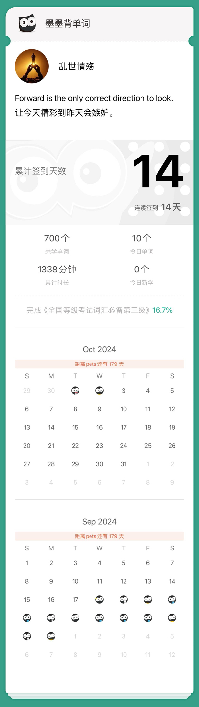

- range

- The children's ages range form 8 to 15.

- immediate

- The immediate cause of death is unknown.

- thrill

- He felt a thrill of fear.

- proposal

- She accepted his proposal of marriage.

- terror

- The whole area was filled with terror.

- spite

- He did it just to spite her.

- detain

- Allow me to detain you for a moment.

- crown

- He opened a bottle of wine to crown the feast.

- architecture

- The architecture of this house is very substantial.

- occupy

- These people occupy an inferior position in local society.

- bent

- He has a bent for history.

- congress

- The congress has approved the new publication laws.

- parallel

- The trees stand in parallel with the road.

- sly

- He cast a sly glance at his bridge partner.

- stranger

- Never trust the stranger.

- nest

- a nest of boxes.

- dismiss

- We should dismiss all thoughts of revenge.

- deliver

- The doctor agreed to deliver her baby at home.

- collection

- The painting comes from his private collection.

- rot

- The ripe fruit began to rot.

- leisure

- He reads books at his leisure.

- diameter

- Measure the diameter of this circle.

- terrific

- What a terrific idea!

- wound

- Apply medicine to his wound.

- phenomenon

- Earthquake is a phenomenon of nature.

- reduce

- He would not reduce it in price.

- explicit

- They gave explicit reasons for leaving.

- cream

- I'II have some cream in my coffee.

- regret

- I regret to say I can't come.

- difficulty

- He faced the difficulty with courage.

- wise

- You are wise to remain silent.

- cooperate

- They cooperate in perfect harmony.

- resolution

- You must stand to your resolution.

- skyscraper

- The skyscraper was wrapped in fog.

- survey

- They surveyed the damage caused by the storm.

- damp

- He damped a towel and wrapped it around his leg.

- summary

- I'm giving you a summary of facts.

- furthermore

- I don't want to go there,and furthermore,I have no time.

- original

- Her translation sticks closely to the original.

- ancient

- He found a piece of fossil of an ancient bird.

- dine

- He is going to dine with us tonight.

- patent

- The company applied for a patent on its invention.

- scream

- A scream broke the silence.

- modern

- Modern medical science has conquered many diseases.

- arrange

- You can arrange the meeting at your covenience.

- portrait

- He is a portrait painter.

- keen

- She has a keen mind.

- swift

- A swift builds a nest.

- catalog

- The librarian has the catalog of all the books.

- purity

- We must ensure the purity of drinking water.

- concession

- She runs a jewellery concenssion in the hotel lobby.

- recycle

- We should recycle the used things.

- realize

- He want to realize the house.

- handy

- The shops are quite handy.

- constitution

- He was responsible for the constitution of a new committee.

- ache

- My head began to ache.

- perceive

- At first I couldn't perceive what he meant.

- monetary

- The monetary unit of the US is the dollar.

- abrupt

- That young man has an abrupt manner.

- consolidate

- The two banks will consolidate in July.

- direct

- Sign posts direct travellers.

- sale

- The shoe shop is having a sale.

- argue

- His clothes argue poverty.

- tunnel

- The engineers had to tunnel through solid rocks.

- annual

- They make an annual visit to Hawaii.

- inflation

- The inflation of the airbed took several minutes.

- conform

- Stundents are required to conform to the rules.

- according to

- Everything went off according to plan.

- assist

- Nurses can assist the doctor in performing the operation.

- gamble

- Don't gamble with your future.

- cautious

- Be cautious when crossing the road.

- pupil

- Teachers seat pupils alphabetically from the fornt.

- consume

- He was consumed with happiness.

- criticize

- I often criticize myself.

- derive

- We derive our food from the land.

- stair

- I hear a step on the stair!

- overcoat

- Put on your overcoat,or you will catch a cold.

- landlady

- The landlady is very kind to me.

- situation

- He was in a dangerous situation.

- evidence

- They have the evidence to charge him.

- spit

- The spit will soon stop.

- elegant

- Her good looks and elegant manners are very attractive.

- urban

- Exploit the urban and rural markets.

- anticipate

- We anticipate hearing from you again.

- foreigner

- He is not from this country.He is a foreigner.

- composition

- We examined the rock to find out its composition.

- erect

- They plan to erect a building.

- inhabitant

- Every inhabitant has an obligation to pay taxes.

- clasp

- He gave my hand a warm clasp.

- worst

- The worst has happened.

- meantime

- I continued working.Meantime,he went out shopping.

- concentrate

- I can't concentrate because of the noise.

- reserve

- to reserve rooms at a hotel.

- complaint

- She made a complaint about the noise.

- boundary

- They marked the boundary of the football field.

- coherent

- This is a coherent sentence.

- draw

- draw one's attention.

- attractive

- Magnets have great attractive power for iron.

- grave

- He preserved his grave and dignified bearing.

- nation

- Spain is a romantic nation.

- commission

- Publishers commission her to translate the book.

- observe

- All citizens should observe the traffic rules.

- cheek

- A tear rolls down my cheek.

- tease

- You should not tease your sister.

- tow

- They threatened to tow away my car.

- excess

- You have to pay for excess luggage on a plane.

- deliberate

- I deliberate whether or not to accept his offer.

- inspect

- Customs officers inspect our baggage.

- paragraph

- Condense this paragraph into a few sentences.

- transmit

- Parents transmit some of their characteristics to their children.

- apt

- an apt description.

