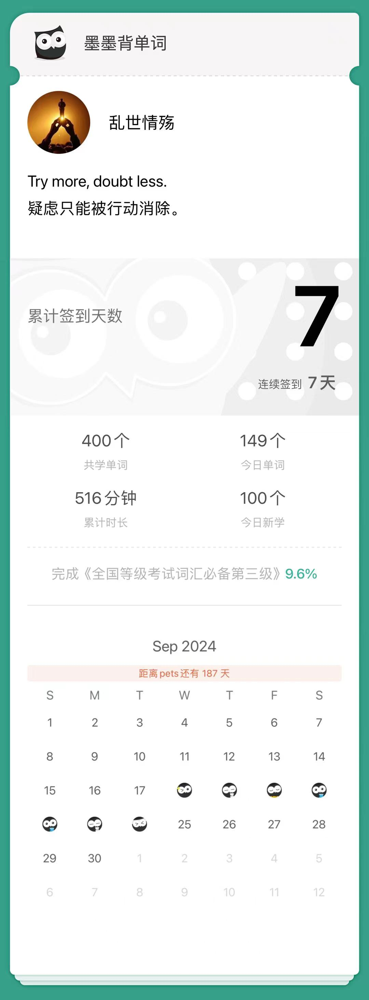

今日复习的单词49个：

expression

Language is a means for the expression of thought.

privilege

It is a privilege to know you.

tank

He destroyed an enemy tank.

pour

pour away the water.

summit

She is now at the summit of her career.

diameter

Measure the diameter of this circle.

glitter

Stars glitter in a clear sky.

significant

Economic conditions are significant in many ways.

scatter

Don't scatter your energy.

liner

The liner is about to leave the port.

crown

They wanted to crown Caesar king.

treaty

There's an unfair clause in the treaty.

fence

They put a fence around the garden.

monitor

This instrument can monitor the patien's heartbeats.

ignorant

He is ignorant of even the most elementary facts.

equivalent

This Chinese word has no satisfactory English equivalent.

kettle

a kettle of boiled water.

frown

I frown at him with impatience.

forecast

The weather forecast says it will be sunny tomorrow.

crack

The metal will not crack under heavy pressure.

pattern

Education follows the same pattern in different regions.

appearance

Don't judge a person by appearance.

bent

He has a bent for history.

tick

Please tick off what you like the best.

dock

The ship was approaching the dock.

congress

The congress has approved the new publication laws.

startle

The least noise would startle the child.

garment

This garment should be washed carefully.

porter

I had to get a porter to help me with the luggage.

shed

The cattle are in the shed.

convenient

It is not convenient for me to ring him up.

perceive

At first I couldnt percive what he meant.

harbour

It's an offence to harbour the criminals.

violet

The violet is a kind of beautiful flower.

detain

Allow me to detain you for a moment.

conscious

The boss is conscious of the risks.

architecture

The architecture of this house is very substantial.

plunge

The whale took a plunge into the deep water.

emigrate

He has decided to emigrate and start a new life in America.

trade

I refuse to trade with that company again.

recruit

His job was to recruit for the army.

mist

Everything was covered in mist.

frustrate

The repeated failures really frustrate me.

resolve

It has taken forever to resolve these problems.

damp

He damped a towel and wrapped it around his leg.

criminal

The criminal was sentenced to prison for theft.

dilemma

The issue raises a moral dilemma.

sly

he cast a sly glance at his bridge partner.

chancellor

Chancellor plays a big role on the world stage.

今日学习新词100个：

boast

Nobody should boast of his own learning.

handbook

She is reading a handbook on gardening.

signal

The railway signal showed that the train could pass.

fridge

Put the milk into the fridge.

accompany

She will accompany the song on the violin.

convict

The convict confessed his crime.

grain

Grain is used for making flour.

narrate

He continued to narrate his story.

impress

I impress him as a scholar.

indoors

The rain made us stay indoors.

veto

The President has the power to veto legislation.

flee

The fightened people flee from the fire.

drema

The drama builds steadily toward a climax.

screw

The two pieces screw together easily.

housewife

She became a housewife after the marriage.

best

He is my best pal.

capacity

Her little son has a mind of great capacity.

strengthen

We must strengthen our unity in the face of powerful enemies.

god

Gold bless you!

belief

The miserable story about him is beyond my belief.

both

She is both a soldier and a poet.

session

This year's session of Congress is long.

invade

Don't invade the rights of others.

blog

I blog every day to record my life.

shopkeeper

The shopkeeper cheats his customers.

manual

Work done by machines has replaced manual labor.

release

Don't release this news to the public.

gold

I will offer you 250 gold pieces!

westward

They had walked for three days westward.

learn

How did you learn to bake cakes?

jump

She took a jump backward.

skyscraper

The skyscraper was wrapped in fog.

adequate

His knowledge is adequate to do this job well.

cradle

the cradle of civilization.

pitch

The pitch depends on the frequency.

conversation

I had a conversation with your teacher.

goose

She dislikes to eat goose.

heritage

We are proud of our heritage and our culture.

snatch

Let us snatch an hour of sleep

lazy

Lazy people seldom succeed.

concentrate

I can't concentrate because of the noise.

roast

His favorite dish is roast duck.

counsel

I would counsel you not to marry too young.

reduce

He would not reduce it in price.

luxury

The diamond was a luxury to her.

prospect

What do you think about the marketing prospect?

stranger

He is a stranger to me.

haste

In my haste I forgot to lock the door.

cultivate

It takes some time to cultivate a new friendship.

assert

They assert that he was innocent.

soldier

He showed himself a brave soldier.

stoop

Don't stoop to quarrelling with her about it.

wheel

Nobay can roll back the wheel of history.

tennis

I am not good at tennis.

summary

I'm giving you a summary of facts.

peasant

Peasants will sow wheat in spring.

lag

There is a time lag of about fifteen years.

drill

Let them drill in teams.

evolve

to evolve step by step.

customer

He met the need of the customer.

financial

This company was in serious financial difficulties.

soak

Water will soak through the earth.

offend

I didn't mean to offend you.

partner

We hope that we can be your strategic partner.

choke

The strong smell makes me choke.

lately

I haven't had enough sleep lately.

compass

She had to rely on a compass and a lot of luck to get there.

ambitious

Only ambitious students get the best marks.

approximate

We approximate the distance as three miles.

thread

I've lost the thread of your argument.

belong

These boots belong in the closet.

envelope

Please put a  stamp on the envelope.

collection

The painting comes from his private collection.

