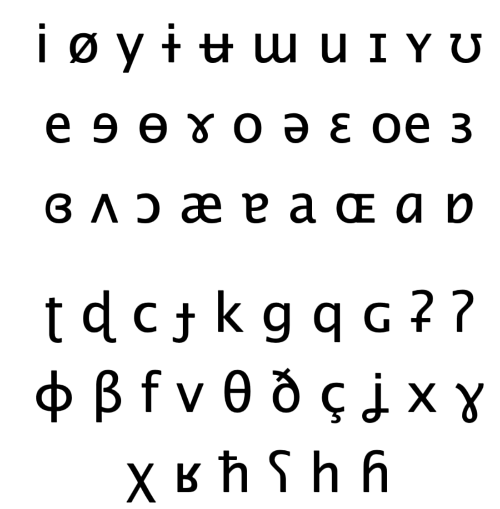
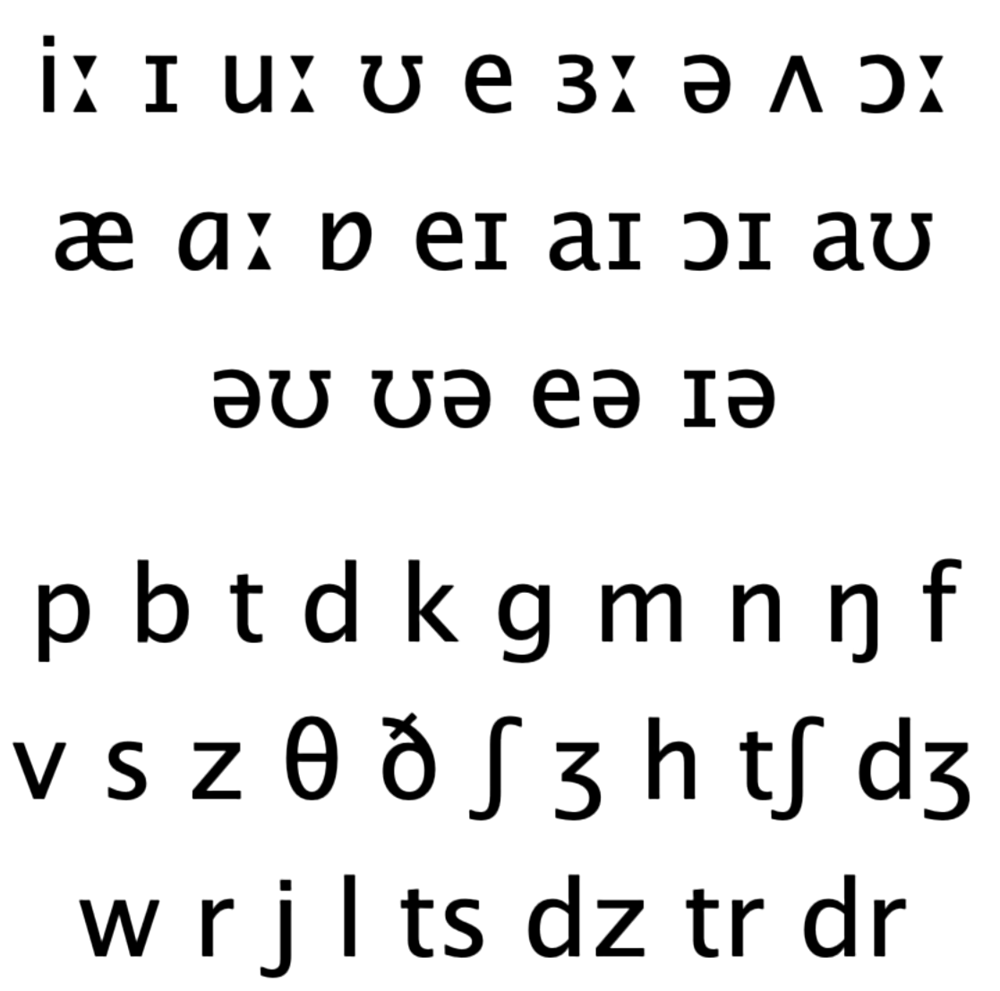
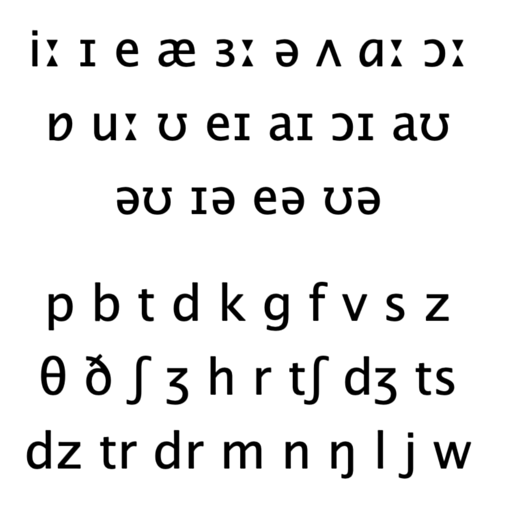
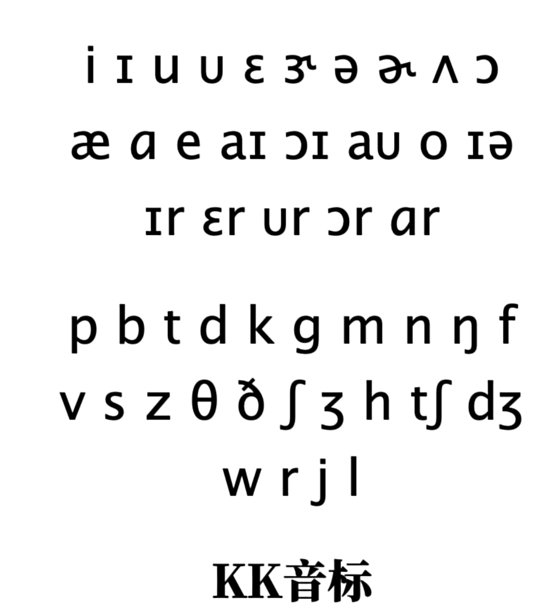
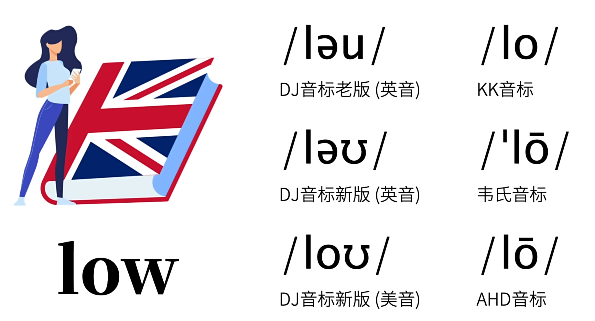

以上音标属于国际音标，用于给世界上所有单词注音用。

常见英语音标应该是上面这个图，丹尼尔·琼斯，给那个19世纪的英音设置的。

他将上面的国际音标转化成了下面这个图，实际上并不叫国际音标。

避免混淆，更名叫DJ音标

新版本的音标应该是，下面这个图，由他的徒弟做的，有了一些变化。

美国人也做了一套音标叫KK音标，在台湾用的比较多，美国也很少用。

在读单词时要知道他是DJ音标还是KK音标

韦氏音标和AHD音标是美国人本土喜欢用的音标，他们看不懂DJ音标和KK音标。

大多数的美国人不用音标，他们看不懂。一般用Respelling，常用音的发音。

到底用哪一个音标？

DJ音标被词典常用。

# 元音

- 区分元音的三元素

- 舌位的前后

- 发音时舌面隆起的最高点在口腔中的位置

- 用中文感受

- 币

- 兔

- 哈 

- 舌位的高低

- 嘴唇的圆唇度