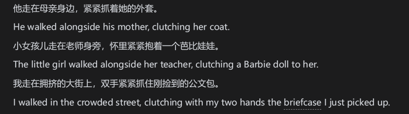

# 英语学习的有效方法

英语译学法，顾名思义就是通过翻译和对比学习英语。

- 好处有什么：

- 顺应汉英思维

- 利用母语而不排斥

- 重视对比，利用对比，发现规律。

- 强调英语学习的技术性，英语学习的关键是练，只有反复练习才能熟能生巧

- 重视复习，便于复习。

# 英语三习

什么是三习？

学习、练习和复习。学习是为了理解，练习为了熟练，复习为了巩固。

学习就是动脑思考，为了看懂英语，弄明白意义、包括段意和整篇意义。不仅要动脑，还要动手查词典，语法书。一遍查一边研究。在英语译学法里，最重要的动手是拿起笔来翻译，将英语翻译成汉语。在这个翻译成汉语的过程是十分艰难的，翻译的达意传神，你就会对它过目不忘。

练习便是要动口，语言不动口就像只在课本上学游泳一样，一事无成。首先是熟读，两个语言的发音差别很大，这只能靠一只动嘴皮子才能形成惯性。要想流利说英语就必须把一个句子读上几十遍甚至上百遍。目的在于使发声器官习惯英语因素，并保持很长时间。实际上学外语就如同弹钢琴，要把嘴巴练得像钢琴家的手一样。

第三习是复习，那便是汉译英。

学习理解不要过多耽搁时间，要把重心转移到后两步上去，特别是复习。

# 学习英美英语的方法

什么是英美英语？

就是那些以英语为母语的人的英语

- 利用英语译学法学习的四个步骤

- 学习

- 借助词典或别的什么将文章或课文读懂

- 提取

- 将有用的句子选择出来，翻译成地道中文

- 这一步可以借助专业人士的翻译

- 练习

- 将英语句子读熟

- 复习

- 看着汉语说英语或者写英语。

- 要回想两句话之间的差异，不停比较，找出差别。

# 收集有价值的句子

什么是有价值的句子？

我们的目的是摆脱哑巴英语和中式英语，提高英语表达能力。那么，和汉语差别很大的句子便是有价值的，差别越大，价值越大。

这些句子的特点是我们必须对词汇、短语、句式等做很大的调整。

很多英语句子含有成语，任何语言都有成语，这是精华所在。中国学生往往会忽略这一点。

# 改造英语

收集英语句子时可以会碰到一些句子，有学习价值，内容却不适用，背的滚瓜烂熟也用不上。这时候就需要改造句子。改造句子实际上模仿造出新句子。

在英语学习中，很多内容和我们的生活、工作、环境关系不大，例如教材里的很多美国的事情，如果我们不去美国生活，那在中国使用这类句子的机会就很有限。

# 再谈学习中国英语

学习和使用中国英语不仅是学生的实际需要，而且是国家的需要。中国现在非常需要用英语将中国文化推介给世界，可我们的学生在这方面居然这么空白。

# 学习中国英语的方法

第一步读懂英语，在分析译文和原文，仔细对比，弄清为什么这样翻译和差别在什么地方。

凡是都有个先难后易，尽管英语和语文的语序上差别巨大，多多对比就能慢慢形成牢固的观念。关键是注意英语怎样表达，并记住这些表达。记忆的时候要汉语和英语一起记。

# 关于译学法的几个问题

译学法和翻译法有什么区别？

- 语法-翻译法主要是老师用，英语译学法则是学习方法，学生用。

- 语法-翻译法重输入，不重输出，翻译的目的是辅助理解，完成输入。而英语译学法是为了提高学生外语输出能力设计的。

- 语法-翻译法不重视母语和外语的对比，翻译是帮助理解的步骤，而不是对比的手段。英语译学法则力图通过对比，发现异同的规律，以便指导以后得学习。

- 语法-翻译法重书面语，轻视口语，而英语译学法对两者同样重视。

汉译英要建立在有正确的汉语翻译的前提上，不能一股脑的投入全英文原著。

什么是死记硬背？和译学法差不多吗？

译学法并不是死记硬背，靠的是对英语的侧透理解，复习和练习阶段对英语句子的背诵是不能马虎的，连标点符号都不能错。

但是学生对这种背诵都很反感，这怎么办？

如果背的东西全是外国的东西，那么学生自然会反感，所以要先对句子进行改造。

Jack bought a book.杰克买了一本书

- 第一个任务，背下这句英文

- 第二个任务，看着中文说出英文。

第一个任务就是你要背下这些单词，一个都不能错。

第二格就完全不同，你不用背下中文意思，因为你看汉语就知道意思了，只要记住的只是句子的特定词、短语、句式和语法特征，这样记忆的负担就很少了。

对比汉语和英语，这似乎不是学习英语，而是研究英语了？

实践证明，直接投入英语的过程事半功倍，收效甚微。只有深入剖析英语句子并和中文对比，看着耗时、费力、艰苦，但却是学好英语最扎实、最可靠的“捷径”，这才是真正的英语学习。

英语句子千千万万，难道都要记住？

任何一种语言的学习，都是一个个词，一个个句子积累起来的。“高山起微尘，千里始足下”。

那我们要记住多少英语句子才是标准呢？

英语学习是没有上限的，是一个不断提高的过程，只能说是“韩信点兵，多多益善”，这个英语译学法在英语学习阶段是越早用越好，越多越好。

如果英语译学法碰到了没有差别引起的错误怎么办？

不要紧，译学法都可以统统拿下，毫不留情，不要只重输入，不重输出。好处在于从输出中学习，出现什么错误都能立马纠正。

# 建立自己的小语料库

将你学过的句子、收集的句子和改造的句子，按照先汉后英的顺序输到word文档里，还可以根据需要进行分类，这样做的目的是为了方便复习。

注意要看着汉语想英语的复习。

# 利用译学法教英语

一要讲解英语语言点，二要讲解汉英差异。讲解英语语言点是为了正确完成英汉转化，讲解汉英差异是为了让学生掌握汉英转化的特点和规律。

第一步理解原文，这一步要快，不要拖泥带水。这样可以腾出时间复习和练习。