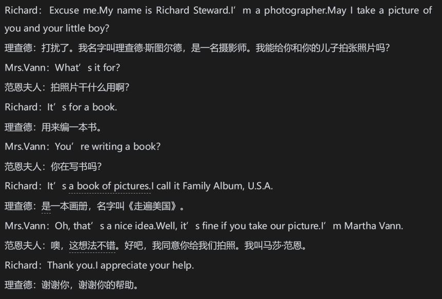

# 对比

## 英语不是汉语

吕叔湘曾在1962年出过一本书叫《中国人学英语》，在当时产生了很大的影响。并对中国人学英语遇到的实际问题，在学习方法、语音、词义、动词时态等方面做了细致的分析和讲解。并在开篇说了一句：“英语不是汉语”。这个道理世人皆知，无人不晓。但他说，知道一件事，实行又是一件事。您学习的时候，还是不知不觉把英语当成和汉语差不多的东西看待，不知不觉地在那比附。就是硬要搞英汉对应，搞“拉郎配”。明明不是一种东西，却要等同起来。

## 英汉差别巨大

前面说的“无话‘和”错话“都可能导致了交际失败。有时候，”错话“比”无话“后果可能更严重。张嘴就”What are you doing?“"Where are you going?"老外会觉得你不礼貌。再比如想用英语表达”我很容易感冒“，结果说出了”I am easy to catch cold“.这就闹出了笑话。

处处拿汉语的说法套英语会闹出笑话，这便是中式英语。

凡是出现这种错误的人，都忘了英语和汉语不是一回事，它们之间差别很大。要记住“英语汉语，差别很大”，要有这个差别意识，但还不够，还要有对比意识。

## 树立对比意识

学英语时、使用英语时，用于不要忘了进行英汉的对比。要时时进行对比，这样就可以说树立了对比意识。

《走遍美国》的一段话：

英语时地道的英语，汉语是正确的汉语。这样就可以进行对比了。

It's book of pictures中it在汉语中被省略了。另外book of picture和“画册”的词序上不同。than you后是句号。汉语中谢谢你，如果后面还有其他东西的话，一般要用逗号。

这也算差异？

当然算，如果你说Than you, I appreciate your help.那就错了，than you是一个玩具，不能再以逗号引起另一个完整句。

这真是无一句无差异了。不过差异很小，也需要对比吗？

英汉差别是一种知识。知识的积累，绝不能“只打老虎不打苍蝇”，“不积跬步，无以至千里；不积小流，无以成江海。”

比如my name is ，习惯译为，“我的名字叫”，如果不注意写成了My name is called....，这就错了。说差别小，是因为你的英语水平已经达到一定程度，对它们无比熟悉，但对水平不高的人来说，情况就不一样了。

## 对比的必要性和重要性

日常生活中，我们要不断地做出判断，得出结论，而做判断、得结论常常离不开对比，只不过这个对比很多情况下是潜意识的，机械化的，我们意识不到。我们说要树立对比意识，就是要有意为之，主动去对比，去发现差异，找出规律，从而学好英语。我们平时学英语也会对比，但多是英语内部的对比。例如学习时态现在完成时，要和一般现在时和一般过去时进行比较。这些都是英语课堂上经常用到的办法。总之，对比是人类认识事物、研究事物的一种基本方法，也是语言学习和研究的一种办法。

吕叔湘：

我相信，对于中国学生最有用的帮助是让他认识英语和汉语的差别，在每一个具体问题，词性、词义、语法范畴、句子结构上，都尽可能用汉语的情况跟英语作比较，让他通过这种比较得到更深刻的领会。只有比较才能看出各种语文表现法的共同之点和特殊之点。

其他语言学家：

本族语的相同点在学生学起来会很简单，没有的元素，他们会感到困难。教师如果时常对比，他们就能更好的了解真正学习困难所在，并能更好地组织教学。

最有效的教材是这样的教材：它的立足点是一方面对所学的外语进行科学的描写，一方面又对学生的母语进行相应的描写，并加以仔细的比较。

学英语不对比就看不出差别，哪来的“差别意识”？所以，没有“对比意识”，就没有“差别意识”。没有“差别意识”，就会想当然地按汉语去“创造”英语。

明白是一回事，做到又是另外一回事。所谓“有意识”，就是能自觉地去做，总想着去做。

英汉对比应该很困难吧？我们学生可以搞吗？

只要从学习英语的角度出发即可，而不是为了语言学理论的研究。

## 对比靠翻译

实际上我们读英汉对照的翻译回去看看汉语，知道他的意思，并不会去对比。

这样读英汉对照的书，对提高英语的表达能力帮助很小。咱们来看一句话：He was a quiet and thoughtful man, even a little shy as he welcomed his visitors and urged them to be seated and to tell how he could help them.译文是：他举止文静，待人体贴，在迎接客人，招呼他们坐下并询问有何见教的时候，甚至还有些腼腆。

读的时候，自然地去观察英汉语不同的表达方式，找出差别所在。

比如He was a quiet and thoughtful man翻译成“他举止文静，待人体贴”，差别很大，英语的形容词加名词结构变成了四字短语，这样翻译很符合汉语的表达习惯。

不明白了，翻译了，对比了，目的是什么？咱们不是讨论怎样学习英语吗？你这难道是搞对比研究？

为了学好最难学好的东西，就是说和写，我们难免要搞一些，但不会很深、很理论化。