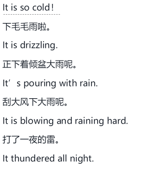
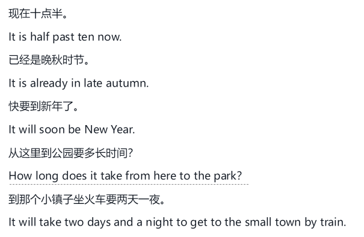
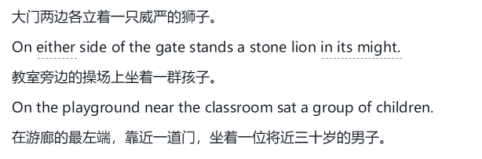
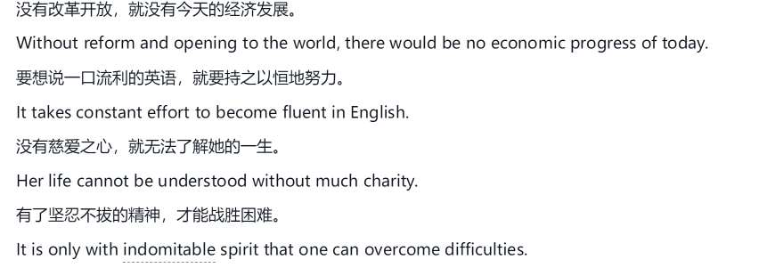

# 句式对比特别重要

英语可以随意倒装次序，汉语不行，有且仅有一种句式。

学习一门外语，一定要以句子为根本，学了词或短语，最终目的都是为了表达出正确的句子来，不但词汇、语法上要正确，句式上也要地道、正确、丰富。

# 汉英句式的最主要差别

汉语句子是“竹式结构”，英语句式是“树式结构”，英语句子有主干，也就是基本句，其他都系都可以剔除。

汉语叙事一般讲究时间顺序，先后展开。英语则把常安排在主干句里。

# 汉语和英语的句子

汉英转化时，不要以汉语句号为标准，拿英语一句话去对应汉语一句话，而要根据以小句构成的意群来思考、转换，这样就灵活多了，转换起来相对容易。

# 汉语简单主谓句

汉语的句子分为单句和复句，单句由一个句子构成，复句由两个或两个以上小句构成。单句又分为主谓句和非主谓句，能分析出主语和谓语的叫主谓句，无法分析出主语和谓语的叫非主谓句。主谓句和非主谓句是所有句子的基础部分。

# 汉语无主句

第一类表示天气、气象情况的句子，没有主句

第二类是表示时间、距离等的句子，转换为英语也常用it做主语。

第三类是说明事物存在、出现或变化的句子，有个名字，叫存现句，常见格式是：处所或时间+动词+名词性词语

第四类是表达真理、哲理或某种道理、经验的句子

第五类表达规定、要求、号召、禁止等内容的句子。

# 汉语话题句

汉语的很多主语说不通，如果按英语语法判断的话。

水果还是橘子好吃。

使用话题剧解决

话题是宾语或宾语的一部分

戏法人人会变。​（人人会变戏法。​）

话题是介词短语变化而成

大碗吃得又快又多，容易胖。​（用大碗吃得又快又多，容易胖。​）

话题是后面词语的修饰语

凤姐儿嘴特巧。​（凤姐儿的嘴特巧。​）

话题和后面说明部分形成判断关系

这个人教书的。​（这个人是教书的。​）

话题和后面的词语形成被动关系

小偷抓住了。​（小偷被（警察）抓住了。​）

# 汉语连动句

什么是连动句？

主语后面连续跟了两个或两个以上的动词或动词短语，和主语形成主谓关系，这样的句子就是连动句。

他站起身来轻轻打开门朝外看了几眼。

英语要找出重点，确定主次，主句为本，次语为枝。

# 汉语流水句

一个小句接一个小句，很多地方可断可连。

# 掌握好英语从句结构

当两个或更多在意思上有主从之别的句子合并时，我们要观察分析它们的关系，看哪个表示主要的意思，哪个表示从属的意思，从属的意思和主要的意思中间有哪些联系。

# 被动句

汉语里的被动句很少，要多注意对比和使用。