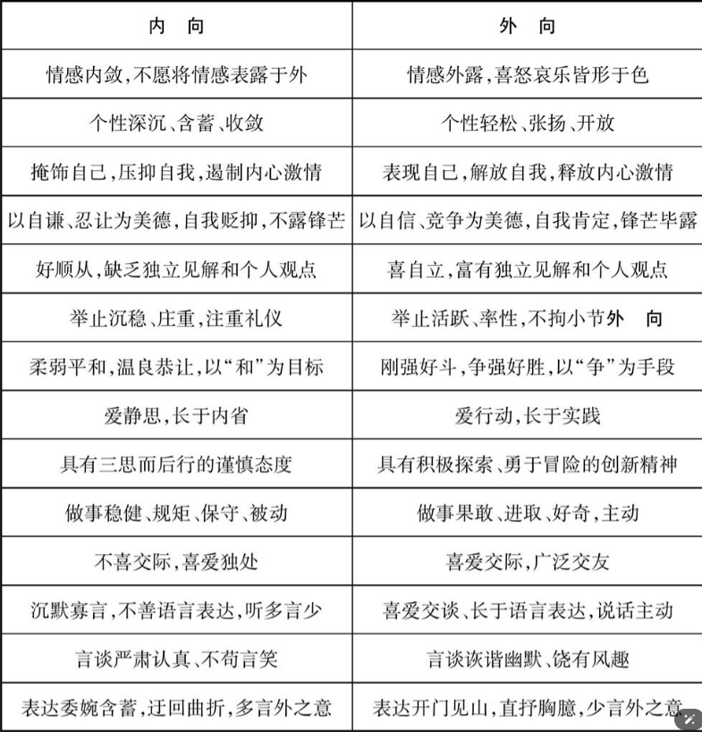

# 文化无处不在

文化是一个群体所共有的精神、知识和艺术的总和，包括其传统，习惯、社会风俗、伦理道德、法律法规和社会关系。

咱们国家每年都有大量青年学生去美国留学，其中不少就是因为不能适应美国的文化而中断留学，被迫回国，他们就是因文化而“休克”的人。

# 文化和语言

第一，在文化的各个部分中，语言这个部分非同小可，可以说是最重要的部分，是文化的“顶梁柱”​，有了语言，文化才能成为一座“大厦”​。

第二，语言是文化传播的最重要载体，也可以说是工具，它将文化从古传到今，从近传到远，跨越时间和空间，使人类有了“千里眼”和“顺风耳”​，使历史与文明得以延续传承，使世界缩小成一个小小的地球村。

第三，语言还是文化的镜子，能够表现文化、反映文化，通过语言，我们可以了解一个民族、一个国家的文化。

中国文化非常强调尊人卑己，自谦的表现很多，比如听到别人夸奖的时候，要说些表示拒绝的话，有时甚至说得很重。

# 文化错误

如果英语流利，还犯下文化错误，对方可能会认为你是故意的。

# 文化对比与翻译

第一是要增强文化学习意识，随时注意学习文化知识。

第二点是要找些专门讲文化知识的书，比如跨文化交际方面的书来读，从中可以集中学习文化知识和文化差异，效率能大大提高。还有词典。

# 重内向与重外向

# 重整体与重个体

咱们汉语写地址是先大后小，先说国家，再说省份、县市、乡镇、街道等，而英语则相反，完全倒过来。

# 人文英语

​“人文”指的是人类社会的文化现象，​“人文英语”是指以深厚的文化修养为基础的英语学习。

一是分散学习，二是集中学习。