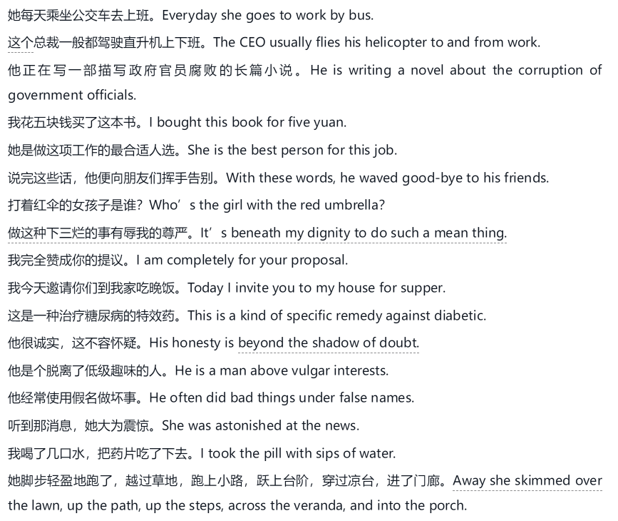
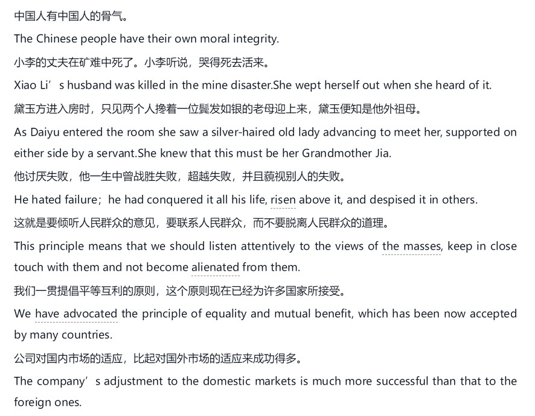

# “人治”和“法治”

英语语法就是规定我们怎样使用英语的原则，没有英语自然环境，我们就不能再语言的使用中自我纠正错误。

“法治”的英语是指受语法严格约束，没有弹性。

“人治”的汉语只需要意思表达清楚即可。

# 动态语言和静态语言

汉语喜欢用动词，英语喜欢用名词。

在将英语转化成汉语的时候，如果汉语的名词用的多了，那样句子会变得很别扭。

# 英语抽象名词

名词分为专有名词和普通名词。

普通名词分为具体名词和抽象名词。

具体名词是看得见摸得着。

抽象名词就是抽象概念的，例如意志、情感、性质、关系。

汉语不喜欢把动词和形容词说得像名词一样。

英语在表达上的最大特点之一就是大量、广泛地使用由动词或形容词派生或转化来的抽象名词。

# 汉语范畴词

范畴词是汉语里的一类抽象名词，它们往往跟在其他的词后面使用，本身的意义想当笼统、模糊。但是译为英语就不需要写出来，因为他们词语都包含了这个意思。

例如“解决办法”，solution method，method不需要说，solution已经包含了way的意思。

# 英语行为抽象名词

因为产词能力很强，有很多动词变名词的后缀，例如-ion,-tion,-sion,-ment,-ance,-ence,al,-ure-,ing.，汉语不喜欢由动词转化成名词。

# 英语-er类表人名词

以-er或or结尾，表示“做......的人”

# 汉语动词和英语介词

汉语很少用介词，因为他可以连续使用动词。

我带上帽子骑自行车去食堂买午饭。

英语介词有280多个，能否熟练运用介词是真正掌握英语的标尺。我们应该有很强的意识，常想着将汉语动词词组转化为英语介词词组，这对纠正中式英语很有帮助。

# 汉语动词和英语形容词

汉语的动词特别多，在用英语表达的时候多转化为形容词。

# 英语品质抽象名词

汉语里的抽象名词，加上.......性，例如危险性、重要性。但是灵活性相比英语差了很多。

英语品质抽象名词译成汉语时不得不用形容词。

# 代词和连词

汉语可以重复使用名词，英语不喜欢重复。

