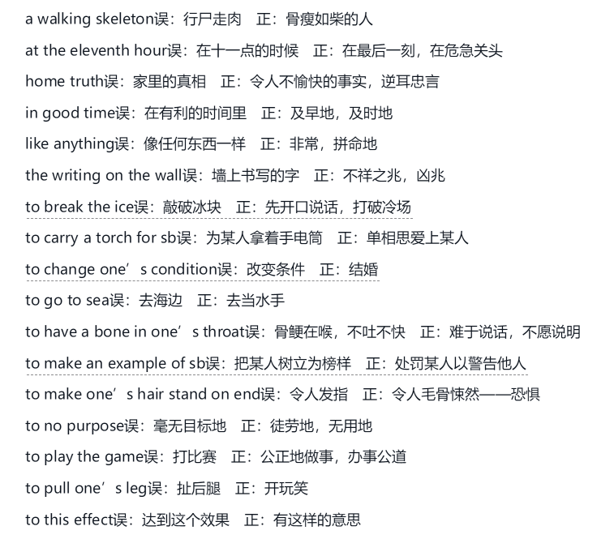
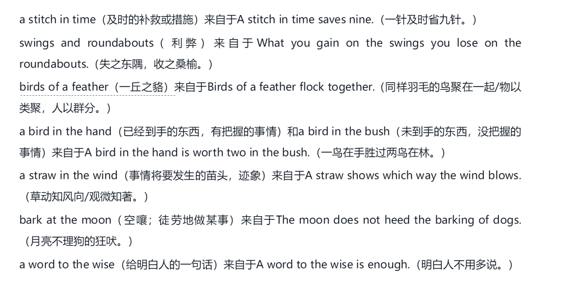

# 语汇和成语

什么是语汇？

指的是成语、惯用语、歇后语和谚语的总汇。

# 固定搭配

固定搭配在英语中就像成语一样，指结构固定的构成词，the last straw.

# 短语动词

第一词是动词，后面是副词或介词。

look after

look ahead

look around

look around for sth.

学好这种词汇可以克服哑巴英语，提高口语能力。

# 隐喻成语

例如“水滴石穿”，隐喻了坚持不懈，一定就能成功。多学习这种词汇是了解异国历史文化和生活习俗的最佳途径之一。在翻译成外语的时候，不要过重成语的形式，只需要表达出意思即可。

# 典故

外国人熟知的历史上的事件和故事，古代神话传说和寓言故事，古代著名文学作品，这种都是极其包含文化知识的成语，例如 to raise Cain，在西方是家喻户晓。

# 明喻成语

as poor as Job,

# 成对词

again and again,out and out,over and over,two and two.

hue and cry

back and forth

# 英汉成语里的“假朋友”

例如，It s nice and sunny today，以为是今天天气好，阳光明媚。但是nice and是成语，起强调作用，译成“很”“非常”

# 谚语

# 关于cliche

类似新词、新句、新玩意

# 重视英语词汇学习

什么是语块？

类似固定搭配、短语、成语、谚语等，还包括许多固定或半固定的表达语句。

学英语就直接从学语块入手，不要只记单词，然后再去造句，这样会导致“创造英语”

学习语块的两个好处

一、提高语言的流利性

二、提高学习者语言的地道性