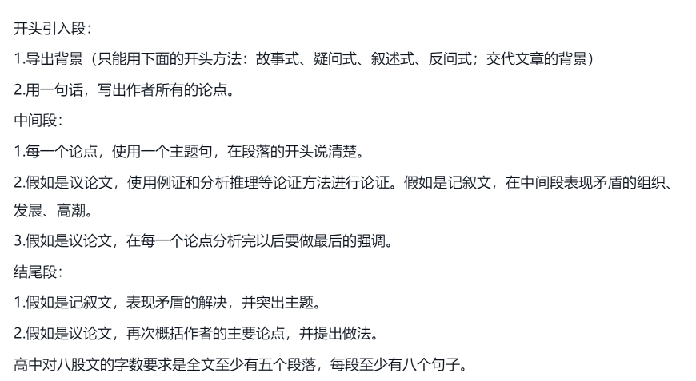

# 段落结构

古代汉语不分段，到了近代学了西方才有段落，但是也不严谨，很随意。

英语一段里只表达一个内容，一个话题。

# 主题句

英语段落时只记住一件事就可以了，那就是主题句。如果主题句写好了，后面紧跟上支持句，来进一步阐释、说明主题句的内容，一个段落就写成了，而且也不会跑题。

西方人爱演绎，中国人爱归纳。

# 演绎与归纳

所谓演绎，就是从一般到具体，先给出结论或说明事理，再列出与之相关的具体事实；而归纳则相反，是从具体到一般，也就是先将具体事实讲清楚，再引出结论。

英语文章是否能理解，是否容易抓住主题思想，作者是负全责的，他应该把观点和论点清清楚楚地摆在最显眼的位置，要让读者不费力就能把握住，而汉语文章则相反，表达中心思想不是那么直截了当，而是犹抱琵琶半遮面，婉转含蓄，能否把握，让读者去负责。

# 篇章架构

英语八股文。

# 衔接手段

理解英语靠直观，理解汉语靠领悟。靠领悟就是指在没有外在形式表现的情况下，依靠意义去揣摩、理解句子之间的关系，而英语大都把这些关系表现在形式上，用语法手段显露在外，靠直接观察就容易捕捉到。