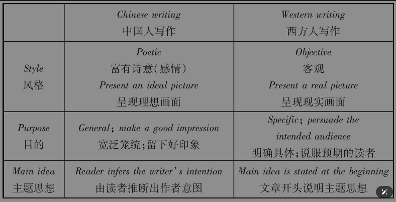
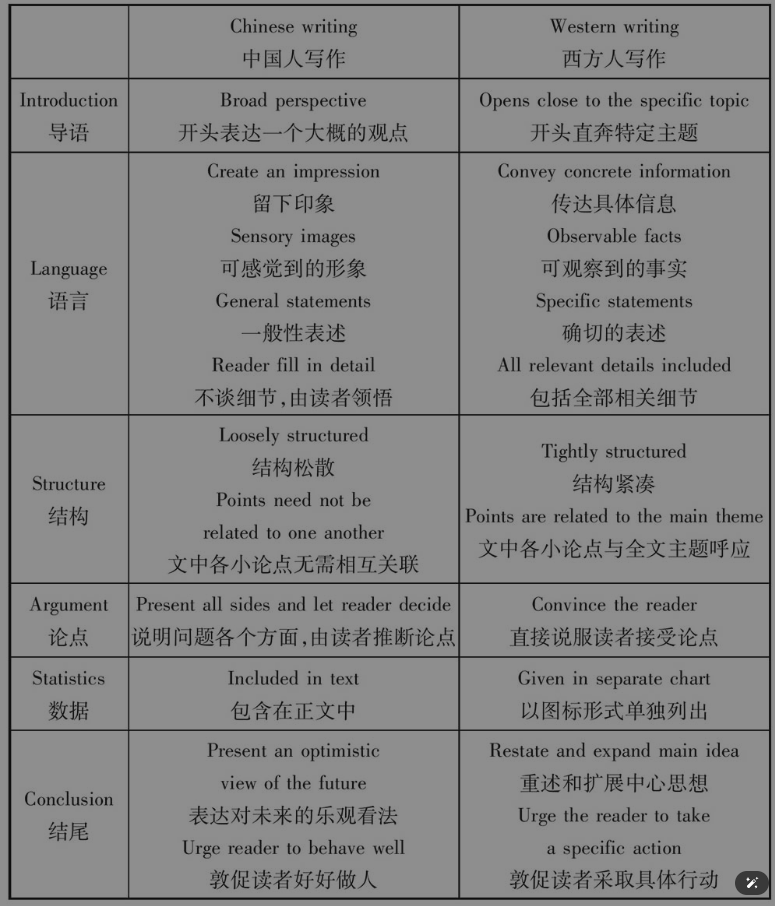

# 学习写作的目的

听说读写译，四年大学里就只有写是最没用的，因为英语写作毕业后工作用不上就荒废了。

在大多数英语专业学生毕业后就很少用英语写作的需要，甚至连写封英语信的机会都极少，更不用说写议论文什么的了。但是另一方面代表这是一种储备性学习，要记住有备无患，平时不烧香，临时抱佛脚，肯定会吃苦头的。能写一篇好文章，不但表现语言文字能力，还说明思辨能力、想象力、创造力等也很强，还包括逻辑性，所以，学习英语写作也是全面发展英语能力的有效手段。

# 翻译与英语写作

当你用英语写作的时候，是脱离不开中文思维的，你没法直接用英语思维直接思考然后写作英语，所以多联系汉译英，就可以把你的中文文笔体现在英文上，而不是写出一些贫乏、简短的词和句子。

# 写作中的对比

第一，要重视英汉在书面上的差别，这和口语差别很大，口语的句式较短，句法表现很少。

第二，汉语在句法上没有明显表示不同语体的特征，而英语在这方面却是强项。通过翻译找出英语书面语语体的特点非常重要

第三，通过汉译英记住英语句子时要举一反三

第四，汉语中常用人称代词，而英语常用非人称代词，如果能掌握去差别便能克服中式英语。

# 中西写作差异

汉语的写作和英语的写作差异很大，如果不知道这些差异，单纯用译学法掌握的英语句子也不能让你写出一手好文章。

中式作文的英语表达仅局限于给中国人看，外国人看不懂也看不惯 。

# 书面语口语化问题

为什么中国学生会有将口语化的英语写进作文的表现呢？

因为中国学习英语时都从简单的口语开始，开始得早，学习得多，印象就比较深，加上重复次数多。英语老师也没有灌输这方面的知识。汉语在这方面并没有语体上的差别，导致了英文写作有了这样的误导。

# 英语写作课

这个课程只主要写作知识和技巧，而不重视表达，连英语意思都表达不好谈何写作呢？即便知道技巧，也是无用武之地，那还有什么意义呢？

以写促学，我们的汉语水平便是这样提高的。莫言便是如此，尽管他小学也没毕业。但是这和英语写作有很大不同。要首先解决汉式英语的想法，没有思想就不会有文章。