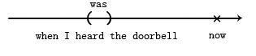
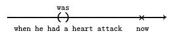
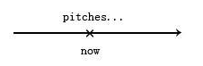
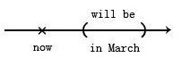
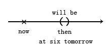
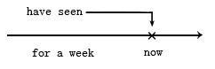
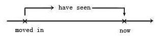
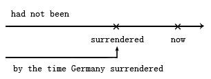
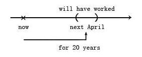

# 动词时态

## 简单式

简单式的时间是括弧的形状

### 过去时间

- The U.S. established diplomatic relations with the P.R.C. in 1979

- 美国与中华人民共和国于1979年建交。

- in 1979是过去时间，修饰动词establish(建立)的时间

- 把这个时间括号括起来，左边的动词就是过去式

- The movable print was introduced to England in 1485

- 活版印刷于1485年被引进英国。

- 把introduced过去分词当成形容词看待，修饰be动词

- I was visiting clients the whole day yesterday.

- 昨天一整天我一直在拜访客户。

- 把visiting clients当成现在分词的短语，作为形容词补语来形容主语。

- 现在分词有着持续性的含义，相当于中文的“正在” “一直”口吻

- I was watching TV when I heard the doorbell.

- 听到门铃响的时候，我正在看电视。

- The witness was being questioned in court when he had a heart attack.

- 证人心脏病突发时，他正在法庭上被质询。

- be动词没有翻译的意义，只有连接作用。

### 现在时间

如果时间副词是now，或是以now为中心的或大或小的括弧，就要用现在时间的简单式。

Huang pitches a fast ball. Li Swings. It looks like a hit. The shortstop fails to stop it. It's a double!

(黄[平洋]投出快速球，李[居明]挥棒，好像是安打，游击手没有蓝岛求，是二垒打打！)

尽管没有时间副词now，但是句句是现在发生，

Bush is the U.S. President.

(布什是美国总统。)

All mothers love their children.

天下的妈妈都爱自己的小孩。

以now为中心的极大的括弧，括了古今，所以是现在式。

7-ELEVEN is selling big cokes at a discount this mouth.

统一超市这个月大杯可乐打折。

be动词当动词看，时间副词是this mouth是以now为核心的一个括弧，所以用现在简单式is。持续中的活动，selling big cokes，用现在分词做补语来强调持续性。

### 未来时间

把括弧放在now 的右边。

There will be a major election in March.

三月将会有一次大选。

因为时间副词in March时间是未来时间，事情还没发生，要加个助动词will在前面，意思是“到时候会”。

Don't call me at six tomorrow. I'II still be sleeping then.

不要在明天六点时打电话给我。我那时还在睡觉。

be动词当动词看待，后面的sleeping当成形容词补语，而ing代表了持续性。

The building will be razed next month.

这房子下个月拆除。

这个过去分词razed当形容词修饰主语building

## 完成式

相对于简单式用括弧形状来表达时间，完成式则是以箭头形状来表达时间，表示动作的截止时间。

### 现在时间

I'm sure I have seen this face somewhere.

我肯定曾经见过这种脸。

“看到“这个动作没有交代时哪个时间段发生的，只有一个箭头的形状，表示截止的时间是现在，所以用have seen

We have been working overtime for a week to fill your order.

我们连续加班一个星期赶出你订的货。

把be当动词看，因为用了了时间副词for a week，“算算有一个星期之久”，强调的是截止时间，所以用完成式”已经“，动词用have been，后面working是现在分词表示主语形容主语。have been是be动词，不需要翻译，只是解释完成式的部分

The house has been redecorated twice since they moved in.

打从他们搬来算起，这栋房子已经被装修过两次了。

虽然时间副词是since they moved in，但是语气重点时“算到现在时多久”所以用完成式，redecorated过去分词作形容词修饰主语。

### 过去时间

一般说“有过......”就是"到现在有......过"就是过去时间的截止。

Many soldiers had died from pneumonia before the discovecry of penicilin.

发现盘尼西林以前，已经有很多士兵死于肺炎。

盘尼西林是1929年的，这个时间的前面，直到1929年截止，这就是过去完成时的条件，过去的事情并在过去的时间节点上截止就是过去完成式。

I had been smoking three packs of cigarettes a day before I decided to quit.

我决定戒烟之前，每天要抽三包烟。

时间副词是I decided是括弧，而是箭头，somking是持续性的形容词修饰主语。

Japan had not been defeated yet by the time Germany surrendered unconditionally.

到德国无条件投降为止，日本尚未被打败。

时间副词，“算到德国投降为止”，是个在过去时间截止的箭头，用动词had not been表示“尚未”，be动词不需要翻译，defeated是过去分词作形容词修饰主语。

### 未来时间

未来时间的完成式，只是把箭头所指的截止时间移到未来的一个点。观念上与过去相同，只是加个wil。

Next April, I will have worked here for 20 years.

到四月，我在这里就工作20年了。

有两个时间，Next Aprill，这个是未来表示截止时间，for 20 years是过去到未来，“算到四月为止有20年”，所以动词前面要will，再用完成式。

Come back at 5:00. Your car will have been fixed by then.

五点再来吧！到时候你的车一定已经修好了。

真正修好车的时间不超过五点，截止时间再未来，be动词没有意义，只翻译时态 will have “会已经”，来链接主语“车子”和补语“被修好”（fixed)

In two more minutes, She will have been talking on the phone for three hours!

再过两分钟，她就一直打了足足三个小时的电话了！

be动词作为动词，连接主语she和补语talking，-ing表示持续性当形容词。“再过两分钟“是未来的一个截止点，