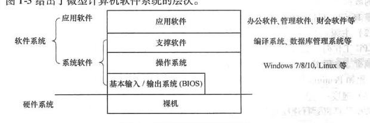
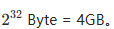

### **第一章 微型计算机系统概述**

#### **1. 考核知识点与考核要求**

1. **1. 微型计算机系统的组成**

**（1）微型计算机的硬件组成**

微型计算机硬件系统包括以下五大部分：

1. 运算器：

- 负责完成算术运算（加、减、乘、除）和逻辑运算（与、或、非、移位等）。

- 包括算术逻辑单元（ALU）、寄存器等。

1. 控制器：

- 根据指令的要求，控制微型计算机各部件协同工作。

- 包括指令译码单元、程序计数器（PC）等。

1. 存储器：

- 内部存储器（内存/主存）：存储当前正在使用的数据和程序，掉电后数据丢失（如RAM）。

- 外部存储器：如硬盘、光盘等，存储大容量数据，不掉电丢失。

1. 输入设备：

- 将数据或信息输入到计算机中，如键盘、鼠标、扫描仪。

1. 输出设备：

- 将计算结果输出到外部，如显示器、打印机。

- 

**（2）微型计算机系统的软件**

1. 系统软件：

- BIOS：负责开机自检、硬件初始化及基本输入/输出控制。

- 操作系统（OS）：管理硬件资源，提供用户交互界面。

- 支撑软件：如编译器、调试器等，为开发者提供支持。

1. 应用软件：

- 为满足特定需求而开发，如办公软件、财务软件等。

#### **2. 微型计算机的工作过程**

**（1）微型计算机的工作原理**

- 冯·诺依曼结构：

- 核心思想：程序和数据以二进制形式存储在存储器中，CPU按指令顺序逐条执行。

- 特点：

1. 存储程序：程序和数据存储在同一存储器中。

1. 程序控制：CPU按指令序列逐条执行，直至完成任务。

**（2）微型计算机的工作过程**

1. 程序加载：

- 将程序和数据从外存加载到内存。

1. 指令取出：

- CPU从内存中取出指令，程序计数器（PC）保存下一条指令的地址。

1. 指令译码：

- 控制器将指令译码，生成控制信号。

1. 指令执行：

- 运算器根据指令完成操作，结果存储到内存或I/O端口。

1. 循环执行：

- 重复取指、译码、执行的过程，直到程序结束。

#### **3. 微型计算机的组成结构**

**（1）系统芯片与芯片组的功能**

- 芯片组的功能：

1. 支撑和协调系统工作：确保系统稳定运行。

1. 决定存储器类型和接口：支持不同存储器（如DDR、DDR4）及其接口。

1. 决定总线类型并进行控制：如PCI、PCIe总线。

1. 控制数据传输：在CPU与外设之间进行数据传输。

1. 提供扩展接口：如USB、SATA、PCIe插槽等。

**（2）微型计算机基本结构及其发展的特点**

1. 处理器性能不断增强：

- 采用流水线、超标量、乱序执行、多核等技术。

1. 系统芯片集成度提高：

- 从单功能芯片发展到多功能芯片，甚至将存储控制器和图形处理器集成到CPU中。

1. 总线带宽变宽：

- 从PC总线到PCI、PCIe，总线带宽逐步提升。

1. 总线串行化趋势：

- 串行总线（如PCIe、SATA）逐步替代并行总线。

1. 保持良好兼容性：

- 硬件和软件向下兼容，支持新旧设备共存。

**（3）三总线结构**

1. 地址总线（AB）：

- 单向传输，传输存储单元地址或I/O端口地址。

- 宽度决定系统的最大寻址范围。

- 示例：8086有20根地址线，最大寻址范围为1MB。

1. 数据总线（DB）：

- 双向传输，传输CPU与存储器或外设之间的数据。

- 宽度决定一次传输的数据位数。

- 示例：8086有16根数据线，一次传输2字节。

1. 控制总线（CB）：

- 传输控制信号，如读/写信号、时序信号。

- 协调地址总线和数据总线的使用。

微型计算机硬件系统包括以下五大部分：

1. 运算器：

- 负责完成算术运算（加、减、乘、除）和逻辑运算（与、或、非、移位等）。

- 包括算术逻辑单元（ALU）、寄存器等。

1. 控制器：

- 根据指令的要求，控制微型计算机各部件协同工作。

- 包括指令译码单元、程序计数器（PC）等。

1. 存储器：

- 内部存储器（内存/主存）：存储当前正在使用的数据和程序，掉电后数据丢失（如RAM）。

- 外部存储器：如硬盘、光盘等，存储大容量数据，不掉电丢失。

1. 输入设备：

- 将数据或信息输入到计算机中，如键盘、鼠标、扫描仪。

1. 输出设备：

- 将计算结果输出到外部，如显示器、打印机。

**（2）微型计算机系统的软件**

1. 系统软件：

- BIOS：负责开机自检、硬件初始化及基本输入/输出控制。

- 操作系统（OS）：管理硬件资源，提供用户交互界面。

- 支撑软件：如编译器、调试器等，为开发者提供支持。

1. 应用软件：

- 为满足特定需求而开发，如办公软件、财务软件等。

### **本章重点、难点**

**重点**

1. 微型计算机的工作过程

1. 芯片组的功能

1. 微型计算机基本结构及其发展的特点

**难点**

1. 微型计算机的工作过程

1. 微型计算机基本结构及其发展的特点

# **第一节** **、微型计算机系统的组成**

## **一.微型计算机系统的硬件系统**

**冯·诺依曼结构**

- 组成部分：运算器、控制器、存储器、输入设备、输出设备。

- 特点：

- 数据和程序以二进制代码形式存放在存储器中。

- 存储位置由**地址**指定，地址码也是二进制形式。

- 控制器通过存储器中的指令序列控制机器运行，使用程序计数器（指令地址计数器）决定指令执行顺序。

**硬件部件功能**

**运算器和控制器**

- 组成：

- 运算器、控制器、寄存器，共同组成**中央处理单元（CPU）**。

- 运算器：

- 包括算术逻辑单元（ALU）和其他运算部件，负责算术和逻辑运算（加、减、乘、除、逻辑与、逻辑或、逻辑非、移位等）。

- 现代处理器增加了**浮点运算单元**处理浮点运算。

- 控制器：

- 根据指令要求，控制微型计算机各部件协同工作。

- 寄存器：

- 存放经常使用的数据。

- 包括通用寄存器、控制与状态寄存器、指令指针寄存器等。

**存储器**

- 作用：存储数据和程序。

- 分类：

- 内部存储器（内存/主存）：

- 以8个二进制位为一个单元，每单元有唯一物理地址。

- 单位换算：

- 1字节（Byte）= 8位（bit）；

- 1KB = 1024字节，1MB = 1024KB，1GB = 1024MB，1TB = 1024GB。

- 特点：

- 读/写速度快，主要存放当前正在使用的数据和程序。

- 通常为**RAM**，掉电后数据丢失。

- 外部存储器：

- 如硬盘、光盘等，容量大，不掉电丢失数据。

- 访问速度慢，需通过专门总线或接口访问。

**输入/输出设备与接口**

- 输入设备：指那些为微型计算机提供数据或信息的输入设备，如扫描仪、键盘、鼠标。

- 输出设备：那些接收从微型计算机中输出的信息或数据的输出设备，如打印机、显示器。

- I/O接口：

- 连接微型计算机与I/O设备的桥梁。

- 数据进出微型计算机的通道，协调微型计算机与I/O设备协同工作。

**微型计算机的总线**

- 作用：连接微型计算机各部件及设备，传送信息的公共导线。

- 组成：地址总线、数据总线、控制总线。

- 地址总线（AB）：

- 单向传输，传送CPU发出的地址信息（存储单元地址或I/O端口地址）。

- 宽度决定系统最大存储容量。例如，8086微处理器有20根地址线，最大存储容量为1MB（2²⁰字节）。

- 数据总线（DB）：

- 双向传输，负责CPU与外设、主存之间的数据交换。

- 宽度决定一次传输的二进制数据位数。例如，8086微处理器有16根数据总线，一次可传输16位（2字节）数据。

- 控制总线（CB）：

- 传输控制信息、时序信息和状态信息，用于控制数据总线和地址总线的使用。

**微型计算机系统的软件系统**

1. 

- 裸机：仅有硬件的微型计算机称为裸机，无法直接完成任务。

- 软件系统：硬件的基础上配备软件，才能实现微型计算机的功能。

- 统一体：计算机系统是硬件和软件的结合体，二者相辅相成。

- 操作系统和**编译系统**等软件可充分发挥硬件性能。

- 硬件结构知识对应用程序开发有助于提高程序效率。

2. 

- 系统软件：为运行、管理和维护微型计算机而编写的程序。

- 包括：**BIOS**、**操作系统**、**支撑软件**。

- 应用软件：用户为解决特定问题而编写的软件。

3. 

从硬件到软件的层次依次为：

3.1 

- 位置：存储在ROM芯片或Flash Memory中。

- 功能：

- 开机自检（POST）。

- 提供最基本的设备控制方法和数据输入/输出接口。

- 特点：

- 直接与裸机交互，使计算机能够正常运转。

- 编程接口复杂，不具备资源管理功能。

3.2 

- 作用：

- 管理和利用系统资源。

- 提供便捷的操作界面和编程接口。

- 主要功能模块：

- 进程管理：管理程序的执行。

- 作业管理：调度作业任务。

- 内存管理：分配和回收内存资源。

- 设备管理：控制输入/输出设备。

- 文件管理：组织和存储文件数据。

3.3 

- 定义：为编程和扩展功能提供支持的软件。

- 组成：

- 编译系统：将高级语言（如C、C++、Java）翻译成机器码。

- 调试软件：帮助程序员发现和修复程序中的错误。

- 文字编辑软件：编写和编辑程序代码。

- 数据库管理系统（DBMS）：管理和存储大量数据。

- 程序库：事先编好的标准子程序集合。

- 中间件：为应用程序提供功能扩展的工具。

4. 

- 定义：用户为解决特定问题而编写的软件。

- 实例：办公软件、管理软件、财务软件等。

5. 

- 操作系统优化硬件性能：

- 通过调度算法、资源管理等提升硬件资源的利用率。

- 编译系统与硬件结合：

- 根据硬件结构生成高效的机器码。

- 程序员了解硬件的优势：

- 底层编程和优化指令可提高程序执行效率。

## **二 、微型计算机系统主要性能指标**

**1. 字长**

- 定义：CPU 一次能处理的二进制位数。

- 意义：字长越长，CPU 数据处理精度越高、速度越快、存储容量越大。

- 注意：字长通常是字节的整数倍。

- 实例：

- 8086的字长是16位。

- 现代微型计算机的字长主要是64位。

**2. 主频**

- 定义：CPU 工作时的时钟脉冲频率（由主时钟产生）。

- 单位：MHz 或 GHz。

- 意义：主频越高，CPU 工作速度越快。

- 实例：

- Pentium 主频范围：66~750 MHz。

- Pentium 4 主频：最高超过3 GHz。

**3. 速度 (MIPS)**

- 定义：每秒所能执行的指令条数。

- 衡量单位：MIPS（Million Instructions Per Second）。

- 公式：

- 说明：指令条数通常是指加、减等简短指令的条数。

**4. 主存容量与存取时间**

- 主存容量：

- 定义：内部存储器能存放数据的最大字节数。

- 意义：主存容量越大，CPU 访问外部存储器的次数越少，处理能力越强。

- 计算公式：

- 实例：80386微处理器有32根地址线，最大主存容量为

- 存取时间：

- 定义：主存完成一次读/写操作所需时间。

- 意义：存取时间越短，存取速度越快。

**5. 兼容性**

- 定义：指同一软件无需修改即可在不同机器上运行。

- 分类：

- 向上兼容：低档机器开发的软件可在高档机器上运行。

- 示例：8086处理器开发的软件可在Pentium 4中运行。

- 向下兼容：新硬件支持老硬件的性能。

- 示例：AGP8X显卡（如NVIDIA 5200、ATi 9550）可插在AGP4X主板上。

**关键知识点总结**

1. 字长：决定数据处理精度和速度。

1. 主频：决定CPU工作速度。

1. 速度 (MIPS)：衡量CPU每秒执行指令条数。

1. 主存容量：由地址线宽度决定，容量越大处理能力越强。

1. 存取时间：时间越短，存取速度越快。

1. 兼容性：分为向上兼容和向下兼容。

**实例补充**

- 字长：64位现代计算机。

- 主频：Pentium 4主频 > 3 GHz。

- 主存容量公式：

- 地址线32根，主存容量 = 232232 Byte = 4GB。

- 兼容性实例：NVIDIA 5200显卡向下兼容AGP4X主板。

# 第二节 微型计算机系统的工作过程

### **一、微型计算机系统的基本原理**

1. 冯·诺依曼结构：

- 核心思想：数据和程序以二进制形式共同存储在存储器中，存储位置由地址指定。

- 特点：

- 存储程序：程序和数据存储在存储器中，供 CPU 按需调取。

- 程序控制：程序按指令顺序逐条执行，直到完成任务。

1. 存储程序的执行过程：

- 程序和数据需先存储到存储器中。

- CPU 从内存中读取程序的指令，逐条分析并执行，完成任务。

### **二、从程序到电子信号的转化过程**

1. 高级语言程序的编译与转换：

- 编译与连接：

- 高级语言程序需通过编译器翻译为机器指令（二进制形式）。

- 编译过程包括词法分析、语法分析、中间代码生成以及指令优化。

- 指令优化：

- 编译器根据硬件特点优化指令序列，提高程序执行效率。

- 例如，早期 CPU 没有浮点运算单元时，编译器通过软件仿真库实现浮点运算。

1. 机器指令的加载与执行：

- 加载过程：

- 机器指令存储在外存中，通过操作系统加载到内存。

- 操作系统本身由 BOOT 引导程序加载到内存。

- 执行过程：

- CPU 取出内存中的指令，通过译码单元分析指令功能。

- 控制单元根据指令生成控制信号，协调部件工作。

- 运算单元完成计算，结果回写到存储器或 I/O 端口。

### **三、指令的执行过程**

1. 程序执行的两个阶段：

- 取指阶段：

- CPU 从内存中读取指令，程序计数器（PC）保存下一条指令的地址。

- PC 每次取指后自动加上当前指令的字节数。

- 执行阶段：

- CPU 对取出的指令进行译码，解释指令功能。

- 执行指令可能涉及存储器或 I/O 端口的读写操作。

1. 执行过程的循环：

- 程序的执行过程是取指和执行的不断循环。

### **四、模型机的工作过程（以 8 位模型机为例）**

1. 模型机的组成：

- CPU 部分：

- 总线控制逻辑、地址寄存器（AR）、程序计数器（PC）、数据寄存器（DR）、指令寄存器（IR）、指令译码单元（ID）、累加器（A）、运算单元（ALU）、标志寄存器等。

- 存储器部分：

- 存储指令和数据，按地址访问。

1. 示例程序分析：

- 任务：计算 12H + 28H 的结果并存储到地址 30H。

- 程序与指令：

| 地址 | 机器码 | 汇编语句 | 指令字节数 | 操作说明 | 
| -- | -- | -- | -- | -- |
| 00H | B8H，告诉CPU这是MOV指令 | MOV A,12H | 2 | 将立即数 12H 送入累加器 A | 
| 02H | 05H | ADD A,28H | 2 | A 的值加上立即数 28H，结果存入 A | 
| 04H | A3H | MOV [30H],A | 2 | 将累加器 A 的值存入地址 30H | 
| 06H | F4H | HLT | 1 | CPU 停止任何操作 | 

### **五、模型机的指令执行过程**

以下是模型机执行上述程序的具体步骤：

**1. 第一条指令：MOV A,12H**

- 取指过程：

1. PC 内容（00H）送到 AR。

1. PC 自动加 1，变为 01H。

1. AR 内容（00H）通过地址总线选中存储器地址 00H。

1. 存储器地址 00H 的内容（B8H）通过数据总线送到 IR。

- 执行过程：

1. ID 译码，识别为将下一字节数据送入累加器 A。

1. PC 内容（01H）送到 AR，PC 自动加 1，变为 02H。

1. 存储器地址 01H 的内容（12H）通过数据总线送到 DR，再送到累加器 A。

**2. 第二条指令：ADD A,28H**

- 取指过程：

- 与第一条指令类似，取出操作码（05H），PC 变为 03H。

- 执行过程：

1. ID 译码，识别为加法指令。

1. PC 内容（03H）送到 AR，PC 自动加 1，变为 04H。

1. 存储器地址 03H 的内容（28H）通过数据总线送到 DR。

1. DR 内容（28H）送到运算寄存器 I₂，累加器 A 的内容（12H）送到 I₁。

1. ALU 执行加法运算，结果（3AH）送回累加器 A。

**3. 第三条指令：MOV [30H],A**

- 取指过程：

- 与第一条指令类似，取出操作码（A3H），PC 变为 05H。

- 执行过程：

1. ID 译码，识别为存储指令。

1. PC 内容（05H）送到 AR，PC 自动加 1，变为 06H。

1. 存储器地址 05H 的内容（30H）通过数据总线送到 DR，再送到 AR。

1. AR 内容（30H）通过地址总线选中存储器地址 30H。

1. 累加器 A 的内容（3AH）通过数据总线送到 DR，再存储到地址 30H。

**4. 第四条指令：HLT**

- 取指过程：

- 与第一条指令类似，取出操作码（F4H）。

- 执行过程：

- ID 译码，识别为停止指令，CPU 停止产生控制信号，计算机停止操作。

### **六、总结**

1. 微型计算机的工作原理：

- 按冯·诺依曼结构，程序和数据以二进制形式存储，CPU 按程序指令顺序逐条执行。

1. 程序执行的两个阶段：

- 取指阶段：从内存中读取指令。

- 执行阶段：译码并执行指令。

1. 从程序到电子信号的转化：

- 高级语言程序需经过编译、连接、加载、执行，最终转化为电子信号完成任务。

1. 模型机的指令执行示例：

- 通过逐条指令的取指和执行，完成简单的加法计算和存储操作。

# **第三节 微型计算机的组成结构**

#### 1. 微型计算机的基本组成

- 主板主要部件：

- CPU、存储器、系统芯片、I/O接口插槽。

- 各部件通过总线连接。

- I/O接口卡：

- 插入I/O接口扩展槽的附加设备接口电路板（如显示卡、声卡、采集卡等）。

- 现代多将显示卡、声卡、网卡功能集成到主板或CPU中。

#### 2. 总线的分类

微机系统中，总线按层次结构分为以下三类：

1. CPU总线

（主总线/片总线/元件级总线）：

- 位于微处理器内部，连接ALU和寄存器等功能单元。

- 在现代系统中部分扩展到CPU外部，小范围内提供高速控制和命令信号。

- 特点：速度最快。

1. 系统总线

（I/O总线/内总线/板级总线）：

- 连接主板上的器件以及扩展槽。

- 典型接口：ISA总线、EISA总线。

1. 通信总线

（外部总线/外总线）：

- 用于微机系统之间或与外部设备通信。

- 常见接口：RS-232、RS-485、IEEE-488、USB、IEEE 1394等。

#### 3. PC/XT的基本结构

- PC/XT：

- 第一代通用微机，采用8088微处理器。

- 通过PC总线（数据总线8位，地址总线20位）连接系统部件。

3.1 系统芯片

1. 8087协处理器：

- 提供浮点运算支持，提升速度约100倍。

1. 可编程定时/计数器8253/8254：

- 3个16位计数通道：

- 通道0：每55ms发送时钟中断信号。

- 通道1：动态存储器刷新。

- 通道2：控制扬声器发声。

1. DMA控制器8237：

- 提供4个DMA通道：

- 通道0：动态存储器刷新。

- 通道2：软盘与内存DMA传输。

- 通道3：硬盘与内存DMA传输。

1. 可编程中断控制器8259：

- 控制8级中断优先权。

1. 串行通信控制器8250：

- 提供RS-232串行通信接口。

1. 可编程并行接口8255：

- 3个并行接口口：

- A口：键盘扫描码输入。

- B口：键盘控制、RAM检测、扬声器控制。

3.2 存储器

1. 只读存储器(ROM)：

- 容量64KB。

- 包含BIOS（管理程序、上电自检、系统引导等功能）。

1. 随机存取存储器(RAM)：

- 初始主存容量为256KB，后期扩展至640KB。

3.3 I/O接口与扩展槽

- 提供键盘、扬声器等接口。

- 8个I/O扩展槽，支持插入显示卡、硬盘卡等扩展设备。

#### 4. 基于3芯片平台架构的微型计算机系统

- 芯片组：由南桥和北桥芯片组成，与CPU形成3芯片结构。

- 北桥芯片：

- 存储控制中心，连接主存和图形控制器。

- 直接与CPU通过高速主总线相连。

- 南桥芯片：

- I/O控制中心，集成多种设备接口及总线控制器（如USB、SATA、PCI等）。

- 与北桥通过高速DMI总线连接（双向2GB/s）。

- 固件中心：

- 包含BIOS和硬件随机发生器。

- 提供系统启动、自检、温度管理等功能。

- Super I/O芯片：

- 通过LPC接口连接南桥，支持慢速设备（如PS/2键盘、串口、并口等）。

#### 5. 基于2芯片平台架构的微型计算机系统

- 背景：

- 2011年Intel推出SandyBridge微架构的Core i7处理器。

- 将北桥功能整合到处理器内，形成2芯片架构。

- 结构：

- 处理器：集成存储控制器和图形处理器。

- PCH（平台控制中心）：

- 汇集南桥的所有功能。

- 通过DMI 2.0与处理器连接。

- 优点：

- 性能更高、价格更低、验证更容易。

#### 总结

1. 微型计算机系统由主板、CPU、存储器、系统芯片和I/O接口组成。

1. 系统总线分为CPU总线、系统总线和通信总线。

1. PC/XT是第一代微机，采用8088处理器，系统芯片功能丰富。

1. 现代微机发展到3芯片架构（南北桥），再到2芯片架构（处理器+PCH），性能和集成度不断提升。

#### 三、芯片组的功能

芯片组是由单功能或多功能的系统芯片组成，在微型计算机中起着核心作用，主要功能如下：

1. 支撑和协调系统工作：

- 确保系统有条不紊地运行。

1. 决定存储器类型和接口类型：

- 决定支持的存储器种类（如DDR、DDR4等）及其接口。

1. 决定总线类型并进行控制：

- 确定系统支持的总线（如PCI、PCIe）并负责其管理和控制。

1. 控制数据传输：

- 在微处理器与外设之间进行数据传输和协调。

1. 提供扩展接口和插槽：

- 支持功能扩展的接口（如USB、SATA）和插槽（如PCIe插槽）。

#### 四、微型计算机基本结构发展特点

微型计算机的基本结构随着技术进步不断演变，主要发展特点如下：

1. 

- 采用新技术提升性能，如：

- 流水线：多指令同时执行。

- 超标量：每周期处理多条指令。

- SIMD：单指令多数据流处理。

- 分支预测：减少分支指令的延迟。

- 乱序执行：提高指令执行效率。

- 超线程：提升多任务处理能力。

- 多核架构：多个核心并行工作。

2. 

- 早期：

- 使用单功能芯片（如8259、8253、8237等）。

- 芯片多、连线复杂，速度受限，出错率高。

- 现代：

- 采用2~3片高集成度多功能芯片。

- 存储器控制器、图形处理器等集成到CPU中。

- 系统架构简化，主板微型化，出错率降低。

3. 

- 总线从早期的PC总线（8位/16位）逐步发展：

- ISA总线：16位。

- PCI总线：更高带宽。

- PCI Express总线：高速串行总线。

- 历史发展：经历了EISA、MCA、VL等总线阶段。

4. 

- 串行总线优点：

- 提高频率、传输距离，抗干扰能力强。

- 逐步替代并行总线：

- PCI Express替代并行的AGP和PCI总线。

- SATA替代并行的PATA总线。

- SAS替代并行的SCSI总线。

- USB逐步采用串行方式。

5. 

- 体系结构兼容性：

- 处理器指令系统向下兼容（如Pentium兼容8088/8086指令）。

- 芯片组兼容性：

- 现代芯片组集成了兼容PC/XT的功能（如8259、8254、8237）。

- 接口兼容性：

- 保持串口、并口等接口功能和地址访问的兼容性。

#### 总结

- 芯片组：是微型计算机系统的核心，负责协调工作、控制数据传输、提供扩展能力。

- 发展特点：

1. 处理器性能大幅提升。

1. 系统芯片高度集成化，主板更简洁。

1. 总线带宽不断增加，串行化趋势明显。

1. 保持良好的兼容性，支持新旧设备共存。

#### **1) 微型计算机系统主要由哪两个子系统组成？它们分别又包含哪几部分？**

- 微型计算机系统的两大子系统：

1. 硬件系统：

- 运算器：负责算术和逻辑运算。

- 控制器：控制各部件协同工作。

- 存储器：存储数据和程序。

- 输入设备：如键盘、鼠标，提供数据输入。

- 输出设备：如显示器、打印机，输出计算结果。

1. 软件系统：

- 系统软件：如BIOS、操作系统。

- 应用软件：如办公软件、管理软件。

#### **2) 总线在微型计算机中起什么作用？请简单叙述地址总线、数据总线和控制总线的特点和作用。**

- 总线的作用：

- 连接微型计算机各部件及设备，传输信息的公共导线。

- 包括地址总线、数据总线和控制总线。

- 总线分类与作用：

1. 地址总线（AB）：

- 特点：单向传输，传送CPU发出的地址信息。

- 作用：决定系统的最大存储容量。

- 示例：8086的地址总线为20位，最大寻址范围为1MB。

1. 数据总线（DB）：

- 特点：双向传输，传输CPU与外设、存储器之间的数据。

- 作用：宽度决定一次传输的数据位数。

- 示例：8086的数据总线为16位，一次可传输2字节。

1. 控制总线（CB）：

- 特点：传输控制信息、时序信息和状态信息。

- 作用：用于协调数据总线和地址总线的使用。

#### **3) 微型计算机系统为什么要配备软件？系统软件包括哪些？有什么作用？**

- 配备软件的原因：

- 硬件需要软件的支持才能实现功能。

- 软件与硬件协同作用，充分发挥硬件性能。

- 系统软件的分类：

1. BIOS：

- 作用：提供设备控制方法和数据输入/输出接口。

1. 操作系统（OS）：

- 作用：管理硬件资源，提供用户界面。

1. 支撑软件：

- 作用：支持编程和功能扩展（如编译器、调试器）。

#### **4) 衡量微型计算机系统性能的主要指标有哪些？**

1. 字长：

- CPU一次能处理的二进制位数，决定数据处理精度和速度。

- 如：8086为16位，现代处理器为64位。

1. 主频：

- CPU时钟脉冲频率，单位为MHz或GHz。

- 主频越高，处理速度越快。

1. 速度（MIPS）：

- 每秒执行的指令条数，单位为百万指令每秒。

1. 主存容量与存取时间：

- 容量越大、存取时间越短，性能越强。

1. 兼容性：

- 硬件与软件的兼容程度（如向下兼容老系统）。

#### **5) 简述高级语言程序如何才能最终变成电路信号控制硬件工作。**

1. 编译与连接：

- 高级语言程序通过编译器翻译为机器指令（二进制形式）。

1. 指令优化：

- 编译器根据硬件特点优化指令，提高执行效率。

1. 加载过程：

- 操作系统将机器指令从外存加载到内存。

1. 执行过程：

- CPU取出指令，译码后生成控制信号。

- 运算单元完成计算，结果存储到存储器或I/O端口。

#### **6) 总结8088、80386、Pentium微处理器的地址线、数据线的根数，以及这些微处理器物理地址的最大寻址范围。**

| 处理器 | 地址线（根数） | 数据线（根数） | 最大寻址范围 | 
| -- | -- | -- | -- |
| 8088 | 20 | 8 | 1MB | 
| 80386 | 32 | 32 | 4GB | 
| Pentium | 36 | 64 | 64GB | 

#### **7) 请解释流水线和超标量两个概念，并请用生活中的例子解释流水线的好处。**

1. 流水线：

- 将指令的执行分解为多个阶段（如取指、译码、执行），多个指令可以同时在不同阶段执行。

- 例子：工厂生产线，每个工人负责一个环节，同时处理不同产品。

- 好处：提高任务处理效率。

1. 超标量：

- 每周期可以同时执行多条指令，依赖多条功能单元。

- 区别：流水线是分阶段处理，超标量是同时处理多条指令。

#### **8) 动态执行技术包括哪几项内容？为什么指令可以乱序执行？**

1. 动态执行技术：

- 分支预测

- 指令乱序执行

- 指令级并行

1. 指令乱序执行原因：

- 指令间无数据依赖性，允许调整顺序以提高执行效率。

#### **9) MMX的技术特点是什么？**

- MMX技术特点：

- 支持多媒体指令集，优化多媒体处理。

- 使用SIMD（单指令多数据流）技术，一条指令可同时处理多个数据。

#### **10) 超线程技术和多核技术有什么异同点？它们可否共存于一个处理器中？**

1. 超线程技术：

- 在一个物理核心内模拟两个逻辑核心，提高线程并发能力。

1. 多核技术：

- 在一个处理器中集成多个物理核心。

1. 异同点：

- 相同点：都提升多任务处理能力。

- 不同点：超线程是逻辑层面的优化，多核是物理层面的扩展。

1. 是否共存：

- 可以共存，一个处理器可以同时支持多核和超线程技术。

#### **11) 整机系统中，芯片组起何重要作用？**

- 芯片组的作用：

1. 支撑和协调整个系统工作。

1. 决定存储器类型和接口类型。

1. 决定总线类型并进行控制。

1. 控制处理器与外设之间的数据传输。

1. 提供扩展接口和插槽。

#### **12) 微型计算机基本结构发展的特点是什么？**

1. 处理器性能不断增强：

- 流水线、超标量、乱序执行、多核等技术提升性能。

1. 系统芯片集成度提高：

- 从单功能芯片发展为多功能芯片，甚至将功能集成到CPU中。

1. 总线带宽变宽：

- 从PC总线到PCI、PCIe总线，带宽逐步提升。

1. 总线串行化趋势：

- PCIe、SATA、USB等串行总线逐步替代并行总线。

1. 保持良好兼容性：

- 新硬件支持老硬件，处理器指令系统向下兼容。

分享

GPT-4o与网络访问

尝试网页版获取PDF详细信息/比较

### 选择其他模型回答

生成思维导图

**翻译**

**定日程**

**生成文档**

**生成思维导图**

**创作 Artifact**

**AI 搜索**

**与网页聊天**

**写作**

**画图**

**高级数据分析**

**Monica**

