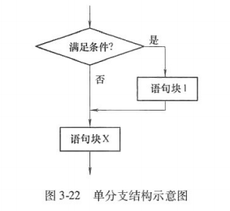
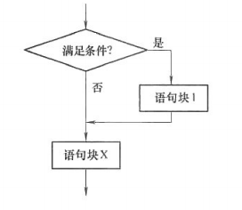
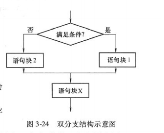
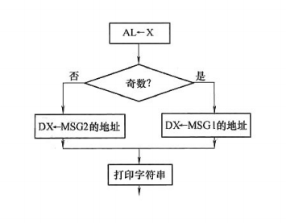
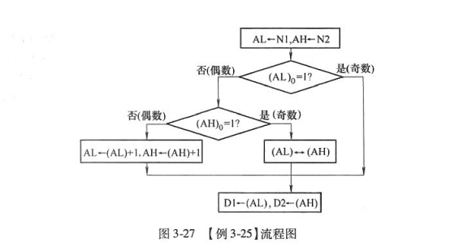

# **考核知识点与考核要求**

1.8086指令寻址方式

领会：8086指令的数据寻址方式和转移操作寻址方式。 

2.8086汇编语言格式

识记：汇编语言语句格式、常量、标识符、表达式。 领会：汇编语言源程序结构。

3.8086伪指令与操作数运算符

简单应用：数据定义和存储器分配伪指令，表达式赋值伪指令，地址计数器和对准伪指令，程序开始与结束伪指令，简化段定义伪指令。

4.8086汇编指令与汇编语言程序设计

简单应用：人机交互程序和相关指令，顺序程序结构和相关指令，分支程序结构和相关指令，循环程序结构和相关指令，子程序结构和相关指令。

# 第一节 8086指令寻址方式

**一、指令格式**

- 指令的组成：

- 操作码（Opcode）：指明指令执行的操作。

- 操作数（Operand）：指令操作所需的数据或数据的地址。

- 指令类型：

- 零地址指令：无操作数。

- 一地址指令：一个操作数。

- 二地址指令：两个操作数（8086中最常见）。

- 格式：OP dest, src

- OP：操作码。

- dest：目的操作数。

- src：源操作数。

**二、寻址方式的概念**

- 寻址方式：指令中操作数的表示方式，也即寻找操作数的方法。

- 意义：丰富的寻址方式能增强指令系统的功能和灵活性，提升程序运行效率。

- 分类：

1. 数据寻址方式。

1. 转移操作寻址方式。

**三、数据寻址方式**

8086处理器支持以下四种类型的操作数：

1. 立即数操作数：直接作为指令的一部分。

1. 寄存器操作数：存储在CPU寄存器中。

1. 存储器操作数：存储在内存中。

1. I/O端口操作数：存储在端口寄存器中。

**1. 立即寻址（Immediate Addressing）**

- 特点：

- 操作数直接存放在指令中，紧跟操作码后。

- 操作数作为指令的一部分，存储在代码段中。

- 示例：

```ada
MOV AL, 8       ; 将立即数8送入AL寄存器
MOV AX, 1234H   ; 将立即数1234H送入AX寄存器

```

- 优点：无需访问内存，速度快。

- 机器码结构：

- 操作码 + 立即数。

**2. 寄存器寻址（Register Addressing）**

- 特点：

- 数据存储在寄存器中，指令中指定寄存器编号。

- 操作数直接从寄存器中读取或写入。

- 示例：

```ada
MOV AL, CL      ; 将CL寄存器的内容送入AL寄存器
MOV DS, AX      ; 将AX寄存器的内容送入DS段寄存器

```

- 优点：

- 寄存器操作速度快，不需要访问内存。

- 指令字节数少，节省存储空间。

- 机器码结构：

- 操作码 + 寄存器编号。

**3. 存储器寻址（Memory Addressing）**

- 特点：

- 操作数存储在内存中，指令中指定操作数的地址。

- 地址可以直接给出，也可以通过计算得到。

- 有效地址（EA）：

- EA = 基址 + 变址 + 位移量。

- 基址寄存器：BX、BP。

- 变址寄存器：SI、DI。

- 位移量：8位或16位无符号数。

- 分类：

1. 直接寻址（Direct Addressing）

- 地址直接在指令中给出。

- 默认段：DS段。

- 示例：

```ada
MOV AX, [1234H]   ; 将内存地址DS:[1234H]的内容送入AX
MOV BL, SS:[10H]  ; 将内存地址SS:[10H]的内容送入BL

```

1. 寄存器间接寻址（Register Indirect Addressing）

- 地址存储在寄存器中（BX、BP、SI、DI）。

- 默认段：

- BX、SI、DI：DS段。

- BP：SS段。

- 示例：

```ada
MOV AX, [SI]       ; 取DS:[SI]的内容送入AX
MOV BL, [BP]       ; 取SS:[BP]的内容送入BL
MOV AX, ES:[BX]    ; 取ES:[BX]的一字节与AX相加再送入AX

```

1. 基址寻址（Based Addressing）

- 地址 = 基址寄存器（BX/BP）+ 位移量。

- 默认段：

- BX：DS段。

- BP：SS段。

- 示例：

```ada
MOV BL, 10H[BP]        ; 取SS:[BP+10H]的内容送入BL
MOV AX, [BX+200H]      ; 取DS:[BX+200H]的内容送入AX
MOV AX, [BX+10H]       ; 取DS段，从DS[bx+10H]的内容送入AX

```

1. 变址寻址（Indexed Addressing）

- 地址 = 变址寄存器（SI/DI）+ 位移量。

- 默认段：DS段。

- 示例：

```ada
MOV AX, [SI+120H]      ; 取DS:[SI+120H]的内容送入AX
MOV AX, BUF[DI]        ; 取DS:[DI+BUF]的内容送入AX

```

1. 基址变址寻址（Based Indexed Addressing）

- 地址 = 基址寄存器（BX/BP）+ 变址寄存器（SI/DI）+ 位移量。

- 默认段：

- BX：DS段。

- BP：SS段。

- 示例：

```ada
MOV AX, [BX][SI]       ; 取DS:[BX+SI]的内容送入AX
MOV AL, [BX+SI+10H]    ; 取SS:[BP+SI*2+10H]的内容送入AL

```

**4. I/O端口寻址（I/O Port Addressing）**

- 特点：

- 操作数存储在I/O端口中，专用I/O指令进行访问。

- 分类：

1. 直接寻址（Direct Addressing）：

- 8位端口地址直接写在指令中。

- 示例：

```ada
IN AL, 20H       ; 从端口20H读取1字节数据到AL
OUT 60H, AX      ; 将AX中的数据输出到端口60H和61H

```

1. 间接寻址（Indirect Addressing）：

- 端口地址存储在DX寄存器中。

- 示例：

```
MOV DX, 3FCH
IN AL, DX        ; 从端口3FCH读取1字节数据到AL

```

**四、转移操作寻址**

- 特点：

- 操作数为转移地址，用于条件转移、无条件转移、循环指令和调用指令。

- 分类：

1. 段内相对寻址（Intrasegment Relative Addressing）：

- 地址 = IP + 位移量。

- 示例：

```ada
JMP SHORT PROG_S   ; 短跳转，位移量为8位
JMP NEAR PTR LABEL ; 近跳转，位移量为16位

```

1. 段内间接寻址（Intrasegment Indirect Addressing）：

- 地址存储在寄存器或存储单元中。

- 示例：

```ada
JMP BX             ; 跳转到BX寄存器指定的地址
JMP [BX]           ; 跳转到内存地址DS:[BX]指定的地址

```

1. 段间直接寻址（Intersegment Direct Addressing）：

- 指令中直接提供段地址和偏移地址。

- 示例：

```ada
JMP DWORD PTR [SI+125H] ; 跳转到内存指定的段间地址

```

1. 段间间接寻址（Intersegment Indirect Addressing）：

- 地址存储在存储器中。

- 示例：

```ada
JMP DWORD PTR [SI+125H] ; 跳转到内存指定的段间地址

```

**五、总结**

1. 数据寻址方式：

- 立即寻址、寄存器寻址、存储器寻址、I/O端口寻址。

- 存储器寻址进一步分为直接、寄存器间接、基址、变址、基址变址寻址。

1. 转移操作寻址方式：

- 段内相对、段内间接、段间直接、段间间接寻址。

1. 灵活性：

- 8086提供丰富的寻址方式，适应多种编程需求，提高了指令系统的功能和效率。

# 第二节 8086汇编语言基础

**一、汇编源程序结构**

8086汇编语言是一种面向机器的符号化程序语言，介于机器语言和高级语言之间。它的特点是：

- 优点：易于理解和修改、利用硬件资源高效、速度快、占用内存少。

- 适用场景：高性能、低资源占用率的程序，如控制系统、操作系统内核等。

汇编语言源程序不能直接运行，需通过汇编程序（如MASM）转化为机器语言目标程序。8086汇编程序的结构遵循特定格式，下面以实例说明。

**示例程序**

```ada
.MODEL  SMALL
.DATA
MSGDB 'This is an example.$'
.STACK
.CODE
START:  MOV AX, @DATA
        MOV DS, AX
        MOV DX, OFFSET MSG
        MOV AH, 9
        INT 21H
        MOV AX, 4C00H
        INT 21H
END START

```

**特点解析：**

1. 分段结构：

- 数据段（.DATA）：定义数据。

- 堆栈段（.STACK）：定义堆栈。

- 代码段（.CODE）：定义程序代码。

- 每个段的开始意味着上一个段的结束，程序结束由END语句标志。

1. 段内组成：

- 每个段由若干汇编语言语句组成，每条语句占一行。

- 推荐使用注释（以;开头）提高可读性。

1. 起始标号：

- 程序入口由标号（如START）标明，且必须出现在END之后。

1. 程序开始语句：

- 通常以以下两条语句开始：

```ada
MOV AX, @DATA
MOV DS, AX

```

- 作用：将数据段基址赋给DS寄存器，确保访问数据段中的数据。

1. 程序正常退出：

- 通过以下语句返回到操作系统：

```ada
MOV AX, 4C00H
INT 21H

```

**二、8086汇编语言语句**

汇编程序的语句分为两类：

1. 指令性语句（符号指令）：直接对应机器指令。

1. 指示性语句（伪指令）：为汇编程序提供信息，不产生机器指令。

**1. 指令性语句**

**格式**

```ada
[标号:] 指令助记符 [操作数1,] [操作数2, …] [;注释]

```

**组成部分**

1. 标号：

- 可选，仅在指令作为转移目标时需要。

- 标号属性：

- 段属性：标号所在段的起始地址。

- 偏移地址属性：段起始地址到标号位置的字节数。

- 类型属性：转移指令类型（NEAR近转移，FAR远转移），默认NEAR。

1. 指令助记符：

- 必选，用于表示指令的功能（如MOV、ADD）。

1. 操作数：

- 表示指令操作的对象。

- 源操作数：指令的输入。

- 目的操作数：指令的输出。

- 示例：

```ada
ADD AX, BX

```

- 含义：将AX和BX的值相加，结果存入AX。

1. 注释：

- 以分号；开头，用于解释代码，便于阅读。

**示例解析**

```ada
START: MOV AX, @DATA ; @DATA 是等价名，代表 .DATA 定义的段名

```

- START:：标号。

- MOV：指令助记符。

- AX：目的操作数。

- @DATA：源操作数。

- ;后为注释。

**2. 指示性语句（伪指令）**

**格式**

```ada
[变量/名字] 命令 [操作数1,] [操作数2, …] [;注释]

```

**组成部分**

1. 名字：

- 用于表示常量名、段名、过程名等。

- 示例：

```ada
MSG DB 'Hello, World!$'

```

- MSG为名字，表示字符串的存储位置。

1. 变量：

- 表示数据所在存储单元的地址。

- 属性：

- 段属性：变量所在段的起始地址。

- 偏移地址属性：段起始地址到变量位置的字节数。

- 类型属性：变量的数据类型（如字节、字、双字等）。

**伪指令功能**

- 不产生目标代码，仅为汇编程序提供信息。

- 示例：

```ada
.MODEL SMALL
.DATA
.STACK
.CODE

```

**三、标识符、常量与表达式**

**1. 标识符**

- 定义：由程序员定义的字符序列，用于标识段名、变量名、标号等。

- 规则：

1. 第一个字符不能是数字。

1. 若以.开头，则必须是第一个字符。

1. 区分大小写，但汇编时不敏感。

1. 特殊符号?、@、_、$可用，但不能单独作为标识符。

1. 长度最多31个字符，超出部分无效。

1. 不得使用保留字。

**2. 常量**

- 定义：具有固定值的量。

- 类型：

1. 数值常量：

- 二进制：以B结尾，如0101B。

- 八进制：以O或Q结尾，如235Q。

- 十进制：以D结尾或无后缀，如98D或98。

- 十六进制：以H结尾，如5BH，若最高位为字母，加0，如0FB35H。

1. 字符与字符串常量：

- 字符：单引号括起来的字符，如'a'。

- 字符串：单引号括起来的多个字符，如'Hello'。

1. 符号常量：

- 程序员定义的标识符，赋予固定值。

**3. 表达式**

- 定义：由操作数和运算符组成的序列。

- 运算符：+、-、*、/。

- 示例：

```ada
35 + 4
40H OR 57H
800 XOR 681

```

**总结**

8086汇编语言源程序的编写需要遵循特定格式，包括分段结构、指令性语句和伪指令的使用。程序员需熟悉标识符、常量和表达式的定义规则，并掌握基本的语法与操作，才能高效编写汇编程序。

# 第三节 8086汇编伪指令与操作数运算符

**一、伪指令**

伪指令是辅助汇编器工作的指令，不会直接生成机器代码，而是为汇编器提供信息或约束。以下是常用伪指令的详细说明。

**1. 简化段定义伪指令**

**(1) 存储模式伪指令**

- 功能：定义程序的存储模式，确定段的组织方式、调用方式和默认属性。

- 格式：

```ada
.MODEL 存储模式[, 语言类型][, 堆栈类型]

```

- 参数说明：

- 存储模式：决定代码段和数据段的个数及程序规模。

- Tiny：代码段和数据段在同一段内，适合小型.com程序。

- Small：1个代码段和1个数据段，适合小型.exe程序。

- Medium：多个代码段，1个数据段。

- Compact：1个代码段，多个数据段。

- Large：多个代码段，多个数据段。

- Huge：支持大于64KB的段，多个代码段和数据段。

- 语言类型：指定与高级语言的接口约定（如C、PASCAL等），可省略。

- 堆栈类型：

- NEARSTACK：堆栈段与数据段共享（默认）。

- FARSTACK：堆栈段独立。

- 示例：

```ada
.MODEL SMALL             ; 定义Small模式
.MODEL LARGE, C, FARSTACK ; Large模式，C语言约定，独立堆栈

```

**(2) 数据段定义伪指令**

- 功能：定义数据段，用于存储全局变量和常量。

- 格式：

```ada
.DATA

```

- 说明：

- 定义的数据段段名默认为_DATA。

- 可以通过@DATA获取数据段基址。

- 示例：

```ada
.DATA
MSG DB 'Hello, World!$' ; 定义字符串
MOV AX, @DATA           ; 获取数据段基址
MOV DS, AX              ; 设置DS指向数据段

```

**(3) 代码段定义伪指令**

- 功能：定义代码段，用于存储程序指令。

- 格式：

```ada
.CODE [名字]

```

- 说明：

- 如果没有指定名字：

- Tiny/Small/Compact模式：段名为_TEXT。

- Medium/Large/Huge模式：段名为模块名_TEXT。

- 多代码段时，可为每段指定不同的名字。

- 示例：

```ada
.CODE
START: MOV AX, @DATA ; 设置数据段基址
       MOV DS, AX
       ; 其他代码
END START

```

**(4) 堆栈段定义伪指令**

- 功能：定义堆栈段，用于存储函数调用的返回地址和局部变量。

- 格式：

```ada
.STACK [大小]

```

- 说明：

- 如果未指定大小，默认分配1KB。

- 段名默认为STACK。

- 示例：

```ada
.STACK 1024 ; 定义1KB堆栈

```

**2. 数据定义伪指令**

**功能**

**格式**

```ada
[变量名] 命令 操作数项 [, 操作数项, …] [; 注释]

```

**常用命令与功能**

| 命令 | 功能 | 占用字节数 | 
| -- | -- | -- |
| DB | 定义字节数据 | 1 | 
| DW | 定义字数据（2字节） | 2 | 
| DD | 定义双字数据（4字节） | 4 | 
| DF | 定义6字节数据 | 6 | 
| DQ | 定义8字节数据 | 8 | 
| DT | 定义10字节数据 | 10 | 


**操作数项类型**

1. 常量或表达式：直接赋值。

```ada
VAR1 DB 0FFH        ; 定义1字节，初值为0FFH
VAR2 DW 1234H       ; 定义2字节，初值为1234H

```

1. 字符串：存储为ASCII码序列。

```ada
MSG DB 'Hello, World!$'

```

1. ?：分配存储单元但不初始化。

```ada
VAR3 DW ?           ; 分配2字节，初值不定

```

1. DUP操作符：复制操作数。

```ada
BUFFER DB 10 DUP(?) ; 分配10字节，初值不定

```

**示例**

```ada
.DATA
VAR1 DB 31H            ; 定义1字节，初值为31H
VAR2 DW 1234H, 0       ; 定义2个字，每个占2字节
STR  DB 'ABC', 0       ; 定义字符串，存储为ASCII码
BUFFER DW 5 DUP(0)     ; 分配5个字，初值为0

```

**3. 地址定位伪指令与地址计数器**

**(1) 地址定位伪指令 **

- 功能：设置偏移地址，指定数据或指令的存储位置。

- 格式：

```ada
ORG 表达式

```

- 示例：

```ada
ORG 100H
VAR1 DB 31H  ; 从偏移地址100H开始存储

```

**(2) 地址计数器 **

- 功能：表示当前偏移地址，用于动态计算存储位置。

- 示例：Z

```ada
ORG $+10        ; 当前偏移地址+10
JMP $+2         ; 跳转到当前指令偏移地址+2

```

**(3) 偶地址对齐 **

- 功能：确保下一个数据或指令从偶地址开始，便于字数据的高效存储。

- 格式：

```ada
EVEN

```

- 示例：

```ada
BUF1 DB 12
EVEN            ; 确保BUF2从偶地址开始
BUF2 DW 1234H

```

**(4) 地址边界对齐 **

- 功能：确保数据或指令从指定的整数倍地址开始。

- 格式：

```ada
ALIGN NUM

```

- 说明：

- 对8086：NUM只能是1或2。

- 对80386及以上：NUM可以是1、2或4。

- 示例：

```ada
ALIGN 4         ; 确保下一个数据从4的倍数地址开始
BUF2 DD 12345678H

```

**4. 符号定义伪指令**

**(1) **

- 功能：为符号赋固定值，不能在程序中重新定义。

- 格式：

```ada
EQU 表达式

```

- 示例：

```ada
CONST EQU 100
MOV AX, CONST   ; 等同于 MOV AX, 100

```

**(2) **

- 功能：为符号赋值，可以在程序中重新定义。

- 格式：

```ada
符号名 = 表达式

```

- 示例：

```ada
NUM = 23
MOV BX, NUM
NUM = 76
MOV CX, NUM

```

**5. 过程定义伪指令**

**功能**

- 格式：

```ada
过程名 PROC [NEAR/FAR]
    ; 过程体
过程名 ENDP

```

- 说明：

- NEAR：近过程，与调用程序在同一代码段内（默认）。

- FAR：远过程，与调用程序不在同一代码段内。

- 示例：

```ada
MYPROC PROC
    MOV AX, BX
    RET
MYPROC ENDP

```

**6. 程序起始与结束伪指令**

**(1) 起始伪指令 **

- 功能：初始化DS寄存器，调整SS和SP寄存器。

- 示例：

```ada
.STARTUP

```

**(2) 退出伪指令 **

- 功能：终止程序执行并返回DOS。

- 格式：

```ada
.EXIT [返回码]

```

- 示例：

```ada
.EXIT 0 ; 正常退出

```

**(3) 结束伪指令 **

- 功能：表示源程序结束。

- 格式：

```ada
END [起始标号]

```

- 示例：

```ada
END START

```

**1. 宏指令的概念**

- 宏指令是为了简化程序书写而设计的，用于避免重复书写相同的代码段。

- 宏指令在汇编时由汇编器直接展开为实际代码（称为**宏展开**），从而替代重复的代码书写。

- 宏可以带参数，调用时用**实参**替换宏定义中的**形参**。

**2. 宏定义的格式**

**语法**

```
宏名 MACRO [形参1, 形参2, ...]
    ; 宏体
ENDM

```

- MACRO：用于开始宏定义。

- ENDM：标志宏定义的结束，MACRO 和 ENDM 必须成对出现。

- 形参：

- 宏可以没有形参，也可以有多个形参，形参之间用逗号隔开。

- 形参在宏体中用作占位符，在调用宏时用实参替换。

- 宏体：

- 宏体是宏的具体内容，通常是指令或代码块。

**宏调用的格式**

```
宏名 [实参1, 实参2, ...]

```

- 调用宏时，汇编器会将宏体中的形参替换为对应的实参，然后将宏体展开为实际代码。

**3. 宏的示例**

**定义一个宏**

以下是一个带 3 个形参的宏，用于计算 3 个数的和。

```
ADDUP MACRO AD1, AD2, AD3
    MOV AX, AD1      ; 将第一个数加载到 AX
    ADD AX, AD2      ; 将第二个数加到 AX
    ADD AX, AD3      ; 将第三个数加到 AX
ENDM

```

- ADDUP 是宏的名字。

- AD1**、****AD2****、****AD3** 是形参，分别代表三个操作数。

- 宏体中使用了 MOV 和 ADD 指令来实现 3 个数的相加。

**调用宏**

调用宏时传入实参：

```
ADDUP BX, 2, COUNT

```

- 实参 BX、2、COUNT 分别替换宏定义中的形参 AD1、AD2、AD3。

**宏展开后的代码**

汇编器在翻译宏调用时会将宏体展开为实际代码：

```
MOV AX, BX        ; 将 BX 加载到 AX
ADD AX, 2         ; 将 2 加到 AX
ADD AX, COUNT     ; 将 COUNT 加到 AX

```

- 宏展开后，代码中不再有宏的名字，只有展开后的指令。

**4. 宏与过程的对比**

| 特性 | 宏指令 | 过程 | 
| -- | -- | -- |
| 实现方式 | 在汇编时直接展开为目标代码。 | 在程序中通过 | 
| 代码存储 | 每次调用都会生成一份独立的代码块（代码重复）。 | 只有一份代码块，所有调用共用。 | 
| 执行效率 | 无额外开销，直接执行展开后的代码。 | 有 | 
| 程序大小 | 多次调用会导致程序代码变长。 | 程序代码较短，因为只有一份代码块。 | 
| 适用场景 | 适用于短小、频繁的代码段，注重执行速度。 | 适用于较长的代码段，注重节约程序大小。 | 


**5. 宏与过程的选用原则**

- 选用宏的场景：

- 当程序执行速度比程序大小更重要时，选用宏。

- 当代码块较短且需要频繁调用时，选用宏。

- 选用过程的场景：

- 当程序大小比执行速度更重要时，选用过程。

- 当代码块较长时，选用过程，以避免重复代码导致程序膨胀。

**二、操作数运算符**

**1. 算术运算符**

| 运算符 | 说明 | 示例 | 解析 | 
| -- | -- | -- | -- |
| + | 在两个操作数之间作加法 | MOV AX, 8+4 | 汇编为 | 
| + | 在一个操作数左边作正号 | DB +7, +8 | 内存中存入 | 
| - | 在两个操作数之间作减法 | MOV AX, 8-4 | 汇编为 | 
| - | 在一个操作数左边作负号 | DB -7, -8 | 内存中存入 | 
| * | 乘法运算 | MOV AX, 7*8 | 汇编为 | 
| / | 除法运算 | MOV AX, 16/4 | 汇编为 | 
| MOD | 取余运算 | MOV AX, 31 MOD 5 | 汇编为 | 


**2. 逻辑与移位运算符**

| 运算符 | 说明 | 示例 | 解析 | 
| -- | -- | -- | -- |
| AND | 按位相与 | MOV AL, 37H AND 0FH | 汇编为 | 
| OR | 按位相或 | MOV AL, 7 OR 30H | 汇编为 | 
| XOR | 按位异或 | MOV AL, 0AAH XOR 55H | 汇编为 | 
| NOT | 按位取反 | MOV AL, NOT 10010011B | 汇编为 | 
| SHL | 左移 | MOV AL, 73H SHL (2 * 4) | 汇编为 | 
| SHR | 右移 | MOV BL, 16 SHR (1 + 3) | 汇编为 | 


**3. 关系运算符**

| 运算符 | 说明 | 示例代码 | 解析 | 
| -- | -- | -- | -- |
| EQ | 相等为真 | MOV AL, X EQ 5 | 如果 | 
| NE | 不相等为真 | MOV AL, X NE 5 | 如果 | 
| LE | 小于或等于为真 | MOV AL, X LE 5 | 如果 | 
| GE | 大于或等于为真 | MOV AL, X GE 5 | 如果 | 
| LT | 小于为真 | MOV AL, X LT 5 | 如果 | 
| GT | 大于为真 | MOV AL, X GT 5 | 如果 | 


**4.数值回送运算符**

**1. SEG 运算符**

- 说明：返回变量或标号的段值（即段地址）。

```ada
MOV AX, SEG MSG

```

- 将变量 MSG 的段地址存入寄存器 AX。

- 汇编后，AX 中存储的是 MSG 所在段的段地址。

**2. OFFSET 运算符**

- 说明：返回变量或标号的偏移地址。

- 示例：

```ada
MOV DX, OFFSET MSG

```

- 将变量 MSG 的偏移地址存入寄存器 DX。

- 汇编后，DX 中存储的是 MSG 在段中的偏移地址。

**3. TYPE 运算符**

- 说明

：返回变量的类型大小（单位：字节）。具体规则如下：

- DB = 1（字节型变量，1 字节）

- DW = 2（字型变量，2 字节）

- DD = 4（双字型变量，4 字节）

- DQ = 8（四字型变量，8 字节）

- DT = 10（十字型变量，10 字节）

- 示例：

```ada
BLOCK DW 50 DUP(2 DUP(?))
MOV SI, TYPE BLOCK

```

- 变量 BLOCK 的类型为 DW（字型），占用 2 字节。

- 汇编后，SI = 2。

- 标号类型：

- NEAR = -1（近地址）

- FAR = -2（远地址）

**4. LENGTH 运算符**

- 说明：返回变量的元素个数。

- 如果变量定义中包含 DUP，则返回外层 DUP 的重复次数；

- 如果没有 DUP，返回值为 1。

- 示例：

```ada
BLOCK DW 50 DUP(2 DUP(?))
MOV CX, LENGTH BLOCK

```

- BLOCK 的外层 DUP 为 50，因此 LENGTH BLOCK = 50。

- 汇编后，CX = 50。

```ada
BUFF DB 10, 20, 30
MOV AX, LENGTH BUFF

```

- BUFF 没有 DUP，因此 LENGTH BUFF = 1。

- 汇编后，AX = 1。

```ada
STR DB 'hello!', 0DH, 0AH, '$'
MOV DX, LENGTH STR

```

- STR 没有 DUP，因此 LENGTH STR = 1。

- 汇编后，DX = 1。

**5. SIZE 运算符**

- 说明：返回变量的总字节数，计算公式为：

```ada
SIZE = TYPE * LENGTH

```

- 示例：

```ada
BLOCK DW 50 DUP(2 DUP(?))
MOV CX, SIZE BLOCK

```

- TYPE BLOCK = 2（DW 类型），LENGTH BLOCK = 50。

- SIZE BLOCK = 2 * 50 = 100。

- 汇编后，CX = 100。

**6. LENGTHOF 运算符**

- 说明：返回变量的元素个数，类似于 LENGTH，但支持更复杂的结构。

- 注意：LENGTHOF 需要 MASM 6.11 或更高版本支持。

- 示例：

```ada
BLOCK DW 50 DUP(2 DUP(?))
MOV CX, LENGTHOF BLOCK

```

- BLOCK 的总元素个数为 50 * 2 = 100。

- 汇编后，CX = 100。

```ada
BUFF DB 10, 20, 30
MOV AX, LENGTHOF BUFF

```

- BUFF 有 3 个元素，因此 LENGTHOF BUFF = 3。

- 汇编后，AX = 3。

```ada
STR DB 'hello!', 0DH, 0AH, '$'
MOV DX, LENGTHOF STR

```

- STR 有 9 个元素，因此 LENGTHOF STR = 9。

- 汇编后，DX = 9。

**7. SIZEOF 运算符**

- 说明：返回变量的总字节数，计算公式为：

```ada
SIZEOF = TYPE * LENGTHOF

```

- 注意：SIZEOF 需要 MASM 6.11 或更高版本支持。

- 示例：

```ada
BLOCK DW 50 DUP(2 DUP(?))
MOV CX, SIZEOF BLOCK

```

- TYPE BLOCK = 2（DW 类型），LENGTHOF BLOCK = 100。

- SIZEOF BLOCK = 2 * 100 = 200。

- 汇编后，CX = 200。

**总结**

| 运算符 | 功能描述 | 示例结果 | 
| -- | -- | -- |
| SEG | 返回变量的段地址 | MOV AX, SEG MSG | 
| OFFSET | 返回变量的偏移地址 | MOV DX, OFFSET MSG | 
| TYPE | 返回变量的类型大小（字节数） | MOV SI, TYPE BLOCK | 
| LENGTH | 返回变量的元素个数 | MOV CX, LENGTH BLOCK | 
| SIZE | 返回变量的总字节数 | MOV CX, SIZE BLOCK | 
| LENGTHOF | 返回变量的总元素个数（支持复杂结构） | MOV CX, LENGTHOF BLOCK | 
| SIZEOF | 返回变量的总字节数（支持复杂结构） | MOV CX, SIZEOF BLOCK | 


**1. **

**功能**

- PTR 用于显式指定地址操作数的类型。

- 类型可以是 **BYTE**、**WORD** 或 **DWORD**（用于内存操作数）；也可以是 **NEAR** 或 **FAR**（用于标号）。

**格式**

```ada
类型 PTR 表达式

```

**使用场景**

- 当指令中操作数的数据类型不明确时，必须使用 PTR 运算符来显式指定操作数的类型。

**示例**

```ada
X DW 1234H
Y DB 10H, 20H, 30H

MOV AL, BYTE PTR X ; 汇编为 MOV AL, 34H
MOV AX, WORD PTR Y ; 汇编为 MOV AX, 2010H

```

**解释：**

- BYTE PTR X：将变量 X 视为字节类型，取其低 8 位（34H）。

- WORD PTR Y：将变量 Y 视为字类型，取其前两个字节（2010H，低地址存储低字节）。

**远地址和近地址**

- NEAR PTR：标号是一个近地址指针（偏移地址）。

- FAR PTR：标号是一个远地址指针（段 + 偏移地址）。

**示例**

```ada
JMP FAR PTR NEXT ; 指明 NEXT 是一个远地址指针（段间跳转）

```

**错误示例与修改**

```ada
MOV [BX], 20 ; 错误

```

**问题分析：**

- 这里无法判断 [BX] 是字节操作还是字操作。

**正确写法：**

```ada
MOV BYTE PTR [BX], 20 ; 明确指定为字节操作

```

**2. **

**功能**

- SHORT 用于显式指定标号为短标号（-128 到 +127 的范围）。

- 适用于跳转指令，用来优化代码大小。

**示例**

```ada
JMP SHORT NEXT

```

**解释：**

- 指定 NEXT 为短标号，表示跳转范围在 -128 到 +127 字节内。

- 如果没有 SHORT，MASM 会根据标号的实际距离自动选择短跳转或远跳转。

**3. **

**功能**

- THIS 用于保持标号或变量的段和偏移地址不变，同时改变其属性。

**示例**

```ada
MY-BYTE EQU THIS BYTE
MY-WORD DW 10 DUP(?)

```

**解释：**

- MY-BYTE 和 MY-WORD 的地址是相同的，但 MY-BYTE 的属性是字节类型，而 MY-WORD 是字类型。

**4. 段属性修改**

**功能**

- 改变地址表达式的段属性为新的段属性。

**示例**

```ada
MOV AL, SS:[BX]

```

**解释：**

- 将段属性修改为 SS 段，表示 [BX] 的地址属于堆栈段（SS 段）。

**总结：属性运算符的作用**

| 运算符 | 功能描述 | 示例 | 
| -- | -- | -- |
| PTR | 显式指定地址操作数的类型（BYTE、WORD、DWORD、NEAR、FAR） | MOV BYTE PTR [BX], 20 | 
| SHORT | 指定标号为短标号（跳转范围： | JMP SHORT NEXT | 
| THIS | 保持标号或变量的地址不变，同时改变其属性 | MY-BYTE EQU THIS BYTE | 
| 段属性修改 | 改变地址表达式的段属性为新的段属性 | MOV AL, SS:[BX] | 


**实际应用场景**

1. 避免歧义：

- 当操作数类型不明确时（如 [BX]），PTR 运算符可以显式指定类型，避免错误。

1. 优化代码：

- 使用 SHORT 运算符可以优化跳转指令的大小（短跳转占用更少字节）。

1. 灵活性：

- THIS 运算符允许在保持地址不变的情况下，灵活改变变量的属性。

**1. HIGH 运算符**

- 功能： 返回一个数据的 **高字节**（即数据的高 8 位）。

- 示例：

```ada
X DW 1234H
MOV AL, HIGH X

```

- 解释：

- X 是一个字（WORD）变量，值为 1234H。

- 在内存中，1234H 的高字节是 12H，低字节是 34H（小端存储）。

- HIGH X 提取 1234H 的高字节 12H，并将其赋值给寄存器 AL。

- 生成机器码：

- 汇编器将 MOV AL, HIGH X 翻译为 MOV AL, 12H。

**2. LOW 运算符**

- 功能： 返回一个数据的 **低字节**（即数据的低 8 位）。

- 示例：

```ada
X DW 1234H
MOV AL, LOW X

```

- 解释：

- X 是一个双字（WORD）变量，值为 1234H。

- 在内存中，1234H 的低字节是 34H。

- LOW X 提取 1234H 的低字节 34H，并将其赋值给寄存器 AL。

- 生成机器码：

- 汇编器将 MOV AL, LOW X 翻译为 MOV AL, 34H。

**3. 圆括号 **

- 功能： 改变运算符的优先级。

- 示例：

```
MOV AL, 2 * (5 + 3)

```

- 解释：

- 表达式 2 * (5 + 3) 中，括号改变了运算顺序，先计算括号内的 5 + 3 = 8，然后再计算 2 * 8 = 16。

- 汇编器将常量表达式的结果直接计算好，并将其翻译为机器码。

- 生成机器码：

- 汇编器将 MOV AL, 2 * (5 + 3) 翻译为 MOV AL, 10H（即十六进制的 16）。

**4. 方括号 **

- 功能： 表示一个地址表达式，用来访问内存中的值。

- 示例：

```
MOV AL, [BX]

```

- 解释：

- BX 是一个寄存器，存储一个内存地址。

- [BX] 表示访问 BX 指向的内存地址中的值。

- 该指令将 BX 指向的内存单元中的数据加载到寄存器 AL 中。

- 注意：

- BX 本身不是操作数，而是一个地址。

- 如果需要访问连续的内存单元，可以通过修改 BX 的值来实现。

**总结**

| 运算符 | 功能 | 示例 | 说明 | 
| -- | -- | -- | -- |
| HIGH | 返回高字节 | MOV AL, HIGH X | 提取 | 
| LOW | 返回低字节 | MOV AL, LOW X | 提取 | 
| () | 改变运算符优先级 | MOV AL, 2 * (5 + 3) | 先计算括号内的值，汇编为 | 
| [] | 表示一个地址表达式，用于访问内存中的值 | MOV AL, [BX] | 访问 | 


**补充知识点**

**1. 小端存储与高字节、低字节**

- 在 x86 架构中，内存采用 **小端存储**：

- 低字节 存储在低地址。

- 高字节 存储在高地址。

- 示例： 如果 X DW 1234H，在内存中的存储为：

```ada
地址    内容
1000H   34H   ; 低字节
1001H   12H   ; 高字节

```

**2. **

- 方括号常用于间接寻址模式，例如：

```ada
MOV AL, [BX]    ; 访问 BX 指向的内存地址中的值
MOV [BX], AL    ; 将 AL 的值存储到 BX 指向的内存地址中
```

**优先级分析**

**1. 括号和索引操作（优先级最高）**

- 运算符：**( )****, ****[ ]**

- ( )：表示括号运算，用于改变默认的运算优先级。

- [ ]：表示内存寻址操作，用于指示寄存器或地址的内容。

- 优先级最高，因为括号和索引直接影响表达式的计算顺序和内存访问。

**2. 长度和大小相关操作**

- 运算符：**LENGTH****, ****LENGTHOF****, ****SIZE****, ****SIZEOF****, ****WIDTH****, ****MASK**

- 功能： 这些运算符用于获取数据段、变量或类型的属性信息。

- LENGTH：获取数组的元素个数。

- LENGTHOF：类似于 LENGTH，但更常用于高级汇编语言。

- SIZE：获取数组占用的总字节数。

- SIZEOF：获取变量或类型的大小（字节数）。

- WIDTH：获取变量的位宽。

- MASK：生成位掩码，用于按位操作。

- 优先级次高，因为它们通常在编译时计算，直接影响操作数的属性。

**3. 指针和段相关操作**

- 运算符：**PTR****, ****OFFSET****, ****SEG****, ****TYPE****, ****THIS**

- 功能：

- PTR：指针类型转换，用于显式指定操作数的大小（如 BYTE PTR 表示 8 位数据）。

- OFFSET：获取变量的偏移地址。

- SEG：获取变量所在的段地址。

- TYPE：获取变量的类型大小（类似于 SIZEOF，但仅返回类型的大小）。

- THIS：指向当前对象（在面向对象汇编中使用）。

- 优先级较高，因为这些运算符直接与内存地址或数据类型相关。

**4. 高低字节操作**

- 运算符：**HIGH****, ****LOW**

- 功能：

- HIGH：获取数据的高字节。

- LOW：获取数据的低字节。

- 优先级较高，因为它们直接操作数据的特定部分，常用于分离高低字节或位操作。

**5. 单目运算符**

- 运算符：**+****, ****-****（单目）**

- 功能：

- 单目 +：表示正值（通常省略）。

- 单目 -：表示取反（负值）。

- 优先级中等偏高，因为单目运算符直接作用于操作数。

**6. 算术操作**

- 运算符：*******, ****/****, ****MOD****, ****SHL****, ****SHR**

- 功能：

- *：乘法。

- /：除法。

- MOD：取模（余数）。

- SHL：逻辑左移。

- SHR：逻辑右移。

- 优先级中等，这些是常见的算术和位移操作，通常在单目运算后执行。

**7. 双目加减法**

- 运算符：**+****, ****-****（双目）**

- 功能：

- 双目 +：加法。

- 双目 -：减法。

- 优先级中等偏低，因为加减法通常在乘除法之后执行。

**8. 比较操作**

- 运算符：**EQ****, ****NE****, ****LT****, ****LE****, ****GT****, ****GE**

- 功能：

- EQ：等于。

- NE：不等于。

- LT：小于。

- LE：小于等于。

- GT：大于。

- GE：大于等于。

- 优先级较低，因为比较操作通常在算术运算之后执行。

**9. 逻辑非操作**

- 运算符：**NOT**

- 功能：

- 对操作数进行按位取反（逻辑非）。

- 优先级较低，用于逻辑运算的前置处理。

**10. 逻辑与操作**

- 运算符：**AND**

- 功能：

- 对操作数进行按位与操作（逻辑与）。

- 优先级较低，但高于逻辑或和异或。

**11. 逻辑或和异或操作**

- 运算符：**OR****, ****XOR**

- 功能：

- OR：按位或操作。

- XOR：按位异或操作。

- 优先级较低，因为这些运算通常在逻辑与之后执行。

**12. SHORT（优先级最低）**

- 运算符：**SHORT**

- 功能：

- 用于指示短跳转（short jump），优化跳转指令的范围。

- 优先级最低，因为它是对分支跳转指令的修饰，不直接参与运算。

**总结：优先级的总体结构**

1. 优先级最高： 括号和索引操作（( ), [ ]）。

1. 数据属性相关： 长度、大小、指针、段寄存器操作（如 LENGTH, PTR, OFFSET）。

1. 数据分割： 高低字节操作（HIGH, LOW）。

1. 基本运算： 单目运算符、乘除法、加减法。

1. 比较和逻辑： 比较运算符、逻辑非、逻辑与、逻辑或/异或。

1. 优先级最低： 分支跳转修饰（SHORT）。

# 第四节 8086汇编指令与汇编语言程序设计

**一、程序设计概述**

**1. 程序的定义**

程序是完成特定功能的指令序列，可以理解为解决某个问题的算法描述。

**2. 程序设计的原则**

作为程序设计者，应遵循以下原则：

- 程序的正确性与完整性： 确保程序能够正确完成目标功能，且逻辑完整，不遗漏必要部分。

- 程序结构清晰、简单明了：

- 注释详尽，便于阅读与维护。

- 避免过于复杂的结构，保持直观性。

- 效率与资源平衡：

- 尽量提高运算速度。

- 减少内存占用。

- 在速度与内存之间取得平衡。

**3. 程序设计的步骤**

从问题到程序的完整设计，一般需要以下几个步骤：

**1) 分析问题**

- 理解问题的实质和要求。

- 明确目标、初始数据、计算精度和速度要求。

**2) 确定算法**

- 将实际问题转化为计算机可执行的步骤。

- 为程序编写提供明确的实现路径。

**3) 功能模块划分**

- 对于复杂问题，将其分解为多个功能模块。

- 制定各模块间的信息交换机制。

**4) 绘制流程图**

- 流程图：算法的直观表现形式。

- 特别适用于分支和循环较多的程序设计，辅助理清逻辑。

**5) 编写程序**

- 在熟悉8086指令和程序编写技巧的基础上：

- 根据流程图编写代码。

- 合理分配内存和寄存器。

**6) 上机调试**

- 反复调试和修改，直到程序功能完全正确。

**二、程序的基本结构**

**1. 程序结构分类**

8086汇编语言是一种结构化程序设计语言，程序结构主要分为以下四种：

1. 顺序结构

1. 分支结构

1. 循环结构

1. 子程序结构

**2. 交互功能**

为了方便学习8086指令和汇编语言程序设计，同时实现人机交互功能：

- 程序中可以通过键盘输入数据。

- 程序结果可以通过屏幕显示。

**3. 学习目标**

- 掌握8086指令与程序设计方法。

- 能够根据流程图即时上手编写程序，并实现基本的人机交互。

**总结**

本节内容为程序设计提供了原则、步骤和结构化方法，尤其针对8086汇编语言的学习，强调了流程图的重要性，以及如何将问题分解为模块化、结构化的程序设计。

**人机交互程序的编写**

**一、概述**

人机交互程序是通过编写程序实现键盘数据的输入和屏幕数据的输出。

在8086汇编程序中，通常通过

**二、中断指令与中断返回指令**

**1. 软件中断指令（INT）**

- 格式： INT nn 为中断类型号（或中断向量号），范围为0~255。

- 操作过程：

1. 将标志寄存器（FLAGS）、代码段寄存器（CS）和指令指针寄存器（IP）的值依次压栈。

1. 禁止单步跟踪（TF=0）和中断（IF=0）。

1. 从中断向量表中读取n号中断的段基址和偏移地址，分别赋值给CS和IP，跳转到中断处理程序执行。

1. 中断向量表存储中断处理程序入口地址，其地址为4*n。

**2. 中断返回指令（IRET）**

- 格式： IRET

- 操作过程：

1. 从栈中依次弹出断点处的偏移地址（IP）、段基址（CS）和标志寄存器（FLAGS）。

1. 恢复被中断程序的状态，继续执行。

**三、BIOS与DOS系统功能**

**1. BIOS功能**

BIOS（基本输入/输出系统）是管理程序，提供对硬件设备（如显示器、键盘、打印机等）的基本操作支持。

**2. DOS功能**

DOS（磁盘操作系统）是单用户单任务操作系统，提供更多高级功能（如文件操作、磁盘管理等）。

**3. BIOS与DOS相关中断类型号**

| 中断类型号 | 功能 | 
| -- | -- |
| 10H | BIOS显示器输出功能 | 
| 16H | BIOS键盘输入功能 | 
| 17H | BIOS打印输出功能 | 
| 21H | DOS系统功能调用 | 
| 33H | 鼠标功能 | 


**4. 使用INT指令调用BIOS或DOS功能的一般步骤**

1. 将功能号送入AH寄存器。

1. 按要求将所有入口参数送入指定寄存器。

1. 执行INT n指令。

**四、人机交互功能实现**

**1. 从键盘输入一个字符**

**方法1：使用DOS功能调用的1号功能**

- 代码：

```ada
MOV AH, 1
INT 21H

```

- 功能：

- 等待键盘输入，将输入字符的ASCII码存入AL寄存器。

- 如果输入的是功能键（如F1、Del），则AL=0。

- 自动回显输入字符。

**方法2：使用DOS功能调用的6号功能**

- 代码：

```ada
MOV AH, 6
MOV DL, 0FFH
INT 21H

```

- 功能：

- 检测键盘输入，当有输入时，将字符的ASCII码存入AL。

- 如果无输入，ZF=1。

- 无回显，不检测Ctrl+Break。

**方法3：使用BIOS功能调用的0号功能**

- 代码：

```ada
MOV AH, 0
INT 16H

```

- 功能：

- 等待键盘输入，将输入字符的ASCII码存入AL。

- 如果输入的是功能键，扫描码存入AH。

- 无回显，可识别所有按键。

**方法4：使用BIOS功能调用的1号功能**

- 代码：

```ada
MOV AH, 1
INT 16H

```

- 功能：

- 检测键盘输入，当有输入时，将字符的ASCII码存入AL。

- 如果无输入，ZF=1。

- 无回显。

**2. 向屏幕输出一个字符**

- 代码：

```ada
MOV AH, 2
MOV DL, 'a'
INT 21H

```

- 功能：

- 将DL中的ASCII码以字符形式输出到屏幕当前光标位置。

- 光标向后移动一位。

**3. 向屏幕输出一个字符串**

- 代码：

```ada
.DATA
MSG BYTE 'This is an example. $'
.CODE
MOV AX, @DATA
MOV DS, AX
MOV DX, OFFSET MSG
MOV AH, 9
INT 21H

```

- 功能：

- 输出以$结尾的字符串。

- 输出时会忽略$字符。

- 示例：输出两行字符串：

```ada
.MODEL SMALL
.DATA
MSG1 DB 'Hello, ', 0DH, 0AH, '$' ; 定义字符串 MSG1，内容为 'Hello, '，后面是回车换行符和结束符 '$'
MSG2 DB 'World! $'              ; 定义字符串 MSG2，内容为 'World!'，后面是结束符 '$'

.STACK
.CODE
START:
    MOV AX, @DATA          ; 将数据段的段地址装入 AX
    MOV DS, AX             ; 将 AX 的值赋给 DS 寄存器，设置数据段寄存器指向 .DATA 段

    MOV DX, OFFSET MSG1    ; 将字符串 MSG1 的偏移地址装入 DX
    MOV AH, 9              ; 设置 AH 为 9，调用 DOS 的 9号功能（输出字符串）
    INT 21H                ; 调用中断 21H，输出 MSG1 的内容

    MOV DX, OFFSET MSG2    ; 将字符串 MSG2 的偏移地址装入 DX
    MOV AH, 9              ; 设置 AH 为 9，调用 DOS 的 9号功能（输出字符串）
    INT 21H                ; 调用中断 21H，输出 MSG2 的内容

    MOV AX, 4C00H          ; 设置 AX 为 4C00H，调用 DOS 的结束程序功能
    INT 21H                ; 调用中断 21H，结束程序

END START

```

**4. 从键盘输入一个字符串**

- 代码：

```ada
.DATA
MAXLEN DB 80    ; 最大长度
ACTLEN DB ?      ; 实际输入长度
STRING DB 80 DUP(?)
.CODE
MOV AX, @DATA
MOV DS, AX
MOV AH, 0AH
MOV DX, OFFSET MAXLEN
INT 21H

```

- 功能：

- 输入字符串存储在缓冲区中：

- 第一字节：最大输入长度。

- 第二字节：实际输入长度。

- 第三字节起：输入的字符。

- 输入以回车键结束，多余字符会被丢弃。

**5. 示例：不回显输入一个字符并输出**

- 代码：

```ada
MOV AH, 0
INT 16H
MOV DL, '*'
MOV AH, 2
INT 21H

```

**6. 示例：输出字符串并换行**

- 代码：

```ada
.DATA
MSG1 DB 'Hello, ', 0DH, 0AH, '$'
MSG2 DB 'World! $'
.CODE
MOV AX, @DATA
MOV DS, AX
MOV DX, OFFSET MSG1
MOV AH, 9
INT 21H
MOV DX, OFFSET MSG2
MOV AH, 9
INT 21H
```

**7. 从键盘输入一个字符串**

- 代码：

```ada
.DATA
ACTLEN DB ?              ; 缓冲区实际输入的字符个数
STRING DB 80 DUP(?)      ; 定义一个 80 字节的缓冲区，用于存储输入的字符串

.CODE
MOV AX, @DATA            ; 将数据段的段地址装入 AX
MOV DS, AX               ; 将 AX 的值赋给 DS 寄存器，设置数据段寄存器指向 .DATA 段

MOV AH, 0AH              ; 设置 AH 为 0AH，调用 DOS 的 0AH 功能（从键盘输入字符串）
MOV DX, OFFSET MAXLEN    ; 将缓冲区首地址（MAXLEN）装入 DX
INT 21H                  ; 调用中断 21H，执行输入功能
```

**DOS 0AH 功能的工作原理**

**缓冲区格式**

DOS 的 0AH 功能需要一个特定格式的缓冲区，结构如下：

| 偏移量 | 内容 | 说明 | 
| -- | -- | -- |
| 0 | 最大输入字符数 N | 缓冲区的第一个字节，定义最大能输入的字符数（不包括回车符）。 | 
| 1 | 实际输入字符数 K | 缓冲区的第二个字节，DOS 回填实际输入的字符数（不包括回车符）。 | 
| 2-N+1 | 输入的字符串 | 从第三个字节开始，存储用户输入的字符串。 | 
| N+2 | 结束符（隐含回车符） | 用户按下回车键后，DOS 会自动在缓冲区中附加一个回车符。 | 


**输入过程**

1. 初始化缓冲区：

- 缓冲区的第一个字节（MAXLEN）定义最大输入字符数 N。

- 缓冲区的第二个字节（ACTLEN）在输入完成后由 DOS 填充，存储实际输入的字符数 K。

1. 输入字符串：

- 用户通过键盘输入字符，字符存储在缓冲区的第 3 个字节开始的位置。

- 输入以回车键结束，回车符不会计入实际输入的字符数 K。

1. 多余字符处理：

- 如果用户输入的字符数超过最大长度 N，多余的字符会被丢弃，并且系统会发出警告音。

1. 缓冲区填充：

- 如果实际输入的字符数 K 小于最大长度 N，缓冲区中剩余的位置会填充 0。

**代码运行后缓冲区的内容示例**

假设用户输入了字符串 

| 偏移量 | 内容 | 说明 | 
| -- | -- | -- |
| 0 | 80 | 最大输入字符数（80）。 | 
| 1 | 5 | 实际输入字符数（5，不包括回车符）。 | 
| 2 | H | 用户输入的字符串内容。 | 
| 7 | 0 | 剩余空间填充为 | 


**注意事项**

1. 缓冲区格式要求严格：

- 缓冲区的第一个字节必须是最大输入字符数 N，否则 DOS 的 0AH 功能无法正常工作。

1. 输入限制：

- 如果用户输入的字符数超过 N，多余的字符会被丢弃，并发出警告音。

1. 实际输入字符数：

- 缓冲区的第二个字节会存储实际输入的字符数（不包括回车符）。

1. 回车符处理：

- 用户按下回车键后，输入结束，回车符不会存储在缓冲区中，但 DOS 会自动附加一个回车符。

**8086基本指令与顺序程序的编写**

**1. 8086的基本指令分类**

8086的基本指令主要包括以下几类：

- 数据传送指令

- 算术运算指令

- 逻辑运算指令

- 移位与循环移位指令

- 处理器控制指令

**(1) 数据传送指令**

数据传送指令共分为4类，包含14条指令。以下是主要指令的分类和功能：

**通用数据传送指令**

| 指令 | 功能描述 | 英文描述 | 
| -- | -- | -- |
| MOV | 传送字节或字 | Move | 
| PUSH | 将字压入堆栈 | Push onto stack | 
| POP | 将字从堆栈弹出 | Pop off of stack | 
| XCHG | 交换字节或字 | Exchange | 
| XLAT | 字节转换 | Table lookup translation | 


**I/O指令**

| 指令 | 功能描述 | 英文描述 | 
| -- | -- | -- |
| IN | 从端口输入字节或字 | Read from a port | 
| OUT | 向端口输出字节或字 | Write to a port | 


**地址传送指令**

| 指令 | 功能描述 | 英文描述 | 
| -- | -- | -- |
| LEA | 装入有效地址 | Load effective address | 
| LDS | 将指针变量装入寄存器及DS | Load far pointer using DS | 
| LES | 将指针变量装入寄存器及ES | Load far pointer using ES | 


**标志传送指令**

| 指令 | 功能描述 | 英文描述 | 
| -- | -- | -- |
| LAHF | 标志寄存器低字节送入AH | Load flags into AH register | 
| SAHF | 将AH值送入标志寄存器低字节 | Store AH register into flags | 
| PUSHF | 将标志寄存器内容压入堆栈 | Push FLAGS onto stack | 
| POPF | 将标志寄存器内容弹出堆栈 | Pop FLAGS from stack | 


**2. 数据传送指令的注意事项**

在使用数据传送指令时，需要注意以下规则：

1. 立即数的限制：

- 立即数只能作为源操作数，不能作为目的操作数。

- 不允许用立即数直接赋值给段寄存器。

1. 存储器操作数的限制：

- 不允许源操作数和目的操作数均为存储器操作数。

1. 段寄存器的限制：

- 不能用数据传送指令为 CS 和 IP 寄存器赋值。

- 不允许两个操作数均为段寄存器。

1. 标志寄存器的影响：

- 除 SAHF 和 POPF 指令外，数据传送指令不会影响标志寄存器的值。

1. 源操作数的保护：

- 除 XCHG 和 XLAT 指令外，数据传送指令不会破坏源操作数。

1. 数据位宽的匹配：

- 源操作数和目的操作数的数据位宽必须相等。

**3. MOV指令**

MOV指令的格式为：

```ada
MOV dest, src

```

功能：将源操作数 

**MOV指令的寻址方式及合法组合**

| 格式 | 示例 | 
| -- | -- |
| MOV reg8/16, imm8/16 | MOV AX, 0FAB2H | 
| MOV reg8/16, reg8/16 | MOV AH, DL | 
| MOV reg8/16, mem8/16 | MOV DX, BUFF[BX][SI] | 
| MOV mem8/16, reg8/16 | MOV [DI], AL | 
| MOV mem8/16, imm8/16 | MOV BYTE PTR [DI], 30 | 
| MOV seg, reg16 | MOV DS, AX | 
| MOV reg16, seg | MOV AX, DS | 
| MOV seg, mem16 | MOV DS, WORD PTR [BX] | 
| MOV mem16, seg | MOV WORD PTR [BX], DS | 


**MOV指令的规则补充**

1. 寻址方式说明：

- reg8/16：8位或16位通用寄存器。

- imm8/16：8位或16位立即数。

- mem8/16：8位或16位存储器操作数。

- seg：段寄存器。

1. 额外要求：

- 源和目的操作数的数据位宽必须相等。

- 不允许两个操作数均为段寄存器。

**4. 例题解析**

**例3-11**

已知变量和常量定义如下：

```ada
val1 DB 100
val2 DB 200
number EQU 100

```

以下指令的正确性分析：

1. MOV val1, val2

**错误**

1. MOV number, val2

**错误**

1. MOV val2, number

**正确**

1. MOV ds, 3000H

**错误**

1. MOV ax, bl

**错误**

1. MOV al, 300

**错误**

**例3-12**

**问题**

**解答**

```ada
MOV AX, 3000H  ; 将立即数3000H赋值给通用寄存器AX
MOV DS, AX     ; 将AX的值传递给段寄存器DS

```

**总结**

8086的数据传送指令是基础指令编写的重要部分，以下是核心要点：

1. 立即数限制：只能作为源操作数，不能直接赋值给段寄存器。

1. 存储器操作数限制：不允许两个操作数均为存储器。

1. 数据位宽匹配：源和目的操作数的位宽必须一致。

1. 段寄存器赋值：需要借助通用寄存器完成。

**1. PUSH指令**

**格式**

```ada
PUSH src

```

**操作**

```ada
SP ← (SP) - 2
((SP)+1, (SP)) ← (src)

```

- 将16位的源操作数压入栈顶，栈指针（SP）递减2。

**支持的寻址方式**

| 指令格式 | 示例 | 
| -- | -- |
| PUSH reg16 | PUSH AX | 
| PUSH mem16 | PUSH WORD PTR [BX][SI] | 
| PUSH seg | PUSH DS | 


**2. POP指令**

**格式**

```ada
POP dest

```

**操作**

```ada
dest ← ((SP)+1, (SP))
SP ← (SP) + 2

```

- 将栈顶的16位数据弹出到目的操作数dest中，栈指针（SP）递增2。

**支持的寻址方式**

| 指令格式 | 示例 | 
| -- | -- |
| POP reg16 | POP AX | 
| POP mem16 | POP WORD PTR [BX+2] | 
| POP seg（不含CS） | POP DS | 


**3. XLAT指令**

**格式**

```
XLAT 或 XLAT OPR

```

**操作**

```less
AL ← (DS : BX + ZeroExtend(AL))

```

- 该指令用于字节表查找和转换：

1. 在内存中需要有一个字节类型的数组（字节表）。

1. DS:BX指向字节表的首地址。

1. AL中存放一个无符号8位数作为索引值，通过索引查找字节表中对应位置的数据，替换AL的值。

**示例**

```ada
TABLE DB 30H, 31H, 32H, 33H, 34H, 35H, 36H, 37H, 38H, 39H
MOV BX, OFFSET TABLE ; 表首地址给BX
MOV AL, 4            ; 索引值4
XLAT                 ; AL中存放字节表中第4个字节的值

```

**4. LEA指令**

**格式**

```ada
LEA dest, src

```

**操作**

```ada
dest ← EA(src)

```

- 获取源操作数的有效地址（偏移地址），存入目的操作数dest中。

- src必须是存储器操作数。

**示例**

```ada
假设 (DS) = 2000H, (BX) = 1234H, 内存中 (21234H) = 7086H
指令：
LEA SI, [BX]
MOV DI, [BX]

分析：
1. LEA SI, [BX]：获取有效地址`[BX]`，即1234H，存入SI。
2. MOV DI, [BX]：从物理地址`21234H`（段地址2000H + 偏移地址1234H）取数值7086H，存入DI。
执行结果：
SI = 1234H
DI = 7086H

```

**5. XCHG指令**

**格式**

```ada
XCHG dest, src

```

**操作**

```ada
dest ↔ src

```

- 交换源操作数和目的操作数的值。

**注意**

- 段寄存器不能作为操作数。

- 不能使用立即数作为操作数。

**6. IN指令**

**格式**

```ada
IN A, PORT

```

**操作**

- 8位操作：AL ← (PORT)

- 16位操作：AX ← (PORT+1)_(PORT)

**说明**

1. 如果端口地址是8位：

- PORT可以是8位立即数（直接地址）或符号常量。

1. 如果端口地址是16位：

- PORT必须存放在DX寄存器中。

- 将 PORT 和 PORT+1 两个连续端口的 8 位数据拼接成 16 位，输入到累加器 AX 中

**示例**

```ada
IN AL, 32H          ; 从端口32H读取8位数据到AL
MOV DX, 01F8H
IN AL, DX           ; 从端口01F8H读取8位数据到AL
IN AX, DX           ; 从端口01F8H读取16位数据到AX

```

**7. OUT指令**

**格式**

```ada
OUT PORT, A

```

**操作**

- 8位操作：(PORT) ← AL

- 16位操作：(PORT+1)_(PORT) ← AX

**说明**

1. 如果端口地址是8位：

- PORT可以是8位立即数（直接地址）或符号常量。

1. 如果端口地址是16位：

- PORT必须存放在DX寄存器中。

**示例**

```ada
OUT 21H, AL         ; 将AL中的8位数据输出到端口21H
MOV DX, 01F0H
OUT DX, AL          ; 将AL中的8位数据输出到端口01F0H
OUT DX, AX          ; 将AX中的16位数据输出到端口01F0H

```

**总结**

**PUSH/POP**

- PUSH：将16位数据压入栈，SP减2。

- POP：从栈顶弹出16位数据，SP加2。

**XLAT**

- 用于字节表查找和转换，AL存放索引值，DS:BX指向字节表。

**LEA**

- 获取存储器操作数的有效地址（偏移地址）。

**XCHG**

- 交换两个操作数的值，段寄存器和立即数不能作为操作数。

**IN/OUT**

- IN：从指定端口读数据到累加器（AL/AX）。

- OUT：将累加器（AL/AX）中的数据写入指定端口。

**加法指令**

1. ADD：加法

- 格式：ADD 目的操作数, 源操作数

- 功能：将两个操作数相加，结果存储在目的操作数中。

- 示例：

```
MOV AL, 05H    ; AL = 5
ADD AL, 03H    ; AL = AL + 3 = 8

```

1. ADC：带进位的加法

- 格式：ADC 目的操作数, 源操作数

- 功能：在加法的基础上加上进位标志位（CF）。

- 用途：多字节或多字加法。

- 示例：

```
MOV AL, 0FFH   ; AL = 255
ADD AL, 01H    ; AL = 0，CF = 1
ADC AL, 00H    ; AL = AL + CF = 1

```

1. INC：增量

- 格式：INC 操作数

- 功能：对操作数加 1，不影响进位标志位（CF）。

- 示例：

```
MOV AL, 05H    ; AL = 5
INC AL         ; AL = 6

```

1. AAA/DAA：加法修正

- 用于调整 BCD 格式的结果，常用于处理十进制数据。

1. 2. DAA 指令解析

**2.1 指令格式**

```ada
DAA

```

- 功能：对 AL 寄存器中的压缩 BCD 码加法结果进行调整，使其成为合法的 BCD 码。

- 调整规则：

- 如果 AL 的低 4 位（个位）> 9 或辅助进位标志（AF）= 1，则 AL += 6，并置位 AF。

- 如果 AL 的高 4 位（十位）> 9 或进位标志（CF）= 1，则 AL += 60H，并置位 CF。

**2.2 用途**

- 仅用于处理压缩 BCD 码（每个字节的高 4 位和低 4 位分别表示一个十进制数）。

- 必须紧跟在对压缩 BCD 码进行加法操作的 ADD 或 ADC 指令之后。

**2.3 示例**

**计算十进制数 29 + 18**

```ada
MOV AL, 29H    ; AL = 压缩 BCD 表示的 29
MOV BL, 18H    ; BL = 压缩 BCD 表示的 18
ADD AL, BL     ; AL = 29 + 18 = 41H（未调整）
DAA            ; 调整为合法的 BCD，结果 AL = 47H（表示十进制 47）
```

**减法指令**

1. SUB：减法

- 格式：SUB 目的操作数, 源操作数

- 功能：将源操作数从目的操作数中减去，结果存储在目的操作数中。

- 示例：

```
MOV AL, 05H    ; AL = 5
SUB AL, 03H    ; AL = AL - 3 = 2

```

1. SBB：带借位的减法

- 格式：SBB 目的操作数, 源操作数

- 功能：在减法的基础上减去借位标志位（CF）。

- 示例：

```
MOV AL, 05H    ; AL = 5
SUB AL, 03H    ; AL = 2，CF = 0
SBB AL, 01H    ; AL = AL - 1 - CF = 1

```

1. DEC：减量

- 格式：DEC 操作数

- 功能：对操作数减 1，不影响进位标志位（CF）。

- 示例：

```
MOV AL, 05H    ; AL = 5
DEC AL         ; AL = 4

```

1. NEG：求补

- 格式：NEG 操作数

- 功能：取操作数的补码（相当于 0 - 操作数）。

- 示例：

- 

```
MOV AL, 05H    ; AL = 5
NEG AL         ; AL = -5 = FBH（补码表示）


```

1. 1. CMP 指令解析

**1.1 指令格式**

```css
CMP dest, src

```

- 功能：将目的操作数（dest）减去源操作数（src），**不保存结果**，但会影响标志位。

- 操作公式：dest - src （仅影响标志位，不修改 dest 的值）。

1. 3. DAS 指令解析

**3.1 指令格式**

```
DAS

```

- 功能：对 AL 寄存器中的压缩 BCD 码减法结果进行调整，使其成为合法的 BCD 码。

- 调整规则：

- 如果 AL 的低 4 位（个位）> 9 或辅助进位标志（AF）= 1，则 AL -= 6，并置位 AF。

- 如果 AL 的高 4 位（十位）> 9 或进位标志（CF）= 1，则 AL -= 60H，并置位 CF。

**3.2 用途**

- 仅用于处理压缩 BCD 码。

- 必须紧跟在对压缩 BCD 码进行减法操作的 SUB 或 SBB 指令之后。

**3.3 示例**

**计算十进制数 29 - 18**

```ada
MOV AL, 29H    ; AL = 压缩 BCD 表示的 29
MOV BL, 18H    ; BL = 压缩 BCD 表示的 18
SUB AL, BL     ; AL = 29 - 18 = 11H（未调整）
DAS            ; 调整为合法的 BCD，结果 AL = 11H（表示十进制 11）
```

**1.2 标志位影响**

- CF（进位标志）：如果发生借位，则置 1。

- ZF（零标志）：如果结果为 0，则置 1。

- SF（符号标志）：结果的符号（正/负）。

- OF（溢出标志）：有符号数运算是否溢出。

- PF（奇偶标志）：结果二进制 1 的个数是否为偶数。

**1.3 用途**

- 主要用于**比较两个数的大小**，根据标志位的变化决定程序的后续执行路径。

- 常配合条件跳转指令（如 JZ、JNZ、JG、JL 等）实现分支结构。

**乘法与除法指令**

1. MUL/IMUL：乘法

- 格式：MUL 操作数 或 IMUL 操作数

- 功能：

- MUL：无符号乘法。

- IMUL：有符号乘法。

- 示例：

```
MOV AL, 05H    ; AL = 5
MOV BL, 03H    ; BL = 3
MUL BL         ; AX = AL * BL = 15

```

1. DIV/IDIV：除法

- 格式：DIV 操作数 或 IDIV 操作数

- 功能：

- DIV：无符号除法。

- IDIV：有符号除法。

- 示例：

```
MOV AX, 000AH  ; AX = 10
MOV BL, 03H    ; BL = 3
DIV BL         ; AL = 商 = 3，AH = 余数 = 1

```

**数据扩展指令**

1. CBW：字节转换为字

- 功能：将 AL 的符号位扩展到 AH，形成 AX。

- 示例：

```
MOV AL, -5     ; AL = FBH（补码表示）
CBW            ; AX = FFFBH

```

1. CWD：字转换为双字

- 功能：将 AX 的符号位扩展到 DX，形成 DX:AX。

- 示例：

```
MOV AX, -5     ; AX = FFFBH
CWD            ; DX:AX = FFFF:FFFBH
```

**逻辑运算指令详解与笔记**

**表 3-19：逻辑运算指令概览**

| 指令 | 中文含义 | 英文含义 | 
| -- | -- | -- |
| AND | 逻辑“与” | And | 
| OR | 逻辑“或” | Or | 
| XOR | 逻辑“异或” | Exclusive or | 
| NOT | 逻辑“非” | Not | 
| TEST | 测试 | Logical compare | 


**逻辑运算指令的规则**

1. 标志位影响：

- NOT 指令：不影响任何标志位。

- 其他指令（AND、OR、XOR、TEST）：会影响以下标志位：

- PF（奇偶标志位）：根据结果判断低8位中1的个数是否为偶数。

- SF（符号标志位）：根据结果的最高位判断符号（0为正，1为负）。

- ZF（零标志位）：结果是否为零。

- CF（进位标志位）：固定为0。

- OF（溢出标志位）：固定为0。

1. 操作数规则：

- NOT 指令：

- 操作数仅支持寄存器（reg8/16）和内存（mem8/16）。

- 其他指令：

- 操作数规则与 **MOV 指令** 相同，支持寄存器、内存和立即数。

1. 运算方式：

- 所有逻辑运算均为 **按位运算**（Bitwise Operation）。

**指令功能详解**

1. AND（逻辑“与”）：

- 功能：对两个操作数按位进行“与”运算。

- 结果规则：

- 如果两个位都为1，则结果为1；否则为0。

- 应用：常用于清零某些位（通过与0掩码操作）。

1. OR（逻辑“或”）：

- 功能：对两个操作数按位进行“或”运算。

- 结果规则：

- 只要任意一个位为1，结果为1；否则为0。

- 应用：常用于设置某些位（通过与1掩码操作）。

1. XOR（逻辑“异或”）：

- 功能：对两个操作数按位进行“异或”运算。

- 结果规则：

- 两个位相同则为0，不同则为1。

- 应用：

- 清零技巧：对同一数值两次异或，结果为0。

- 用于加密、校验等场景。

1. NOT（逻辑“非”）：

- 功能：对操作数按位取反。

- 结果规则：

- 0变为1，1变为0。

- 应用：常用于按位取反操作。

1. TEST（测试）：

- 功能：对两个操作数按位进行“与”运算，但**不存储结果**，仅更新标志位。

- 应用：

- 测试某些位是否为1（通过与掩码操作）。

- 判断条件分支。

**标志位细节**

| 标志位 | 含义 | 影响情况 | 
| -- | -- | -- |
| CF | 进位标志位（Carry Flag） | 固定为0 | 
| OF | 溢出标志位（Overflow Flag） | 固定为0 | 
| ZF | 零标志位（Zero Flag） | 结果为0时置1，否则置0 | 
| SF | 符号标志位（Sign Flag） | 结果最高位为1时置1，否则置0 | 
| PF | 奇偶标志位（Parity Flag） | 结果低8位1的个数为偶数置1 | 


**操作数支持**

| 指令 | 操作数支持 | 
| -- | -- |
| AND | reg, mem, imm | 
| OR | reg, mem, imm | 
| XOR | reg, mem, imm | 
| NOT | reg, mem | 
| TEST | reg, mem, imm | 


**应用示例**

1. 清零某些位（AND）：

```ada
MOV AL, 0xFF       ; AL = 11111111
AND AL, 0xF0       ; AL = 11110000

```

1. 设置某些位（OR）：

```ada
MOV AL, 0x0F       ; AL = 00001111
OR AL, 0xF0        ; AL = 11111111

```

1. 按位取反（NOT）：

```ada
MOV AL, 0x0F       ; AL = 00001111
NOT AL             ; AL = 11110000

```

1. 测试某些位（TEST）：

```ada
MOV AL, 0x08       ; AL = 00001000
TEST AL, 0x08      ; 测试第3位是否为1
JNZ BIT_IS_SET     ; 如果ZF=0，则跳转

```

1. 异或清零（XOR）：

```ada
MOV AL, 0x55       ; AL = 01010101
XOR AL, AL         ; AL = 00000000

```

**总结**

- 逻辑运算指令是汇编语言中常用的基础指令，主要用于按位操作、标志位更新以及条件判断。

- NOT 的特殊性：不影响标志位，且操作数限制较多。

- TEST 指令的特殊性：只更新标志位，不存储运算结果。

- 熟练掌握这些指令可以更高效地进行位操作、掩码处理以及程序逻辑控制。

**表：移位与循环移位指令**

| 指令 | 中文含义 | 英文含义 | 
| -- | -- | -- |
| 移位指令 |   |   | 
| SHL | 逻辑左移 | Shift logical left | 
| SAL | 算术左移 | Shift arithmetic left | 
| SHR | 逻辑右移 | Shift logical right | 
| SAR | 算术右移 | Shift arithmetic right | 
| 循环移位指令 |   |   | 
| ROL | 循环左移 | Rotate left | 
| ROR | 循环右移 | Rotate right | 
| RCL | 通过 CF 循环左移 | Rotate through carry left | 
| RCR | 通过 CF 循环右移 | Rotate through carry right | 


**一、移位指令**

**1. SHL（逻辑左移）**

- 功能: 按位左移，右侧补零。

- 特点:

- 移出的最高位进入 CF 标志位。

- 结果中最低位始终为 0。

- 应用:

- 用于快速乘以 2 的幂。

**2. SAL（算术左移）**

- 功能: 和 SHL 功能相同，按位左移，右侧补零。

- 特点:

- 算术左移和逻辑左移在功能上是等价的。

- 移出的最高位进入 CF 标志位。

- 应用:

- 用于有符号数的左移。

**3. SHR（逻辑右移）**

- 功能: 按位右移，左侧补零。

- 特点:

- 移出的最低位进入 CF 标志位。

- 结果中最高位始终为 0。

- 应用:

- 用于快速除以 2 的幂（无符号数）。

**4. SAR（算术右移）**

- 功能: 按位右移，左侧补符号位（即保留符号）。

- 特点:

- 移出的最低位进入 CF 标志位。

- 最高位保持原符号位（0 表示正数，1 表示负数）。

- 应用:

- 用于有符号数的右移。

**二、循环移位指令**

**1. ROL（循环左移）**

- 功能: 将最高位移到最低位，同时其他位左移。

- 特点:

- 移出的最高位进入 CF 标志位。

- 结果中最低位由原最高位填充。

- 应用:

- 用于循环数据处理。

**2. ROR（循环右移）**

- 功能: 将最低位移到最高位，同时其他位右移。

- 特点:

- 移出的最低位进入 CF 标志位。

- 结果中最高位由原最低位填充。

- 应用:

- 用于循环数据处理。

**3. RCL（通过 CF 循环左移）**

- 功能: 将最高位移入 CF，同时 CF 的值移入最低位，其他位左移。

- 特点:

- CF 标志位参与循环。

- 移出的最高位进入 CF。

- 应用:

- 用于带进位的循环操作。

**4. RCR（通过 CF 循环右移）**

- 功能: 将最低位移入 CF，同时 CF 的值移入最高位，其他位右移。

- 特点:

- CF 标志位参与循环。

- 移出的最低位进入 CF。

- 应用:

- 用于带进位的循环操作。

**三、移位与循环移位指令的共同规则**

1. 指令格式:

```
OP dest, count

```

- OP：指令名称（如 SHL、ROR 等）。

- dest：目的操作数，可以是寄存器或存储器。

- count：移位次数，可以是立即数 1 或存储在 CL 寄存器中的值（当移位次数大于 1 时，必须使用 CL）。

1. 移位结果规则:

- 移出的位进入标志位 CF。

- 移位后的结果存储在 dest 中。

1. 标志位影响:

- 移位指令（SHL、SAL、SHR、SAR）**影响以下标志位：

- CF（进位标志位）：存储移出的位。

- OF（溢出标志位）：仅当移位次数为 1 时有意义，符号位变化时 OF=1，否则 OF=0。

- PF（奇偶标志位）：根据结果的低 8 位更新。

- SF（符号标志位）：根据结果的最高位更新。

- ZF（零标志位）：结果为 0 时置 1，否则置 0。

- 循环移位指令（ROL、ROR、RCL、RCR）**仅影响：

- CF：存储移出的位。

- OF：与移位指令规则相同。

1. 特殊规则:

- 当 count 为 0 时，移位操作无效。

- 当 count 大于操作数位宽时，仅保留低 5 位作为有效移位次数（例如 32 位寄存器中，count 的有效值为 count % 32）。

**四、指令应用场景**

| 指令 | 应用场景 | 
| -- | -- |
| SHL/SAL | 快速乘以 2 的幂；数据位扩展；生成掩码。 | 
| SHR | 快速除以 2 的幂；无符号数右移；数据压缩。 | 
| SAR | 有符号数右移；保留符号的除法运算。 | 
| ROL/ROR | 循环数据处理；加密算法；位图操作。 | 
| RCL/RCR | 带进位的循环操作；多字节数据的移位处理。 | 


**五、移位与循环移位指令示例**

**1. SHL 示例：快速乘法**

```ada
MOV AL, 3        ; AL = 00000011
SHL AL, 1        ; AL = 00000110 (3 × 2 = 6)

```

**2. SAR 示例：有符号数右移**

```ada
MOV AL, -8       ; AL = 11111000 (补码表示)
SAR AL, 1        ; AL = 11111100 (-8 ÷ 2 = -4)

```

**3. ROR 示例：循环右移**

```ada
MOV AL, 0x81     ; AL = 10000001
ROR AL, 1        ; AL = 11000000 (最低位移到最高位)

```

**4. RCL 示例：带进位循环左移**

```
MOV AL, 0x80     ; AL = 10000000
STC              ; CF = 1
RCL AL, 1        ; AL = 00000001, CF = 1
```

**总结**

- 移位指令主要用于数据的快速乘除、位操作和符号处理。

- 循环移位指令适合用于循环数据处理、加密算法和进位操作。

- 熟练掌握这些指令，可以高效处理低级位操作和逻辑运算。

**处理器控制指令解析**

**一、指令分类**

处理器控制指令共分为两类：

1. 标志操作指令：用于操作特定标志位。

1. 系统控制指令：用于控制处理器与外部事件的同步、总线操作以及特殊功能。

**二、标志操作指令**

标志操作指令主要用于对处理器的标志寄存器（Flags Register）进行操作，具体包括进位标志（CF）、方向标志（DF）和中断标志（IF）的设置、清除或取反。

| 指令 | 功能描述 | 英文解释 | 
| -- | -- | -- |
| STC | 进位标志置 1 | Set carry flag | 
| CLC | 进位标志置 0 | Clear the carry flag | 
| CMC | 进位标志取反 | Complement the carry flag | 
| STD | 方向标志置 1（地址减量） | Set direction flag | 
| CLD | 方向标志置 0（地址增量） | Clear the direction flag | 
| STI | 中断允许标志置 1（开中断） | Set interrupt flag | 
| CLI | 中断允许标志置 0（关中断） | Clear the interrupt flag | 


**1. STC（Set Carry Flag）**

- 功能：将进位标志 CF 设置为 1。

- 应用：多用于需要强制设置进位标志的场景，如模拟加法进位。

**2. CLC（Clear Carry Flag）**

- 功能：将进位标志 CF 清零。

- 应用：多用于需要清除进位标志的场景，如初始化标志位。

**3. CMC（Complement Carry Flag）**

- 功能：将进位标志 CF 取反。

- 应用：多用于需要反转进位标志的场景，如加法与减法的切换。

**4. STD（Set Direction Flag）**

- 功能：将方向标志 DF 设置为 1，表示字符串操作时地址递减（从高地址向低地址）。

- 应用：多用于倒序处理字符串或数组的场景。

**5. CLD（Clear Direction Flag）**

- 功能：将方向标志 DF 清零，表示字符串操作时地址递增（从低地址向高地址）。

- 应用：多用于正常顺序处理字符串或数组的场景。

**6. STI（Set Interrupt Flag）**

- 功能：将中断标志 IF 设置为 1，允许处理器响应外部中断。

- 应用：多用于启用中断的场景。

**7. CLI（Clear Interrupt Flag）**

- 功能：将中断标志 IF 清零，禁止处理器响应外部中断。

- 应用：多用于临时屏蔽中断的场景，如关键代码段的执行。

**三、系统控制指令**

系统控制指令主要用于控制处理器的状态，与外部事件同步、协处理器交互以及总线操作等。

| 指令 | 功能描述 | 英文解释 | 
| -- | -- | -- |
| HLT | 停机 | Halt processor | 
| WAIT | 等待 | Wait | 
| ESC | 换码 | Escape | 
| LOCK | 封锁 | Lock Bus (prefix) | 
| NOP | 空操作 | No operation | 


**1. HLT（Halt Processor）**

- 功能：使处理器停止运行，进入停机状态，等待外部中断到来。

- 特点：一旦发生外部中断，处理器会继续执行后续指令。

- 应用：多用于低功耗模式或等待外部事件的场景。

**2. WAIT（Wait）**

- 功能：使处理器进入空转状态，等待外部条件满足或中断发生。

- 特点：与 HLT 类似，但中断结束后会返回 WAIT 指令继续等待。

- 应用：多用于等待外部硬件信号的场景。

**3. ESC（Escape）**

- 功能：用于与协处理器（如数学协处理器）交互，从存储器中取得指令或操作数。

- 格式：ESC mem，其中 mem 指出一个存储单元。

- 特点：不允许使用立即数和寄存器寻址方式。

- 应用：多用于协处理器的指令交互。

**4. LOCK（Lock Bus）**

- 功能：作为一种前缀指令，与其他指令联合使用，保证总线锁定信号在指令执行期间不会被释放。

- 特点：用于多处理器环境，防止其他处理器破坏当前处理器正在操作的数据。

- 应用：多用于多处理器协作的场景。

**5. NOP（No Operation）**

- 功能：不执行任何操作，仅占用一个字节单元。

- 特点：常用于调试程序或在存储单元中占位。

- 应用：多用于程序调试和优化。

**四、指令应用场景总结**

| 指令 | 应用场景 | 
| -- | -- |
| STC | 模拟加法进位，手动设置进位标志。 | 
| CLC | 初始化标志位，清除进位标志。 | 
| CMC | 切换加法与减法，反转进位标志。 | 
| STD | 倒序处理字符串或数组。 | 
| CLD | 正序处理字符串或数组。 | 
| STI | 启用外部中断。 | 
| CLI | 禁用外部中断，保护关键代码段。 | 
| HLT | 低功耗模式，等待外部中断唤醒。 | 
| WAIT | 等待外部硬件信号或中断。 | 
| ESC | 协处理器指令交互，获取操作数或指令。 | 
| LOCK | 多处理器环境下的总线锁定，避免数据竞争。 | 
| NOP | 程序调试、占位或优化。 | 


**五、示例代码**

**1. 标志操作指令示例**

```ada
; 设置进位标志
STC                ; CF = 1

; 清除进位标志
CLC                ; CF = 0

; 取反进位标志
CMC                ; CF = ~CF

; 设置方向标志为递减
STD                ; DF = 1

; 清除方向标志为递增
CLD                ; DF = 0

; 启用外部中断
STI                ; IF = 1

; 禁用外部中断
CLI                ; IF = 0

```

**2. 系统控制指令示例**

```ada
; 停机指令
HLT                ; 停止处理器，等待外部中断

; 等待指令
WAIT               ; 等待外部条件满足

; 换码指令（协处理器交互）
ESC [BX]           ; 从 BX 指向的存储单元获取协处理器指令

; 总线锁定指令
LOCK INC [BX]      ; 锁定总线，执行 [BX] 地址的自增操作

; 空操作指令
NOP                ; 不执行任何操作
```

**顺序结构与示例笔记**

**一、顺序结构的特点**

- 顺序结构是程序中最简单的一种结构形式。

- 指令按从上到下的顺序依次执行，无条件跳转或分支。

- 汇编语言中通过数据传送指令、算术运算指令等实现。

**二、例3-21：BCD码转字符串**

- 功能：将压缩BCD码（如96H）转换为对应的字符串（如"96"）。

- 关键步骤：

1. 提取高4位BCD码，右移并转换为ASCII字符。

1. 提取低4位BCD码，按位与后转换为ASCII字符。

1. 将结果存储到字符串缓冲区。

- 代码：

```ada
MOV AL, BCD_BUF
MOV CL, 4
MOV BL, AL
SHR AL, CL
OR AL, 30H
MOV ASC_BUF, AL
AND BL, 0FH
OR BL, 30H
MOV ASC_BUF+1, BL

```

**三、例3-22：平方值转换**

- 功能：将键盘输入的十进制数（0~9）转换为对应的平方值。

- 关键步骤：

1. 获取键盘输入的ASCII字符。

1. 转换为十进制数。

1. 利用查表法获取平方值。

1. 将平方值存储到缓冲区。

- 代码：

```ada
MOV AH, 1
INT 21H
AND AL, 0FH
MOV BX, OFFSET SQUTAB
XLAT
MOV SQRBUF, AL
```

**一、转移指令概述**

- 转移指令分为两大类：

1. 无条件转移指令：直接跳转到指定地址。

1. 有条件转移指令：根据条件是否满足决定是否跳转。

**二、无条件转移指令（JMP）**

**1. 段内转移**

- 格式1：段内相对短转移

- 格式：JMP SHORT OPR

- 操作：IP ← (IP) + disp8，转移范围为 -128 ~ +127 字节。

- 示例：

```ada
JMP SHORT NEXT

```

- 格式2：段内相对近转移

- 格式：JMP OPR 或 JMP NEAR PTR OPR

- 操作：IP ← (IP) + disp16，转移范围为 -32 KB ~ +32 KB。

- 示例：

```ada
JMP NEXT

```

- 格式3：段内间接转移

- 格式：JMP REG16 或 JMP WORD PTR OPR

- 操作：

1. IP ← (REG16)：将基址寄存器或变址寄存器的值赋给 IP。

1. IP ← (OPR)：将存储器操作数的值赋给 IP。

- 示例：

```ada
JMP BX
JMP WORD PTR [SI]

```

**2. 段间转移**

- 格式1：段间直接转移

- 格式：JMP FAR PTR OPR

- 操作：

1. IP ← EA(OPR)：将操作数的有效地址赋给 IP。

1. CS ← 段基址(OPR)：将操作数的段基址赋给 CS。

- 示例：

```ada
JMP FAR PTR NEXT

```

- 格式2：段间间接转移

- 格式：JMP DWORD PTR OPR

- 操作：

1. IP ← ((DS) * 10H + OPR)：将存储器的低16位赋给 IP。

1. CS ← ((DS) * 10H + OPR + 2)：将存储器的高16位赋给 CS。

- 示例：

```ada
JMP DWORD PTR [4000H]

```

**三、有条件转移指令（Jcc）**

**1. 指令格式**

- 格式：Jcc dest

- cc 是测试条件，当条件成立时跳转到标号 dest，否则继续执行后续指令。

- 操作：

- 若条件成立：IP ← (IP) + disp8。

- 跳转范围：-128 ~ +127 字节（段内相对短跳转）。

**2. 有条件转移指令分类**

**(1) 单标志位判断**

- 根据单个标志位的状态决定是否跳转。

- 指令和测试条件如下表：

| 操作符 | 功能 | 测试条件 | 
| -- | -- | -- |
| JE/JZ | 等于/为零转移 | ZF = 1 | 
| JNE/JNZ | 不等于/不为零转移 | ZF = 0 | 
| JC | 有进位（借位）转移 | CF = 1 | 
| JNC | 无进位（借位）转移 | CF = 0 | 
| JO | 溢出转移 | OF = 1 | 
| JNO | 无溢出转移 | OF = 0 | 
| JS | SF = 1 转移 | SF = 1 | 
| JNS | SF = 0 转移 | SF = 0 | 
| JP/JPE | 奇状态转移 | PF = 1 | 
| JNP/JPO | 偶状态转移 | PF = 0 | 


**(2) 根据 CX 值判断**

- 格式：JCXZ dest

- 功能：当 CX = 0 时跳转到标号 dest，否则继续执行。

- 操作：IP ← (IP) + disp8。

**(3) 多标志位判断**

- 用于两个数的大小比较，分为无符号数比较和有符号数比较两类。

**无符号数比较指令**

- 指令和测试条件如下表：

| 操作符 | 功能 | 测试条件 | 
| -- | -- | -- |
| JA/JNBE | 高于/不低于等于转移 | CF = 0 且 ZF = 0 | 
| JAE/JNB | 高于等于/不低于转移 | CF = 0 | 
| JB/JNAE | 低于/不高于等于转移 | CF = 1 | 
| JBE/JNA | 低于等于/不高于转移 | CF = 1 或 ZF = 1 | 


**有符号数比较指令**

- 指令和测试条件如下表：

| 操作符 | 功能 | 测试条件 | 
| -- | -- | -- |
| JG/JNLE | 大于/不小于等于转移 | SF = OF 且 ZF = 0 | 
| JGE/JNL | 大于等于/不小于转移 | SF = OF | 
| JL/JNGE | 小于/不大于等于转移 | SF ≠ OF | 
| JLE/JNG | 小于等于/不大于转移 | SF ≠ OF 或 ZF = 1 | 


**四、总结**

- 无条件转移指令：

- JMP 指令实现段内和段间的直接或间接跳转。

- 段内跳转范围根据格式不同为 -128 ~ +127 字节或 -32 KB ~ +32 KB。

- 有条件转移指令：

- Jcc 指令根据标志位状态跳转，跳转范围为 -128 ~ +127 字节。

- 根据标志位判断的指令分为单标志位判断、CX 值判断和多标志位判断。

- 多标志位判断指令适用于比较操作，分为无符号和有符号两类。

**1. 分支结构的概述**

- 分支结构程序是通过条件判断和转移，实现对不同情况的处理。

- 组成部分：

- 条件判断：根据条件的真假决定程序的执行路径。

- 转移部分：在满足某些条件时转移到指定的执行路径。

- 分支结构的三种类型：

1. 单分支结构

1. 双分支结构

1. 多分支结构

**2. 单分支结构**

- 特点：

- 只有一个分支路径，当条件成立时执行特定语句块，否则直接跳过。

- 



- 示例：计算两个16位数 X-Y，如果结果为负数则存入绝对值，否则直接存入结果。

- 逻辑分析：

- 判断是否为负数，若为负数需取绝对值。

- 流程图：

- 



- 程序代码：

```
MOV AX, X        ; 将 X 装入 AX
SUB AX, Y        ; AX = X - Y
JNS NEXT         ; 如果 SF=0，跳转到 NEXT
NEG AX           ; 取负数的绝对值
NEXT: MOV RES, AX ; 将结果存入 RES

```

**3. 双分支结构**

- 特点：

- 两条分支路径，根据条件选择执行其中一条。

- 



- 示例：检查 X 中的数是否为奇数，输出相应字符串。

- 逻辑分析：

- 二进制中，奇数最低位为 1，偶数最低位为 0。

- 流程图：

- 



- 程序代码：

```ada
.MODEL SMALL
.STACK
.DATA
MSG1 DB 'Odd number $'  ; 奇数字符串
MSG2 DB 'Even number'   ; 偶数字符串
X DB 73H                ; 测试数据
.CODE
START: MOV AX, @DATA    ; 初始化数据段
       MOV DS, AX
       MOV AL, X        ; 将 X 装入 AL
       TEST AL, 01H     ; 判断最低位
       JNZ ODD          ; 是奇数，跳转到 ODD
       LEA DX, MSG2     ; 偶数，加载 MSG2 地址
       JMP PRN
ODD:   LEA DX, MSG1     ; 奇数，加载 MSG1 地址
PRN:   MOV AH, 9        ; 调用中断打印字符串
       INT 21H
       MOV AX, 4C00H    ; 结束程序
       INT 21H
       END START

```

**4. 多分支结构**

- 特点：

- 通过多次单分支和双分支组合形成多种选择路径。

- 每种选择路径执行不同的语句块。

- 流程图如图 3-26 所示。

- 示例：处理两个无符号数 N1 和 N2，按以下条件存储结果到 D1 和 D2。

- 要求：

1. N1 和 N2 均为偶数：分别加 1 后存入 D1 和 D2。

1. N1 和 N2 均为奇数：直接存入 D1 和 D2。

1. 一个奇数，一个偶数：奇数存入 D1，偶数存入 D2。

- 逻辑分析：

- 根据 N1 和 N2 的奇偶性判断，分为三种情况执行。

- 流程图：

- 



- 程序代码：

```ada
MOV AL, N1           ; 将 N1 装入 AL
MOV AH, N2           ; 将 N2 装入 AH
TEST AL, 01H         ; 测试 N1 的奇偶性
JNE ENDO             ; 如果 N1 为奇数，跳转 ENDO
TEST AH, 01H         ; 测试 N2 的奇偶性
JNE L1               ; 如果 N2 为奇数，跳转 L1
INC AL               ; 如果 N1 和 N2 均为偶数，AL+1
INC AH               ; AH+1
JMP ENDO
L1: XCHG AL, AH      ; 如果 N1 偶数，N2 奇数，交换 AL 和 AH
ENDO: MOV D1, AL     ; 存储结果到 D1
      MOV D2, AH     ; 存储结果到 D2

```

**5. 总结**

- 单分支结构：简单决策，执行或跳过。

- 双分支结构：两条路径，满足条件选择一条执行。

- 多分支结构：复杂决策，结合多个条件判断实现多种选择。

- 关键点：

- 条件判断的实现依赖于位操作（如 TEST 指令）。

- 程序逻辑清晰，流程图辅助设计，便于实现复杂任务。

**串操作指令及其使用详解**

以下是根据上传的资料整理的串操作指令的详细分析和笔记，便于理解和学习。

**1. 串操作指令概述**

串操作指令用于处理

**指令特点**

1. 隐含寻址：源操作数地址在 DS:SI 中，目的操作数地址在 ES:DI 中。

1. 方向控制：通过方向标志位 DF 决定地址递增或递减。

- DF = 0（默认）：地址递增。

- DF = 1：地址递减。

1. 循环控制：通过 CX 寄存器指定重复次数。

1. 标志寄存器影响：某些指令会影响标志寄存器（如 ZF），从而结合条件前缀实现条件循环。

**2. 串操作指令分类**

| 指令格式 | 功能 | 操作 | 
| -- | -- | -- |
| MOVSB/MOVSW | 串传送（字节/字） | ES:[DI] = DS:[SI] | 
| CMPSB/CMPSW | 串比较（字节/字） | 比较 | 
| SCASB/SCASW | 串扫描（字节/字） | 比较 | 
| LODSB/LODSW | 取出串（字节/字） | 将 | 
| STOSB/STOSW | 存入串（字节/字） | 将 | 


**3. 重复前缀**

重复前缀用于控制串操作指令的执行次数或条件，结合 

| 前缀 | 功能 | 
| -- | -- |
| REP | 重复执行串操作 | 
| REPE/REPZ | 在 | 
| REPNE/REPNZ | 在 | 


**4. 串操作指令的约定**

1. 操作数：

- 串操作指令通常有两个操作数：源操作数和目的操作数。

- 源操作数地址存储在 DS:SI 中，目的操作数地址存储在 ES:DI 中。

1. 方向控制：

- CLD 指令将 DF 清零，地址递增。

- STD 指令将 DF 置 1，地址递减。

1. 数据段一致性：

- 如果源和目的操作数在同一数据段内，需确保 (DS) = (ES)。

1. 重复前缀的作用：

- 重复前缀控制指令是否重复执行，并在每次重复后自动修改 SI 和 DI。

- 指令指针 IP 不会移动，始终指向重复前缀的指令。

**5. 应用实例**

**例 1：清零操作**

**需求**

**程序**

```ada
BUFF DB 1000 DUP(?)   ; 定义 1000 字节的存储器区域

CLD                   ; DF = 0，地址递增
LEA DI, BUFF          ; 将 BUFF 的首地址加载到 DI
MOV CX, 1000          ; 设置重复次数为 1000
MOV AL, 0             ; 将 0 加载到 AL
REP STOSB             ; 重复存储 0 到 BUFF 中

```

**解释**

1. CLD：确保地址递增。

1. LEA DI, BUFF：将目标地址加载到 DI。

1. MOV CX, 1000：设置循环次数为 1000。

1. MOV AL, 0：将 0 作为存储的值。

1. REP STOSB：将 AL 中的值（0）存储到 ES:[DI] 中，重复 1000 次。

**例 2：字符串比较**

**需求**

**程序**

```ada
String1 DB 'HELP'     ; 定义字符串 String1
String2 DB 'HELP'     ; 定义字符串 String2

CLD                   ; DF = 0，地址递增
LEA SI, String1       ; 将 String1 的地址加载到 SI
LEA DI, String2       ; 将 String2 的地址加载到 DI
MOV CX, 4             ; 设置重复次数为 4（字符串长度）
REPZ CMPSB            ; 重复比较 DS:[SI] 和 ES:[DI]
JZ NEXT               ; 如果相等（ZF = 1），跳转到 NEXT

```

**解释**

1. CLD：确保地址递增。

1. LEA SI, String1 和 LEA DI, String2：分别加载源字符串和目标字符串的地址。

1. MOV CX, 4：设置循环次数为字符串长度（4）。

1. REPZ CMPSB：

- 比较 DS:[SI] 和 ES:[DI] 的值。

- 如果相等（ZF = 1），继续比较；否则停止。

1. JZ NEXT：如果比较结束后 ZF = 1，说明两字符串相等，跳转到 NEXT。

**6. 串操作指令总结**

| 指令 | 功能 | 应用场景 | 
| -- | -- | -- |
| MOVSB/MOVSW | 字符串传送 | 数据块拷贝 | 
| CMPSB/CMPSW | 字符串比较 | 字符串匹配、查找 | 
| SCASB/SCASW | 字符串扫描 | 查找指定字符 | 
| LODSB/LODSW | 从字符串中取数据到 AL/AX | 逐字节读取数据 | 
| STOSB/STOSW | 从 AL/AX 存数据到字符串 | 数据块初始化（如清零） | 
| REP | 重复 CX 次 | 固定次数的循环 | 
| REPE/REPZ | 在 ZF = 1 且 CX ≠ 0 时重复 | 条件成立时的循环，如字符串相等比较 | 
| REPNE/REPNZ | 在 ZF = 0 且 CX ≠ 0 时重复 | 条件不成立时的循环，如查找第一个不同的字符 | 


**一、循环结构的基本概念**

- 开式结构：程序的控制流只能向前，指令最多执行一次，无法回到入口。

- 闭式结构（循环结构）：程序的控制流可以返回到入口，实现重复执行相同或类似的操作。

**循环结构的组成**

循环程序一般由以下五个部分组成：

1. 初始化部分：

- 设置操作数、地址指针、循环计数器等初始值。

- 特性：只执行一次。

1. 工作部分：

- 循环的主体，完成核心操作。

1. 修改部分：

- 修改工作部分的变量，为下一次循环做准备（如地址指针递增）。

1. 控制部分：

- 判断循环是否结束。

- 若条件满足，则退出循环；否则返回循环体头部继续执行。

1. 结束部分：

- 循环结束后，处理循环的结果。

- 特性：只执行一次。

**二、循环结构的分类**

**1. 按执行顺序分类**

1. 先执行、后判断（do-while 结构）：

- 特点：循环体至少执行一次。

- 结构图如下：

```ada
初始化部分 → 工作部分 → 修改部分 → 控制部分（判断条件）
                                ↓
                         条件满足 → 结束部分

```

1. 先判断、后执行（while 结构）：

- 特点：循环体可能一次都不执行。

- 结构图如下：

```ada
初始化部分 → 控制部分（判断条件）
                      ↓
                  条件满足 → 工作部分 → 修改部分 → 控制部分
                                ↓
                           条件不满足 → 结束部分

```

**2. 按控制方法分类**

1. 计数法：

- 适用于已知循环次数的情况。

- 增数法：计数器从 0 开始，每次循环计数器加 1，直到达到指定次数。

- 减数法：计数器从循环次数开始，每次循环计数器减 1，直到计数器为 0。

1. 条件控制法：

- 用条件判断循环是否结束，适用于循环次数未知的情况。

- 每次循环后检测条件，若满足退出条件则终止循环，否则继续。

**三、循环程序设计实例**

**1. 增数法示例**

**需求**

**程序**

```
NUM DW 1        ; 初始值为 1
MOV CX, 0       ; 初始化计数器
MOV AX, 0       ; 初始化累加器

ROTATE:
ADD AX, NUM     ; 累加当前值
INC WORD PTR [NUM] ; NUM 加 1
INC CX          ; 计数器加 1
CMP CX, 50      ; 判断是否达到 50 次
JNZ ROTATE      ; 若未达到，继续循环

MOV S, AX       ; 将结果存入 S

```

**分析**

- ADD AX, NUM：将当前值累加到总和中。

- INC CX：计数器递增，每次循环加 1。

- CMP CX, 50：判断是否达到 50 次。

- JNZ ROTATE：若未达到，跳回循环体。

**2. 减数法示例**

**需求**

**程序**

```ada
ASCBUF DB 35H, 38H, 30H, 4DH, 39H, 32H  ; 输入的 ASCII 数组
DB 6 DUP(?)                              ; 输出的 BCD 数组

MOV DI, OFFSET ASCBUF ; 指向输入数组
MOV CX, 6             ; 设置循环次数

LAB_1:
MOV BL, OFFH          ; 设置错误标志
MOV AL, [DI]          ; 读取当前字符
CMP AL, 3AH           ; 判断是否大于等于 '9' + 1
JNB OK                ; 若大于等于，跳转到错误处理
SUB AL, 30H           ; 转换为 BCD
JC OK                 ; 若小于 '0'，跳转到错误处理
MOV BL, AL            ; 转换成功，保存结果

OK:
MOV [DI + 06H], BL    ; 存储结果
INC DI                ; 地址指针递增
LOOP LAB_1            ; 循环直到 CX = 0

```

**分析**

- CMP AL, 3AH 和 SUB AL, 30H：判断字符是否在合法范围内。

- MOV BL, OFFH：错误时存储 OFFH。

- MOV [DI + 06H], BL：将结果存入输出数组。

**3. 条件控制法示例**

**需求**

**程序**

```ada
MOV CX, 0       ; 初始化计数器

COUNT:
AND AX, AX      ; 检查 AX 是否为 0
JZ STOP         ; 若为 0，跳出循环
SHL AX, 1       ; 左移 1 位
JNC COUNT       ; 若最高位不是 1，跳回循环
INC CX          ; 若最高位是 1，计数器加 1
JMP COUNT       ; 继续循环

STOP:

```

**分析**

- AND AX, AX：检查 AX 是否为 0，若为 0 则结束循环。

- SHL AX, 1：将 AX 左移一位。

- JNC COUNT：若最高位不是 1，则继续循环。

- INC CX：若最高位是 1，则计数器加 1。

**4. 双重循环示例**

**需求**

**程序**

```ada
MOV CX, 10          ; 设置外循环计数值

DELAY:
PUSH CX             ; 保存外循环计数值
MOV CX, 2801        ; 设置内循环计数值

WAIT:
LOOP WAIT           ; 内循环

POP CX              ; 恢复外循环计数器
LOOP DELAY          ; 外循环

```

**分析**

- 内循环实现约 10 ms 的延时。

- 外循环重复 10 次，总延时约 100 ms。

**四、循环结构的特点总结**

1. 先执行、后判断：

- 循环体至少执行一次。

- 常见于 do-while 结构。

1. 先判断、后执行：

- 循环体可能一次都不执行。

- 常见于 while 结构。

1. 计数法：

- 适用于已知循环次数。

- 包括增数法和减数法。

1. 条件控制法：

- 适用于未知循环次数。

- 根据条件判断是否退出循环。

1. 嵌套循环：

- 多重循环需要保护外层计数器（如用栈保存）。

**五、注意事项**

1. 初始化：

- 确保计数器、地址指针等初始值正确。

1. 修改部分：

- 每次循环后正确更新变量。

1. 循环控制：

- 条件判断要准确，避免死循环。

1. 嵌套循环：

- 外层计数器需妥善保存，避免被内层循环修改。

1. 子程序定义

子程序是能够完成一定功能的连续指令序列组成的程序段，具有以下特点：

- 功能相对独立。

- 可在程序的多个地方被调用，甚至被其他模块调用。

- 具有 **可重用性** 和 **递归性**。

调用子程序的程序称为 

2. 与子程序相关的指令

子程序调用指令和返回指令是子程序设计的核心。

**2.1 CALL 调用指令**

CALL

- CALL 指令会保存断点（即当前指令的下一条指令地址）到栈中，以便返回。

- JMP 指令直接跳转，不保存断点。

**CALL 的操作**

1. 将返回地址（IP 或 CS：IP）压入栈。

1. 修改 IP 和 CS（如果是段间调用），跳转到子程序。

**CALL 的分类**

CALL 指令分为 

**1) 段内直接调用**

- 指令格式：

```objectivec
CALL PROC_NAME

```

- 操作：

- SP ← SP - 2将 IP 压栈。

- IP ← IP + disp16

- 示例：

```objectivec
CALL PROC_G

```

子程序名 

**2) 段内间接调用**

- 指令格式：

```objectivec
CALL reg16
CALL WORD PTR mem16

```

- 操作：

- SP ← SP - 2将 IP 压栈。

- IP ← (EA)

- 示例：

```objectivec
CALL BX

```

目标地址在寄存器 

```css
CALL WORD PTR [BX + SI]

```

目标地址在存储器中的 16 位数。

**3) 段间直接调用**

- 指令格式：

```objectivec
CALL FAR PTR PROC_NAME

```

- 操作：

- SP ← SP - 2将 CS 压栈。

- SP ← SP - 2将 IP 压栈。

- IP ← 偏移地址，CS ← 段地址

- 示例：

```objectivec
CALL FAR PTR PROG_F

```

段地址和偏移地址在指令中。

**4) 段间间接调用**

- 指令格式：

```objectivec
CALL DWORD PTR mem

```

- 操作：

- SP ← SP - 2将 CS 压栈。

- SP ← SP - 2将 IP 压栈。

- IP ← (EA)，CS ← (EA + 2)

- 示例：

```css
CALL DWORD PTR [BX]

```

目标地址存放在存储器中的 32 位数。

**2.2 RET 返回指令**

RET

**RET 的操作**

- 将返回地址从栈中弹出到 IP（段间返回时，还需弹出到 CS）。

- 恢复调用前的程序执行。

**RET 的分类**

根据返回的方式，RET 指令分为以下 4 种形式：

**1) 段内返回**

- 指令格式：

```
RET

```

- 操作：

- IP ← ((SP) + 1, (SP))

- SP ← SP + 2

**2) 段内带立即数返回**

- 指令格式：

```
RET imm16

```

- 操作：

- IP ← ((SP) + 1, (SP))

- SP ← SP + 2 + imm16

**3) 段间返回**

- 指令格式：

```
RET

```

- 操作：

- IP ← ((SP) + 1, (SP))

- CS ← ((SP) + 1, (SP))

- SP ← SP + 2

**4) 段间带立即数返回**

- 指令格式：

```
RET imm16

```

- 操作：

- IP ← ((SP) + 1, (SP))

- CS ← ((SP) + 1, (SP))

- SP ← SP + 2 + imm16

**1. 子程序的基本概念**

- 子程序是程序中完成特定功能的一段代码，通常被定义为独立的程序段。

- 主程序通过 CALL 指令调用子程序，子程序完成任务后通过 RET 指令返回主程序。

- 子程序可以通过 PROC 和 ENDP 指令定义，并具有 NEAR 或 FAR 属性：

- NEAR 属性：子程序在当前代码段内，返回时通过近返回指令（不涉及段地址）。

- FAR 属性：子程序可被其他代码段调用，返回时需要段间返回指令。

**2. 子程序的调用和返回过程**

- 调用：主程序通过 CALL 指令将控制权转移到子程序。

- 如果是 NEAR 调用，CALL 指令将当前指令的下一条地址压入栈。

- 如果是 FAR 调用，CALL 指令将段地址和偏移地址压入栈。

- 返回：子程序通过 RET 指令返回主程序。

- RET 从栈中弹出返回地址，并恢复控制权。

**3. 子程序的典型结构**

```ada
.MODEL SMALL
.DATA
...
.STACK
.CODE
MAIN: 
    MOV AX, @DATA   ; 主程序
    MOV DS, AX
    ...
    CALL SUB_PROC1  ; 调用子程序1
    ...
    CALL SUB_PROC2  ; 调用子程序2
    ...
SUB_PROC1 PROC      ; 定义子程序1
    ...
    RET             ; 返回主程序
SUB_PROC1 ENDP

SUB_PROC2 PROC      ; 定义子程序2
    ...
    RET
SUB_PROC2 ENDP
END MAIN

```

**子程序编写方法**

**1. 子程序调用说明**

在子程序调用前，需要明确子程序的功能、参数和使用方法。通常包括以下内容：

1. 子程序名：主程序调用时使用的标识符。

1. 功能和性能：描述子程序的作用和执行效率。

1. 占用资源：说明子程序会修改哪些寄存器和存储单元。

1. 入口参数：调用子程序时需要准备的参数。

1. 出口参数：子程序完成后返回的结果存放位置。

1. 调用其他子程序：说明子程序是否调用其他子程序。

1. 调用示例：给出子程序的调用方法。

**2. 子程序清单**

子程序的具体实现部分以 

```
SUB_PROC1 PROC      ; 子程序1
    ...
    RET
SUB_PROC1 ENDP

```

**3. 现场保护与恢复**

- 现场保护：为了避免子程序修改主程序的寄存器内容，子程序在使用寄存器前需要将其值保存（通常压栈）。

- 现场恢复：子程序完成任务后，将保存的寄存器值恢复（通常弹栈）。

**示例**

```
SUB_PROC1 PROC
    PUSH AX         ; 保护现场
    PUSH BX
    PUSH SI
    PUSH DI
    ...
    POP DI          ; 恢复现场
    POP SI
    POP BX
    POP AX
    RET
SUB_PROC1 ENDP

```

**子程序的参数传递方法**

在主程序与子程序之间，需要通过参数传递进行信息交互。常见的参数传递方法如下：

**1. 利用寄存器传递参数**

- 主程序将参数存入寄存器，子程序直接使用这些寄存器。

- 优点：简单快速。

- 缺点：只能传递有限数量的参数。

**示例**

```
.DATA
ARRAY 50 DB (?)    ; 数组
COUNT DW 50        ; 数组长度
SUM DW ?           ; 和
.STACK 100H
.CODE
START:
    LEA SI, ARRAY  ; 参数准备
    MOV CX, COUNT
    CALL SUM1      ; 调用子程序
    MOV SUM, AX    ; 存储结果
    ...
; 子程序：SUM1
; 入口参数：SI=数组首地址，CX=数组长度
; 出口参数：AX=数组和
SUM1 PROC NEAR
    PUSH CX        ; 保护现场
    PUSH SI
    CMP CX, 0
    JZ EXIT
    XOR AX, AX     ; 累加和清0
AGAIN:
    ADD AL, [SI]   ; 累加
    ADC AH, 0
    INC SI
    LOOP AGAIN
EXIT:
    POP SI         ; 恢复现场
    POP CX
    RET
SUM1 ENDP
END START

```

**2. 利用地址表传递参数**

- 主程序在数据段建立地址表，将参数的地址存入表中。

- 调用子程序时，将地址表的偏移量通过寄存器传递给子程序。

- 适用场景：参数较多时使用。

**总结**

1. 子程序调用与返回：通过 CALL 和 RET 指令实现，支持段内和段间调用。

1. 编写方法：包括调用说明和清单，需注意现场保护与恢复。

1. 参数传递：常用寄存器或地址表，选择方法视场景而定。

1. 结构化编程：子程序是实现模块化、提高代码复用性的关键。

**1. 地址表传递参数**

**特点**

- 在数据段建立一张地址表，主程序将所有参数的地址存入地址表。

- 子程序通过获取地址表中的参数地址，完成操作。

- 适用场景：参数较多时。

**例子分析**

**功能**

求50个字节数组 

**主程序**

```ada
.DATA
ARRAY 50 DB(?)        ; 数组
COUNT DW 50           ; 数组元素个数
SUM DW ?              ; 存储结果
TABLE DW ?, ?, ?      ; 地址表

.CODE
START:
    MOV TABLE, OFFSET ARRAY    ; ARRAY 的地址存入 TABLE
    MOV TABLE+2, OFFSET COUNT  ; COUNT 的地址存入 TABLE+2
    MOV TABLE+4, OFFSET SUM    ; SUM 的地址存入 TABLE+4
    LEA BX, TABLE              ; 地址表首地址送入 BX
    CALL SUM2                  ; 调用子程序

```

**子程序：SUM2**

```ada
SUM2 PROC
    PUSH AX                   ; 保存现场
    PUSH BX
    PUSH CX
    PUSH SI
    PUSH DI

    MOV SI, [BX]              ; 数组首地址送 SI
    MOV DI, [BX+2]            ; 数组长度单元地址送 DI
    MOV CX, [DI]              ; 数组长度送 CX
    MOV DI, [BX+4]            ; 存储和的单元地址送 DI

    CMP CX, 0                 ; 判断数组长度是否为 0
    JZ EXIT                   ; 如果为 0，跳转到 EXIT

    MOV AX, 0                 ; 初始化 AX 为 0
ADDT:
    ADD AL, [SI]              ; 将当前数组元素加到 AX 中
    ADC AH, 0                 ; 处理进位
    INC SI                    ; 指向下一个数组元素
    LOOP ADDT                 ; 循环 CX 次

    MOV [DI], AX              ; 将和存入 SUM 中

EXIT:
    POP DI                    ; 恢复现场
    POP SI
    POP CX
    POP BX
    POP AX
    RET
SUM2 ENDP

```

**总结**

- 参数通过地址表传递，子程序从地址表中提取参数地址。

- 子程序计算数组元素之和，将结果存储到指定地址。

**2. 堆栈传递参数**

**特点**

- 参数通过堆栈传递，避免占用寄存器或数据段。

- 适用场景：参数数量少、临时性需求。

**例子分析**

**功能**

同例3-34，求50个字节数组 

**主程序**

```ada
.DATA
ARRAY 50 DB(?)        ; 数组
COUNT DW 50           ; 数组元素个数
SUM DW ?              ; 存储结果

.CODE
START:
    MOV BX, OFFSET ARRAY      ; 数组地址送入 BX
    PUSH BX                   ; 压入堆栈
    MOV BX, OFFSET COUNT      ; COUNT 地址送入 BX
    PUSH BX                   ; 压入堆栈
    MOV BX, OFFSET SUM        ; SUM 地址送入 BX
    PUSH BX                   ; 压入堆栈
    CALL SUM3                 ; 调用子程序

```

**子程序：SUM3**

```ada
SUM3 PROC
    PUSH BP                   ; 保存 BP
    MOV BP, SP                ; BP 指向当前堆栈顶
    PUSH AX                   ; 保存现场
    PUSH CX
    PUSH SI
    PUSH DI

    MOV SI, [BP+8]            ; 获取 ARRAY 地址
    MOV DI, [BP+6]            ; 获取 COUNT 地址
    MOV CX, [DI]              ; 获取数组长度
    MOV DI, [BP+4]            ; 获取 SUM 地址

    MOV AX, 0                 ; 初始化 AX 为 0
ADDT:
    ADD AX, [SI]              ; 将当前数组元素加到 AX 中
    ADD SI, 2                 ; 指向下一个数组元素
    LOOP ADDT                 ; 循环 CX 次

    MOV [DI], AX              ; 将和存入 SUM 中

    POP DI                    ; 恢复现场
    POP SI
    POP CX
    POP AX
    POP BP
    RET 6                     ; 弹出 6 个字节参数
SUM3 ENDP

```

**总结**

- 参数通过堆栈传递，子程序通过 BP 获取参数地址。

- 使用 RET 6 自动调整堆栈，避免主程序手动弹出参数。

**3. 子程序嵌套与递归**

**特点**

- 子程序可以调用其他子程序（嵌套）或调用自身（递归）。

- 关键点：

1. 保存和恢复寄存器（PUSH 和 POP）。

1. 必须有结束条件，避免无限递归。

**例子分析**

**功能**

计算 

**主程序**

```ada
.DATA
N DB 4                     ; N 的值
RESULT DW ?                ; 存储结果

.CODE
START:
    MOV AL, N              ; N 的值送入 AL
    CALL FACT              ; 调用子程序 FACT
    MOV RESULT, DX         ; 将结果存入 RESULT

```

**子程序：FACT**

```ada
FACT PROC
    PUSH AX                ; 保存现场
    PUSH CX

    CMP AL, 0              ; 判断 N 是否为 0
    JNZ F1                 ; 如果不是 0，跳转到 F1
    MOV DX, 1              ; N = 0 时，结果为 1
    JMP EXIT               ; 跳转到结束

F1:
    MOV CL, AL             ; 保存当前 N 到 CL
    DEC AL                 ; N = N - 1
    CALL FACT              ; 递归调用 FACT(N-1)
    CALL MULT              ; 计算 N * FACT(N-1)

EXIT:
    POP CX                 ; 恢复现场
    POP AX
    RET
FACT ENDP

```

**子程序：MULT**

```ada
MULT PROC
    PUSH AX                ; 保存 AX
    MOV AL, CL             ; N 的值送入 AL
    MUL DL                 ; 计算 AL * DL（FACT(N-1)）
    MOV DX, AX             ; 结果存入 DX
    POP AX                 ; 恢复 AX
    RET
MULT ENDP

```

**递归过程**

1. 调用阶段：

- FACT(4) → FACT(3) → FACT(2) → FACT(1) → FACT(0)。

1. 返回阶段：

- 依次调用 MULT，计算 1 * 1 → 2 * 1 → 3 * 2 → 4 * 6，最终得到 24。

**总结**

- 递归通过逐层调用和返回实现。

- 每层调用保存当前状态，返回时恢复并继续执行。

**4. 笔记总结**

**地址表传递参数**

- 优点：适合参数较多的情况，参数地址集中管理。

- 缺点：需要额外的数据段存储地址表。

**堆栈传递参数**

- 优点：节省寄存器，参数管理灵活。

- 缺点：需要清楚堆栈结构，避免错误。

**子程序嵌套与递归**

- 嵌套：子程序调用其他子程序。

- 递归：子程序调用自身，需注意结束条件和寄存器保护。