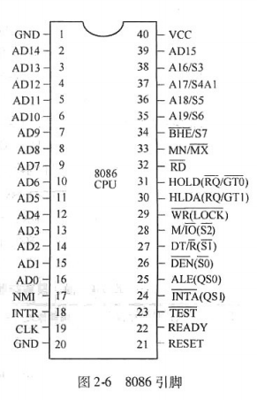
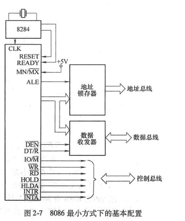
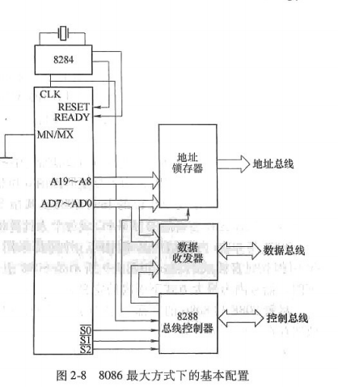
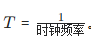
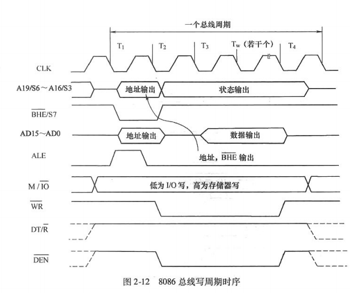
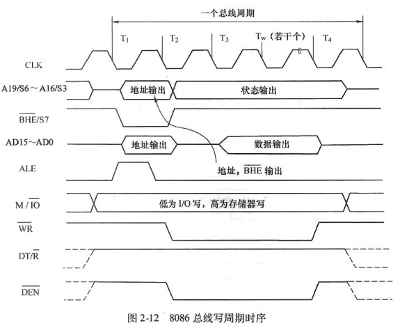
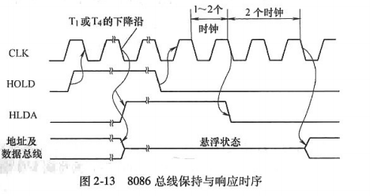
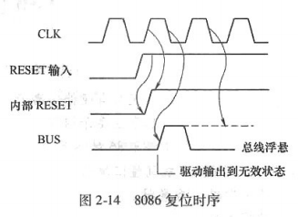

# **考核知识点与考核要求**

**1. 8086的内部结构**

**识记：8086的执行部件与总线接口部件**

8086 微处理器的内部结构分为两大单元：

1. 总线接口单元（Bus Interface Unit, BIU）

- 组成部分：

- 段寄存器（CS、DS、SS、ES）

- 指令队列（6 字节 FIFO 队列）

- 总线控制逻辑

- 地址加法器（用于计算物理地址）

- 主要功能：

- 取指令：从内存中取指令并存入指令队列。

- 地址计算：根据段基址和偏移地址计算 20 位物理地址。

- 数据传输：通过总线与内存或 I/O 接口进行数据交换。

1. 执行单元（Execution Unit, EU）

- 组成部分：

- 通用寄存器（AX、BX、CX、DX，SP、BP，SI、DI）

- 算术逻辑单元（ALU）

- 标志寄存器（FLAGS）

- 控制电路

- 主要功能：

- 指令执行：从指令队列中取指令，译码并执行。

- 数据运算：在 ALU 中完成算术和逻辑运算。

- 标志更新：根据运算结果更新 FLAGS 寄存器。

- 数据存储：将运算结果存入寄存器或通过 BIU 写入内存。

**BIU 与 EU 的协作**

- BIU 负责取指令并存入指令队列，EU 从队列中取指令执行。

- BIU 和 EU 并行工作（取指令与执行指令重叠进行）。

**2. 8086的基本执行环境**

**领会：寄存器结构，内存组织方式，逻辑地址的概念，物理地址的形成**

1. 寄存器结构

- 通用寄存器（AX、BX、CX、DX）：存放运算数据和结果。

- 段寄存器（CS、DS、SS、ES）：存放段基地址。

- 指针寄存器（SP、BP）：用于栈操作和基址寻址。

- 变址寄存器（SI、DI）：用于变址寻址和串操作。

- 指令指针寄存器（IP）：存放当前指令的偏移地址。

- 标志寄存器（FLAGS）：记录运算状态和控制操作。

1. 内存组织方式

- 分段存储：

- 内存划分为若干段，每段最大 64KB。

- 每段通过段寄存器（CS、DS、SS、ES）管理。

- 逻辑地址：段基址 + 偏移地址。

- 物理地址：由段基址左移 4 位（×16）加上偏移地址计算得出。

1. 逻辑地址与物理地址

- 逻辑地址：由段寄存器和偏移地址组成，形式为“段基址:偏移地址”。

- 物理地址：内存单元的实际地址。

- 计算公式：物理地址 = 段基址 × 10H + 偏移地址。

**3. 8086的引脚信号**

**领会：8086的引脚信号定义**

8086 采用 40 引脚双列直插封装，引脚信号可分为以下几类：

1. 地址/数据复用线（AD15~AD0）

- T1 时期：传输地址。

- 其他 T 周期：传输数据。

1. 地址/状态复用线（A19/S6~A16/S3）

- 高 4 位地址线复用为状态线，指示当前操作状态。

- S4/S3：指示当前使用的段寄存器。

1. 控制信号

- M/IO：高电平表示存储器操作，低电平表示 I/O 操作。

- RD：读信号，低电平有效。

- WR：写信号，低电平有效。

- ALE：地址锁存允许信号，高电平有效。

- DT/R：数据发送/接收信号，高电平表示发送，低电平表示接收。

- DEN：数据允许信号，用于控制数据总线收发器。

- READY：外设准备信号，高电平表示设备已准备好。

- RESET：复位信号，高电平有效。

- HOLD/HLDA：总线保持请求与响应信号。

1. 中断信号

- NMI：非屏蔽中断输入，低到高有效。

- INTR：可屏蔽中断输入，高电平有效。

- INTA：中断响应信号，低电平有效。

1. 最小方式与最大方式的切换

- MN/MX：高电平为最小方式，低电平为最大方式。

**4. 8086的基本时序**

**领会：时钟周期、总线周期和指令周期，8086基本时序**

1. 时钟周期（Clock Cycle）

- 定义：CPU 的最小时间单位，由外部时钟信号决定。

- 8086 的时钟频率常为 5 MHz，对应时钟周期为 200 ns。

1. 总线周期（Bus Cycle）

- 定义：CPU 通过总线完成一次数据传输所需的时间。

- 一个总线周期通常由 **4 个时钟周期（T₁、T₂、T₃、T₄）** 组成。

- 如果外设响应较慢，会插入等待周期（Tw）。

1. 指令周期（Instruction Cycle）

- 定义：执行一条指令所需的时间，包括取指令、译码、执行等阶段。

- 长度因指令不同而异：

- 最短指令：2 个时钟周期。

- 最长指令（如 16 位乘法）：约 200 个时钟周期。

1. 8086基本时序

- 存储器读周期：

- T₁：输出地址，ALE 有效。

- T₂：地址高阻，RD 信号有效。

- T₃：数据准备，等待 READY 信号。

- T₄：数据传输完成，信号撤销。

- 存储器写周期：

- T₁：输出地址，ALE 有效。

- T₂：数据输出，WR 信号有效。

- T₃：数据保持到总线上。

- T₄：写操作完成，信号撤销。

- 等待周期（Tw）：

- 如果外设或存储器未及时响应，CPU 会插入 Tw，直到 READY 信号有效。

**总结**

- 8086的内部结构：由 BIU 和 EU 两大单元组成，分别负责取指令和执行指令。

- 基本执行环境：分段存储机制解决了 16 位寄存器无法直接表示 20 位物理地址的问题。

- 引脚信号：通过复用技术减少引脚数量，支持最小和最大两种工作模式。

- 基本时序：总线周期由 T₁、T₂、T₃、T₄ 组成，等待周期 Tw 用于适应慢速设备。

以上是对 8086 相关知识点的全面解析，涵盖了执行部件、寄存器、引脚信号及基本时序的核心内容。

# 8086的内部结构

## **一、8086微处理器简介**

- 开发时间：1978年，由Intel公司研发。

- 封装形式：双列直插式封装（DIP），共40个引脚。

## **二、8086微处理器内部结构**

8086微处理器的内部结构由以下主要部分组成：

- 算术逻辑单元（ALU）

- 累加器

- 专用寄存器

- 通用寄存器

- 指令寄存器

- 指令译码器

- 定时和控制电路

根据功能，8086的内部结构可分为两大单元：

1. 总线接口单元（Bus Interface Unit, BIU）

1. 执行单元（Execution Unit, EU）

### **1. 总线接口单元（BIU）**

#### **组成部分**：

- 4个段寄存器

- 1个指令寄存器

- 内部暂存器（用于与EU通信）

- 先入先出的指令队列（FIFO队列）

- 总线控制逻辑

- 20位物理地址加法器（∑）

#### **主要功能**：

- 负责与存储器及I/O接口传递信息：

- 取指令：通过计算地址，从内存中取出待执行的指令放入指令队列。

- 取数据：当指令需要数据时，根据计算出的地址从内存或I/O端口取出数据送入EU。

- 存储结果：将EU的计算结果存入内存或输出到I/O端口。

- 地址计算：

- BIU通过段寄存器和偏移地址计算出20位实际物理地址。

### **2. 执行单元（EU）**

#### **组成部分**：

- 8个通用寄存器

- 1个标志寄存器（FLAGS）

- 算术逻辑单元（ALU）

- 控制系统电路

#### **主要功能**：

- 指令执行：

- 从指令队列中取出指令代码，译码并发出控制信号。

- 从内存/I/O端口或通用寄存器中取出数据，在ALU中进行算术和逻辑运算。

- 根据指令要求，将运算结果存入通用寄存器或通过BIU传送到内存/I/O端口。

- 标志寄存器更新：

- ALU的运算结果会影响FLAGS寄存器的相关位。

- 地址计算：

- 计算内存地址并传送给BIU。

### **3. BIU与EU的配合**

BIU与EU是8086处理器中的两个独立部件，但它们相互配合工作：

- 指令队列的作用：

- EU从指令队列中取指令执行，BIU负责在队列空出字节时从内存中取新指令填入队列。

- 8086的指令队列为6字节，通常当队列空出2字节时，BIU会自动执行一次取指令周期。

- 并行工作：

- BIU与EU可以独立工作，取指令和执行指令通常是重叠进行的。

- 例如：当EU执行当前指令时，BIU可以取下一条指令。

- 优点：

- 减少CPU因取指令而等待的时间。

- 提高CPU利用率，加快运行速度。

- 降低对存储器访问速度的要求。

- 总线冲突问题：

- 当BIU正在取指令时，EU可能需要通过总线访问数据或写入结果，造成总线冲突。

- 解决方法：

- EU的总线访问请求必须等待BIU取指令完毕后才会响应。

## **三、8088与8086内部结构的区别**

8088微处理器的内部结构与8086基本相同，均由BIU和EU组成，但在BIU上存在以下区别：

### **1. 指令队列的长度**

- 8086：指令队列长度为6字节。

- 8088：指令队列长度为4字节。

### **2. 指令队列的取指条件**

- 8086：当队列空出2字节时，BIU自动执行一次取指令周期。

- 8088：当队列空出1字节时，BIU自动执行一次取指令周期。

### **3. 外部数据总线宽度**

- 8086：外部数据总线为16位。

- 8088：外部数据总线为8位，因此8088被称为“准16位机”。

## **四、8086内部结构的特点**

1. 模块化设计：

- BIU和EU独立工作，指令队列作为缓冲，支持并行操作。

1. 提高效率：

- 取指令和执行指令的重叠进行减少了等待时间。

1. 总线冲突的解决：

- 通过优先级机制避免BIU和EU同时访问总线的问题。

## **五、关键点验证与思考**

1. BIU和EU的独立性：

- BIU和EU确实可以独立工作，但需要通过指令队列协调。

- 指令队列的大小直接影响并行效率。

1. 总线冲突问题：

- 总线冲突的解决方法合理，但在高负载情况下，可能仍存在性能瓶颈。

1. 8088的外部数据总线：

- 8088的8位外部数据总线设计，尽管降低了性能，但适应了当时的硬件环境（如8位外设）。

# 8086的基本执行环境

**8086的基本执行环境概述**

从程序员的角度看，8086的基本执行环境包括以下三个关键部分：

1. 各类寄存器

1. 内存的组织形式

1. 内存访问的地址确定方法

8088的基本执行环境与8086相同，因此本节主要讨论8086的基本执行环境。

## **一、8086的内部寄存器**

8086内部有14个16位寄存器，根据功能分为以下四类：

1. 通用寄存器

1. 段寄存器

1. 指令指针寄存器

1. 标志寄存器

**1. 通用寄存器**

**(1) 数据寄存器：AX、BX、CX、DX**

- 数据寄存器的作用：

- 存放参与运算的数据或运算结果。

- 每个寄存器为16位，但可以拆分为高8位和低8位，分别作为独立的8位寄存器使用：

- 高8位：AH、BH、CH、DH

- 低8位：AL、BL、CL、DL

- 习惯用法：

1. AX（累加器）：

- 用于字乘法、字除法、字I/O操作。

- AL用于字节乘法、字节除法、字节I/O操作、十进制运算和查表转换。

1. BX（基址寄存器）：

- 用于查表转换和间接寻址时存放基址。

1. CX（计数寄存器）：

- 用于串操作和循环中的计数。

1. DX（数据寄存器）：

- 在寄存器间接寻址的I/O操作中存放I/O端口号。

- 在双字长乘除法中，与AX组合存储32位数据，DX存放高16位。

【例2-1】分析

- 题目：AX=1101101100101111B，问AH和AL的值。

- 解答：

- AH为AX的高8位：11011011B

- AL为AX的低8位：00101111B

**(2) 地址指针寄存器：SP、BP**

- SP（栈指针寄存器）：

- 用于栈操作，确定栈顶在内存中的位置。

- 栈的实际位置由SP和栈段寄存器（SS）共同确定。

- BP（基址指针寄存器）：

- 用于存放当前栈段的一个数据区的基地址。

- 注意：BP与BX虽然同为基址寄存器，但BP用于栈段，BX用于数据段。

- 特点：

- 两者只能用作16位寄存器，也可存放其他数据。

**(3) 变址寄存器：SI、DI**

- SI（源变址寄存器）：

- 用于存放变址寻址方式中的源变址地址。

- DI（目的变址寄存器）：

- 用于存放变址寻址方式中的目的变址地址。

- 特点：

- 两者只能用作16位寄存器，也可存放其他数据。

**2. 段寄存器：CS、SS、DS、ES**

**(1) 段寄存器的作用**

- 用于存放不同段的基地址（首地址）。

- 8086系统的内存被划分为不同的逻辑段，每个段存放特定类型的信息：

1. 代码段（CS）：存放指令代码。

1. 数据段（DS）：存放数据。

1. 堆栈段（SS）：存放返回地址或中间结果。

1. 附加数据段（ES）：用于串操作时存放目标串。

**(2) 段寄存器的特点**

- 每个段寄存器为16位，存储的是段的基地址。

- 20位物理地址的计算方法需要结合段基地址和偏移地址。

**3. 指令指针寄存器（IP）**

- 作用：

- 存放预取指令在当前代码段中的偏移地址。

- 偏移地址（Effective Address, EA）：指令代码的地址相对于段基址的偏移量。

- 特点：

- IP不能直接读写，而是通过控制转移指令（如JMP、CALL等）间接控制。

- 每次取指令后，IP自动加1，指向下一条指令的地址。

**4. 标志寄存器（FLAGS）**

- 作用：

- 记录运算结果的特征（状态标志）。

- 控制CPU操作（控制标志）。

- 结构：

- FLAGS为16位寄存器，但只有9位有效：

- 6个状态标志：

1. CF（进位标志位）：最高位发生进位或借位时为1。

1. PF（奇偶标志位）：最低字节中1的个数为偶数时为1。

1. AF（辅助进位标志位）：D3到D4位发生进位或借位时为1。

1. ZF（零标志位）：运算结果为零时为1。

1. SF（符号标志位）：运算结果的最高位为1（负数）时为1。

1. OF（溢出标志位）：有符号数运算结果超出范围时为1。

- 3个控制标志：

1. TF（跟踪标志位）：单步调试模式。

1. IF（中断允许标志位）：允许或禁止响应可屏蔽中断。

1. DF（方向标志位）：控制串操作的地址递增/递减方式。

**三、关键点验证与思考**

**1. 通用寄存器的分工合理性**

- 数据寄存器（AX、BX、CX、DX）具有明确的分工，并支持高低位独立操作，灵活性强。

- 地址指针寄存器（SP、BP）和变址寄存器（SI、DI）用于寻址，适合8086的分段存储模型。

**2. 段寄存器的设计合理性**

- 段寄存器的16位宽度限制了直接存储20位物理地址的能力，但通过段基址和偏移地址的组合解决了这一问题。

- 段寄存器的分类（CS、DS、SS、ES）清晰且符合程序执行的实际需求。

**3. 标志寄存器的功能完整性**

- 状态标志和控制标志的设计覆盖了运算结果的特征记录和操作控制需求。

- 特别是OF和CF的分工清晰，适用于有符号和无符号运算的不同场景。

**4. IP的自动递增机制**

- IP的自动递增机制简化了指令执行流程，无需程序员手动更新。

## 二、8086的存储器管理

**一、存储器分段**

**1. 存储单元和地址范围**

- 存储单元：以1字节为单位，每个存储单元都有一个唯一的地址。

- 地址范围：

- 8086有20条地址线，最大可寻址内存容量为1MB（220220）。

- 每个内存单元的地址为20位，称为**物理地址**。

**2. 分段机制**

- 为什么需要分段：

- 8086的寄存器和内部结构是16位，无法直接表示20位的物理地址。

- 16位地址的寻址范围仅为64KB（2^16），远小于1MB。

- 分段方法：

- 将1MB内存划分为若干段，每段最大64KB。

- 每段的起始地址必须是16的倍数（低4位为0）。

- 每段的**段基址**存放在段寄存器中（16位）。

- 段内的偏移地址（有效地址，EA）用16位表示。

- 物理地址计算方法： 物理地址=段基址×10H+偏移地址物理地址=段基址×10*H*+偏移地址

**3. 段的灵活性**

- 程序员可以同时使用4段，分别由4个段寄存器（CS、SS、DS、ES）管理。

- 段之间的关系可以是：

- 邻接：段与段之间连续。

- 部分重叠：段之间有部分地址重合。

- 完全重叠：段基址相同。

- 不相邻：段之间完全独立。

**二、逻辑地址与物理地址**

**1. 定义**

- 逻辑地址：由段基址和段内偏移地址组成，形式为“段基址:偏移地址”。

- 物理地址：内存单元的实际地址，由逻辑地址计算得到。

**2. 物理地址的计算**

- 计算公式： 物理地址=段基址×10H+偏移地址物理地址=段基址×10*H*+偏移地址

- 例子：

- 已知DS=6417H，偏移地址=0100H。

- 物理地址计算： 物理地址=6417H×10H+0100H=64170H+0100H=64270H物理地址=6417*H*×10*H*+0100*H*=64170*H*+0100*H*=64270*H*

**3. 逻辑地址的非唯一性**

- 同一个物理地址可以由不同的逻辑地址表示。

- 例如：

- 逻辑地址6407H:0200H和6320H:1070H的物理地址均为64270H。

- 注意：物理地址是唯一的，但逻辑地址可能不唯一。

**三、多字节数据的存放**

**1. 字节的存储**

- 8086的存储单元是按字节编址的，每个存储单元存储1字节（8位）。

- 存储器的地址是每个字节的地址。

**2. 多字节数据的存储**

- 小端存储法：

- 低字节存放在低地址，高字节存放在高地址。

- 例如，32位数据12345678H的存储：

- 低字节78H → 存放在最低地址。

- 高字节12H → 存放在最高地址。

- 例子：

- 数据12345678H存放在逻辑地址3000H:2DA0H。

- 存储分布：

- 3000H:2DA0H → 78H

- 3000H:2DA1H → 56H

- 3000H:2DA2H → 34H

- 3000H:2DA3H → 12H

- 问题：34H所在的物理地址是多少？

- 逻辑地址：3000H:2DA2H

- 物理地址计算： 物理地址=3000H×10H+2DA2H=32DA2H物理地址=3000*H*×10*H*+2*DA*2*H*=32*DA*2*H*

**四、段、段寄存器和偏移地址的默认关系**

**1. 段寄存器和偏移地址的默认关系**

在不同的操作场景下，段寄存器和偏移地址的默认关系如下表所示：

| 段 | 默认段寄存器 | 偏移地址（有效地址） | 用途 | 
| -- | -- | -- | -- |
| 代码段 | CS | IP | 取指令 | 
| 堆栈段 | SS | SP或BP | 堆栈操作或以BP作为地址指针访问存储器数据 | 
| 数据段 | DS | BX、SI、DI、常数 | 访问存储器中数据（BP作为地址指针时除外） | 
| 附加数据段 | ES | DI | 串操作中的目标串 | 

**2. 分析默认关系**

- 代码段（CS:IP）：

- 取指令时，默认使用CS作为段寄存器，IP作为偏移地址。

- 堆栈段（SS:SP/BP）：

- 堆栈操作使用SS作为段寄存器，SP或BP作为偏移地址。

- BP常用于访问堆栈段中的局部数据。

- 数据段（DS:BX/SI/DI/常数）：

- 默认使用DS作为段寄存器，偏移地址可以是BX、SI、DI或常数。

- 例外：当BP作为偏移地址时，默认使用SS作为段寄存器。

- 附加数据段（ES:DI）：

- 串操作中，目标串默认使用ES作为段寄存器，DI作为偏移地址。

**五、关键点验证与思考**

**1. 分段机制的合理性**

- 分段机制解决了16位寄存器无法直接表示20位物理地址的问题。

- 通过段基址和偏移地址的组合，既扩展了寻址范围，又简化了编程。

**2. 物理地址的计算公式**

- 段基址左移4位（乘以16）后加上偏移地址，计算过程清晰且易于实现。

- 逻辑地址的非唯一性在某些场景下可能引起混淆，但物理地址的唯一性保证了数据访问的准确性。

**3. 小端存储法的设计**

- 小端存储法符合8086的字节编址习惯，低字节优先的存储方式与寄存器操作的低位优先特性一致。

**4. 默认段寄存器的选择**

- 默认段寄存器的选择规则与实际操作场景高度匹配，简化了程序员的编码负担。

# 8086的引脚信号

**1. 8086的工作方式**

8086有两种工作模式：

1. 最小方式：

- 系统中只有一个微处理器（8086），所有总线控制信号由8086直接产生。

- 特点：控制线路简单，适合小型系统。

- 应用：本课程实验采用此方式。

1. 最大方式：

- 系统中有多个总线主设备（如8086、协处理器8087或输入/输出协处理器8089）。

- 8086作为主处理器，其他设备配合工作。

- 特点：需要外加总线控制器（如8288）协调设备工作。

- 应用：PC机采用最大方式。

**切换方式**

- 高电平：最小方式。

- 低电平：最大方式。

**2. 8086的引脚信号分类**

8086采用40引脚双列直插式封装，部分引脚复用以满足功能需求。引脚信号可分为以下几类：

**(1) 公共引脚（最小方式与最大方式均适用）**

- 电源和地线：

- VCC：+5V电源。

- GND：地线。

- 地址/数据复用线（AD15~AD0）：

- 20位地址线的低16位复用为数据线。

- T1周期：传输地址。

- 其他T周期：传输数据。

- 地址/状态复用线（A19/S6~A16/S3）：

- 高4位地址线复用为状态线。

- S6：固定为0。

- S5：中断允许标志状态。

- S4/S3：当前使用的段寄存器（详见表2-2）。

**表2-2 S4/S3段寄存器状态：**

| S4 | S3 | 当前段寄存器 | 
| -- | -- | -- |
| 0 | 0 | ES | 
| 0 | 1 | SS | 
| 1 | 0 | CS或未使用 | 
| 1 | 1 | DS | 

- 控制信号：

- NMI：非屏蔽中断，低到高有效。

- INTR：可屏蔽中断，高电平有效。

- CLK：时钟信号，由8284提供，频率4.77MHz。

- RESET：复位信号，高电平有效，复位后从地址 FFFFH:0000H 开始执行。

- READY：准备信号，高电平表示内存/I/O设备已准备好。

- TEST：测试信号，配合 WAIT 指令使用。

- RD：读信号，低电平有效。

- BHE/S7：总线高允许信号，低电平有效，用于控制高8位数据线。

**(2) 最小方式下的引脚**

在最小方式下，8086直接控制系统，以下引脚用于控制总线：

- INTA：中断响应信号，低电平有效。

- ALE：地址锁存允许信号，高电平有效，用于锁存地址。

- DEN：数据允许信号，用于控制数据总线收发器。

- DT/R：数据发送/接收信号，高电平发送数据，低电平接收数据。

- M/IO：存储器/输入输出选择，高电平访问内存，低电平访问I/O端口。

- WR：写信号，低电平有效。

- HOLD：总线保持请求信号，高电平表示请求总线。

- HLDA：总线保持响应信号，高电平表示CPU已让出总线。

**(3) 最大方式下的引脚**

在最大方式下，8086需要配合8288总线控制器工作，以下引脚用于多处理器协调：

- QS1/QS0：指令队列状态信号，指示内部指令队列状态。

- S2/S1/S0：总线周期状态信号，由8288译码生成控制信号。

- LOCK：总线封锁信号，低电平表示锁定总线。

- RQ/GT0 和 RQ/GT1：总线请求/允许信号，用于外部设备请求总线。

**表2-5 S2/S1/S0状态：**

| S2 | S1 | S0 | 操作 | 控制信号 | 示例指令 | 
| -- | -- | -- | -- | -- | -- |
| 000 | 0 | 0 | 中断响应 | INTA | 无 | 
| 001 | 0 | 1 | 读I/O端口 | IORC | IN AL, DX | 
| 010 | 1 | 0 | 写I/O端口 | IOWC | OUT DX, AL | 
| 100 | 0 | 0 | 取指令 | MRDC | 无 | 
| 101 | 0 | 1 | 读内存 | MRDC | MOV AX, [1234H] | 
| 110 | 1 | 0 | 写内存 | MWTC | MOV [BX], AX | 
| 111 | 1 | 1 | 无效状态 | 无 | 无 | 

**3. 8088与8086的区别**

8088是8086的简化版本，主要区别如下：

1. 数据线宽度：

- 8086：16位（AD15~AD0）。

- 8088：8位（AD7~AD0）。

1. 引脚定义差异：

- 第28引脚：

- 8086：M/IO，高电平表示内存操作。

- 8088：IO/M，低电平表示内存操作。

- 第34引脚：

- 8086：BHE/S7。

- 8088：SSO（系统状态信号）。

1. 性能：

- 8088外部数据总线为8位，每次只能传输一半数据，速度较慢。

# 8086的基本时序

**一、时钟周期、总线周期和指令周期**

**1. 时钟周期 (Clock Cycle)**

- 定义：每两个时钟脉冲上升沿之剑的时间间隔称为T状态。

- 计算：时钟周期 

例如，8086 的时钟频率为 5 MHz，则时钟周期为 200 ns。

**2. 总线周期 (Bus Cycle)**

- 定义：CPU 通过总线与存储器或 I/O 端口进行一次数据传输所需的时间。

- 特点：

- 一个总线周期通常包含 **4 个时钟周期**。

- 8086 中，每次存储器或 I/O 操作（读写一个字节或字）需要一个总线周期。

**3. 指令周期 (Instruction Cycle)**

- 定义：执行一条指令所需的时间，包括取指令、译码、执行等阶段。

- 特点：

- 指令周期的长度因指令不同而不同。

- 指令长度：

- 最短指令：1 字节。

- 最长指令：6 字节。

- 执行时间：

- 最短执行时间：2 个时钟周期。

- 一般加/减/逻辑指令：几十个时钟周期。

- 最长指令（如 16 位乘除法）：约 200 个时钟周期。

**二、8086 的基本时序**

**1. 总线周期的组成**

- T₁ 周期：

- 输出 20 位地址。

- ALE 信号有效，锁存地址。

- M/IO 信号输出，指示操作类型（低电平为 I/O 操作，高电平为存储器操作）。

- T₂ 周期：

- 地址高 4 位输出状态编码。

- WR 或 RD 信号输出，指示读写状态。

- T₃ 周期：

- 地址/数据复用线上出现 16 位数据。

- T₄ 周期：

- CPU 获取数据（读操作）或完成数据传输（写操作）。

- 所有信号撤销。

- 等待周期 (Tw)：

- 如果存储器或 I/O 接口无法及时响应，CPU 会在 T₃ 和 T₄ 之间插入等待周期，直到 READY 信号有效。

**2. 总线操作类型**

8086 的总线操作时序可分为以下几种：

1. 存储器读/写周期。

1. I/O 端口读/写周期。

1. 中断响应周期。

1. 总线保持与响应周期。

1. 复位周期。

**一、总线周期的定义**

8086 CPU 的操作时序由 

一个总线周期通常由 

**二、总线读周期时序**

**时序图**

**时序分析**

1. T₁ 周期

（地址输出阶段）：

- A19/S6~A16/S3：输出 20 位地址的高 4 位。

- AD15~AD0：输出 20 位地址的低 16 位。

- BHE/S7：输出高字节使能信号，表明是否允许高 8 位数据总线工作。

- ALE：地址锁存信号有效，在其下降沿锁存地址。

- M/IO：指示操作类型（低电平为 I/O 操作，高电平为存储器操作）。

- DT/R：低电平，表示当前为读操作。

1. T₂ 周期

（状态输出阶段）：

- A19/S6~A16/S3：输出状态信息 S6~S3。

- AD15~AD0：进入高阻态，为后续的数据输入做准备。

- BHE/S7：转为高电平。

- ALE：无效（低电平）。

- RD：读信号有效，表明当前为读操作。

- DEN：数据总线使能信号有效，选通数据总线收发器。

1. T₃ 周期

（数据传输阶段）：

- AD15~AD0：

- 如果存储器或 I/O 设备准备好数据，则数据出现在数据线上。

- 如果数据未准备好，外设通过 READY 信号通知 CPU，CPU 会在 T₃ 和 T₄ 之间插入等待周期（Tw）。

- READY 信号：

- 如果 READY 信号无效，CPU 会在 T₃ 之后插入 Tw 周期，直到 READY 信号有效。

1. T₄ 周期

（读操作完成阶段）：

- CPU 从数据线上读取数据。

- 所有信号撤销，完成一次总线读周期。

**三、总线写周期时序**

**时序分析**

1. T₁ 周期

（地址输出阶段）：

- DT/R：高电平，表示当前为写操作。

- 输出地址信号，与读周期一致。

1. T₂ 周期

（数据输出阶段）：

- AD15~AD0：被 CPU 驱动，输出要写入的数据。

- WR：写信号有效，表明当前为写操作。

1. T₃ 周期

（数据保持阶段）：

- 数据保持在总线上，等待存储器或 I/O 设备接收。

1. T₄ 周期

（写操作完成阶段）：

- 数据传输完成，所有信号撤销，完成一次总线写周期。

**四、总线保持与响应时序**

**时序分析**

1. HOLD 信号：

- 当系统中其他主设备（如 DMA 控制器）需要使用总线时，向 CPU 发出 HOLD 信号。

- HOLD 信号有效时，CPU 会在当前总线周期的 T₄ 后沿或下一个总线周期的 T₁ 后沿响应。

1. HLDA 信号：

- CPU 在响应 HOLD 信号后，输出 HLDA 信号，表示已释放总线控制权。

- 释放总线后，CPU 的地址线、数据线、控制线进入高阻态。

1. 恢复总线控制权：

- 当主设备完成操作后，撤销 HOLD 信号。

- CPU 在下一个时钟周期恢复总线控制权。

**五、复位时序**

**时序分析**

1. RESET 信号：

- RESET 是一个输入引脚，用于启动或重新启动系统。

- 当 RESET 信号检测到上升沿时，CPU 停止所有操作，进入复位状态。

1. 复位期间：

- 地址线浮空。

- ALE 和 HLDA 信号无效（低电平）。

- 其他信号先变高一段时间，然后浮空。

- 指令队列被清空。

1. 复位完成：

- CPU 从地址 FFFF0H 开始执行指令。

**六、8086 时序的关键点总结**

1. 总线周期的组成：

- 一个总线周期由 T₁、T₂、T₃、T₄ 组成，外设响应较慢时会插入 Tw。

1. 读写操作的区别：

- 读操作：DT/R 为低电平，RD 信号有效。

- 写操作：DT/R 为高电平，WR 信号有效。

1. 等待机制：

- 如果外设或存储器未准备好数据，CPU 会插入等待周期（Tw），直到 READY 信号有效。

1. 总线保持与响应：

- 通过 HOLD 和 HLDA 信号实现总线控制权的交接。

1. 复位操作：

- RESET 信号有效时，CPU 停止所有操作，进入复位状态，并清空指令队列。

### **1) 8086微处理器中EU 和 BIU是如何并行工作的?又是如何合作的?**

- 并行工作：

- **BIU（总线接口单元）**负责从内存中取指令并存入指令队列，同时计算物理地址。

- **EU（执行单元）**从指令队列中取出指令并执行。

- BIU 和 EU 可以并行工作，BIU取指令的同时，EU执行当前指令。

- 合作方式：

- 指令队列：BIU 将取指令存入 6 字节的 FIFO 指令队列，EU 从中取指令执行。

- 总线冲突：当 EU 需要通过总线访问数据时，需等待 BIU 完成当前的取指令操作。

### **2) 8086微处理器内部有哪些通用寄存器?除了存放运算结果和中间结果，它们各自还有什么特殊用途?**

8086 有 8 个通用寄存器，分为以下三类：

1. 数据寄存器（AX、BX、CX、DX）

：

- AX（累加器）：用于字乘法、字除法、字 I/O 操作。

- BX（基址寄存器）：用于间接寻址和查表操作。

- CX（计数寄存器）：用于循环和串操作计数。

- DX（数据寄存器）：在双字长乘除法中存放高 16 位数据；也用于 I/O 端口号存储。

1. 指针寄存器（SP、BP）

：

- SP（栈指针）：指向当前栈顶。

- BP（基址指针）：用于栈段中局部变量的访问。

1. 变址寄存器（SI、DI）

：

- SI（源变址寄存器）：用于存储源数据地址。

- DI（目的变址寄存器）：用于存储目标数据地址，特别是在串操作中。

### **3) 在8086的程序中，最常见的有哪几个段?分别存放的什么?**

1. 代码段（CS）：存放程序的指令代码。

1. 数据段（DS）：存放程序运行时需要的数据。

1. 堆栈段（SS）：存放函数返回地址和中间结果。

1. 附加段（ES）：用于串操作时存放目标数据。

### **4) 在8086中，如果AX=902FH，BX=8761H，则完成AX+BX后，CF、OF、AF、PF、SF、ZF分别是多少?**

1. AX + BX

：

- 902FH+8761H=11790H902*FH*+8761*H*=11790*H*（结果为 17 位，超出 16 位）。

- 结果为 1790H1790*H*（低 16 位）。

1. 标志位分析

：

- CF（进位标志）：1（因为有进位产生）。

- OF（溢出标志）：0（无符号数运算，最高位无溢出）。

- AF（辅助进位标志）：1（低 4 位有进位）。

- PF（奇偶标志）：1（结果的最低字节中 1 的个数为偶数）。

- SF（符号标志）：0（最高位为 0，结果为正数）。

- ZF（零标志）：0（结果不为零）。

### **5) 在8086中，逻辑地址 FFFFH:0001H、00A2H:037FH 和 B800H:173FH 的物理地址分别是多少?**

- 计算公式：物理地址 = 段基址 × 10H + 偏移地址。

1. FFFFH:0001H

：

- FFFFH×10H+0001H=FFFF0H+0001H=100000H*FFFFH*×10*H*+0001*H*=*FFFF*0*H*+0001*H*=100000*H*。

1. 00A2H:037FH

：

- 00A2H×10H+037FH=00A20H+037FH=00D9FH00*A*2*H*×10*H*+037*FH*=00*A*20*H*+037*FH*=00*D*9*FH*。

1. B800H:173FH

：

- B800H×10H+173FH=B8000H+173FH=B973FH*B*800*H*×10*H*+173*FH*=*B*8000*H*+173*FH*=*B*973*FH*。

### **6) 在8086中，从物理地址 388H 开始顺序存放下列 3 个双字节的数据：651AH、D761H 和 007BH，请问物理地址 388H、389H、38AH、38BH、38CH 和 38DH 6 个单元中分别是什么数据?**

8086 使用 

1. 651AH

：

- 388H → 1AH

- 389H → 65H

1. D761H

：

- 38AH → 61H

- 38BH → D7H

1. 007BH

：

- 38CH → 7BH

- 38DH → 00H

**结果**

- 388H → 1AH

- 389H → 65H

- 38AH → 61H

- 38BH → D7H

- 38CH → 7BH

- 38DH → 00H

### **7) 8086工作方式有哪几种?它们有什么区别?**

1. 最小方式

：

- 8086 单独工作，直接控制总线。

- 特点：控制信号简单，适合小型系统。

- 应用：实验教学环境。

1. 最大方式

：

- 8086 与协处理器（如 8087）协同工作。

- 需要外部总线控制器（如 8288）协调。

- 特点：支持多主设备，适合复杂系统。

- 应用：PC 机。

**切换方式**

- 高电平：最小方式。

- 低电平：最大方式。

### **8) 请总结8086处理器中M/IO、RD、WR的不同值的组合所代表的操作。**

| M/IO | RD | WR | 操作 | 
| -- | -- | -- | -- |
| 1 | 1 | 0 | 写存储器 | 
| 1 | 0 | 1 | 读存储器 | 
| 0 | 1 | 0 | 写 I/O 端口 | 
| 0 | 0 | 1 | 读 I/O 端口 | 

### **9) S2、S1 和 S0 的不同值组合代表什么操作?8288会发出什么控制信号?**

| S2 | S1 | S0 | 操作 | 8288控制信号 | 
| -- | -- | -- | -- | -- |
| 0 | 0 | 0 | 中断响应 | INTA | 
| 0 | 0 | 1 | 读 I/O 端口 | IORC | 
| 0 | 1 | 0 | 写 I/O 端口 | IOWC | 
| 1 | 0 | 0 | 取指令 | MRDC | 
| 1 | 0 | 1 | 读存储器 | MRDC | 
| 1 | 1 | 0 | 写存储器 | MWTC | 

### **12) 总线读/写周期中，Tw 会在什么情况下出现?其作用是什么?又有什么特点?**

1. 出现条件

：

- 外设或存储器响应速度较慢，未及时准备好数据或接收数据。

1. 作用

：

- 插入等待周期（Tw）用于延长总线周期，等待外设或存储器准备完成。

1. 特点

：

- Tw 的数量不固定，CPU 会根据 READY 信号动态调整。

- Tw 确保了 CPU 与慢速设备之间的兼容性。