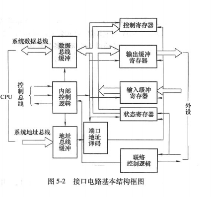
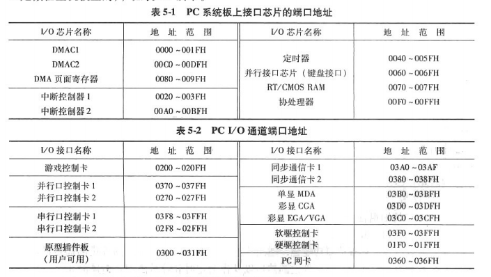

# 第一节 I/0接口概述

# I/O 接口概述与分析笔记

## 一、接口的概念和种类

1. 接口的定义

- 接口是 **CPU 与外部世界（存储器、I/O 设备）** 的连接电路，是信息交换的中转站。

- 外部世界指的是 **除 CPU 外的所有设备或电路**。

1. 接口的分类

- **内存接口**：CPU 与存储器之间的连接。

- **I/O 接口**：CPU 与外部设备之间的连接。

1. 作用

- 通过接口电路，CPU 能够与各种外部设备（键盘、鼠标、显示器、ADC/DAC 等）进行有效通信。

- 接口的引入解除了 CPU 对外设硬件的直接依赖，增强了系统的灵活性。

1. I/O 接口的重要性

- 接口是微机应用系统的 **核心技术**，是实现外部设备通信的关键。

- 微机应用开发的重点主要集中在 **接口电路设计** 和 **驱动程序编写**。

## 二、I/O 接口的基本功能

1. 数据缓冲功能

- 在接口电路中设置数据缓冲寄存器，用于补偿 CPU 和外设之间的速度差异，实现速度匹配。

1. 设备寻址功能

- 在系统中有多个 I/O 设备时，通过接口的寻址功能，确定与 CPU 交换信息的具体设备。

1. 信号转换功能

- 将 CPU 信号与外设信号进行格式、逻辑关系、电平和时序的匹配与转换，确保两者兼容。

1. 控制逻辑与状态信号

- 提供 CPU 与外设之间数据交换所需的 **控制逻辑** 和 **状态信号**。

1. 三总线转换与连接

- 实现 **数据总线**、**地址总线** 和 **控制总线** 的转换与连接。

## 三、I/O 接口的组成

I/O 接口由 **硬件** 和 **软件** 两部分组成。

### 1. 接口硬件

接口硬件通常集成在芯片中，主要包括以下部分：

- 数据缓冲寄存器

- 用于临时存储外设传入或 CPU 传出的数据，分为输入缓冲和输出缓冲。

- 输入缓冲器需具备三态输出功能。

- 控制寄存器

- 存放处理器发来的控制命令，确定接口的工作方式和功能。

- 控制寄存器为写寄存器，仅能由处理器写入。

- 状态寄存器

- 保存外设的状态信息（如忙/闲、就绪/故障等），供 CPU 查询。

- 状态寄存器为读寄存器，仅能由处理器读取。

- 数据总线和地址总线缓冲器

- 用于接口芯片内部总线与处理器外部总线的连接。

- 端口地址译码器

- 确保每个端口寄存器对应唯一地址，实现准确的设备寻址。

- 内部控制逻辑

- 实现系统控制总线与内部控制信号的转换。

- 对外联络控制逻辑

- 负责 CPU 和外设之间的数据传送同步信号的产生与接收。

### 2. 接口软件

接口软件即设备驱动程序，主要包括以下程序段：

1. 初始化程序段

- 设置接口芯片的工作方式和初始条件。

1. 传送方式处理程序段

- 根据 CPU 与 I/O 设备的传送方式不同，编写相应的数据传送处理程序。

1. 主控程序段

- 实现具体任务的程序段，如数据采集、转换启动信号、读数据等。

1. 程序终止与退出程序段

- 包括硬件保护程序和数据恢复程序。

1. 辅助程序段

- 解决人机对话等功能。

## 四、接口电路的基本结构

### 1. 核心部分

- 数据缓冲寄存器

- 端口地址译码器

- 输入/输出操作控制逻辑

### 2. 其他部分

- 数据总线和地址总线缓冲器

- 内部控制逻辑

- 对外联络控制逻辑

### 3. 结构框图

见图 5-2（接口电路基本结构框图），包含以下模块：

- 数据缓冲寄存器（输入/输出）

- 控制寄存器

- 状态寄存器

- 内部控制逻辑

- 地址译码器

- 对外联络控制逻辑

## 五、总结

- I/O 接口是微机系统中不可或缺的组成部分，承担着数据、地址和控制信号的转换与传递任务。

- 接口技术是软硬件结合的综合技术，是微机应用开发的核心。

- 学习和掌握 I/O 接口技术对从事嵌入式系统开发和微机应用研究具有重要意义。

# 第二节 I/O 端口编址

## 一、I/O 端口与 I/O 端口地址

1. I/O 端口的定义

- I/O 端口是 CPU 与 I/O 设备进行数据传送的窗口，端口可以是输入端口、输出端口或双向端口。

- 每个 I/O 端口需要分配一个地址，称为 **I/O 端口地址**。

1. I/O 端口地址的组成

- I/O 端口地址由 **高位地址线** 和 **低位地址线** 组成：

- **高位地址线**：通过地址译码电路生成片选信号（如 CS 信号），用于选择接口电路。

- **低位地址线**：用于端口号的寻址，通过端口地址译码器选中具体端口寄存器。

1. 端口访问的原理

- CPU 通过端口地址访问接口电路中的寄存器（如控制寄存器、数据缓冲寄存器、状态寄存器等）。

- 端口寄存器与 I/O 设备直接相连，完成数据、状态及控制信息的交换。

- **I/O 操作的本质**：通过访问 I/O 端口实现对 I/O 设备的操作。

## 二、I/O 端口编址方式

I/O 端口的编址方式决定了 I/O 端口地址的管理方式。主流的编址方式有两种：

### 1. **I/O 统一编址**

- **特点**：

- 将 I/O 端口映射为存储空间的一部分，I/O 地址与存储器地址共享同一地址空间。

- 访问 I/O 端口时使用存储器操作指令（如 MOV 指令）。

- **优点**：

1. 对 I/O 端口的操作与存储器操作完全一致，指令丰富，操作灵活。

1. I/O 地址空间可扩展到整个存储器地址空间，适用于大型系统。

1. 控制逻辑简单，与存储器读写控制一致。

- **缺点**：

1. 占用了存储器地址空间，减少了可用内存。

1. 访问内存的指令较长，执行速度慢。

1. I/O 地址译码复杂，增加了硬件设计难度。

### 2. **I/O 独立编址**

- **特点**：

- I/O 地址空间与存储器地址空间完全独立，互不干扰。

- 访问 I/O 端口时需使用专用的 I/O 指令（如 IN 和 OUT 指令）。

- **优点**：

1. I/O 地址不占用存储器地址空间，地址资源充足。

1. I/O 地址译码简单，寻址速度快。

1. I/O 指令与存储器指令区分明确，程序清晰易懂。

- **缺点**：

1. I/O 指令种类少，操作灵活性差。

1. 需要处理器支持两组控制信号（存储器读写信号和 I/O 端口读写信号），增加了控制逻辑复杂性。

## 三、I/O 端口地址译码方法

1. 地址译码的原理

- 地址译码通过地址总线和控制信号的组合，生成端口的片选信号和寄存器选择信号。

1. 地址译码的组成

- **高位地址线**：与控制信号组合生成片选信号，用于片间寻址。

- **低位地址线**：用于片内寄存器寻址，决定具体访问的寄存器。

1. 地址译码的方法

- **固定端口地址译码**：为特定接口分配固定的端口地址，硬件设计简单，编写驱动程序时需固定端口地址。

- **动态端口地址译码**：允许接口地址动态分配，灵活性高，但硬件和软件设计复杂。

1. 实例：固定地址译码电路

- 使用 74LS138 译码器实现固定端口地址译码：

- 译码器的使能端（如 G1、G2A、G2B）控制译码器是否工作。

- 输入端（如 A、B、C）根据地址线组合生成唯一有效的输出信号。

## 四、8088 系列 PC 的 I/O 编址方式和端口地址分配

### 1. **I/O 编址方式**

- **8088 系列 PC** 采用 **独立编址方式**：

- I/O 地址空间与存储器地址空间独立，访问 I/O 端口需使用专用指令（如 IN 和 OUT）。

- 存储器和 I/O 地址可以重叠，通过硬件和指令区分。

### 2. **I/O 地址空间**

- 8088 系列 PC 提供 **64 KB（2^16）独立 I/O 地址空间**，通常只使用低 10 位地址线（A9~A0）。

- 实际可用地址空间为 1 KB（1024 个端口），分为：

1. **系统板地址空间**：前 256 个端口（0000H~00FFH），供系统板上的接口芯片使用。

1. **扩展卡地址空间**：后 768 个端口（0100H~03FFH），供扩展槽上的接口控制卡使用。

### 3. **端口地址分配**

- 系统板上的接口芯片端口地址（表 5-1）：

- 中断控制器：0020H~003FH。

- 定时器：0040H~005FH。

- DMA 控制器：0000H~001FH 等。

- 扩展槽上的接口设备端口地址（表 5-2）：

- 串行口控制卡：03F8H~03FFH。

- 并行口控制卡：0378H~037FH。

- 游戏控制卡：0200H~020FH。

- 硬盘控制卡：01F0H~01FFH 等。

## 五、总结

1. I/O 端口与地址

- I/O 端口是 CPU 与外设通信的窗口，通过端口地址实现对外设的访问。

1. 编址方式

- I/O 统一编址适用于系统复杂、资源丰富的场合。

- I/O 独立编址适用于系统简单、对速度要求高的场合。

1. 地址译码

- 地址译码是实现端口访问的关键，可通过固定或动态译码实现。

1. 8088 系列 PC 的特点

- 采用独立编址方式，I/O 地址空间独立，硬件设计和软件编程各自分工明确。