# **第一节 存储器分类及其层次结构**

## **一、存储器分类**

1. 按位置和功能分类

- 通用寄存器

- 高速缓存（Cache）

- 内部存储器（内存、主存）

- 外部存储器（外存、辅助存储器）

1. 按存储介质分类

- 半导体存储器

- 磁存储器

- 光存储器

1. 按信息存取方式分类

- 只读存储器（ROM）

- 随机存取存储器（RAM）

- 顺序存取存储器（如磁带）

1. 半导体存储器的制造工艺

- 双极型（TTL电路）

- 速度快

- 集成度低，功耗略大

- 单级型（MOS电路）

- 集成度高，功耗低

- 速度相对较慢

## **二、存储器的层次结构**

**1. 层次设计原则**

- 目标：在**性能**、**容量**、**速度**和**成本**之间找到平衡。

- 现状：

- 高速存储器价格高，不适合大容量存储。

- 低速存储器价格低，但速度慢。

- 解决方案：采用分层存储结构。

**2. 典型存储结构（图4-1）**

从上到下，性能逐级降低，容量逐级增大：

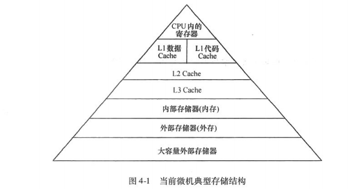

1. CPU内的寄存器

- 特点：速度最快，直接参与运算。

- 限制：器件成本高，数量有限。

1. 高速缓冲存储器（Cache）

- 作用：加速CPU与内存之间的数据传输。

- 特点：

- 通常采用静态RAM（SRAM）。

- 容量较小（如Core处理器：32KB L1 Cache，2MB L2 Cache）。

- 可能存在L1、L2、L3三级结构。

1. 内部存储器（内存）

- 特点：

- 使用动态RAM（DRAM，如DDR、DDR2、DDR3 SDRAM）。

- 容量大（如IA-32/Intel64系统中4GB~8GB）。

- 速度较Cache慢，但易组成大容量。

- 用途：存放正在运行程序的代码和数据。

1. 外部存储器（外存）

- 传统外存：磁存储（如硬盘）或光存储（如光盘）。

- 现代外存：固态硬盘（SSD）。

- 由控制单元和存储单元（如FLASH芯片、DRAM芯片）组成。

- 读写速度快、功耗低，但价格较高。

- 容量通常达到500GB~1TB以上。

- 特点：读写速度慢于内存，通常在磁盘控制器中增加缓存。

1. 大容量外部存储器

- 如磁盘库、光盘库等大规模存储设备。

**3. 存储器的工作流程**

- 程序和数据的运行过程：

1. 程序和数据首先存储在外存中。

1. 当程序运行时，相关数据调入内存。

1. 最近使用的数据和程序段暂时保留在Cache中。

1. Cache中的数据进一步调入CPU寄存器或指令缓冲区参与运算。

- PC/XT计算机的特殊情况：

- 没有寄存器和内存之间的Cache。

**总结**

- 存储器分为多种类型，根据位置、介质和存取方式分类。

- 现代计算机采用分层存储结构，以平衡性能、容量、速度和成本。

- 各存储层次在速度、容量和成本上呈现出明显的差异，形成了高效的协作体系。

# 第二节 半导体存储器

## **一、半导体存储器的基本结构**

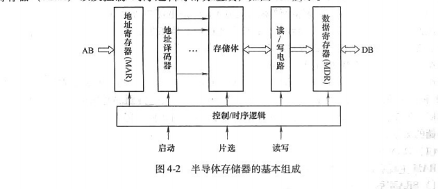

半导体存储器的组成部分如图4-2所示，主要包括以下模块：

- 地址寄存器（MAR）：存储当前访问的存储单元地址。

- 地址译码器：将地址信号译码后选中对应的存储单元。

- 存储体：存储数据的核心部分，由多个存储单元组成。

- 读/写电路：负责存储单元的数据读出或写入。

- 数据寄存器（MDR）：暂存从存储单元中读取的数据或准备写入的数据。

- 控制/时序逻辑：协调存储器的启动、片选、读写等操作。

**工作流程**

1. CPU通过地址总线将地址送入地址寄存器（MAR）。

1. 地址译码器根据地址选中目标存储单元。

1. 读/写电路完成数据的读出或写入操作。

1. 数据通过数据寄存器（MDR）传递给CPU或I/O设备。

## **二、半导体存储器分类**

**1. 只读存储器（ROM）**

- 特点：

- 正常工作时只能读取数据，不能修改内容。

- 掉电后数据不丢失（非易失性存储器）。

- 常用于存储固定不变的数据，如BIOS程序。

- 常见类型：

1. 掩膜ROM（Masked ROM）

- 在制造时通过掩膜工艺将数据固化，无法更改。

1. 可编程ROM（PROM）

- 用户可编程一次，之后数据不可更改。

1. 可擦除PROM（EPROM）

- 通过紫外线擦除数据后可重新写入。

- 通常封装中有玻璃窗以便紫外线照射。

1. 电可擦除PROM（EEPROM/E²PROM）

- 通过电信号在线擦除和修改，速度较慢。

1. 闪存（Flash Memory）

- 电可擦除，可在线读写，存储容量大、速度快、功耗低，广泛应用于现代设备。

**2. 随机存取存储器（RAM）**

- 特点：

- 可随时进行读/写操作。

- 掉电后数据丢失（易失性存储器）。

- 读写速度比ROM快，存取时间一致。

- 常见类型：

1. 静态RAM（SRAM）

- 使用触发器存储数据，只要不断电数据不会丢失。

- 速度快，但集成度低，成本高。

1. 动态RAM（DRAM）

- 通过电容存储数据，需要定期刷新以维持数据。

- 集成度高，常用于内存。

1. 非易失RAM（NVRAM）

- SRAM与EEPROM的结合体，掉电后数据自动保存到EEPROM中。

## **三、DRAM的发展与内存条**

**1. DRAM的发展历程**

- 早期形式：直接焊接到主板上的内存颗粒。

- 现代形式：内存芯片组成的内存条（SIMM、DIMM）。

**2. 常见DRAM类型**

1. SDRAM（同步动态随机存储器）

- 与CPU同步工作，消除等待时间。

- 采用双存储体结构，切换访问。

- 工作频率：66MHz、100MHz、133MHz等。

- 命名：如PC133表示工作频率为133MHz。

1. DDR SDRAM（双倍速率SDRAM）

- 在时钟的上升沿和下降沿各传输一次数据。

- 数据传输频率是时钟频率的两倍。

- 常见规范：DDR200（PC1600）、DDR333（PC2700）等。

1. DDR2 SDRAM

- 预读取能力为DDR的两倍（4bit）。

- 内核频率为时钟频率的一半，功耗更低。

- 工作电压：1.8V。

1. DDR3 SDRAM

- 预读取能力为DDR2的两倍（8bit）。

- 数据传输速率更高（如1600MHz）。

- 内核频率为数据传输速率的1/8，进一步降低功耗。

## **四、内存的主要性能指标**

1. 存储容量

- 单位：bit或Byte（1Byte=8bit）。

- 计算公式：


1. 存取时间

- 从启动存储器到完成读/写操作所需时间。

- 包括读取时间和写入时间。

1. 存取周期

- 两次独立读/写操作的最小时间间隔。

- 通常大于存取时间（需包含恢复时间）。

1. 可靠性

- 用平均无故障时间（MTBF）衡量，时间越长越可靠。

1. 性能/价格比

- 不同用途的存储器关注点不同：

- Cache（SRAM）：强调速度。

- 内存（DRAM）：强调容量。

**总结**

- 半导体存储器分为ROM和RAM两大类，各自有多种细分类型，适用于不同场景。

- DRAM技术不断发展，内存条的性能和容量逐步提升，满足现代计算机的需求。

- 内存的性能由容量、速度、可靠性等多方面指标综合衡量。

## **五丶典型的半导体存储器芯片**

### **1. SRAM芯片 HM6264**

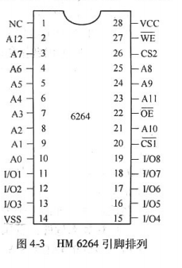

#### **基本信息**

- 容量：8K × 8位

- 工艺：1.5 μm CMOS技术

- 性能参数：

- 最大存取时间：85/100 ns

- 工作电压：5V，与TTL电平兼容

- 待机功耗：10 μW

- 工作功耗：15 mW

- 特点：

- 静态存储器（SRAM），无需刷新操作。

- 全静态设计，无需时钟和定时选通信号。

- 封装：

- 28引脚双列直插式（DIP）封装。

#### **引脚功能**

| 引脚编号 | 名称 | 功能说明 | 
| -- | -- | -- |
| 1 | NC | 无连接 | 
| 2-13 | A0-A12 | 地址线，共13根，用于访问8K存储单元 | 
| 14 | VSS | 电源地 | 
| 15-22 | I/O1-I/O8 | 数据线，共8根双向，传输8位数据 | 
| 23 | OE | 输出使能信号，低电平有效 | 
| 24 | A10 | 地址线 | 
| 25 | CS2 | 片选信号，高电平有效 | 
| 26 | WE | 写使能信号，低电平有效 | 
| 27 | A12 | 地址线 | 
| 28 | VCC | 电源正极，5V | 


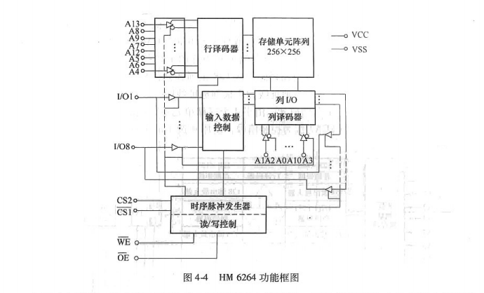

#### **功能框图解析**

1. 存储单元阵列：

- 内部采用二维结构，存储单元排列为256行 × 32列，共256 × 32 = 8192个存储单元。

- 每个存储单元包含8位数据，因此总容量为8K × 8位。

- 行地址（A0 ~ A7）通过行译码器生成256行选择信号。

- 列地址（A8 ~ A12）通过列译码器生成32列选择信号。

1. 数据操作：

- 写入操作：

- 条件：CS1 = 0，CS2 = 1，WE = 0，OE = 1。

- 地址线选择目标存储单元，数据通过I/O1 ~ I/O8写入。

- 读取操作：

- 条件：CS1 = 0，CS2 = 1，WE = 1，OE = 0。

- 地址线选择目标存储单元，数据通过I/O1 ~ I/O8输出。

1. 控制信号：

- CS1：片选信号1，低电平有效。

- CS2：片选信号2，高电平有效。

- WE：写使能信号，低电平时允许写入。

- OE：输出使能信号，低电平时允许输出。

#### **特点总结**

- SRAM芯片HM6264的静态存储结构使其在小型高速缓存或嵌入式系统中使用广泛。

- 功耗低，适合低功耗应用场景。

### **2. DRAM芯片 Intel 2164**

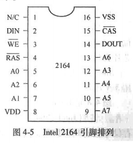

#### **基本信息**

- 容量：64K × 1位

- 性能参数：

- 最大存取时间：150/200 ns

- 待机功耗：27.5 mW

- 最大工作功耗：275 mW

- 特点：

- 动态存储器（DRAM），需要定期刷新。

- 内部采用行列地址复用技术，节省引脚数量。

- 封装：

- 16引脚双列直插式（DIP）封装。

#### **引脚功能**

| 引脚编号 | 名称 | 功能说明 | 
| -- | -- | -- |
| 1 | NC | 无连接 | 
| 2 | DIN | 数据输入线 | 
| 3 | WE | 写使能信号，低电平有效 | 
| 4 | RAS | 行选通信号，低电平有效 | 
| 5-12 | A0-A7 | 地址线，共8根，行列复用 | 
| 13 | CAS | 列选通信号，低电平有效 | 
| 14 | DOUT | 数据输出线 | 
| 15 | VSS | 电源地 | 
| 16 | VDD | 电源正极，5V | 


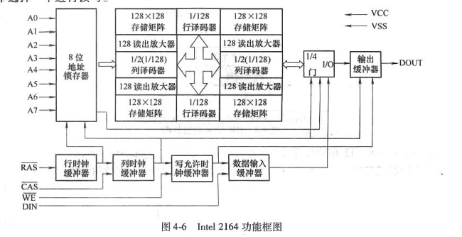

#### **功能框图解析**

1. 存储单元阵列：

- 内部由4个128 × 128的存储矩阵组成。

- 行地址（RA0 ~ RA6）通过行译码器生成128行选择信号。

- 列地址（CA0 ~ CA6）通过列译码器生成128列选择信号。

- RA7和CA7用于选择4个存储矩阵中的一个。

1. 数据操作：

- 写入操作：

- 条件：WE = 0，RAS有效，CAS有效。

- DIN引脚上的数据通过输入缓冲器写入选中的存储单元。

- 读取操作：

- 条件：WE = 1，RAS有效，CAS有效。

- 选中存储单元的数据通过输出缓冲器输出至DOUT引脚。

1. 刷新机制：

- DRAM需要定期刷新以保持数据。

- 每次刷新操作选择128个存储单元进行刷新。

- 128行刷新完成需要128次操作，刷新周期为2 ms。

#### **特点总结**

- Intel 2164通过行列地址复用技术大幅减少了引脚数量，适合大容量存储需求。

- 动态存储器的刷新机制使其适合高速存储和临时数据存储场景。

### **3. EPROM芯片 Intel 2764**

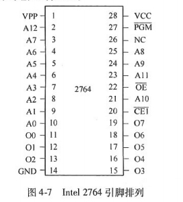

#### **基本信息**

- 容量：8K × 8位

- 性能参数：

- 最大读出时间：250 ns

- 工作电压：5V

- 特点：

- 只读存储器（EPROM），可通过紫外线擦除并重新编程。

- 适用于固件存储和程序代码存储。

- 封装：

- 28引脚双列直插式（DIP）封装。

#### **引脚功能**

| 引脚编号 | 名称 | 功能说明 | 
| -- | -- | -- |
| 1 | VPP | 编程电压输入（12.5V） | 
| 2-13 | A0-A12 | 地址线，共13根，用于访问8K存储单元 | 
| 14 | GND | 电源地 | 
| 15-22 | D0-D7 | 数据线，共8根双向 | 
| 23 | OE | 输出使能信号，低电平有效 | 
| 24 | A10 | 地址线 | 
| 25 | CE | 片选信号，低电平有效 | 
| 26 | PGM | 编程脉冲输入信号 | 
| 27 | NC | 无连接 | 
| 28 | VCC | 电源正极，5V | 


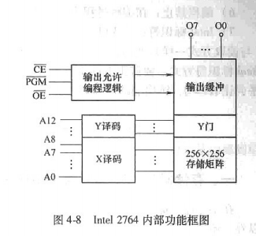

#### **功能框图解析**

1. 存储单元阵列：

- 内部采用二维结构，存储单元排列为256行 × 256列。

- 行地址（A0 ~ A7）通过行译码器生成256行选择信号。

- 列地址（A8 ~ A12）通过列译码器生成256列选择信号。

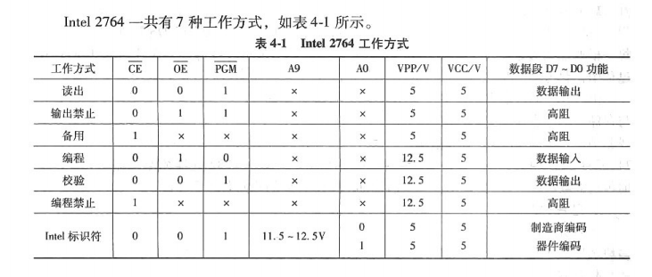

1. 工作模式：

- 读出：

- 条件：VPP = 5V，CE = 0，OE = 0，PGM = 1。

- 地址线选择目标存储单元，数据通过D0 ~ D7输出。

- 编程：

- 条件：VPP = 12.5V，CE = 0，OE = 1，PGM = 0。

- 数据通过D0 ~ D7写入目标存储单元。

- 校验：

- 条件：VPP = 12.5V，CE = 0，OE = 0，PGM = 1。

- 数据从目标存储单元输出，通过比对检查编程是否正确。

1. 编程过程：

- 提供12.5V的编程电压（VPP）。

- 地址线选择目标存储单元。

- 在PGM引脚上施加一个宽度为45 ms的低脉冲。

- 校验写入数据是否正确。

#### **特点总结**

- Intel 2764适合固件和程序代码存储，支持多次擦写。

- 编程需要专用设备，适合嵌入式系统开发和调试。

### **对比分析**

| 芯片类型 | SRAM (HM6264) | DRAM (Intel 2164) | EPROM (Intel 2764) | 
| -- | -- | -- | -- |
| 容量 | 8K × 8位 | 64K × 1位 | 8K × 8位 | 
| 存储特性 | 静态存储，无需刷新 | 动态存储，需要刷新 | 只读存储，可编程 | 
| 控制信号 | CS1, CS2, WE, OE | RAS, CAS, WE | CE, OE, PGM | 
| 数据线 | 8根双向 | 1根输入，1根输出 | 8根双向 | 
| 刷新机制 | 无需刷新 | 每行刷新，共128次 | 无需刷新 | 
| 功耗 | 10 μW（待机） | 27.5 mW（待机） | 40 mA（备用） | 
| 应用场景 | 高速缓存、嵌入式系统 | 大容量高速存储 | 固件存储、程序代码存储 | 


## **第三节：半导体存储器与 CPU 的连接**

### **一、存储器芯片与 CPU 连接中应关注的问题**

在半导体存储器芯片和 CPU 连接时，除了正确连接数据线、地址线和控制信号外，还需要特别注意以下几个问题：

### **1. CPU 的负载能力**

- 基本概念：

- 一般情况下，CPU 输出线的直流负载能力设计为带 **1 个 TTL 负载或 20 个 MOS 器件**。

- 由于 CPU 的每根地址线或数据线可能需要连接多个存储器芯片，因此需要考虑 CPU 外接存储器芯片的数量及物理距离等因素。

- 解决方法：

- 小型系统：由于 MOS 芯片的直流负载较小，CPU 可直接连接存储器芯片。

- 大型系统：需要在总线上增加缓冲器或驱动器，提升 CPU 的负载能力。

- 单向传输的地址线或控制线：

- 使用 **74LS244** 或 **74LS367** 单向缓冲器。

- 或使用 **74LS373** 或 **Intel 8282** 驱动器。

- 双向传输的数据线：

- 使用 **74LS245** 或 **Intel 8287** 双向总线驱动器。

### **2. 芯片的选择**

- 存储器系统的特点：

- 由于单片存储器芯片容量有限，构建一定容量的存储器需要选择多块芯片。

- 选择芯片时需要考虑的因素：

1. 芯片容量：单片存储器的容量。

1. 总存储容量：系统需要的整体存储容量。

1. 时序匹配：芯片工作时序是否与系统匹配。

### **3. 时序配合**

- CPU 与存储器的时序要求：

- CPU 对存储器的 **读/写操作** 是最基本且最频繁的操作。

- 存储器芯片的工作速度必须与 CPU 的读/写时序相匹配。

- 读操作：

- CPU 发出地址和读命令后，存储器必须在规定时间内将数据送入数据总线。

- 写操作：

- CPU 发出写脉冲后，存储器必须在规定时间内将数据写入指定存储单元。

- 存储器的输入信号要求：

- 存储器对输入信号的时序要求严格，不同存储器件的时序要求可能不同。

- 为确保系统正常运行，地址信号和控制信号必须满足存储器的时序参数。

- 关键参数：存取时间。

- 解决方法：

- 若存储器芯片速度无法直接匹配 CPU，可以通过插入 **等待周期** 来解决。

### **4. 存储器的地址分配**

- 内存分区：

- 系统内存通常分为 **ROM** 和 **RAM** 两部分：

1. ROM：用于存放系统监控程序及固化的程序和常数。

1. RAM：分为系统区和用户区：

- 系统区：存放监控程序或操作系统的数据。

- 用户区：存放用户程序和数据。

- 用户区又进一步分为 **程序区** 和 **数据区**。

- 地址分配问题：

- 由于存储器芯片单片容量有限，需要多个存储器芯片连接组成存储器系统。

- 需要通过使用 **译码器** 产生片选信号，并正确连接各芯片。

## **总结**

### **存储器与 CPU 连接的核心问题**

1. 负载能力：

- 小型系统可直接连接，大型系统需增加缓冲器或驱动器。

1. 芯片选择：

- 需根据系统存储需求选择合适容量和时序的芯片。

1. 时序匹配：

- 存储器芯片的速度需与 CPU 的时序相匹配，必要时插入等待周期。

1. 地址分配：

- 使用译码器生成片选信号，合理分配存储器的地址空间。

### **常用元件**

- 单向缓冲器：74LS244、74LS367。

- 单向驱动器：74LS373、Intel 8282。

- 双向总线驱动器：74LS245、Intel 8287。

## 二丶存储器扩展

### **1. 位扩展**

#### **定义**

位扩展是通过将多个数据位宽较小的存储芯片的数据线并联，增加存储器的数据位宽，从而满足设计中对存储器位宽的需求。位扩展的关键是

#### **例4-1：用2K×8位存储芯片组成一个2K×32位的存储体**

- 

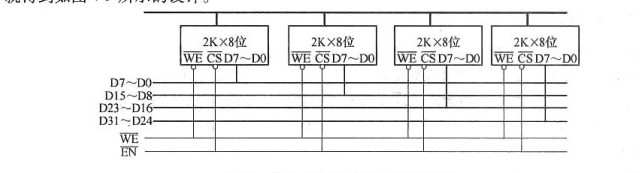

- 分析：

- 每个芯片容量为2K×8位，表示它拥有2K（2048）个存储单元，每个单元存储8位数据。

- 目标存储体容量为2K×32位，表示它拥有2K（2048）个存储单元，每个单元存储32位数据。

- 因此，需要的芯片数量为： 

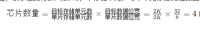

- 所以需要**4片2K×8位存储芯片**。

- 设计原理：

1. 地址线（A0~A10）：

- 每片芯片的地址线完全并联，因为所有芯片的存储单元数量相同（2K），地址范围一致。

- 地址线的数量由存储单元数决定：

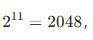

- ，因此需要11根地址线（A0~A10）。

1. 数据线（D0~D31）：

- 总共需要32根数据线，每8根数据线连接一片芯片。

- 第1片芯片连接D0D7，第2片芯片连接D8D15，第3片芯片连接D16D23，第4片芯片连接D24D31。

1. 控制线（WE和CS）：

- 写使能（WE）和片选信号（CS）完全并联，所有芯片同时响应相同的控制信号。

- 设计图：

根据上述分析，设计如图4-9所示：

- 地址线A0~A10并联到所有芯片。

- 数据线分接到各芯片的D0~D7。

- WE和CS信号并联到所有芯片。

### **2. 字扩展**

#### **定义**

字扩展是通过增加存储芯片的数量来扩展存储器的字数，而数据位宽保持不变。字扩展的关键是

#### **例4-2：用2K×8位存储芯片组成一个8K×8位的存储体**

- 

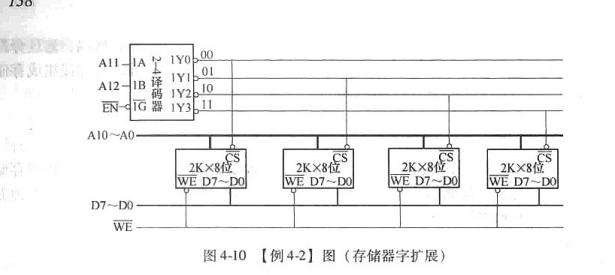

- 分析：

- 每个芯片容量为2K×8位，表示它拥有2K（2048）个存储单元，每个单元存储8位数据。

- 目标存储体容量为8K×8位，表示它拥有8K（8192）个存储单元，每个单元存储8位数据。

- 因此，需要的芯片数量为： 

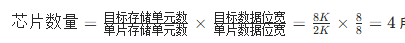

-  所以需要**4片2K×8位存储芯片**。

- 设计原理：

1. 地址线（A0~A12）：

- 目标存储体有8K单元，因此需要13根地址线（A0~A12），因为2^13=8192。

- 每片芯片有2K单元，因此每片芯片只需11根地址线（A0~A10）。

- 剩余的2根地址线（A11和A12）通过2-4译码器生成4个片选信号（Y0~Y3），分别控制4片芯片的选通。

1. 数据线（D0~D7）：

- 数据线D0~D7并联到所有芯片，因为数据位宽保持不变。

1. 控制线（WE）：

- 写使能（WE）信号并联到所有芯片。

- 地址范围划分：

- A11和A12的组合决定了每片芯片的地址范围：

- 第1片芯片（Y0选通）：0000H~07FFH。

- 第2片芯片（Y1选通）：0800H~0FFFH。

- 第3片芯片（Y2选通）：1000H~17FFH。

- 第4片芯片（Y3选通）：1800H~1FFFH。

- 设计图：

根据上述分析，设计如图4-10所示：

- A0~A10并联到所有芯片。

- A11和A12通过2-4译码器生成Y0~Y3，分别连接到4片芯片的CS引脚。

- 数据线D0~D7并联到所有芯片。

### **3. 字位扩展**

#### **定义**

字位扩展是同时扩展存储器的

#### **例4-3：用2K×8位存储芯片组成一个8K×16位的存储体**

- 分析：

- 每个芯片容量为2K×8位。

- 目标存储体容量为8K×16位。

- 因此，需要的芯片数量为：


-  所以需要**8片2K×8位存储芯片**。

- 设计原理：

1. 位扩展：

- 每组2片芯片的数据线分别连接D0D7和D8D15，构成2K×16位的存储体。

- 地址线A0~A10和控制线（WE）并联。

1. 字扩展：

- 将4组2K×16位的存储体通过字扩展，组成8K×16位的存储体。

- 地址线A11A12通过2-4译码器生成片选信号（Y0Y3），控制4组存储体的选通。

- 设计图：

- 位扩展：每组2片芯片分别连接D0D7和D8D15。

- 字扩展：A11和A12通过译码器生成Y0~Y3，分别连接4组存储体的CS引脚。

### **总结**

- 位扩展：增加数据位宽，地址线和控制线并联，数据线分接。

- 字扩展：增加存储字数，地址线分部分译码，数据线并联。

- 字位扩展：结合位扩展和字扩展，先增加数据位宽，再增加存储字数。

## 三丶实现片选控制的方法

存储器片选控制方法分为 

### 1. 全译码法

#### **特点**

- 系统的**全部地址线**都参与地址译码。

- 地址高位通过译码器生成片选信号，用于选择具体的存储芯片。

- 地址低位直接连接到存储芯片，用于选择芯片内部的存储单元。

- 每个存储单元都有唯一地址，不会出现地址重复问题。

#### **常用器件**

- 2-4译码器：74LS139

- 3-8译码器：74LS138

- 译码器的作用是将输入信号组合后产生唯一的低电平片选信号。

### **74LS138 译码器说明**

- 引脚功能：

- 输入端：A、B、C（3个地址输入引脚）

- 使能端：G1（高电平有效），G2A、G2B（低电平有效）

- 输出端：Y0~Y7（低电平有效，用于片选）

- 工作原理：

- 当且仅当 G1=1，G2A=0，G2B=0 时，译码器才有效。

- 根据 A、B、C 的不同组合，Y0~Y7 中只有一个为低电平，其余均为高电平。

- 真值表（片选信号生成规则）：

| G1 | G2A | G2B | C | B | A | Y0 | Y1 | Y2 | Y3 | Y4 | Y5 | Y6 | Y7 | 
| -- | -- | -- | -- | -- | -- | -- | -- | -- | -- | -- | -- | -- | -- |
| 1 | 0 | 0 | 0 | 0 | 0 | 0 | 1 | 1 | 1 | 1 | 1 | 1 | 1 | 
| 1 | 0 | 0 | 0 | 0 | 1 | 1 | 0 | 1 | 1 | 1 | 1 | 1 | 1 | 
| 1 | 0 | 0 | 0 | 1 | 0 | 1 | 1 | 0 | 1 | 1 | 1 | 1 | 1 | 
| 1 | 0 | 0 | 0 | 1 | 1 | 1 | 1 | 1 | 0 | 1 | 1 | 1 | 1 | 
| 1 | 0 | 0 | 1 | 0 | 0 | 1 | 1 | 1 | 1 | 0 | 1 | 1 | 1 | 
| 1 | 0 | 0 | 1 | 0 | 1 | 1 | 1 | 1 | 1 | 1 | 0 | 1 | 1 | 
| 1 | 0 | 0 | 1 | 1 | 0 | 1 | 1 | 1 | 1 | 1 | 1 | 0 | 1 | 
| 1 | 0 | 0 | 1 | 1 | 1 | 1 | 1 | 1 | 1 | 1 | 1 | 1 | 0 | 


### **示例**

- 在8086系统中，20位地址线（A19~A0）需要通过译码器生成片选信号。

- 如果有4个存储芯片，每片容量为8KB，则需要：

- 使用A19~A13（高7位地址线）接译码器输入端，生成片选信号。

- A12~A0（低13位地址线）直接连接到存储芯片的地址引脚。

- 优点：地址完全唯一，硬件设计简单。

- 缺点：需要更多译码器，硬件资源消耗较大。

### 2. 部分译码法

#### **特点**

- 系统的**部分地址线**参与译码，通常是高位地址线。

- 未参与译码的地址线可能为0或1，因此会导致地址重复。

- 存储单元的地址不唯一，每个存储芯片的地址范围也不唯一。

#### **优点**

- 节省硬件资源，设计更简单。

- 适用于地址空间较大的系统。

#### **示例**

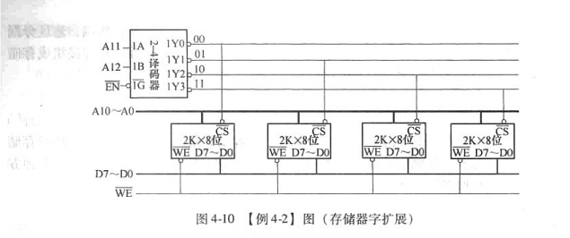

- 图4-10中，8086系统未将A19~A13接到译码器。

- 地址范围计算：

- 如果 A19~A13 全为 0，则第一块存储芯片的地址范围为 00000H~0007FFH。

- 如果 A19~A13 全为 1，则第一块存储芯片的地址范围为 OFE000H~OFE7FFH。

- 每个存储芯片的地址范围有 2^7 = 128 种可能。

#### **注意事项**

- 软件需要避免访问未定义的地址范围，否则可能出现错误。

### 3. 线选法

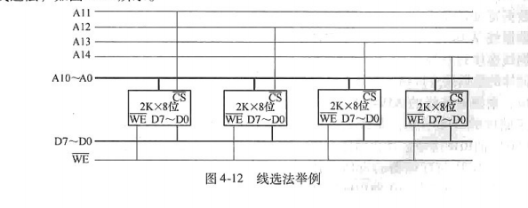

#### **特点**

- 不使用译码器，直接将地址线的高位作为片选信号。

- 每根地址线直接连接到存储芯片的片选端。

- 硬件最简单，但需要软件严格控制地址访问。

#### **问题**

- 如果多根片选信号有效，会导致多个芯片同时被选中，出现**地址重叠**。

#### **示例**

- 图4-12中，A14~A11直接连接到存储芯片的片选端。

- 地址范围：

- 第一片：07000H~077FFH

- 第二片：06800H~06FFFH

- 第三片：05800H~05FFFH

- 第四片：03800H~03FFFH

#### **注意事项**

- 软件必须确保访问的地址不会让多根片选信号同时有效。

- 在系统说明文档中需要明确地址重叠区域，并提醒程序员避开。

#### **总结与对比**

| 方法 | 特点 | 优点 | 缺点 | 适用场景 | 
| -- | -- | -- | -- | -- |
| 全译码法 | 全部地址线参与译码 | 地址唯一，硬件设计清晰 | 硬件资源消耗大 | 地址空间较小的系统 | 
| 部分译码法 | 部分地址线参与译码，地址不唯一 | 节省硬件资源 | 地址重复需软件处理 | 地址空间较大的系统 | 
| 线选法 | 不使用译码器，直接用地址线片选 | 硬件最简单 | 地址重叠问题需软件控制 | 简单系统或资源有限的场景 | 


### **8086 CPU 与存储器连接概述**

### **1. 8086 CPU 的基本特性**

- 地址线：20根地址线（A0 ~ A19），寻址范围为1MB。

- 数据线：16位数据线（D0 ~ D15），支持16位字（Word）和8位字节（Byte）的访问。

- 存储体划分：

- 8086系统通过**奇偶分体存储器**实现对16位数据的访问：

- 偶存储体：数据线D0 ~ D7，存储偶地址的数据。

- 奇存储体：数据线D8 ~ D15，存储奇地址的数据。

- 使用地址线A0和信号BHE（高字节使能）选择存储体。

### **2. 奇偶分体存储器接口**

- 奇偶存储体的接口原理：

- 偶存储体：负责偶地址的数据传输。

- 奇存储体：负责奇地址的数据传输。

- 地址线分配：

- A0用于区分奇偶存储体。

- A1 ~ A19用于存储器内部地址选择。

#### **信号控制逻辑（A0 和 BHE）**

| BHE | A0 | 传送数据 | 示例指令 | 
| -- | -- | -- | -- |
| 0 | 0 | 两个连续的字节（16位字） | MOV AX, [2002H] | 
| 0 | 1 | 奇地址的高位字节 | MOV AH, [2003H] | 
| 1 | 0 | 偶地址的低位字节 | MOV AL, [2002H] | 
| 1 | 1 | 不传送 | 无传输 | 


#### **奇偶存储器访问示意图**

- 8086与存储器的奇偶分体接口（图4-13）：

- A0和BHE用于选择奇存储体或偶存储体。

- 数据线D0 ~ D15分为高8位和低8位，分别连接奇存储体和偶存储体。

### **3. 数据访问中的边界对齐问题**

#### **边界对齐定义**

- 数据的地址如果是其长度的整数倍，则称为边界对齐。

- 如：字（2字节）地址为偶数，即边界对齐。

#### **边界对齐与非对齐的访问效率**

- 边界对齐访问：

- 一个总线周期即可完成（如访问偶地址的16位字）。

- 非边界对齐访问：

- 需要两个总线周期完成。

- 例如访问奇地址的16位字：

1. 第一个周期：访问奇地址的高字节。

1. 第二个周期：访问偶地址的低字节。

#### **非边界对齐访问示例**

- 示例：**MOV AX, [0001H]**

- 数据存储内容：

```
复制地址     内容
0000H    54H
0001H    07H
0002H    61H
0003H    21H

```

- 数据读取过程：

1. 第一个总线周期：

- 地址：0001H

- 信号：BHE=0，A0=1

- 读取奇地址的字节07H，存入数据线高8位（D8 ~ D15）。

1. 第二个总线周期：

- 地址：0002H

- 信号：BHE=1，A0=0

- 读取偶地址的字节61H，存入数据线低8位（D0 ~ D7）。

1. 最终结果：

- AX寄存器内容：6107H。

### **4. 存储器接口设计案例**

#### **设计需求**

- RAM区域：

- 起始地址：00000H

- 容量：64KB x 16位（128KB）

- 支持字节和字的访问。

- ROM区域：

- 起始地址：F0000H

- 容量：16KB x 16位（32KB）

- 仅支持字的访问。

- 译码器：使用74LS138进行地址译码。

#### **RAM与ROM的地址分配**

| 存储类型 | 地址范围（A19~A0，二进制） | 地址范围（十六进制） | 
| -- | -- | -- |
| RAM | 0000 0000 0000 0000 0000 | 00000H | 
| ROM | 1111 0000 0000 0000 0000 | F0000H | 


#### **设计实现**

1. RAM区域设计

：

- 使用两片62512（64KB x 8位的SRAM）进行奇偶分体。

- 地址线分配：

- A0用于奇偶存储体选择。

- A1 ~ A16连接到62512的地址线A0 ~ A15。

- 高位地址线A17 ~ A19通过74LS138译码得到片选信号。

- A17 ~ A19 = 000 → Y0输出有效。

1. ROM区域设计

：

- 使用两片27128（16KB x 8位的EPROM）进行奇偶分体。

- 地址线分配：

- A0始终为0（边界对齐）。

- A1 ~ A14连接到27128的地址线A0 ~ A13。

- 高位地址线A15 ~ A19通过74LS138译码得到片选信号。

- A17 ~ A19 = 110 → Y6输出有效。

1. 控制信号连接

：

- 读写控制信号（WR/RD）分别连接到RAM和ROM的控制引脚。

- 数据线D0 ~ D15分别连接奇偶存储体。

#### **存储系统设计图（图4-15）**

- 包含RAM和ROM的奇偶分体连接。

- 使用74LS138译码器生成片选信号。

- 高位地址线分配给译码器，低位地址线直接连接存储器。

### **5. 非对齐数据访问的优化**

- 问题：非对齐数据访问会增加总线周期，降低效率。

- 优化方法：

- 数据定义时确保边界对齐。

- 示例：

```ada
ORG 0012H
BUF1 DB 28H, 76H, 39H
ORG $ + 1 ; 确保BUF2地址对齐
BUF2 DW 2100H

```

### **总结**

1. 8086的奇偶分体存储设计：

- 使用A0和BHE选择奇偶存储体。

- 数据线高低8位分别连接奇偶存储体。

1. 边界对齐的重要性：

- 边界对齐可提高访问效率。

- 非对齐访问会增加总线周期。

1. 存储系统设计：

- RAM和ROM均采用奇偶分体。

- 地址线分配需结合存储器容量和片选逻辑。

### **8086 系统地址映射的详细分析与笔记**

8086 系统拥有 20 位地址线，支持 1 MB 的存储空间，地址范围为 

### **1. 地址空间分布概览**

| 区域名称 | 地址范围 | 大小 | 功能描述 | 
| -- | -- | -- | -- |
| 中断向量表 | 00000H~003FFH | 1 KB | 保存中断向量，每个中断向量占 4 字节，共 256 个中断向量。 | 
| BIOS 数据区 | 00400H~004FFH | 256 字节 | BIOS 自检数据存储区，保存关键的系统信息。 | 
| DOS 管理区 | 00500H~9FFFFH | 638 KB | DOS 操作系统和应用程序运行的常规内存区。 | 
| 传统视频缓冲区 | 0A0000H~0BFFFFH | 128 KB | 缓存显示适配器的图形或文本信息。 | 
| 扩充区域 | 0C0000H~0DFFFFH | 128 KB | 用于扩展卡的 ROM 或其他扩展存储设备。 | 
| 扩展系统 BIOS 区域 | 0E0000H~0EFFFFH | 64 KB | 存放扩展系统 BIOS 或 ROM BASIC 程序。 | 
| 系统 BIOS 区域 | 0F0000H~0FFFFFH | 64 KB | 存储基本输入输出系统（BIOS），用于系统启动和硬件初始化。 | 


### **2. 各区域详细说明**

#### **2.1 中断向量表**

- 地址范围：00000H ~ 003FFH

- 大小：1 KB

- 功能：

- 保存 256 个中断向量，每个中断向量占 4 字节。

- 每个中断向量包含中断处理程序的入口地址。

- 该区域是系统启动时的必需部分，存储中断服务程序的入口。

#### **2.2 BIOS 数据区**

- 地址范围：00400H ~ 004FFH

- 大小：256 字节

- 功能：

- 保存 BIOS 在开机自检（POST）时检测到的系统信息。

- 例如硬件配置、设备状态等重要数据。

- 数据存储在 RAM 中，便于读写。

#### **2.3 DOS 管理区**

- 地址范围：00500H ~ 9FFFFH

- 大小：638 KB

- 功能：

- DOS 操作系统和应用程序运行的主要内存区域。

- 包括用户程序、系统程序等。

- 是 8086 系统中最常用的内存区域。

#### **2.4 传统视频缓冲区**

- 地址范围：0A0000H ~ 0BFFFFH

- 大小：128 KB

- 功能：

- 用于缓存显示适配器的图形或文本信息。

- 不同类型的显示适配器（如单色、彩色图形）使用的缓冲区大小不同：

- 单色字符显示：0B0000H ~ 0B0FFFH（4 KB）

- 彩色字符显示：0B8000H ~ 0BBFFFH（16 KB）

#### **2.5 扩充区域**

- 地址范围：0C0000H ~ 0DFFFFH

- 大小：128 KB

- 功能：

- 用于扩展卡（如 ISA 总线卡）的地址映射。

- 分为 8 个 16 KB 的段，每段可以设置为只读、只写或禁止访问。

- 通常存储扩展卡的 ROM 数据。

#### **2.6 扩展系统 BIOS 区域**

- 地址范围：0E0000H ~ 0EFFFFH

- 大小：64 KB

- 功能：

- 存放扩展系统 BIOS 或早期 PC 的 ROM BASIC 程序。

- 现代系统中，该区域和系统 BIOS 区域一起用于存储 BIOS。

#### **2.7 系统 BIOS 区域**

- 地址范围：0F0000H ~ 0FFFFFH

- 大小：64 KB

- 功能：

- 存储系统 BIOS 程序，是系统启动时运行的第一个程序。

- 包括硬件自检（POST）和基本输入输出功能。

- 现代系统可能将该段“投影”到 RAM 中以加快执行速度。

### **3. 地址映射的关键点**

1. 地址分配的逻辑

：

- 8086 的地址空间被划分为多个功能区域，每个区域的大小和用途由硬件设计决定。

- 高地址部分主要用于 BIOS 和扩展设备，低地址部分用于操作系统和应用程序。

1. 视频缓冲区的灵活性

：

- 视频缓冲区的实际使用由显示适配器决定，不同适配器的需求不同。

1. 扩展区域的灵活性

：

- 扩展区域可以映射到系统总线插槽，用于扩展卡的 ROM 或其他存储设备。

1. BIOS 的重要性

：

- 系统 BIOS 和扩展 BIOS 区域是系统启动的核心部分，存储基本的硬件初始化程序。

### **4. 图示总结**

#### **地址空间分布图**

```ada
+----------------------+------------------+
| 系统 BIOS 区域       | 0F0000H~0FFFFFH  |
+----------------------+------------------+
| 扩展系统 BIOS 区域   | 0E0000H~0EFFFFH  |
+----------------------+------------------+
| 扩充区域             | 0C0000H~0DFFFFH  |
+----------------------+------------------+
| 传统视频缓冲区       | 0A0000H~0BFFFFH  |
+----------------------+------------------+
| DOS 管理区           | 00500H~9FFFFH    |
+----------------------+------------------+
| BIOS 数据区          | 00400H~004FFH    |
+----------------------+------------------+
| 中断向量表           | 00000H~003FFH    |
+----------------------+------------------+

```

### **5. 总结**

- 8086 的地址空间划分具有严格的功能分区，每个区域都服务于特定的系统需求。

- 高地址区域（0F0000H 以上）主要用于 BIOS 和扩展设备，是系统启动和硬件初始化的关键。

- 中低地址区域用于操作系统、应用程序和硬件缓冲区，是系统运行的核心部分。

通过这种划分，8086 系统能够高效地管理 1 MB 的地址空间，同时兼顾系统启动、扩展设备支持和用户程序运行的需求。