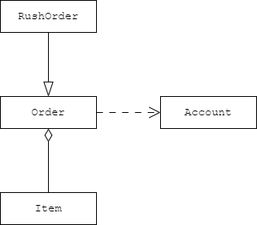
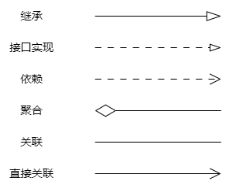

本章主要介绍：

- 面向对象程序设计入门；

- 如何创建Java标准库中类的对象；

- 如何编写自己的类。

## 4.1 面向对象程序设计概述

面向对象的程序是由对象组成的，每个对象都有对用户公开的特定功能和隐藏的实现，对比传统的结构化程序设计，通过设计一系列过程（即算法）来求解问题会更适用于在大型项目的交互上会比面向过程语言更加实用。[](https://zzy979.github.io/posts/java-note-v1ch04-objects-and-classes/#41-%E9%9D%A2%E5%90%91%E5%AF%B9%E8%B1%A1%E7%A8%8B%E5%BA%8F%E8%AE%BE%E8%AE%A1%E6%A6%82%E8%BF%B0)

### 4.1.1 类

类：类告诉你如何创建对象

实例：由类构成对象的过程称为实例

封装：封装就是将数据和行为组合在一个对象中，并对使用者隐藏实现细节。关键在于不能让其他的类访问，只需要在当前类中访问和操作

实例字段：对象中的数据，每个实例都有特定的数值称为状态

方法：操作实例的过程

扩展(extend)：可以通过继承来构造新类，减少代码重复率，JAVA有一个宇宙超级类，所有其他类都继承自这个类[](https://zzy979.github.io/posts/java-note-v1ch04-objects-and-classes/#411-%E7%B1%BB)

### 4.1.2 对象

三个特征：

- 行为：可以对对象做哪些操作，调用哪些方法

- 状态：对象会做什么响应

- 标识：如何区别具有相同行为和状态的不同对象

### 4.1.3 识别类

过程式：一条总指挥脚本挨步操作所有东西。


面向对象：把“怎么做”装进各自对象里，主控只把对象拎出来让它们互相配合。

### 4.1.4 类之间的关系

- 

- 聚合("has-a")，成员引用别的对象，但双方生命周期独立。

- 继承("is-a")，建立“更具体 is-a”类型，继承其接口/实现并可扩展或重写。

- 组合：整体负责成员的创建与销毁（强拥有）。

- 接口实现：实现抽象契约（realization），提供多态点。





## 4.2 使用预定义类

## 4.2.1 对象和对象变量

使用构造器来创建新实例，在构造器前加一个new的运算符

```java
System.out.println(new Data()));

//Data类有一个tostring的方法，返回日期的字符串
String s = new Data().tostring();

//对象变量
Data startTime; //不是一个对象，因为还没引用任何方法
startTime = new Data();// startTime = rightNow();引用一个已有的对象

//注意
//着两个变量引用同一个对象，修改startTime的时候rightNow也会一起被修改
```

### 4.2.2 Java库中的LocalDate类

```java
//不要使用构造器来构造LocalData
LocalData newYearsEve = LocalData.of(1999,12,31);
int year = newYearsEve.getYear(); //1999
int month = newYearsEve.getMonthValue();12
int day = newYearsEve.getDayOfMonth();31

//pulus()方法返回距当前对象指定天数的新的LocalDate:
LocalDate aThousandDaysLater = newYearsEve.plusDays(1000);
year = aThousandDaysLater.getYear(); // 2002
month = aThousandDaysLater.getMonthValue(); // 09
day = aThousandDaysLater.getDayOfMonth(); // 26
```

### 4.2.3 修改器和访问器方法

不是用构造器来构造LocalData的目的是，修改day的数值不会影响原本的对象

## 4.3 自定义类

### 4.3.1 Employee类

```java
//在Java中，最简单的类定义形式为
class ClassName  {
    field1
    field2
    ...
    constructor1
    constructor2
    ...
    method1
    method2
    ...
}

//下面看一个非常简单的Employee类，在编写薪资管理系统时可能会用到：
class Employee {
    // instance fields
    private String name;
    private double salary;
    private LocalDate hireDay;

    // constructor
    public Employee(String n, double s, int year, int month, int day) {
        name = n;
        salary = s;
        hireDay = LocalDate.of(year, month, day);
    }

    // a method
    public String getName() {
        return name;
    }

    // more methods
    ...
}

import java.time.LocalDate;

/**
 * This program tests the Employee class.
 * @version 1.13 2018-04-10
 * @author Cay Horstmann
 */
public class EmployeeTest {
    public static void main(String[] args) {
        // fill the staff array with three Employee objects
        Employee[] staff = new Employee[3];

        staff[0] = new Employee("Carl Cracker", 75000, 1987, 12, 15);
        staff[1] = new Employee("Harry Hacker", 50000, 1989, 10, 1);
        staff[2] = new Employee("Tony Tester", 40000, 1990, 3, 15);

        // raise everyone's salary by 5%
        for (Employee e : staff)
            e.raiseSalary(5);

        // print out information about all Employee objects
        for (Employee e : staff)
            System.out.println("name=" + e.getName() + ",salary=" + e.getSalary() + ",hireDay="
                    + e.getHireDay());
    }
}

class Employee {
    private String name;
    private double salary;
    private LocalDate hireDay;

    public Employee(String n, double s, int year, int month, int day) {
        name = n;
        salary = s;
        hireDay = LocalDate.of(year, month, day);
    }

    public String getName() {
        return name;
    }

    public double getSalary() {
        return salary;
    }

    public LocalDate getHireDay() {
        return hireDay;
    }

    public void raiseSalary(double byPercent) {
        double raise = salary * byPercent / 100;
        salary += raise;
    }
}
```

### 4.3.2 使用多个源文件

```java
javac Employee*.java //这样，所有与通配符匹配的源文件都将被编译成类文件
```

### 4.3.3 剖析Employee类

```java
public Employee(String n, double s, int year, int month, int day)
public String getName()
public double getSalary()
public LocalDate getHireDay()
public void raiseSalary(double byPercent)

//关键字public意味着任何类，任何方法都可以调用这些方法

private String name;
private double salary;
private LocalDate hireDay;

//private代表只能Employee这个类能访问这些字段，不建议使用public进行设置会破坏封装性，
```

### 4.3.4 从构造器开始

```java
public Employee(String n, double s, int year, int month, int day) {
    name = n;
    salary = s;
    hireDay = LocalDate.of(year, month, day);
}

//构造器和类同名，构造Employee类的对象时，构造器会被调用，以初始化实例字段。
//构造器只能用new进行调用，不能对一个已经存在的对象调用构造器来重新设置实例字段。

public class Main {
    public static void main(String[] args) {
        A a = new A(888);
        a.f(); // prints "123", not "888"
    }
}

class A {
    private int x;

    public A(int x) {
        this.x = x;
    }

    public void f() {
        int x = 123; // shadows this.x
        System.out.println(x);
    }
}

//警告：不要定义与实例字段同名的局部变量，否则会遮蔽(shadow)同名的实例字段，  A a = new A(888);我们想要他输出888，因为有个同名局部变量x =123，所以发生了遮蔽导致输出了123，通过this.x来强制访问x这个字段。


```

### 4.3.5 用var声明局部变量

```java
var harry = new Employee("Harry Hacker", 50000, 1989, 10, 1); // =Employee harry = new Employee("Harry Hacker", 50000, 1989, 10, 1);
//JAVA 10才能用var局部变量，避免重复写类型名Employee
//注意var关键字只能用于方法中的局部变量。参数和字段的类型必须声明。


```

### 4.3.6 使用null引用

```java
LocalDate rightNow = null;
String s = rightNow.toString(); // NullPointerException

//这是一个很严重的错误。如果没有捕获异常，程序就会终止。正常情况下，程序并不捕获这种异常，而是依赖程序员一开始就不要造成异常（因为这种错误是完全可以避免的）。


if (n == null) name = "unknown";
else name = n;

//为了确保字段不是NULL，可以用下面的方法
name = Objects.requireNonNullElse(n, "unknown");

name = Objects.requireNonNull(n, "The name cannot be null");
```

### 4.3.7 隐式参数和显式参数

显式参数：

隐式参数：

### 4.3.8 封装的优点

如果想要获得或设置实例字段的值，那么需要提供三项内容：

- 一个私有的实例字段

- 一个公有的访问器方法

- 一个公有的修改器方法

这样做要比提供一个简单的公有实例字段复杂些，但有很多明显的好处。

首先，可以改变内部实现，而不影响该类方法之外的任何代码。另外，修改器方法可以执行错误检查，而直接对字段赋值的代码不会这么做。[](https://zzy979.github.io/posts/java-note-v1ch04-objects-and-classes/#438-%E5%B0%81%E8%A3%85%E7%9A%84%E4%BC%98%E7%82%B9)

### 4.3.9 基于类的访问权限

```java
class Employee {
    ...
    public boolean equals(Employee other) {
        return name.equals(other.name);
    }
}
//一个类的方法可以访问这个类的所有对象的私有数据
```

### 4.3.10 私有方法

可能希望将一个计算代码分解成若干个独立的辅助方法，这些辅助方法不应该成为公有接口的一部分。最好将这样的方法实现为私有的。[](https://zzy979.github.io/posts/java-note-v1ch04-objects-and-classes/#4310-%E7%A7%81%E6%9C%89%E6%96%B9%E6%B3%95)

### 4.3.11 final实例字段

```java
class Employee {
    private final String name;
    ...
}
//可以将实例字段定义为final。这样的字段必须在构造器中初始化（否则编译器会报错），之后不能再修改这个字段

private final StringBuilder evaluations;
evaluations = new StringBuilder();
public void giveGoldStar() {
    evaluations.append(LocalDate.now() + ": Gold star!\n");
}
//final 只锁定“引用绑定一次”，不保证引用对象内容不变（可变对象内部仍可改）

```

## 4.4 静态字段和方法

### 4.4.1 静态字段

```java
//该类下的所有实例都共享这个nextId字段
class Employee {
    private static int nextId = 1;
    private int id;
    ...
}

//在构造器中，为新Employee对象分配下一个可用的id，然后将其加1：
id = nextId;
nextId++;

//==
this.id = Employee.nextId;
Employee.nextId++;

```

### 4.4.2 静态常量

```java
public class Math {
    public static final double PI = 3.14159265358979323846; //公有常量
    ...    
}
//另一个已经多次使用的静态常量是System.out。
//使用方式差异：  
//  - 有 static：`Math.PI`  
//  - 无 static：`new Math().PI`（徒增噪音与开销）
// 只要加了static就会让该类下的所有实例都共享
```

### 4.4.3 静态方法

```java
public static int advanceId() {
    int r = nextId; // obtain next available id
    nextId++;
    return r;
}

//可以认为静态方法是没有隐式参数(this)的方法。静态方法不能访问实例字段，但可以访问静态字段
//可以通过类名调用静态方法
int n = Employee.advanceId();

方法不需要访问实例字段，所需参数都通过显式参数提供（例如Math.pow()）。
方法只需要访问类的静态字段（例如Employee.advanceId()）。
```

### 4.4.4 工厂方法

```java
NumberFormat currencyFormatter = NumberFormat.getCurrencyInstance();
NumberFormat percentFormatter = NumberFormat.getPercentInstance();
double x = 0.1;
System.out.println(currencyFormatter.format(x)); // prints $0.10
System.out.println(percentFormatter.format(x)); // prints 10%

//可以使用NumberFormat类的工厂方法得到不同样式的格式化对象
```

### 4.4.5 main方法

为什么main方法是一个静态方法？

因为不是静态的话，虚拟机需要先构造实例，这会徒增更多的规则[](https://zzy979.github.io/posts/java-note-v1ch04-objects-and-classes/#445-main%E6%96%B9%E6%B3%95)

## 4.5 方法参数

java里只有按值引用，

Java 参数传递 = 永远按值；基本类型拷贝数值，对象类型拷贝引用；只能改对象内部，不能换掉调用者变量指向。

```java
/**
 * This program demonstrates parameter passing in Java.
 * @version 1.01 2018-04-10
 * @author Cay Horstmann
 */
public class ParamTest {
    public static void main(String[] args) {
        /*
         * Test 1: Methods can't modify numeric parameters
         */
        System.out.println("Testing tripleValue:");//
        double percent = 10;
        System.out.println("Before: percent=" + percent); //10
        tripleValue(percent);
        System.out.println("After: percent=" + percent); //10
    
        /*
         * Test 2: Methods can change the state of object parameters
         */
        System.out.println("\nTesting tripleSalary:");
        var harry = new Employee("Harry", 50000);
        System.out.println("Before: salary=" + harry.getSalary()); //50000
        tripleSalary(harry);
        System.out.println("After: salary=" + harry.getSalary()); //150000.0

        /*
         * Test 3: Methods can't attach new objects to object parameters
         */
        System.out.println("\nTesting swap:");
        var a = new Employee("Alice", 70000);
        var b = new Employee("Bob", 60000);
        System.out.println("Before: a=" + a.getName()); //Alice
        System.out.println("Before: b=" + b.getName()); //Bob
        swap(a, b);
        System.out.println("After: a=" + a.getName()); //Alice
        System.out.println("After: b=" + b.getName()); //Bob
    }

    public static void tripleValue(double x) { // doesn't work
        x = 3 * x;
        System.out.println("End of method: x=" + x);
    }

    public static void tripleSalary(Employee x) { // works
        x.raiseSalary(200);
        System.out.println("End of method: salary=" + x.getSalary());
    }

    public static void swap(Employee x, Employee y) {
        Employee temp = x;
        x = y;
        y = temp;
        System.out.println("End of method: x=" + x.getName());
        System.out.println("End of method: y=" + y.getName());
    }//交换的是x，y引用的副本，不影响外部的引用，“修改同一对象内部字段” 与 “让一个变量改指向另一个对象” 是两件本质不同的操作
    
    //你拿到的是“钥匙的复印件”；你能进屋（改屋里家具），但不能把原屋主手里的那把钥匙换掉。
}

// simplified Employee class
class Employee {
    private String name;
    private double salary;

    public Employee(String n, double s) {
        name = n;
        salary = s;
    }

    public String getName() {
        return name;
    }

    public double getSalary() {
        return salary;
    }

    public void raiseSalary(double byPercent) {
        double raise = salary * byPercent / 100;
        salary += raise;
    }
}
```

## 4.6 对象构造

### 4.6.1 重载

```java
var messages = new StringBuilder();
var todoList = new StringBuilder("To do:\n");

//多个方法有相同的名字，但是不同的参数即可重载
//调用方法时，编译器必须通过将形参类型与实参类型进行匹配来选出正确的方法（这个过程称为重载解析(overloading resolution)）
//Java允许重载任何方法，而不只是构造器。要完整地描述一个方法，需要指定方法名和参数类型，这叫做方法的签名(signature)。返回类型不是方法签名的一部分。也就是说，不能有两个名字和参数类型都相同但返回类型不同的方法。
```

### 4.6.2 默认字段初始化

数值为0

布尔值为false

对象引用为null[](https://zzy979.github.io/posts/java-note-v1ch04-objects-and-classes/#462-%E9%BB%98%E8%AE%A4%E5%AD%97%E6%AE%B5%E5%88%9D%E5%A7%8B%E5%8C%96)

### 4.6.3 无参数的构造器

如果编写的类没有构造器，编译器就会提供一个无参数构造器。这个构造器将所有实例字段设置为默认值[ ](https://zzy979.github.io/posts/java-note-v1ch04-objects-and-classes/#463-%E6%97%A0%E5%8F%82%E6%95%B0%E7%9A%84%E6%9E%84%E9%80%A0%E5%99%A8)

### 4.6.4 显式字段初始化

初始值不一定是常量，也可以是方法调用。[](https://zzy979.github.io/posts/java-note-v1ch04-objects-and-classes/#464-%E6%98%BE%E5%BC%8F%E5%AD%97%E6%AE%B5%E5%88%9D%E5%A7%8B%E5%8C%96)

```java
class Employee {
    private static int nextId;
    private int id = advanceId();
    ...
    private static int advanceId() {...}
    ...
}
```

### 4.6.5 参数名

在编写很简单的构造器时，可能很难想出参数名。通常选择单个字母的参数名：

有些程序员在每个参数前加上前缀 “a” ：

还有一种常用的技巧：参数与实例字段同名，用

```java
public Employee(String name, double salary) {
    this.name = name;
    this.salary = salary;
}
```

### 4.6.6 调用另一个构造器

```java
public class Employee {
    private static int nextId = 1;
    private int id;
    private String name;
    private double salary;

    // 主构造器：集中所有真正的初始化逻辑
    public Employee(String name, double salary) {
        this.name = name;
        this.salary = salary;
        this.id = nextId++;
    }

    // 辅助构造器：做参数推导，然后委托
    public Employee(double salary) {
        this("Employee #" + nextId, salary); // 注意：此时 nextId 还没自增，等主构造器里处理
    }
}

//通过 this(参数...)，一个构造器可以“委托”同一个类中的另一个构造器完成公共初始化。这样公共逻辑只写在一个“主构造器”里，其它构造器只是做参数准备 + 委托。
```

### 4.6.7 初始化块

```java
class Employee {
    private static int nextId;
    private int id;
    private String name;
    private double salary;

    // 类声明可以包含任意的代码块。构造这个类的对象时，这些块就会执行。
    {
        id = nextId;
        nextId++;
    }

    public Employee(String n, double s) {
        name = n;
        salary = s;
    }

    public Employee() {
        name = "";
        salary = 0;
    }
    ...
}


class A {
    private int x = f();

    {
        System.out.println("init block");
        x = 0;
    }

    public A(int x) {
        System.out.println("A(int)");
        this.x = x;
    }

    public A() {
        this(123);
        System.out.println("A()");
    }

    public static int f() {
        System.out.println("f()");
        return 42;
    }

    public int getX() {
        return x;
    }
}
/*
调用new A(888)将输出
f()
init block
A(int)


调用new A()将输出
f()
init block
A(int)
A()
*/

import java.util.Random;

/**
 * This program demonstrates object construction.
 * @version 1.02 2018-04-10
 * @author Cay Horstmann
 */
public class ConstructorTest {
    public static void main(String[] args) {
        // fill the staff array with three Employee objects
        var staff = new Employee[3];

        staff[0] = new Employee("Harry", 40000);
        staff[1] = new Employee(60000);
        staff[2] = new Employee();

        // print out information about all Employee objects
        for (Employee e : staff)
            System.out.println("name=" + e.getName() + ",id=" + e.getId() + ",salary="
                    + e.getSalary());
    }
}

class Employee {
    private static int nextId;

    private int id;
    private String name = ""; // instance field initialization
    private double salary;

    private static Random generator = new Random();

    // static initialization block
    static {
        // set nextId to a random number between 0 and 9999
        nextId = generator.nextInt(10000);
    }

    // object initialization block
    {
        id = nextId;
        nextId++;
    }

    // three overloaded constructors
    public Employee(String n, double s) {
        name = n;
        salary = s;
    }

    public Employee(double s) {
        // calls the Employee(String, double) constructor
        this("Employee #" + nextId, s);
    }

    // the default constructor
    public Employee() {
        // name initialized to ""--see above
        // salary not explicitly set--initialized to 0
        // id initialized in initialization block
    }

    public String getName() {
        return name;
    }

    public double getSalary() {
        return salary;
    }

    public int getId() {
        return id;
    }

}

```

### 4.6.8 对象析构和finalize方法

Java 无析构器，内存由 GC 管理；需及时释放的非内存资源请显式调用 close()；finalize() 已废弃不要用；只有在可等进程结束或极少特殊场景下才用 Shutdown Hook 或 Cleaner 注册清理动作。[](https://zzy979.github.io/posts/java-note-v1ch04-objects-and-classes/#468-%E5%AF%B9%E8%B1%A1%E6%9E%90%E6%9E%84%E5%92%8Cfinalize%E6%96%B9%E6%B3%95)

## 4.7 记录

可以隐藏掉为面向对象设计提供的数据[](https://zzy979.github.io/posts/java-note-v1ch04-objects-and-classes/#47-%E8%AE%B0%E5%BD%95)

### 4.7.1 记录概念

```java
//记录(record)是一种特殊形式的类，其状态不可变，且公共可读。
record Point(double x, double y) {}

//在Java中，记录的实例字段称为组件(component)。
//注意，访问器方法名为x()和y()，而不是getX()和getY()。
var p = new Point(3, 4);
System.out.println(p.x() + " " + p.y());

//为记录添加自己的方法
record Point(double x, double y) {
    public double distanceFromOrigin() { return Math.hypot(x, y); }
}

//与类一样，记录可以有静态字段和方法，不能添加实例字段，记录的实例字段自动为final。不过，它们可能是可变对象的引用：
record Point(double x, double y) {
    public static Point ORIGIN = new Point(0, 0);
    public static double distance(Point p, Point q) {
        return Math.hypot(p.x - q.x, p.y - q.y);
    }
    ...
}


```

### 4.7.2 构造器：标准、自定义和简洁

自动定义的设置所有实例字段的构造器称为

```java
//自定义构造器
record Point(double x, double y) {
    //这种构造器的第一条语句必须调用另一个构造器
    public Point() { this(0, 0); }
}

import java.util.Date;

/**
 * This program demonstrates records.
 * @version 1.0 2021-05-13
 * @author Cay Horstmann
 */
public class RecordTest {
    public static void main(String[] args) {
        var p = new Point(3, 4);
        System.out.println("Coordinates of p: " + p.x() + " " + p.y());
        System.out.println("Distance from origin: " + p.distanceFromOrigin());
        // Same computation with static field and method
        System.out.println("Distance from origin: " + Point.distance(Point.ORIGIN, p));

        // A mutable record
        var pt = new PointInTime(3, 4, new Date());
        System.out.println("Before: " + pt);
        pt.when().setTime(0);
        System.out.println("After: " + pt);

        // Invoking a compact constructor
        var r = new Range(4, 3);
        System.out.println("r: " + r);
    }
}

record Point(double x, double y) {
    // A custom constructor
    public Point() { this(0, 0); }
    // A method
    public double distanceFromOrigin() {
        return Math.hypot(x, y);
    }
    // A static field and method
    public static Point ORIGIN = new Point();
    public static double distance(Point p, Point q) {
        return Math.hypot(p.x - q.x, p.y - q.y);
    }
}

record PointInTime(double x, double y, Date when) {}

record Range(int from, int to) {
    // A compact constructor
    public Range {
        if (from > to) { // Swap the bounds
            int temp = from;
            from = to;
            to = temp;
        }
    }
}
```

## 4.8 包

Java允许使用[](https://zzy979.github.io/posts/java-note-v1ch04-objects-and-classes/#48-%E5%8C%85)

### 4.8.1 包名

为了保证包名的绝对唯一性，可以

考虑本书作者的域名[horstmann.com](https://horstmann.com/)，按逆序写就转换为包名[](https://zzy979.github.io/posts/java-note-v1ch04-objects-and-classes/#481-%E5%8C%85%E5%90%8D)

### 4.8.2 类的导入

```java
java.time.LocalDate today = java.time.LocalDate.now();

import java.time.*;

LocalDate today = LocalDate.now();

import java.time.LocalDate;

//大多数情况下，只需导入需要的包，不用过多关注。但在发生命名冲突时就要注意包了。
import java.util.*;
import java.sql.*;
//这两个包都有date类

var startTime = new java.util.Date();
var today = new java.sql.Date(...);


```

### 4.8.3 静态导入

```java
import static java.lang.Math.*;//允许导入类的静态字段和方法 sqrt(pow(x, 2) + pow(y, 2))而不是Math.sqrt(Math.pow(x, 2) + Math.pow(y, 2))

import static java.lang.System.out;//导入特定的方法或字段
```

### 4.8.4 将类加入包中

```java
//要将类放入包中，需要在源文件开头使用package语句指定包名
package com.horstmann.corejava;

public class Employee {
    ...
}
```

### 4.8.5 包访问

如果没有指定访问修饰符，这个实体（类、方法或字段）可以被[](https://zzy979.github.io/posts/java-note-v1ch04-objects-and-classes/#485-%E5%8C%85%E8%AE%BF%E9%97%AE)

### 4.8.6 类路径

classpath = “JVM 按顺序找类/资源的容器列表”，你不告诉它外部库在哪，它就永远找不到。[](https://zzy979.github.io/posts/java-note-v1ch04-objects-and-classes/#486-%E7%B1%BB%E8%B7%AF%E5%BE%84)

### 4.8.7 设置类路径

```java
java -classpath /home/user/classdir:.:/home/user/archives/archive.jar MyProg

export CLASSPATH=/home/user/classdir:.:/home/user/archives/archive.jar

set CLASSPATH=C:\classdir;.;C:\archives\archive.jar
```

## 4.9 JAR文件

在将应用程序打包时，你希望向用户提供单一的文件，而不是一个包含大量类文件的目录。Java归档(Java archive, JAR)文件就是为此目的而设计的。JAR文件既可以包含类文件，也可以包含诸如图像和声音等其他类型的文件。另外，JAR文件是使用ZIP格式压缩的。

### 4.9.1 创建JAR文件

```java
jar cvf jarFileName file1 file2 ...
jar cvf CalculatorClasses.jar *.class icon.gif
jar uf MyArchive.jar newfile...
```

### 4.9.2 清单文件

```java
//每个JAR文件还包含一个清单(manifest)文件，用于描述归档文件的特殊特性
//警告：清单文件的最后一行必须以换行符结束，否则将无法正确地读取清单文件。
Manifest-Version: 1.0
Created-By: My Company

Name: Woozle.class
SHA1-Digest: 265da9c51a9ea05ded00206478c802235774eeee

Name: com/mycompany/mypkg/
Sealed: true

```

### 4.9.3 可执行JAR文件

```java
jar cvfe MyProgram.jar com.mycompany.mypkg.MainAppClass com/mycompany/mypkg/*.class

Main-Class: com.mycompany.mypkg.MainAppClass

java -jar MyProgram.jar
```

### 4.9.4 多版本JAR文件

多版本JAR并不是指库版本(version)，而是JDK版本(release)。多版本JAR的唯一目的是使你的某个特定版本的程序或库能够用于多个JDK版本（例如MyProgram-1.0.jar既支持Java 8也支持Java 9）。如果增加了功能或者改变了API，就应当提供一个新版本的JAR（例如MyProgram-1.1.jar）。[](https://zzy979.github.io/posts/java-note-v1ch04-objects-and-classes/#494-%E5%A4%9A%E7%89%88%E6%9C%ACjar%E6%96%87%E4%BB%B6)

### 4.9.5 关于命令行选项的说明

## 4.10 文档注释

JDK包含一个很有用的工具，叫做

### 4.10.1 注释的插入

javadoc

- 模块

- 包

- 公有类和接口

- 公有和受保护字段

- 公有和受保护构造器和方法

注释放置在所描述特性的上方，以

标记以

### 4.10.2 类注释

### 4.10.3 方法注释

### 4.10.4 字段注释

### 4.10.5 通用注释

### 4.10.6 包注释

### 4.10.7 注释提取

## 4.11 类设计技巧