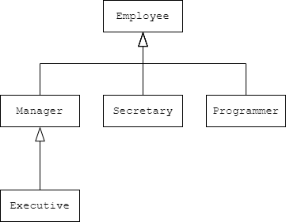
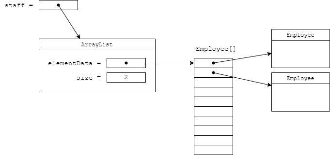
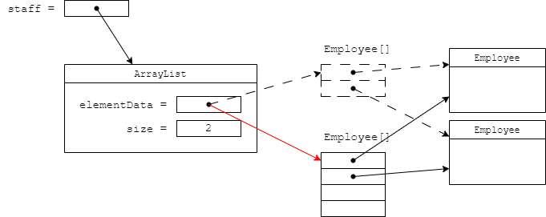
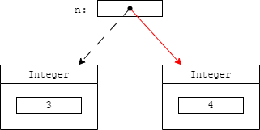

## 5.1 类、超类和子类

### 5.1.1 定义子类

```java
public class Manager extends Employee {
    added methods and fields
}

//关键字extends表示正在构造的新类派生于一个已存在的类。这个已存在的类称为超类(superclass)、基类(base class)或父类(parent class)，新类称为子类(subclass/child class)或派生类(derived class)。

//注释：不能扩展记录，而且记录也不能扩展其他类。
```

### 5.1.2 覆盖方法

```java
//子类方法不能直接访问超类的私有字段
//使用super来访问超类的方法
//警告：覆盖方法时，子类方法的可见性不能低于超类方法。具体地，如果超类方法是public，子类方法也必须声明为public。
public double getSalary() {
    double baseSalary = super.getSalary();
    return baseSalary + bonus;
}

```

### 5.1.3 子类构造器

```java
public Manager(String name, double salary, int year, int month, int day) {
    super(name, salary, year, month, day);//由于子类不能访问超类的私有字段，所以必须通过构造器来初始化这些字段。可以使用super(...)调用超类构造器，这个语句必须是子类构造器的第一条语句。
    bonus = 0;
}
```

### 5.1.4 继承层次结构



### 5.1.5 多态

```java
//可以将一个子类对象赋给超类变量：
Employee e;
e = new Employee(...); // Employee object expected
e = new Manager(...); // OK, Manager can be used as well

//不能将超类对象赋给子类变量。
Manager m = staff[i]; // ERROR

//原因很清楚：不是所有的员工都是经理。
```

### 5.1.6 理解方法调用

- 若方法是 private / static / final / 构造器：静态绑定（static binding），编译期即可确定目标。

- 否则使用动态绑定（dynamic binding），运行期根据对象实际类型决定具体实现。

- JVM 查看对象实际类型对应的“方法表”(method table)

| 概念 | 说明 | 
| -- | -- |
| 重载 (Overload) | 同一类中方法名相同、参数列表不同。编译期决定。 | 
| 覆盖 (Override) | 子类重新定义父类同签名方法。运行期动态绑定。 | 
| 隐式参数 | 即 | 
| 返回类型 | 不参与重载解析；参与覆写兼容性检查。 | 
| 静态方法 | 按声明类型解析（不发生动态绑定）。 | 
| 字段访问 | 不存在动态绑定，字段是“静态解析”（与引用变量类型有关）。 | 


### 5.1.7 阻止继承：final类和方法

```java
public final class Executive extends Manager {
    ...
}
//注释：final类中的所有方法自动地成为final方法，但字段不会。

//子类不能覆写这个方法
//但子类仍可以增加新方法，覆写其他非 final 方法。
```

### 5.1.8 强制类型转换

```java
Manager boss = (Manager) staff[0];

//进行强制类型转换的唯一原因是：在暂时忘记对象的实际类型之后使用对象的全部功能

//超类对象变量转化成子类对象变量，这样可以使用子类的功能
if (staff[i] instanceof Manager) { //instanceof用来检测是否转化成功
    Manager boss = (Manager) staff[i];
    boss.setBonus(5000);
}
```

### 5.1.9 instanceof模式匹配

```java
if (staff[i] instanceof Manager boss) {
    boss.setBonus(5000);
}
//从Java 16起，有一种更简单的方式。可以直接在instanceof测试中声明子类变量，也就是这句不用再写Manager boss = (Manager) staff[i];
```

### 5.1.10 受保护访问

字段声明为

| 修饰符 | 类 | 包 | 子类 | 任何类 | 
| -- | -- | -- | -- | -- |
| public | √ | √ | √ | √ | 
| protected | √ | √ | √ | × | 
| 无 | √ | √ | × | × | 
| private | √ | × | × | × | 


## 5.2 Object：所有类的超类

Object[](https://zzy979.github.io/posts/java-note-v1ch05-inheritance/#52-object%E6%89%80%E6%9C%89%E7%B1%BB%E7%9A%84%E8%B6%85%E7%B1%BB)

### 5.2.1 Object类型的变量

```java
Object obj = new Employee("Harry Hacker", 35000);

Employee e = (Employee) obj;

//Object类型的变量只能用作任意值的通用容器。要对其中的值进行具体的操作，需要清楚原始类型并进行强制类型转换

Employee[] staff = new Employee[10];
obj = staff; // OK
obj = new int[10]; // OK
```

### 5.2.2 equals方法

```java
public class Employee {
    ...
    public boolean equals(Object otherObject) {
        // a quick test to see if the objects are identical
        if (this == otherObject) return true;

        // must return false if the explicit parameter is null
        if (otherObject == null) return false;

        // if the classes don't match, they can't be equal
        if (getClass() != otherObject.getClass()) return false;

        // now we know otherObject is a non-null Employee
        Employee other = (Employee) otherObject;

        // test whether the fields have identical values
        return name.equals(other.name)
            && salary == other.salary
            && hireDay.equals(other.hireDay);
    }
}

//为了防备name或hireDay可能为null的情况，可以使用Objects.equals()方法
return Objects.equals(name, other.name)
    && salary == other.salary
    && Objects.equals(hireDay, other.hireDay);
    
//在子类中定义equals()方法时，首先调用超类的equals()。如果检测失败，那么对象就不可能相等。如果超类字段都相等，则比较子类的字段。
if (!super.equals(otherObject)) return false;


```

### 5.2.3 相等测试与继承

1. **自反性**(reflexive)：对于任何非空引用x，x.equals(x)应该返回true。

1. **对称性**(symmetric)：对于任何非空引用x和y，x.equals(y)返回true当且仅当y.equals(x)返回true。

1. **传递性**(transitive)：对于任何非空引用x、y和z，如果x.equals(y)返回true且y.equals(z)返回true，则x.equals(z)也应该返回true。

1. **一致性**(consistent)：如果x和y引用的对象没有发生变化，则反复调用x.equals(y)应该返回同样的结果。

1. 对于任何非空引用x，x.equals(null)应该返回false。

编写完美

```java
1.将显式参数命名为otherObject，稍后需要将它强制转换成另一个名为other的变量。
2.检测this和otherObject是否相同（引用同一个对象）：
if (this == otherObject) return true;
3.检测otherObject是否为null，如果是则返回false。这个检测是必要的。
if (otherObject == null) return false;
4.比较this和otherObject的类。如果相等性语义可以在子类中改变，就使用getClass()检测：
if (getClass() != otherObject.getClass()) return false;
ClassName other = (ClassName) otherObject;
如果相等性语义对所有的子类都相同，就使用instanceof检测：
if (!(otherObject instanceof ClassName other)) return false;
5.根据相等性概念的要求来比较字段。使用==比较基本类型字段，使用Object.equals()比较对象字段。如果所有字段都匹配则返回true，否则返回false。
return field1 == other.field1
    && Objects.equals(field2, other.field2)
    && ...;
```

### 5.2.4 hashCode方法

**散列码**

### 5.2.5 toString方法

```java
public String toString() {
    return "Employee[name=" + name
        + ",salary=" + salary
        + ",hireDay=" + hireDay
        + "]";
}
```

## 5.3 泛型数组列表

ArrayList[](https://zzy979.github.io/posts/java-note-v1ch05-inheritance/#53-%E6%B3%9B%E5%9E%8B%E6%95%B0%E7%BB%84%E5%88%97%E8%A1%A8)

### 5.3.1 声明数组列表

```java
ArrayList<Employee> staff = new ArrayList<Employee>();

//从Java 10起，可以使用var关键字避免重复写类名
var staff = new ArrayList<Employee>();

//不行写var，参数类型可省略，这称为“菱形”语法，因为空尖括号<>就像是一个菱形
ArrayList<Employee> staff = new ArrayList<>();

//使用add()方法将新元素添加到数组列表中
staff.add(new Employee("Harry Hacker", ...));
staff.add(new Employee("Tony Tester", ...));

//如果已经知道或者能够估计出要存储的元素数量，就可以在填充数组列表之前调用ensureCapacity()方法

staff.ensureCapacity(100);
//也可以把初始容量传递给构造器
ArrayList<Employee> staff = new ArrayList<>(100);

/一旦能够确认数组列表的大小不再发生变化，可以调用trimToSize()方法将容量调整为当前元素数量。垃圾收集器将回收多余的内存空间。
```





### 5.3.2 访问数组列表元素

```java
//不能使用[]语法访问数组列表的元素，而要使用get()和set()方法。

for (Employee e : staff)
    // do something with e
    
//可以使用toArray()方法将数组列表转换为数组。

for (Employee e : staff)
    // do something with e
    
for (int i = 0; i < staff.size(); i++) {
    Employee e = staff.get(i);
    // do something with e
}


package arrayList;

import java.util.ArrayList;

import inheritance.Employee;

/**
 * This program demonstrates the ArrayList class.
 * @version 1.11 2012-01-26
 * @author Cay Horstmann
 */
public class ArrayListTest {
    public static void main(String[] args) {
        // fill the staff array list with three Employee objects
        var staff = new ArrayList<Employee>();

        staff.add(new Employee("Carl Cracker", 75000, 1987, 12, 15));
        staff.add(new Employee("Harry Hacker", 50000, 1989, 10, 1));
        staff.add(new Employee("Tony Tester", 40000, 1990, 3, 15));

        // raise everyone's salary by 5%
        for (Employee e : staff)
            e.raiseSalary(5);

        // print out information about all Employee objects
        for (Employee e : staff)
            System.out.println("name=" + e.getName() + ",salary=" + e.getSalary() + ",hireDay="
                    + e.getHireDay());
    }
}


```

### 5.3.3 类型化与原始数组列表的兼容性

见8.5.4节。

## 5.4 对象包装器与自动装箱

有时，需要将

这些类通常称为

```java
var list = new ArrayList<Integer>();

//警告：由于每个值分别包装在一个对象中，ArrayList<Integer>的效率远低于int[]。只有当程序员的方便性比效率更重要时，才会考虑对较小的集合使用这种构造。

有一个很有用的特性可以很容易地将int类型的元素添加到ArrayList<Integer>。调用list.add(3);将自动地翻译成list.add(Integer.valueOf(3));。这种转换称为自动装箱(autoboxing)。
相反，将一个Integer对象赋给一个int值时，将会自动拆箱(unbox)。也就是说，编译器将int n = list.get(i);翻译成int n = list.get(i).intValue();。

Integer a = 1000;
Integer b = 1000;
if (a == b) ...//不相等，因为
```



## 5.5 参数个数可变的方法

```java
public class PrintStream {
    public PrintStream printf(String fmt, Object... args) {
        return format(fmt, args);
    }
}
//编译器需要转换每个printf()调用，将参数打包到一个数组中，并根据需要自动装箱
System.out.printf("%d %s", new Object[] { Integer.valueOf(n), "widgets" } );

//自己也可以定义有可变参数的方法，可以为参数指定任意类型，甚至是基本类型。
public static double max(double... values) {
    double largest = Double.NEGATIVE_INFINITY;
    for (double v : values) if (v > largest) largest = v;
    return largest;
}

double m = max(3.1, 40.4, -5);

```

## 5.6 抽象类

```java
public abstract String getDescription(); // no implementation required

//包含一个或多个抽象方法的类本身必须被声明为抽象的。
public abstract class Person {
    ...
}

public abstract class DataExporter {
    // 模板方法：final 防止改流程
    public final void export() {
        open();
        writeHeader();
        writeBody();
        close();
    }

    protected void open() { System.out.println("Open stream"); }
    protected void writeHeader() {}
    protected abstract void writeBody(); // 子类必须给
    protected void close() { System.out.println("Close stream"); }
}
class CsvExporter extends DataExporter {
    @Override
    protected void writeBody() { System.out.println("Write CSV rows"); }
}


package abstractClasses;

/**
 * This program demonstrates abstract classes.
 * @version 1.01 2004-02-21
 * @author Cay Horstmann
 */
public class PersonTest {
    public static void main(String[] args) {
        var people = new Person[2];

        // fill the people array with Student and Employee objects
        people[0] = new Employee("Harry Hacker", 50000, 1989, 10, 1);
        people[1] = new Student("Maria Morris", "computer science");

        // print out names and descriptions of all Person objects
        for (Person p : people)
            System.out.println(p.getName() + ", " + p.getDescription());
    }
}

package abstractClasses;

public abstract class Person {
    private String name;

    public Person(String name) {
        this.name = name;
    }

    public String getName() {
        return name;
    }

    public abstract String getDescription();
}

package abstractClasses;

import java.time.LocalDate;

public class Employee extends Person {
    private double salary;
    private LocalDate hireDay;

    public Employee(String name, double salary, int year, int month, int day) {
        super(name);
        this.salary = salary;
        this.hireDay = LocalDate.of(year, month, day);
    }

    public double getSalary() {
        return salary;
    }

    public LocalDate getHireDay() {
        return hireDay;
    }

    @Override
    public String getDescription() {
        return "an employee with a salary of $%.2f".formatted(salary);
    }

    public void raiseSalary(double byPercent) {
        double raise = salary * byPercent / 100;
        salary += raise;
    }

}

package abstractClasses;

public class Student extends Person {
    private String major;

    /**
     * @param name the student's name
     * @param major the student's major
     */
    public Student(String name, String major) {
        // pass name to superclass constructor
        super(name);
        this.major = major;
    }

    @Override
    public String getDescription() {
        return "a student majoring in " + major;
    }

}
```

## 5.7 枚举类

```java
public enum Size {
    SMALL("S"), MEDIUM("M"), LARGE("L"), EXTRA_LARGE("XL");

    private String abbreviation;

    Size(String abbreviation) { this.abbreviation = abbreviation; } // automatically private
    public String getAbbreviation() { return abbreviation; }
}

//SMALL的定义等价于 public static final Size SMALL = new Size("S");

package enums;

import java.util.Scanner;

/**
 * This program demonstrates enumerated types.
 * @version 1.0 2004-05-24
 * @author Cay Horstmann
 */
public class EnumTest {
    public static void main(String[] args) {
        var in = new Scanner(System.in);
        System.out.print("Enter a size: (SMALL, MEDIUM, LARGE, EXTRA_LARGE) ");
        String input = in.next().toUpperCase();
        Size size = Enum.valueOf(Size.class, input);
        System.out.println("size=" + size);
        System.out.println("abbreviation=" + size.getAbbreviation());
        if (size == Size.EXTRA_LARGE)
            System.out.println("Good job--you paid attention to the _.");
    }
}

enum Size {
    SMALL("S"), MEDIUM("M"), LARGE("L"), EXTRA_LARGE("XL");

    Size(String abbreviation) { this.abbreviation = abbreviation; }
    public String getAbbreviation() { return abbreviation; }

    private String abbreviation;
}

//toString()的逆方法是静态方法valueOf()
Size s = Enum.valueOf(Size.class, "SMALL");
```

[](https://zzy979.github.io/posts/java-note-v1ch05-inheritance/#57-%E6%9E%9A%E4%B8%BE%E7%B1%BB)

## 5.8 密封类

```java
public abstract sealed class JSONValue
    permits JSONArray, JSONNumber, JSONString, JSONBoolean, JSONObject, JSONNull {
    ...
}
//可以使用关键字sealed将一个类声明为密封类，并使用permits子句指定允许继承的子类
//一个密封类允许的子类必须是可访问的，不能是嵌套在另一个类中的私有类，也不能是位于另一个包中的包可见类。对于允许的公有子类，规则要更为严格。它们必须与密封类在同一个包中。

package sealed;

import java.util.ArrayList;
import java.util.HashMap;
import java.util.Map;

sealed interface JSONValue permits JSONArray, JSONObject, JSONPrimitive {
    default String type() {
        if (this instanceof JSONArray) return "array";
        else if (this instanceof JSONObject) return "object";
        else if (this instanceof JSONNumber) return "number";
        else if (this instanceof JSONString) return "string";
        else if (this instanceof JSONBoolean) return "boolean";
        else return "null";
    }
}

final class JSONArray extends ArrayList<JSONValue> implements JSONValue {}

final class JSONObject extends HashMap<String, JSONValue> implements JSONValue {
    @Override
    public String toString() {
        StringBuilder result = new StringBuilder();
        result.append("{");
        for (Map.Entry<String, JSONValue> entry : entrySet()) {
            if (result.length() > 1) result.append(",");
            result.append(" \"");
            result.append(entry.getKey());
            result.append("\": ");
            result.append(entry.getValue());
        }
        result.append(" }");
        return result.toString();
    }
}

sealed interface JSONPrimitive extends JSONValue
    permits JSONNumber, JSONString, JSONBoolean, JSONNull {}

record JSONNumber(double value) implements JSONPrimitive {
    @Override public String toString() { return "" + value; }
}

record JSONString(String value) implements JSONPrimitive {
    @Override public String toString() { return "\"" + value.translateEscapes() + "\""; }
}

enum JSONBoolean implements JSONPrimitive {
    FALSE, TRUE;
    @Override public String toString() { return super.toString().toLowerCase(); }
}

enum JSONNull implements JSONPrimitive {
    INSTANCE;
    @Override public String toString() { return "null"; }
}

public class SealedTest {
    public static void main(String[] args) {
        JSONObject obj = new JSONObject();
        obj.put("name", new JSONString("Harry"));
        obj.put("salary", new JSONNumber(90000));
        obj.put("married", JSONBoolean.FALSE);
        JSONArray arr = new JSONArray();
        arr.add(new JSONNumber(13));
        arr.add(JSONNull.INSTANCE);

        obj.put("luckyNumbers", arr);
        System.out.println(obj);
        System.out.println(obj.type());
    }
}
```

## 5.9 反射

- 在运行时分析类的能力

- 在运行时检查对象

- 实现泛型数组操作代码

- 利用Method对象（类似于C++中的函数指针）

### 5.9.1 Class类

在程序运行期间，Java运行时系统始终为所有对象维护一个[](https://zzy979.github.io/posts/java-note-v1ch05-inheritance/#591-class%E7%B1%BB)

```java
var generator = new Random();
Class cl = generator.getClass();
String name = cl.getName(); // name is set to "java.util.Random"

String className = "java.util.Random";
Class cl = Class.forName(className);

Class cl1 = Random.class; // if you import java.util.*;
Class cl2 = int.class;
Class cl3 = Double[].class;

if (e.getClass() == Employee.class) ...
```

### 5.9.2 声明异常入门

```java
public static void doSomethingWithClass(String name)
    throws ReflectiveOperationException {
    Class cl = Class.forName(name); // might throw exception
    // do something with cl
}
```

### 5.9.3 资源

类通常有一些关联的数据文件，例如图像、声音和文本文件。在Java中，这些关联的文件称为

```java
package resources;

import java.io.IOException;
import java.io.InputStream;
import java.net.URL;
import java.nio.charset.StandardCharsets;

import javax.swing.ImageIcon;
import javax.swing.JOptionPane;

/**
 * @version 1.5 2018-03-15
 * @author Cay Horstmann
 */
public class ResourceTest {
    public static void main(String[] args) throws IOException {
        Class cl = ResourceTest.class;
        URL aboutURL = cl.getResource("about.gif");
        var icon = new ImageIcon(aboutURL);

        InputStream stream = cl.getResourceAsStream("data/about.txt");
        var about = new String(stream.readAllBytes(), StandardCharsets.UTF_8);

        InputStream stream2 = cl.getResourceAsStream("/corejava/title.txt");
        var title = new String(stream2.readAllBytes(), StandardCharsets.UTF_8).strip();

        JOptionPane.showMessageDialog(null, about, title, JOptionPane.INFORMATION_MESSAGE, icon);
    }
}
```

### 5.9.4 使用反射分析类的能力

java.lang.reflect[](https://zzy979.github.io/posts/java-note-v1ch05-inheritance/#594-%E4%BD%BF%E7%94%A8%E5%8F%8D%E5%B0%84%E5%88%86%E6%9E%90%E7%B1%BB%E7%9A%84%E8%83%BD%E5%8A%9B)

```java
//Class类的getFields()、getMethods()和getConstructors()方法分别返回这个类的公有字段、方法和构造器的数组，其中包括超类的公有成员。
//Class类的getDeclaredFields()、getDeclaredMethods()和getDeclaredConstructors()方法分别返回这个类中声明的全部字段、方法和构造器的数组，其中包括私有、受保护和包访问成员，但不包括超类的成员。
package reflection;

import java.lang.reflect.Constructor;
import java.lang.reflect.Field;
import java.lang.reflect.Method;
import java.lang.reflect.Modifier;
import java.util.Scanner;

/**
 * This program uses reflection to print all features of a class.
 * @version 1.12 2021-06-15
 * @author Cay Horstmann
 */
public class ReflectionTest {
    public static void main(String[] args) throws ReflectiveOperationException {
        // read class name from command line args or user input
        String name;
        if (args.length > 0) name = args[0];
        else {
            var in = new Scanner(System.in);
            System.out.println("Enter class name (e.g. java.util.Date): ");
            name = in.next();
        }

        // print class modifiers, name, and superclass name (if != Object)
        Class cl = Class.forName(name);
        String modifiers = Modifier.toString(cl.getModifiers());
        if (modifiers.length() > 0)
            System.out.print(modifiers + " ");
        if (cl.isSealed())
            System.out.print("sealed ");
        if (cl.isEnum())
            System.out.print("enum " + name);
        else if (cl.isRecord())
            System.out.print("record " + name);
        else if (cl.isInterface())
            System.out.print("interface " + name);
        else
            System.out.print("class " + name);
        Class supercl = cl.getSuperclass();
        if (supercl != null && supercl != Object.class)
            System.out.print(" extends " + supercl.getName());

        printInterfaces(cl);
        printPermittedSubclasses(cl);

        System.out.print("\n{\n");
        printConstructors(cl);
        System.out.println();
        printMethods(cl);
        System.out.println();
        printFields(cl);
        System.out.println("}");
    }

    /**
     * Prints all constructors of a class
     * @param cl a class
     */
    public static void printConstructors(Class cl) {
        Constructor[] constructors = cl.getDeclaredConstructors();

        for (Constructor c : constructors) {
            String name = c.getName();
            System.out.print("    ");
            String modifiers = Modifier.toString(c.getModifiers());
            if (modifiers.length() > 0) System.out.print(modifiers + " ");
            System.out.print(name + "(");

            // print parameter types
            Class[] paramTypes = c.getParameterTypes();
            for (int j = 0; j < paramTypes.length; j++) {
                if (j > 0) System.out.print(", ");
                System.out.print(paramTypes[j].getName());
            }
            System.out.println(");");
        }
    }

    /**
     * Prints all methods of a class
     * @param cl a class
     */
    public static void printMethods(Class cl) {
        Method[] methods = cl.getDeclaredMethods();

        for (Method m : methods) {
            Class retType = m.getReturnType();
            String name = m.getName();

            System.out.print("    ");
            // print modifiers, return type and method name
            String modifiers = Modifier.toString(m.getModifiers());
            if (modifiers.length() > 0) System.out.print(modifiers + " ");
            System.out.print(retType.getName() + " " + name + "(");

            // print parameter types
            Class[] paramTypes = m.getParameterTypes();
            for (int j = 0; j < paramTypes.length; j++) {
                if (j > 0) System.out.print(", ");
                System.out.print(paramTypes[j].getName());
            }
            System.out.println(");");
        }
    }

    /**
     * Prints all fields of a class
     * @param cl a class
     */
    public static void printFields(Class cl) {
        Field[] fields = cl.getDeclaredFields();

        for (Field f : fields) {
            Class type = f.getType();
            String name = f.getName();
            System.out.print("    ");
            String modifiers = Modifier.toString(f.getModifiers());
            if (modifiers.length() > 0) System.out.print(modifiers + " ");
            System.out.println(type.getName() + " " + name + ";");
        }
    }

    /**
     * Prints all permitted subtypes of a sealed class
     * @param cl a class
     */
    public static void printPermittedSubclasses(Class cl) {
        if (cl.isSealed()) {
            Class<?>[] permittedSubclasses = cl.getPermittedSubclasses();
            for (int i = 0; i < permittedSubclasses.length; i++) {
                if (i == 0)
                    System.out.print(" permits ");
                else
                    System.out.print(", ");
                System.out.print(permittedSubclasses[i].getName());
            }
        }
    }

    /**
     * Prints all directly implemented interfaces of a class
     * @param cl a class
     */
    public static void printInterfaces(Class cl) {
        Class<?>[] interfaces = cl.getInterfaces();
        for (int i = 0; i < interfaces.length; i++) {
            if (i == 0)
                System.out.print(cl.isInterface() ? " extends " : " implements ");
            else
                System.out.print(", ");
            System.out.print(interfaces[i].getName());
        }
    }
}
```

[](https://zzy979.github.io/posts/java-note-v1ch05-inheritance/#594-%E4%BD%BF%E7%94%A8%E5%8F%8D%E5%B0%84%E5%88%86%E6%9E%90%E7%B1%BB%E7%9A%84%E8%83%BD%E5%8A%9B)

### 5.9.5 使用反射在运行时分析对象

```java
var harry = new Employee("Harry Hacker", 50000, 10, 1, 1989);
Class cl = harry.getClass(); // the class object representing Employee
Field f = cl.getDeclaredField("name"); // the name field of the Employee class
Object v = f.get(harry); // the value of the name field of the harry object, i.e., the String object "Harry Hacker"


package objectAnalyzer;

import java.util.ArrayList;

/**
 * This program uses reflection to spy on objects.
 * @version 1.13 2018-03-16
 * @author Cay Horstmann
 */
public class ObjectAnalyzerTest {
    public static void main(String[] args) throws ReflectiveOperationException {
        var squares = new ArrayList<Integer>();
        for (int i = 1; i <= 5; i++)
            squares.add(i * i);
        System.out.println(new ObjectAnalyzer().toString(squares));
    }
}

////////////////////
package objectAnalyzer;

import java.lang.reflect.AccessibleObject;
import java.lang.reflect.Array;
import java.lang.reflect.Field;
import java.lang.reflect.Modifier;
import java.util.ArrayList;

public class ObjectAnalyzer {
    private ArrayList<Object> visited = new ArrayList<>();

    /**
     * Converts an object to a string representation that lists all fields.
     * @param obj an object
     * @return a string with the object's class name and all field names and values
     */
    public String toString(Object obj) throws ReflectiveOperationException {
        if (obj == null) return "null";
        if (visited.contains(obj)) return "...";
        visited.add(obj);
        Class cl = obj.getClass();
        if (cl == String.class) return (String) obj;
        if (cl.isArray()) {
            String r = cl.getComponentType() + "[]{";
            for (int i = 0; i < Array.getLength(obj); i++) {
                if (i > 0) r += ",";
                Object val = Array.get(obj, i);
                if (cl.getComponentType().isPrimitive()) r += val;
                else r += toString(val);
            }
            return r + "}";
        }

        String r = cl.getName();
        // inspect the fields of this class and all superclasses
        do {
            r += "[";
            Field[] fields = cl.getDeclaredFields();
            AccessibleObject.setAccessible(fields, true);
            // get the names and values of all fields
            for (Field f : fields) {
                if (!Modifier.isStatic(f.getModifiers())) {
                    if (!r.endsWith("[")) r += ",";
                    r += f.getName() + "=";
                    Class t = f.getType();
                    Object val = f.get(obj);
                    if (t.isPrimitive()) r += val;
                    else r += toString(val);
                }
            }
            r += "]";
            cl = cl.getSuperclass();
        } while (cl != null);

        return r;
    }
}
```

### 5.9.6 使用反射编写泛型数组代码

```java
var a = new Employee[100];
...
// array is full
a = Arrays.copyOf(a, 2 * a.length);

package arrays;

import java.lang.reflect.Array;
import java.util.Arrays;

/**
 * This program demonstrates the use of reflection for manipulating arrays.
 * @version 1.2 2012-05-04
 * @author Cay Horstmann
 */
public class CopyOfTest {
    public static void main(String[] args) {
        int[] a = { 1, 2, 3 };
        a = (int[]) goodCopyOf(a, 10);
        System.out.println(Arrays.toString(a));

        String[] b = { "Tom", "Dick", "Harry" };
        b = (String[]) goodCopyOf(b, 10);
        System.out.println(Arrays.toString(b));

        System.out.println("The following call will generate an exception.");
        // b = (String[]) badCopyOf(b, 10);
    }

    /**
     * This method attempts to grow an array by allocating a new array and
     * copying all elements.
     * @param a the array to grow
     * @param newLength the new length
     * @return a larger array that contains all elements of a. However, the returned
     * array has type Object[], not the same type as a
     */
    public static Object[] badCopyOf(Object[] a, int newLength) { // not useful
        var newArray = new Object[newLength];
        System.arraycopy(a, 0, newArray, 0, Math.min(a.length, newLength));
        return newArray;
    }

    /**
     * This method grows an array by allocating a new array of the same type and
     * copying all elements.
     * @param a the array to grow. This can be an object array or a primitive
     * type array
     * @return a larger array that contains all elements of a
     */
    public static Object goodCopyOf(Object a, int newLength) {
        Class cl = a.getClass();
        if (!cl.isArray()) return null;
        Class componentType = cl.getComponentType();
        int length = Array.getLength(a);
        Object newArray = Array.newInstance(componentType, newLength);
        System.arraycopy(a, 0, newArray, 0, Math.min(length, newLength));
        return newArray;
    }
}
```

### 5.9.7 调用任意方法和构造器

## 5.10 继承的设计技巧

**1.将公共方法和字段放在超类中。**

**2.不要使用受保护字段。**

**3.使用继承来建模 “is-a” 关系。**

**4.除非所有继承的方法都有意义，否则不要使用继承。**

**5.覆盖方法时，不要改变预期的行为。**

```java
int d1 = x.get(Calendar.DAY_OF_MONTH);
x.add(Calendar.DAY_OF_MONTH, 1);
int d2 = x.get(Calendar.DAY_OF_MONTH);
System.out.println(d2 - d1);
```

**6.使用多态，而不是类型信息。**

```java
if (x instanceof type1)
    action1(x);
else if (x instanceof type2)
    action2(x);
```

**7.不要滥用反射。**