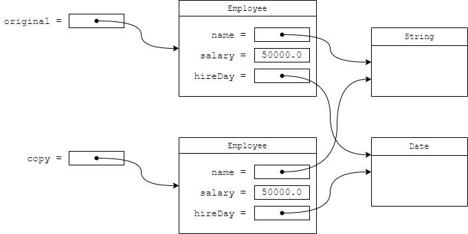

## 6.1 接口

### 6.1.1 接口的概念

### 为什么需要接口？

| 需求 | 如果没有接口的问题 | 接口如何解决 | 
| -- | -- | -- |
| 排序任意对象 | sort() 不知道怎么比较对象 | 统一约定 compareTo | 
| 替换实现 | 使用具体类会耦合实现 | 面向接口编程降低耦合 | 
| 多种角色能力 | Java 不能多继承类 | 一个类可实现多个接口 | 
| 统一调用方式 | 运行期才发现方法不存在 | 编译期就能检查 | 


**接口**[](https://zzy979.github.io/posts/java-note-v1ch06-interfaces-lambda-expressions-and-inner-classes/#61-%E6%8E%A5%E5%8F%A3)

```java
public interface Comparable<T> {
    int compareTo(T other);
}

//在这个接口中，compareTo()方法是抽象的，它没有实现。任何实现Comparable接口的类都需要包含compareTo()方法。否则，这个类也是抽象的。

一个类可以实现(implement)一个或多个接口。要让类实现一个接口，需要：
使用关键字implements声明类实现给定的接口。
对接口中的所有方法提供定义。
class Employee implements Comparable<Employee> {
    @Override
    public int compareTo(Object other) {
        return Double.compare(salary, other.salary);
    }
    ...
}


package interfaces;

import java.util.Arrays;

/**
 * This program demonstrates the use of the Comparable interface.
 * @version 1.30 2004-02-27
 * @author Cay Horstmann
 */
public class EmployeeSortTest {
    public static void main(String[] args) {
        var staff = new Employee[3];

        staff[0] = new Employee("Harry Hacker", 35000);
        staff[1] = new Employee("Carl Cracker", 75000);
        staff[2] = new Employee("Tony Tester", 38000);

        Arrays.sort(staff);

        // print out information about all Employee objects
        for (Employee e : staff)
            System.out.println("name=" + e.getName() + ",salary=" + e.getSalary());
    }
}

package interfaces;

public class Employee implements Comparable<Employee> {
    private String name;
    private double salary;

    public Employee(String name, double salary) {
        this.name = name;
        this.salary = salary;
    }

    public String getName() {
        return name;
    }

    public double getSalary() {
        return salary;
    }

    public void raiseSalary(double byPercent) {
        double raise = salary * byPercent / 100;
        salary += raise;
    }

    /**
     * Compares employees by salary
     * @param other another Employee object
     * @return a negative value if this employee has a lower salary than
     * otherObject, 0 if the salaries are the same, a positive value otherwise
     */
    @Override
    public int compareTo(Employee other) {
        return Double.compare(salary, other.salary);
    }

}
```

### 6.1.2 接口的特性

接口不是类。特别是，不能使用

```java
//接口变量
Comparable x = new Employee(...); // OK provided Employee implements Comparable

//instanceof检查对象是否实现了某个接口
if (anObject instanceof Comparable) { ... }

//与类一样，也可以扩展接口。
public interface Moveable  {
    void move(double x, double y);
}

public interface Powered extends Moveable {
    double milesPerGallon();
}

//虽然接口中不能包含实例字段，但是可以包含常量。接口中的常量总是public static final
public interface Powered extends Moveable {
    double milesPerGallon();
    double SPEED_LIMIT = 95; // a public static final constant
}

//实现多个接口
class Employee implements Cloneable, Comparable

```

### 6.1.3 接口和抽象类

其他编程语言（尤其是C++）允许一个类有多个超类，这个特性称为[](https://zzy979.github.io/posts/java-note-v1ch06-interfaces-lambda-expressions-and-inner-classes/#613-%E6%8E%A5%E5%8F%A3%E5%92%8C%E6%8A%BD%E8%B1%A1%E7%B1%BB)[](https://zzy979.github.io/posts/java-note-v1ch06-interfaces-lambda-expressions-and-inner-classes/#613-%E6%8E%A5%E5%8F%A3%E5%92%8C%E6%8A%BD%E8%B1%A1%E7%B1%BB)

### 6.1.4 静态和私有方法

```java
//目的：接口里放一个和它语义相关的小工具（转大写）。
public interface TextTool {
    // 接口静态方法：调用时用 接口名.方法
    static String upper(String s) {
        return s == null ? "" : s.toUpperCase();
    }
}

// 使用
String r = TextTool.upper("hi"); // 返回 "HI"
//要点：
//不需要实现类。
//不能写成 new TextTool().upper()，也不能通过实例调用。

public interface Adder {
    int add(int a, int b);

    // 静态工厂：隐藏实现类
    static Adder simple() {
        return new SimpleAdder();
    }
}

// 具体实现（包内可见也行）
class SimpleAdder implements Adder {
    @Override
    public int add(int a, int b) {
        return a + b;
    }
}

// 使用
Adder adder = Adder.simple();
int sum = adder.add(3, 5); // 8

要点：
调用端只依赖接口，不知道实现类名字。
Adder.simple() 是静态调用，不涉及多态。
```

### 6.1.5 默认方法

```java
public interface Adder {
    int add(int a, int b);

    // 默认实现：给实现类“额外免费”一个方法
    default int add3(int a, int b, int c) {
        return add(add(a, b), c);
    }

    static Adder simple() {
        return new SimpleAdder();
    }
}

class SimpleAdder implements Adder {
    @Override
    public int add(int a, int b) {
        return a + b;
    }
}

// 使用
Adder adder = Adder.simple();
int r = adder.add3(1, 2, 3); // 6

public interface HexUtil {

    static String toHex(byte b) {
        return "" + HEX[(b & 0xF0) >>> 4] + HEX[b & 0x0F];
    }

    static String toHex(byte[] arr) {
        if (arr == null) return "null";
        StringBuilder sb = new StringBuilder(arr.length * 2);
        for (byte b : arr) {
            sb.append(twoHex(b));
        }
        return sb.toString();
    }

    // 私有静态：只服务上面两个静态方法
    private static String twoHex(byte b) {
        return "" + HEX[(b & 0xF0) >>> 4] + HEX[b & 0x0F];
    }

    // 私有静态“常量”数组（接口里的字段默认 public static final，这里示例）
    char[] HEX = "0123456789abcdef".toCharArray();
}

// 使用
String s = HexUtil.toHex(new byte[]{0x0F, 0x10}); // "0f10"

```

### 6.1.6 解决默认方法冲突

- 当一个类同时从多个接口继承到相同签名的默认方法（default method），或该默认方法与类/父类已有实现发生冲突时，编译器无法自动决定用哪一个实现，这就是“默认方法冲突”。

1. 超类优先(Superclasses win)。如果超类提供了一个具体方法，具有相同签名的默认方法会被忽略。

1. 接口冲突(Interfaces clash)。如果一个接口提供了一个默认方法，另一个接口包含一个具有相同签名的方法（无论是否是默认方法），必须覆盖这个方法来解决冲突。

```java

//类优先：父类实现覆盖接口默认方法 同名hello
class Parent {
    public void hello() { System.out.println("Parent"); }
}
interface A {
    default void hello() { System.out.println("A"); }
}
class Child extends Parent implements A {} // 输出：Parent

//更具体接口优先：子接口默认方法覆盖父接口默认方法 B继承自A，那A肯定是父类
interface A {
    default void hi() { System.out.println("A"); }
}
interface B extends A {
    default void hi() { System.out.println("B"); }
}
class C implements B, A {} // 输出：B


//不相关接口冲突：必须在类中显式覆盖并指定来源
interface A {
    default void ping() { System.out.println("A"); }
}
interface B {
    default void ping() { System.out.println("B"); }
}
class D implements A, B {
    @Override
    public void ping() {
        // 选择其一，或组合两者
        A.super.ping();
        // B.super.ping();
    }
}
```

### 6.1.7 接口与回调

```java
package timer;

import java.awt.Toolkit;
import java.awt.event.ActionEvent;
import java.awt.event.ActionListener;
import java.time.Instant;

import javax.swing.JOptionPane;
import javax.swing.Timer;

/**
 * @version 1.02 2017-12-14
 * @author Cay Horstmann
 */
public class TimerTest {
    public static void main(String[] args) {
        var listener = new TimePrinter();

        // construct a timer that calls the listener once every second
        var timer = new Timer(1000, listener);
        timer.start();

        // keep program running until the user selects "OK"
        JOptionPane.showMessageDialog(null, "Quit program?");
        System.exit(0);
    }
}

class TimePrinter implements ActionListener {
    @Override
    public void actionPerformed(ActionEvent event) {
        System.out.println("At the tone, the time is " + Instant.ofEpochMilli(event.getWhen()));
        Toolkit.getDefaultToolkit().beep();
    }
}
```

### 6.1.8 Comparator接口

```java
public interface Comparator<T> {
    int compare(T first, T second);//参数是一个数组和一个比较器(comparator)
}

class LengthComparator implements Comparator<String> {
    @Override
    public int compare(String first, String second) {
        return first.length() - second.length();
    }
}

var comp = new LengthComparator();
if (comp.compare(words[i], words[j]) > 0) ...

String[] friends = { "Peter", "Paul", "Mary" };
Arrays.sort(friends, new LengthComparator());

//注释：尽管LengthComparator对象没有状态，仍然需要创建一个实例，因为compare()不是静态方法。
```

### 6.1.9 对象克隆

```java
Employee copy = original.clone();
copy.raiseSalary(10); // OK--original unchanged 这是浅拷贝
//如果原对象和克隆对象共享的子对象是不可变的（如String），那么这种共享就是安全的。然而，如果子对象是可变的，就必须重新定义clone()方法来创建一个深拷贝(deep copy)（也克隆子对象）。


class Employee implements Cloneable {
    ...
    // public access, change return type
    @Override
    public Employee clone() throws CloneNotSupportedException {
        return (Employee) super.clone();
    }
}
//这是协变返回类型的一个例子
//协变返回类型：子类重写父类方法时，允许把返回类型“缩小”为更具体的子类型。
//Object.clone() 返回 Object；你在 Employee 中重写为返回 Employee，这就是“协变返回类型”。

//深拷贝
class Employee implements Cloneable {
    ...
    @Override
    public Employee clone() throws CloneNotSupportedException {
        // call Object.clone()
        Employee cloned = (Employee) super.clone();
        // clone mutable fields
        cloned.hireDay = (Date) hireDay.clone();
        return cloned;
    }
}

package clone;

import java.util.TimeZone;

/**
 * This program demonstrates cloning.
 * @version 1.11 2018-03-16
 * @author Cay Horstmann
 */
public class CloneTest {
    public static void main(String[] args) throws CloneNotSupportedException {
        TimeZone.setDefault(TimeZone.getTimeZone("UTC")); //让 Date.toString 的输出稳定，避免不同机器/时区导致打印不同。
        var original = new Employee("John Q. Public", 50000); //创建原对象,此时 hireDay 指向“当前时间”的一个 Date 实例。
        original.setHireDay(2000, 1, 1); //该方法内部通过 hireDay.setTime(...) 修改同一个 Date 实例的时间戳，说明 Date 是可变对象。
        Employee copy = original.clone(); //先调用 super.clone() 做“浅拷贝”，然后对可变字段 hireDay 执行 cloned.hireDay = (Date) hireDay.clone() 做“深拷贝”（重要！）。
        copy.raiseSalary(10); //→ 工资变为 55000
        copy.setHireDay(2002, 12, 31); //→ 只修改 copy 的 hireDay，不影响 original（因为已有独立的 Date 对象）。
        System.out.println("original=" + original);
        System.out.println("copy=" + copy);
    }
}

package clone;

import java.util.Date;
import java.util.GregorianCalendar;

public class Employee implements Cloneable {
    private String name;
    private double salary;
    private Date hireDay;

    public Employee(String name, double salary) {
        this.name = name;
        this.salary = salary;
        this.hireDay = new Date();
    }

    @Override
    public Employee clone() throws CloneNotSupportedException {
        // call Object.clone()
        Employee cloned = (Employee) super.clone();

        // clone mutable fields
        cloned.hireDay = (Date) hireDay.clone();

        return cloned;
    }

    /**
     * Set the hire day to a given date.
     * @param year the year of the hire day
     * @param month the month of the hire day
     * @param day the day of the hire day
     */
    public void setHireDay(int year, int month, int day) {
        Date newHireDay = new GregorianCalendar(year, month - 1, day).getTime();

        // example of instance field mutation
        hireDay.setTime(newHireDay.getTime());
    }

    public void raiseSalary(double byPercent) {
        double raise = salary * byPercent / 100;
        salary += raise;
    }

    @Override
    public String toString() {
        return "Employee[name=" + name + ",salary=" + salary + ",hireDay=" + hireDay + "]";
    }

}
```



## 6.2 Lambda表达式

**Lambda表达式**

### 6.2.1 为什么引入lambda表达式

在Java中不能直接传递代码块。Java是一种面向对象的语言，所以必须构造一个对象，这个对象的类要有一个方法包含所需的代码

### 6.2.2 lambda表达式的语法

```java


class LengthComparator implements Comparator<String> {
    @Override
    public int compare(String first, String second) {
        return first.length() - second.length();
    }
}


(String first, String second) -> first.length() - second.length()
//简单形式为：(params) -> expr。

(String first, String second) -> {
    if (first.length() < second.length()) return -1;
    else if (first.length() > second.length()) return 1;
    else return 0;
}

//无参的时候
() -> {
    for (int i = 100; i >= 0; i--) System.out.println(i);
}

//如果可以推导出lambda表达式的参数类型，就可以将其省略。
Comparator<String> comp = (first, second) -> first.length() - second.length();
//在这里，编译器可以推导出first和second必然是字符串，因为这个lambda表达式被赋给一个Comparator<String>

//如果lambda表达式只有一个参数，而且类型可以推导得出，甚至还可以省略括号
ActionListener listener = event ->
    System.out.println("The time is " + Instant.ofEpochMilli(event.getWhen()));
//等价于
ActionListener listener =
    (ActionEvent event) -> { System.out.println("The time is " + Instant.ofEpochMilli(event.getWhen())); };

//lambda表达式只在某些分支返回值、其他分支不返回值是不合法的。例如，(int x) -> { if (x >= 0) return 1; }就不合法。

package lambda;

import java.time.Instant;
import java.util.Arrays;

import javax.swing.JOptionPane;
import javax.swing.Timer;

/**
 * This program demonstrates the use of lambda expressions.
 * @version 1.0 2015-05-12
 * @author Cay Horstmann
 */
public class LambdaTest {
    public static void main(String[] args) {
        var planets = new String[] { "Mercury", "Venus", "Earth", "Mars",
                "Jupiter", "Saturn", "Uranus", "Neptune" };
        System.out.println(Arrays.toString(planets));
        System.out.println("Sorted in dictionary order:");
        Arrays.sort(planets);
        System.out.println(Arrays.toString(planets));
        System.out.println("Sorted by length:");
        Arrays.sort(planets, (first, second) -> first.length() - second.length());
        //Arrays.sort 有两个常用重载
        //Arrays.sort(T[] a)：按元素的“自然顺序”排序（要求元素实现 Comparable）。
        //Arrays.sort(T[] a, Comparator<? super T> c)：按给定的 Comparator 排序。
        
        System.out.println(Arrays.toString(planets));

        var timer = new Timer(1000, event ->
                System.out.println("The time is " + Instant.ofEpochMilli(event.getWhen())));
        timer.start();

        // keep program running until user selects "OK"
        JOptionPane.showMessageDialog(null, "Quit program?");
        System.exit(0);
    }
}
```

### 6.2.3 函数式接口

只有一个抽象方法的接口称为

```java
Arrays.sort(words, (first, second) -> first.length() - second.length());
//它的第二个参数需要一个Comparator实例。Comparator是函数式接口，所以可以提供一个lambda表达式

public interface Predicate<T> {
    boolean test(T t);
    // additional default and static methods
}


list.removeIf(e -> e == null);


public interface Supplier<T> {
    T get();
}
//Supplier没有参数，调用时生成一个T类型的值。Supplier用于实现惰性求值(lazy evaluation)
//惰性求值（Lazy Evaluation）是一种求值策略：表达式不会在定义时立即计算，而是等到“真的需要它的结果”时才计算；而且计算结果通常会被缓存（备忘/Memoization），后续再次需要时直接复用，避免重复开销。
```

### 6.2.4 方法引用

```java
var timer = new Timer(1000, event -> System.out.println(event));
//这两个相等
var timer = new Timer(1000, System.out::println);
//表达式System.out::println是一个方法引用(method reference)。它等价于lambda表达式e -> System.out.println(e)。

//方法引用（Method Reference）是 Java 8 引入的一种简洁语法，用来把“已有方法”当作“lambda 表达式”的实现来传递。它本质上是 lambda 的语法糖：当你的 lambda 只是调用某个已存在的方法时，用方法引用更简洁、可读性更好。

```

### 6.2.5 构造器引用

构造器引用与方法引用很类似，只不过方法名为

```java
构造器引用（Constructor Reference）是方法引用的一种形式，用来把“创建对象/数组”的构造动作，适配为某个函数式接口的实现。语法是 ClassName::new 或 Type[]::new，本质上是把“new”这件事当作一个可调用的函数来传递。
```

### 6.2.6 变量作用域

lambda表达式有3个部分：

1. 参数

1. 代码块

1. **自由变量**（即不是参数也不是在代码块中定义的变量）的值

代码块连同自由变量值一起有一个术语：[](https://zzy979.github.io/posts/java-note-v1ch06-interfaces-lambda-expressions-and-inner-classes/#626-%E5%8F%98%E9%87%8F%E4%BD%9C%E7%94%A8%E5%9F%9F)

在lambda表达式中，不能修改捕获的变量。[](https://zzy979.github.io/posts/java-note-v1ch06-interfaces-lambda-expressions-and-inner-classes/#626-%E5%8F%98%E9%87%8F%E4%BD%9C%E7%94%A8%E5%9F%9F)

### 6.2.7 处理lambda表达式

使用lambda表达式的重点是

- 在一个单独的线程中运行代码

- 多次运行代码

- 在算法的适当位置运行代码（例如排序中的比较操作）

- 发生某种情况时运行代码（例如点击了按钮）

- 只在必要时运行代码

### 6.2.8 再谈Comparator

## 6.3 内部类

**内部类**

- 内部类可以对同一个包中的其他类隐藏。

- 内部类方法可以访问所在作用域中的数据，包括私有的数据。

### 6.3.1 使用内部类访问对象状态

```java
public class Outer {
    private int value = 42;
    private static String version = "1.0";

    // 1) 成员内部类（需要 Outer 实例）
    public class Inner {
        public int readOuter() {
            // 直接访问外部类的实例字段
            return value;               // 等价于 Outer.this.value
        }
    }

    // 2) 静态内部类（不需要 Outer 实例）
    public static class StaticInner {
        public String info() {
            // 只能访问外部类的静态成员
            return "version=" + version;
        }
    }

    public static void main(String[] args) {
        // 使用成员内部类：必须先有外部类实例
        Outer outer = new Outer();
        Outer.Inner in = outer.new Inner();
        System.out.println(in.readOuter()); // 42

        // 使用静态内部类：像普通类一样直接 new
        Outer.StaticInner sin = new Outer.StaticInner();
        System.out.println(sin.info()); // version=1.0
    }
}


public class Outer {
    private int value = 42;

    public class Inner {
        // 字段（成员变量）
        private int local = 5;

        // 构造器
        public Inner(int offset) {
            this.local += offset;
        }

        // 方法
        public int sum() {
            // 访问外部类实例字段 + 自己的字段
            return Outer.this.value + this.local;
        }

        // 静态常量（从 Java 16 开始，成员内部类里允许有 static final 常量）
        public static final String TAG = "Inner";
    }

    public static void main(String[] args) {
        Outer outer = new Outer();
        Outer.Inner in = outer.new Inner(3);
        System.out.println(in.sum()); // 42 + (5+3) = 50
        System.out.println(Outer.Inner.TAG); // 访问内部类的常量
    }
}


package innerClass;

import java.awt.Toolkit;
import java.awt.event.ActionEvent;
import java.awt.event.ActionListener;
import java.time.Instant;

import javax.swing.JOptionPane;
import javax.swing.Timer;

/**
 * This program demonstrates the use of inner classes.
 * @version 1.11 2017-12-14
 * @author Cay Horstmann
 */
public class InnerClassTest {
    public static void main(String[] args) {
        var clock = new TalkingClock(1000, true);
        clock.start();

        // keep program running until the user selects "OK"
        JOptionPane.showMessageDialog(null, "Quit program?");
        System.exit(0);
    }
}

/**
 * A clock that prints the time in regular intervals.
 */
class TalkingClock {
    private int interval;
    private boolean beep;

    /**
     * Constructs a talking clock
     * @param interval the interval between messages (in milliseconds)
     * @param beep true if the clock should beep
     */
    public TalkingClock(int interval, boolean beep) {
        this.interval = interval;
        this.beep = beep;
    }

    /**
     * Starts the clock.
     */
    public void start() {
        var listener = new TimePrinter();
        var timer = new Timer(interval, listener);
        timer.start();
    }

    public class TimePrinter implements ActionListener {
        @Override
        public void actionPerformed(ActionEvent event) {
            System.out.println("At the tone, the time is " + Instant.ofEpochMilli(event.getWhen()));
            if (beep) Toolkit.getDefaultToolkit().beep(); //if (TalkingClock.this.beep) Toolkit.getDefaultToolkit().beep();
        }
    }
}
```

### 6.3.2 内部类的特殊语法规则

- 在内部类里，用 OuterClass.this 表示“指向外部类实例”的引用。

- 在外部类实例外，创建内部类对象要用 outerObject.new InnerClass(...)。

- 在外部类作用域之外，要用 外部类名.内部类名 来指代内部类类型，比如 TalkingClock.TimePrinter。

### 6.3.3 内部类是否有用、必要和安全

不可否认，内部类的语法很复杂。内部类与其他语言特性（如访问控制和安全性）之间如何交互不是很明确。

### 6.3.4 局部内部类

```java
public class Demo {
    private String prefix = "Demo";

    public void foo(int n) {
        int base = 10; // 实质 final：后面不再修改

        // 局部内部类声明：就在方法体里“加一个 class”
        class Helper {
            int calc(int x) {
                // 访问外部类字段
                System.out.println(Demo.this.prefix);
                // 访问方法局部变量（需 final/实质 final）
                return base + x;
            }
        }

        Helper h = new Helper();       // 只能在当前作用域内使用
        System.out.println(h.calc(n)); // 输出 Demo 和 base+n
    }
}

```

### 6.3.5 访问外部方法的变量

局部类不仅能访问外部类的字段，还能访问外部方法的局部变量。不过，那些局部变量必须是事实最终变量[](https://zzy979.github.io/posts/java-note-v1ch06-interfaces-lambda-expressions-and-inner-classes/#635-%E8%AE%BF%E9%97%AE%E5%A4%96%E9%83%A8%E6%96%B9%E6%B3%95%E7%9A%84%E5%8F%98%E9%87%8F)

```java
public class Outer {
    private String name = "Outer";

    public void startTask() {
        int repeat = 3;           // 方法的局部变量（实质 final：后面不改）
        String suffix = " times"; // 也是局部变量

        // 局部内部类：定义在方法里
        class Task {
            void run() {
                // 访问外部类字段
                System.out.println("Caller: " + Outer.this.name);
                // 访问方法的局部变量（被捕获）
                for (int i = 1; i <= repeat; i++) {
                    System.out.println("Run " + i + suffix);
                }
            }
        }

        new Task().run();
        // 注意：如果你在这里修改 repeat 或 suffix，就会编译报错
        // repeat++;        // 编译错误：Local variables referenced from an inner class must be final or effectively final
        // suffix = "x";    // 同上
    }

    public static void main(String[] args) {
        new Outer().startTask();
    }
}

```

### 6.3.6 匿名内部类

```java
class HelloGreeter implements SimpleAnon.Greeter {
    @Override public void sayHi() { System.out.println("我是有名字的类"); }
}
// 使用
SimpleAnon.Greeter g = new HelloGreeter();
g.sayHi();


SimpleAnon.Greeter g = new SimpleAnon.Greeter() {
    @Override public void sayHi() { System.out.println("我是匿名类"); }
};
g.sayHi();

```

### 6.3.7 静态内部类

```java
package staticInnerClass;

/**
 * This program demonstrates the use of static inner classes.
 * @version 1.02 2015-05-12
 * @author Cay Horstmann
 */
public class StaticInnerClassTest {
    public static void main(String[] args) {
        var values = new double[20];
        for (int i = 0; i < values.length; i++)
            values[i] = 100 * Math.random();
        ArrayAlg.Pair p = ArrayAlg.minmax(values);
        System.out.println("min = " + p.getFirst());
        System.out.println("max = " + p.getSecond());
    }
}

class ArrayAlg {
    /**
     * A pair of floating-point numbers
     */
    public static class Pair {
        private double first;
        private double second;

        /**
         * Constructs a pair from two floating-point numbers
         * @param f the first number
         * @param s the second number
         */
        public Pair(double f, double s) {
            first = f;
            second = s;
        }

        /**
         * Returns the first number of the pair
         * @return the first number
         */
        public double getFirst() {
            return first;
        }

        /**
         * Returns the second number of the pair
         * @return the second number
         */
        public double getSecond() {
            return second;
        }
    }

    /**
     * Computes both the minimum and the maximum of an array
     * @param values an array of floating-point numbers
     * @return a pair whose first element is the minimum and whose second element
     * is the maximum
     */
    public static Pair minmax(double[] values) {
        double min = Double.POSITIVE_INFINITY;
        double max = Double.NEGATIVE_INFINITY;
        for (double v : values) {
            if (v < min) min = v;
            if (v > max) max = v;
        }
        return new Pair(min, max);
    }
}

//注释：只要内部类不需要访问外部类对象，就应该使用静态内部类。
//注释：与常规内部类不同，静态内部类可以有静态字段和方法。
//注释：在接口中声明的类自动是static和public。在类中声明的接口、记录和枚举自动是static
```

## 6.4 服务加载器

- 一个“插件发现机制”：不改主程序代码，通过在类路径里放“实现类 + 配置文件”，运行时就能自动发现并加载这些实现。

- 典型用途：SPI（Service Provider Interface）扩展，比如 JDBC 驱动、日志实现、序列化实现、加解密提供者等。

```java
package serviceLoader;

import java.nio.charset.StandardCharsets;
import java.util.ServiceLoader;

/**
 * @version 1.01 2018-03-17
 * @author Cay Horstmann
 */
public class ServiceLoaderTest {
    public static ServiceLoader<Cipher> cipherLoader = ServiceLoader.load(Cipher.class);

    public static void main(String[] args) {
        Cipher cipher = getCipher(1);
        String message = "Meet me at the toga party.";
        byte[] bytes = cipher.encrypt(message.getBytes(), new byte[]{3});
        var encrypted = new String(bytes, StandardCharsets.UTF_8);
        System.out.println(encrypted);
    }

    public static Cipher getCipher(int minStrength) {
        for (Cipher cipher : cipherLoader) // Implicitly calls iterator
            if (cipher.strength() >= minStrength) return cipher;
        return null;
    }
}
```

## 6.5 代理

### 6.5.1 何时使用代理

一、一句话理解

- Java 代理（Proxy）是一种在“不修改原始代码”的前提下，为目标对象“代为”接收方法调用、再进行增强（如日志、权限、事务、监控、远程调用）的机制。

二、为什么需要代理

- 横切关注点：日志、权限、事务、重试、缓存、监控等逻辑在很多类里都要做，不想每个类里手写一遍，就用代理统一“包一层”。

- 隔离与解耦：调用方不感知增强细节，只面对接口或抽象。

### 6.5.2 创建代理对象

- 一个**类加载器**(class loader)

- 一个Class对象数组（对应要实现的各个接口）

- 一个调用处理器

```java
package proxy;

import java.lang.reflect.InvocationHandler;
import java.lang.reflect.Method;
import java.lang.reflect.Proxy;
import java.util.Arrays;

/**
 * This program demonstrates the use of proxies.
 * @version 1.02 2021-06-16
 * @author Cay Horstmann
 */
public class ProxyTest {
    public static void main(String[] args) {
        var elements = new Object[1000];

        // fill elements with proxies for the integers 1 ... 1000
        for (int i = 0; i < elements.length; i++) {
            Integer value = i + 1;
            var handler = new TraceHandler(value);
            var interfaces = new Class[] {Comparable.class};
            Object proxy = Proxy.newProxyInstance(ClassLoader.getSystemClassLoader(), interfaces, handler);
            elements[i] = proxy;
        }

        // construct a random integer
        Integer key = (int) (Math.random() * elements.length) + 1;

        // search for the key
        int result = Arrays.binarySearch(elements, key);

        // print match if found
        if (result >= 0) System.out.println(elements[result]);
    }
}

/**
 * An invocation handler that prints out the method name and parameters, then
 * invokes the original method
 */
class TraceHandler implements InvocationHandler {
    private Object target;

    /**
     * Constructs a TraceHandler
     * @param t the implicit parameter of the method call
     */
    public TraceHandler(Object t) {
        target = t;
    }


    @Override
    public Object invoke(Object proxy, Method method, Object[] args) throws Throwable {
        // print implicit argument
        System.out.print(target);
        // print method name
        System.out.print("." + method.getName() + "(");
        // print explicit arguments
        if (args != null) {
            for (int i = 0; i < args.length; i++) {
                System.out.print(args[i]);
                if (i < args.length - 1) System.out.print(", ");
            }
        }
        System.out.println(")");

        // invoke actual method
        return method.invoke(target, args);
    }
}
```

### 6.5.3 代理类的特性

[](https://zzy979.github.io/posts/java-note-v1ch06-interfaces-lambda-expressions-and-inner-classes/#617-%E6%8E%A5%E5%8F%A3%E4%B8%8E%E5%9B%9E%E8%B0%83)