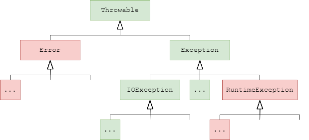

## 7.1 处理错误

在Java中，如果一个方法不能以正常的方式完成任务，就可以选择另一个退出路径。在这种情况下，方法不会返回任何值，而是[](https://zzy979.github.io/posts/java-note-v1ch07-exceptions-assertions-and-logging/#71-%E5%A4%84%E7%90%86%E9%94%99%E8%AF%AF)

### 7.1.1 异常分类



Error

继承自

- 数组下标越界(ArrayIndexOutOfBoundsException)

- 访问空指针(NullPointerException)

- 不合法的参数(IllegalArgumentException)

- 错误的强制类型转换(ClassCastException)

不继承自

- 试图在文件末尾后读取数据(EOFException)

- 试图打开一个不存在的文件(FileNotFoundException)

- 试图根据字符串查找不存在的类(ClassNotFoundException)

### 7.1.2 声明检查型异常

```java
public FileInputStream(String name) throws FileNotFoundException
//在方法的首部使用throws子句声明可能抛出的异常

```

### 7.1.3 抛出异常

```java
public class Demo1 {
    // 计算 a/b，如果 b 为 0 就抛出异常
    static int divide(int a, int b) {
        if (b == 0) {
            // 抛出一个运行时异常，表示调用者传了非法参数
            throw new IllegalArgumentException("b 不能为 0");
        }
        return a / b;
    }

    public static void main(String[] args) {
        int x = divide(10, 2);           // 正常：返回 5
        System.out.println(x);

        int y = divide(10, 0);           // 这里会抛出异常，下面的语句不会执行
        System.out.println(y);
    }
}

```

### 7.1.4 创建异常类

```java
// 自定义业务异常：余额不足
public class InsufficientBalanceException extends RuntimeException {
    // 常见构造器写法
    public InsufficientBalanceException() { super(); }
    public InsufficientBalanceException(String message) { super(message); }
    public InsufficientBalanceException(String message, Throwable cause) { super(message, cause); }
    public InsufficientBalanceException(Throwable cause) { super(cause); }
}


public class Wallet {
    private int balance;

    public Wallet(int init) { this.balance = init; }

    public void debit(int amount) {
        if (amount <= 0) {
            throw new IllegalArgumentException("扣款金额必须为正数");
        }
        if (amount > balance) {
            // 抛出自定义异常，语义明确
            throw new InsufficientBalanceException("余额不足，需扣款 " + amount + "，当前余额 " + balance);
        }
        balance -= amount;
    }

    public int getBalance() { return balance; }

    public static void main(String[] args) {
        Wallet w = new Wallet(100);
        w.debit(60);
        System.out.println("余额：" + w.getBalance()); // 40

        w.debit(50); // 将抛出 InsufficientBalanceException
        System.out.println("这行不会执行");
    }
}

```

## 7.2 捕获异常

### 7.2.1 捕获一个异常

```java
try {
    // code
}
catch (ExceptionType e) {
    // handler for this type
}


package except;

import java.nio.charset.StandardCharsets;
import java.nio.file.Path;
import java.util.Scanner;
import java.util.concurrent.Callable;

/**
 * @version 1.41 2021-09-06
 * @author Cay Horstmann
 */
public class ExceptTest {
    public static void main(String[] args) {
        int thousand = 1000;
        double[] a = {1000, 1, 2, 3, 4, 5, 6, 7, 8, 9};
        performAction("Integer divide by zero", () -> 1 / (a.length - a.length));

        performAction("Floating point divide by zero", () -> a[2] / (a[3] - a[3]));

        performAction("Integer overflow", () -> thousand * thousand * thousand * thousand);

        performAction("Square root of negative number", () -> Math.sqrt(-1));

        performAction("Array index out of bounds", () -> a[1] - a[100]);

        performAction("Bad cast", () -> (int[]) (Object) a);

        performAction("Null pointer", () -> System.getProperty("woozle").toString());

        performAction("No such file",
                () -> new Scanner(Path.of("woozle.txt"), StandardCharsets.UTF_8).next());
    }

    /**
     * Performs the given action and reports the result or failure.
     * @param description the description of the action
     * @param action the action to be carried out
     */
    private static void performAction(String description, Callable<Object> action) {
        System.out.println(description);
        try {
            System.out.println(action.call());
        }
        catch (Throwable t) {
            System.out.println(t.getClass().getName() + ": " + t.getMessage());
        }
    }
}
```

### 7.2.2 捕获多个异常

```java
try {
    // code that might throw exceptions
}
catch (FileNotFoundException | UnknownHostException e) {
    // emergency action for missing files and unknown hosts
}
catch (IOException e) {
    // emergency action for all other I/O problems
}

//只有当捕获的异常类型彼此之间不存在子类关系时才需要这个特性。
注释：捕获多个异常时，异常变量隐式为final（因为类型不确定，不能赋值）。
```

### 7.2.3 再次抛出异常与异常链

```java
public User getUserById(int id) {
    try {
        return dao.loadUser(id);
    } catch (SQLException e) {
        // RuntimeException/自定义BizException通常都有 (message, cause) 构造器
        throw new RuntimeException("读取用户失败，id=" + id, e);
    }
}


//在 catch 里你可以再次 throw。常见目的：把底层异常转成更高层的业务语义。
//但不要丢失原始异常。要把“原始异常”作为“原因 cause”挂到新异常上，这就叫“异常链”（exception chaining）。
//好处：上层看到的是更易懂的高层异常，同时还能从 cause 里追溯到底层根因和完整栈轨迹。
```

### 7.2.4 finally子句

当代码抛出异常时，就会停止处理方法中剩余的代码并退出这个方法。如果这个方法已经获得了一些只有它自己知道的本地资源，而且这些资源必须被清理，这就会有问题。[](https://zzy979.github.io/posts/java-note-v1ch07-exceptions-assertions-and-logging/#724-finally%E5%AD%90%E5%8F%A5)

```java
var in = new FileInputStream(...);
try {
    // 1
    // code that might throw exceptions
    // 2
}
catch (IOException e) {
    // 3
    // show error message
    // 4
}
finally {
    // 5
    in.close();
}
// 6

1.代码没有抛出异常。在这种情况下，首先执行try语句块中的全部代码，然后执行finally子句中的代码。执行顺序是1、2、5、6。
2.代码抛出了异常，并在catch子句中捕获。在这种情况下，将执行try语句块，直到抛出异常为止。然后跳过try语句块中的剩余代码，执行对应的catch子句，最后执行finally子句。
    如果catch子句没有抛出异常，则执行顺序是1、3、4、5、6。
    如果catch子句抛出了异常，异常将被抛回这个方法的调用者，执行顺序只是1、3、5。
3.代码抛出了异常，但没有任何catch子句捕获。在这种情况下，将执行try语句块，直到抛出异常为止。然后跳过try语句块中的剩余代码，执行finally子句。异常将被抛回这个方法的调用者，执行顺序是1、5。
```

### 7.2.5 带资源的try语句

- 语法：try(...) { ... }，圆括号里放“资源对象”的创建。

- 资源：需要用完后关闭的对象，比如文件流、数据库连接、网络套接字等。它们必须实现 AutoCloseable（或 Closeable）。

- 作用：块执行结束后，Java 会自动调用这些资源的 close()，不需要手写 finally 来关资源，异常时也能确保关闭。

```java
import java.nio.file.*;
import java.io.BufferedReader;
import java.io.IOException;

public class Demo {
    public static void main(String[] args) {
        Path path = Path.of("test.txt");
        try (BufferedReader br = Files.newBufferedReader(path)) {
            String line;
            while ((line = br.readLine()) != null) {
                System.out.println(line);
            }
        } catch (IOException e) {
            System.err.println("读取失败: " + e.getMessage());
        }
        // 走到这里，无论是否异常，br 都已安全关闭
    }
}

```

### 7.2.6 分析栈轨迹元素

**栈轨迹**[](https://zzy979.github.io/posts/java-note-v1ch07-exceptions-assertions-and-logging/#726-%E5%88%86%E6%9E%90%E6%A0%88%E8%BD%A8%E8%BF%B9%E5%85%83%E7%B4%A0)

```java
Exception in thread "main" java.lang.NullPointerException
	at MyClass.mash(MyClass.java:9)
	at MyClass.crunch(MyClass.java:6)
	at MyClass.main(MyClass.java:3)
```

## 7.3 使用异常的提示

**1.异常处理不应该代替简单测试。**

捕获异常所花费的时间比执行简单测试要长得多

**2.不要过分地细化异常。**[](https://zzy979.github.io/posts/java-note-v1ch07-exceptions-assertions-and-logging/#73-%E4%BD%BF%E7%94%A8%E5%BC%82%E5%B8%B8%E7%9A%84%E6%8F%90%E7%A4%BA)

合理的做法是将整个任务放在一个

**3.合理利用异常层次结构。**

如果能够将一种异常转换成另一种更加合适的异常，那么不要犹豫。例如，在解析文件中的整数时，可以捕获

**4.不要压制异常。**[](https://zzy979.github.io/posts/java-note-v1ch07-exceptions-assertions-and-logging/#73-%E4%BD%BF%E7%94%A8%E5%BC%82%E5%B8%B8%E7%9A%84%E6%8F%90%E7%A4%BA)

**5.检测到错误时，“苛刻”要比放任更好。**

我们认为，在出错时抛出[](https://zzy979.github.io/posts/java-note-v1ch07-exceptions-assertions-and-logging/#73-%E4%BD%BF%E7%94%A8%E5%BC%82%E5%B8%B8%E7%9A%84%E6%8F%90%E7%A4%BA)

**6.不要羞于传播异常。**

注释：规则5和6可以归纳为“早抛出，晚捕获”。[](https://zzy979.github.io/posts/java-note-v1ch07-exceptions-assertions-and-logging/#73-%E4%BD%BF%E7%94%A8%E5%BC%82%E5%B8%B8%E7%9A%84%E6%8F%90%E7%A4%BA)

**7.使用标准方法报告空指针和越界异常。**

```java
public void putData(int position, Object newValue) {
    Objects.checkIndex(position, data.length);
    Objects.requireNonNull(newValue);
    ...
}
Objects类有requireNonNull()、checkIndex()、checkFromToIndex()、checkFromIndexSize()等方法来完成这些常见的检查。
```

## **8.不要向最终用户显示栈轨迹。** 栈轨迹可能包含你不想暴露给潜在攻击者的实现细节，例如你使用的库的版本。应该将栈轨迹记录日志以便以后获取，而只向用户展示一个总结消息。

## 7.4 使用断言

### 7.4.1 断言的概念

**断言**[](https://zzy979.github.io/posts/java-note-v1ch07-exceptions-assertions-and-logging/#741-%E6%96%AD%E8%A8%80%E7%9A%84%E6%A6%82%E5%BF%B5)

```java
assert condition;
assert condition : expression;


```

### 7.4.2 启用和禁用断言

```java
java -enableassertions MyApp

//在特定的类或整个包中启用断言
java -ea:MyClass -ea:com.mycompany.mylib... MyApp

//也可以用-disableassertions或-da选项在特定的类和包中禁用断言
java -ea:... -da:MyClass MyApp
```

### 7.4.3 使用断言完成参数检查

什么时候应该选择断言呢？请记住下面几点：

- 断言失败是致命的、不可恢复的错误。

- 断言检查只在开发和测试阶段打开。

### 7.4.4 使用断言记录假设

```java
public class AssertDemo {
    public static void main(String[] args) {
        int x = compute(5);
        // 断言：x 应该是非负
        assert x >= 0 : "x 不能为负, 实际为 " + x;
        System.out.println("结果: " + x);
    }

    static int compute(int n) {
        return n - 10; // 这里刻意写个可能为负的逻辑
    }
}

```

## 7.5 日志

- 可以很容易地抑制全部或特定级别以下的日志记录，也很容易将其重新打开。

- 开销很小，唯一的一点坏处就是将日志代码留在程序中。

- 日志记录可以被定向到不同的处理器，如控制台、文件等。

- 日志记录器和处理器都可以对日志进行过滤，过滤器可以根据指定的标准丢弃无用的日志记录。

- 日志记录可以采用不同的方式格式化，例如纯文本或XML。

- 应用程序可以使用多个日志记录器，它们使用类似于包名的有层次的名字（例如com.mycompany.myapp）。

- 日志配置由配置文件控制。

### 7.5.1 基本日志

```java
Logger.getGlobal().info("File->Open menu item selected");
```

### 7.5.2 高级日志

```java
private static final Logger myLogger = Logger.getLogger("com.mycompany.myapp");
//有7个日志级别，从高到低依次为SEVERE、WARNING、INFO、CONFIG、FINE、FINER和FINEST。默认情况下，只记录前3个级别。也可以设置不同的级别，

logger.setLevel(Level.FINE);
//还可以使用Level.ALL开启所有级别的日志，或者使用Level.OFF关闭所有日志。

//使用logp()方法给出调用类和方法的名称

//有一些方便的方法用来跟踪执行流：entering()和exiting()（用于记录进入/退出方法，底层调用了logp()）
int read(String file, String pattern) {
    logger.entering("Reader", "read", new Object[] {file, pattern});
    ...
    logger.exiting("Reader", "read", count);
    return count;
}


//日志的一个常见用途是记录预料之外的异常。可以使用throwing()和带Throwable参数的log()方法在日志记录中包含异常的描述。
if (...) {
    var e = new IOException("...");
    logger.throwing("Reader", "read", e);
    throw e;
}


try {
    ...
}
catch (IOException e) {
    logger.log(Level.WARNING, "Reading image", e);
}
```

### 7.5.3 修改日志管理器配置

### 7.5.4 本地化

### 7.5.5 处理器

### 7.5.6 过滤器

### 7.5.7 格式化器

### 7.5.8 日志技巧

## 7.6 调试技巧