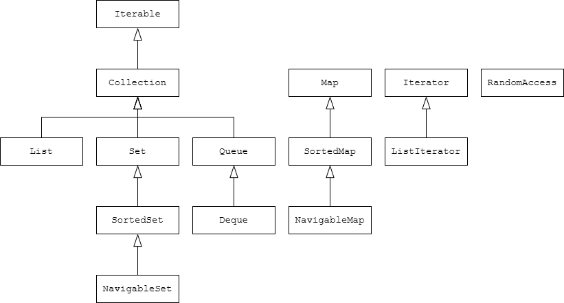
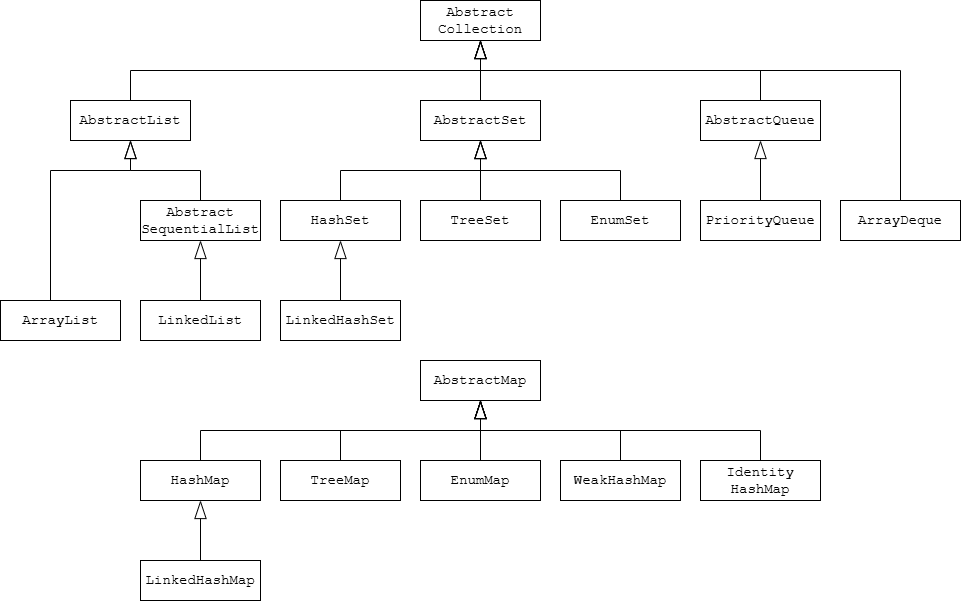

## 9.1 Java集合框架

### 9.1.1 集合接口与实现分离

- 接口与实现分离

- 用接口来定义“能做什么”（行为/语义），用实现类来决定“怎么做”（数据结构/性能）。

- 在集合框架里：声明用接口（如 Queue、List、Set、Map），实例化时选择具体实现（如 ArrayDeque、LinkedList、HashSet、TreeMap）。

```java
// a simplified form of the interface in the standard library
public interface Queue<E> {
    void add(E element);
    E remove();
    int size();
}

//使用示例
Queue<String> q = new ArrayDeque<>(8); // 只在 new 时选择实现
q.add("A");
q.add("B");
System.out.println(q.size()); // 2
System.out.println(q.remove()); // "A"（先进先出）
System.out.println(q.remove()); // "B"


//简化的定义
public class ArrayDeque<E> implements Queue<E> {
    private int head;
    private int tail;
    private E[] elements;

    ArrayDeque(int capacity) { ... }
    public void add(E element) { ... }
    public E remove() { ... }
    public int size() { ... }
}

public class LinkedList<E> implements Queue<E> {
    private Link head;
    private Link tail;

    LinkedList() { ... }
    public void add(E element) { ... }
    public E remove() { ... }
    public int size() { ... }
}


// 构造处（使用具体类）
Queue<String> q = new ArrayDeque<>(128); // 这里选了环形数组实现

// 之后全程用接口方法工作
q.add("A");
q.add("B");
process(q); // 传入的也是 Queue 接口

void process(Queue<String> queue) {      // 方法签名用接口
    while (queue.size() > 0) {
        consume(queue.remove());         // 不关心内部是数组还是链表
    }
}

// 未来想换成链表实现，只改这一行：
Queue<String> q = new LinkedList<>();    // 其他代码无需改动

```

### 9.1.2 Collection接口

- 定义：Collection 是 Java 集合框架中最基础的根接口之一，表示“一组元素”的抽象。常见子接口有 List、Set、Queue。

- 功能：定义了对这组元素的通用操作方法，如添加、删除、判断包含、遍历、大小等。

- 特点：

- 不规定元素顺序和是否允许重复，这取决于具体实现（例如 List 有序可重复，Set 无序且不重复，Queue 是 FIFO）。

- 不是数组，容量可随实现扩展（如 ArrayList 自动扩容；但像你前面的 CircularArrayQueue 是固定容量的实现）。

- 关系：

- Iterable -> Collection -> List/Set/Queue

- Map 不属于 Collection（键值对结构，另一个体系）。

- 基本操作：

- add(E e)：添加单个元素

- addAll(Collection<? extends E> c)：批量添加

- remove(Object o)：移除一个等于 o 的元素

- removeAll(Collection<?> c)、retainAll(Collection<?> c)：差集/交集语义

- clear()：清空

- 查询与检查：

- size()：元素数量

- isEmpty()：是否为空

- contains(Object o)：是否包含

- 遍历：

- iterator()：返回 Iterator，用于迭代

- for-each 语法依赖 Iterable（Collection 继承了 Iterable）

- 转换：

- toArray() / toArray(T[] a)

```java
import java.util.*;

public class CollectionDemo {
    public static void main(String[] args) {
        // 用 Collection 接口来引用具体的 List 实现
        Collection<String> names = new ArrayList<>();
        names.add("Alice");
        names.add("Bob");
        names.add("Alice"); // List 允许重复

        System.out.println("size = " + names.size());          // 3
        System.out.println("contains Alice? " + names.contains("Alice")); // true

        // 遍历（for-each）
        for (String s : names) {
            System.out.println(s);
        }

        // 换一个实现：Set（不允许重复）
        Collection<String> uniq = new HashSet<>();
        uniq.addAll(names); // 将上面的三个元素加入 Set
        System.out.println("set size = " + uniq.size()); // 2，因为重复的 "Alice" 被去重

        // 使用迭代器手动遍历
        Iterator<String> it = uniq.iterator();
        while (it.hasNext()) {
            String v = it.next();
            System.out.println("set elem: " + v);
        }

        // 使用队列实现（仍然用 Collection 引用，只调用通用方法）
        Collection<Integer> q = new ArrayDeque<>();
        q.add(1);
        q.add(2);
        q.add(3);
        System.out.println("queue-like collection size = " + q.size()); // 3

        // 注意：Collection 接口没有提供出队 poll() 这种队列特有方法，
        // 若需要队列语义，应使用 Queue 引用类型：
        Queue<Integer> queue = new ArrayDeque<>();
        queue.offer(10);
        queue.offer(20);
        System.out.println(queue.poll()); // 10
        System.out.println(queue.peek()); // 20
    }
}

```

### 9.1.3 迭代器

Iterator 接口常见的4个方法

- hasNext()：是否还有下一个元素可迭代

- next()：返回下一个元素（若不存在应抛 NoSuchElementException）

- remove()：删除迭代器最近一次 next() 返回的那个元素（可选操作，部分实现不支持会抛 UnsupportedOperationException）

- forEachRemaining(Consumer)：对剩余的每个元素执行给定操作（Java 8+）

```java
//最小示例1：基础用法（hasNext + next）
import java.util.ArrayList;
import java.util.Iterator;
import java.util.List;

public class IteratorBasicDemo {
    public static void main(String[] args) {
        List<String> list = new ArrayList<>();
        list.add("Alice");
        list.add("Bob");
        list.add("Carol");

        Iterator<String> it = list.iterator();
        while (it.hasNext()) {
            String elem = it.next();
            System.out.println(elem);
        }
    }
}

//最小示例2：使用 remove() 删除满足条件的元素
import java.util.ArrayList;
import java.util.Iterator;
import java.util.List;

public class IteratorRemoveDemo {
    public static void main(String[] args) {
        List<Integer> nums = new ArrayList<>();
        nums.add(1); nums.add(2); nums.add(3); nums.add(4);

        Iterator<Integer> it = nums.iterator();
        while (it.hasNext()) {
            Integer v = it.next();
            if (v % 2 == 0) { // 删除偶数
                it.remove();  // 合法删除当前迭代到的元素
            }
        }
        System.out.println(nums); // 输出 [1, 3]
    }
}

//最小示例3：forEachRemaining 一次性处理剩余元素
import java.util.ArrayList;
import java.util.Iterator;
import java.util.List;

public class IteratorForEachRemainingDemo {
    public static void main(String[] args) {
        List<String> list = new ArrayList<>(List.of("A", "B", "C", "D"));

        Iterator<String> it = list.iterator();
        if (it.hasNext()) {
            System.out.println("first = " + it.next()); // 先处理一个
        }

        // 对剩余元素依次执行操作
        it.forEachRemaining(s -> System.out.println("remain: " + s));
    }
}

```

### 9.1.4 泛型实用方法

- Collection 和 Iterator 是泛型接口：可以对任意元素类型的集合写“通用工具方法”，不用为每种类型重复写代码。

- 示例方法 contains：用泛型参数 E 表示“某种元素类型”，方法内部用 for-each 迭代判断是否存在目标元素。

- Collection 已经自带很多常用方法（size、isEmpty、contains、addAll、removeAll、retainAll、toArray 等），避免重复造轮子。

- 并集/交集/差集语义：

- a.addAll(b)：把 b 的元素并入 a，相当于集合的并集。

- a.retainAll(b)：只保留同时属于 a 和 b 的元素，交集。

- a.removeAll(b)：从 a 中删掉属于 b 的元素，差集。

- AbstractCollection：给集合实现者的“骨架类”，只要实现 size() 和 iterator() 两个抽象方法，就能复用很多默认实现（如 toString 组装为 [A, B, C]）。add() 默认抛不支持异常，子类可按需重写。

- Collections 类：是“工具类”，提供创建、操作集合的静态方法（比如不可变集合、排序、填充、同步包装等）。

```java
import java.util.*;

public class GenericUtilsDemo {
    // 泛型工具方法：统计集合中等于 target 的元素个数
    public static <E> int countEquals(Collection<E> c, Object target) {
        int cnt = 0;
        for (E e : c) {
            if (Objects.equals(e, target)) { // 避免 NPE，更安全
                cnt++;
            }
        }
        return cnt;
    }

    public static void main(String[] args) {
        // 准备两个集合
        Collection<String> a = new ArrayList<>(List.of("A", "B", "C", "A"));
        Collection<String> b = new ArrayList<>(List.of("B", "C", "D"));

        // 1) 使用内置的 contains
        System.out.println(a.contains("A")); // true

        // 2) 使用我们写的泛型工具方法
        System.out.println(countEquals(a, "A")); // 2（"A" 出现了两次）

        // 3) 并集（把 b 并入 a）
        Collection<String> union = new ArrayList<>(a);
        union.addAll(b); // A,B,C,A,B,C,D
        System.out.println("并集: " + union);

        // 4) 交集（保留在 b 中也存在的元素）
        Collection<String> inter = new ArrayList<>(a);
        inter.retainAll(b); // 只保留 B,C
        System.out.println("交集: " + inter);

        // 5) 差集（从 a 中删除 b 的元素）
        Collection<String> diff = new ArrayList<>(a);
        diff.removeAll(b); // 从 A,B,C,A 中删掉 B 和 C，剩下 [A, A]
        System.out.println("差集: " + diff);

        // 6) toString 默认格式
        System.out.println(a.toString()); // [A, B, C, A]

        // 7) isEmpty/size 示例
        System.out.println("a.size = " + a.size() + ", a.isEmpty = " + a.isEmpty());
    }
}

```

## 9.2 集合框架中的接口



```java

```

## 9.3 具体集合



| 集合类 | 描述 | 
| -- | -- |
| ArrayList | 可以动态增长和缩减的索引序列 | 
| LinkedList | 可以在任意位置高效插入和删除的有序序列 | 
| ArrayDeque | 循环数组实现的双端队列 | 
| PriorityQueue | 可以高效删除最小元素的集合 | 
| HashSet | 没有重复元素的无序集 | 
| TreeSet | 有序集 | 
| EnumSet | 值为枚举类型的集 | 
| LinkedHashSet | 可以记住元素插入顺序的集 | 
| HashMap | 存储键值对的数据结构 | 
| TreeMap | 键有序的映射 | 
| EnumMap | 键为枚举类型的映射 | 
| LinkedHashMap | 可以记住插入顺序的映射 | 
| WeakHashMap | 如果值不在别处使用就会被垃圾收集的映射 | 
| IdentityHashMap | 用 | 


### 9.3.1 链表

- LinkedList 是一个基于双向链表实现的集合，属于 List 和 Deque 的实现类。

- 关键特性：

- 插入、删除中间节点相对高效（不需要像数组那样整体搬移元素）。

- 按索引随机访问较慢（需要从头/尾走链找第 k 个）。

- 同时支持队列/双端队列/栈用法（头尾进出都很方便）。

```java
import java.util.LinkedList;

public class LinkedListDemo {
    public static void main(String[] args) {
        LinkedList<String> list = new LinkedList<>();

        // 尾部添加（类似队列入队）
        list.add("A");          // 等价于 addLast
        list.add("B");
        list.addLast("C");

        // 头部添加（双端队列/栈）
        list.addFirst("Head");

        // 按索引插入（会在链上定位后插入）
        list.add(2, "X");       // 现在顺序: Head, A, X, B, C

        // 按值删除（删除首个匹配）
        list.remove("X");

        // 头尾出队/弹栈
        String first = list.removeFirst(); // 移除 Head
        String last  = list.removeLast();  // 移除 C

        // 访问元素（注意：随机访问对链表是 O(n)）
        String b = list.get(1); // 现在 list: [A, B]，get(1) -> "B"

        System.out.println(list); // [A, B]
        System.out.println("first removed: " + first);
        System.out.println("last removed: " + last);
        System.out.println("get(1): " + b);
    }
}


import java.util.*;

public class ListIteratorAddDemo1 {
    public static void main(String[] args) {
        List<String> list = new ArrayList<>();
        ListIterator<String> it = list.listIterator(); // 位置在索引0之前

        it.add("A"); // 在当前位置之前插入 -> 相当于在索引0插入
        it.add("B"); // 再插入 -> 现在列表 [A, B]，迭代器位置在 B 后
        it.add("C"); // 再插入 -> [A, B, C]

        System.out.println(list); // [A, B, C]
        // 注意：每次 add 之后，迭代器位置都在新插入元素之后
    }
}

import java.util.*;

public class ListIteratorAddDemo2 {
    public static void main(String[] args) {
        List<String> list = new ArrayList<>(Arrays.asList("A", "B", "C"));
        // 初始: [A, B, C]
        ListIterator<String> it = list.listIterator();

        // 1) 先向前走一次
        String x1 = it.next(); // 返回 "A"，迭代器现在位于 A 与 B 之间（索引1处）
        // 在当前位置之前 add，相当于在 A 后、B 前插入
        it.add("X"); // 现在: [A, X, B, C]，迭代器位于 X 之后、B 之前

        // 2) 再 next 一次
        String x2 = it.next(); // 返回 "B"，迭代器位于 B 与 C 之间（索引3处）
        // 在当前位置之前 add -> 插到 B 后、C 前
        it.add("Y"); // 现在: [A, X, B, Y, C]

        // 3) 使用 previous() 往回看
        String p1 = it.previous(); // 回到 "Y"
        // 在当前位置之前 add -> 插到 "B" 和 "Y" 之间
        it.add("Z"); // 现在: [A, X, B, Z, Y, C]

        System.out.println(list);     // [A, X, B, Z, Y, C]
        System.out.println("x1=" + x1 + ", x2=" + x2 + ", p1=" + p1);
    }
}

import java.util.*;

public class ListIteratorAddDemo3 {
    public static void main(String[] args) {
        List<Integer> list = new ArrayList<>(Arrays.asList(10, 20, 30)); // [10,20,30]
        ListIterator<Integer> it = list.listIterator();

        // 迭代器初始索引：nextIndex=0, previousIndex=-1
        System.out.println("init: nextIndex=" + it.nextIndex() + ", prevIndex=" + it.previousIndex());

        it.next(); // 读到10，迭代器在10和20之间：nextIndex=1
        System.out.println("after next(): nextIndex=" + it.nextIndex() + ", prevIndex=" + it.previousIndex());

        it.add(15); // 在当前位置之前（10后、20前）插入15
        // add 后：迭代器位置在新元素之后，因此 nextIndex 会加1
        System.out.println("after add(15): list=" + list);
        System.out.println("now: nextIndex=" + it.nextIndex() + ", prevIndex=" + it.previousIndex());

        it.next(); // 读到20
        it.add(25); // 在20后、30前插入25
        System.out.println("after add(25): list=" + list);
        System.out.println("now: nextIndex=" + it.nextIndex() + ", prevIndex=" + it.previousIndex());
    }
}

List<String> list = new ArrayList<>(List.of("A","B","C"));
ListIterator<String> it = list.listIterator();

// 情况1：next() 后 remove() —— 删左边
String x = it.next();   // 返回 "A"，迭代器在 A 和 B 之间
it.remove();            // 删除刚返回的 "A"（左侧元素）
System.out.println(list); // [B, C]

// 情况2：previous() 后 remove() —— 删右边
// 当前位置在最前面，previous() 会越过到左侧读到 B 之前先移动到索引0处，再读右侧元素
String y = it.next();   // 先往前读到 "B"，迭代器在 B 和 C 之间
String z = it.previous(); // 返回 "B"，迭代器回到 B 的左侧
it.remove();              // 删除刚返回的 "B"（此时是右侧元素）
System.out.println(list); // [C]

// 情况3：不能连着两次 remove()
it = list.listIterator();
it.next();    // 读到 "C"
it.remove();  // OK，删除 "C"
it.remove();  // 非法：没有新的 next()/previous() 作为删除目标 -> 抛 IllegalStateException


List<String> list = Arrays.asList("A", "B", "C");
ListIterator<String> it = list.listIterator();

System.out.println(it.nextIndex());     // 0
System.out.println(it.previousIndex()); // -1

System.out.println(it.next());          // A
System.out.println(it.nextIndex());     // 1
System.out.println(it.previousIndex()); // 0

System.out.println(it.next());          // B
System.out.println(it.nextIndex());     // 2
System.out.println(it.previousIndex()); // 1

System.out.println(it.previous());      // B
System.out.println(it.nextIndex());     // 1
System.out.println(it.previousIndex()); // 0

System.out.println(it.next());          // B
System.out.println(it.next());          // C
System.out.println(it.nextIndex());     // 3
System.out.println(it.previousIndex()); // 2

```

### 9.3.2 数组列表

```java
import java.util.*;

public class DemoArrayList {
    public static void main(String[] args) {
        // 创建与添加
        List<String> list = new ArrayList<>();
        list.add("Apple");
        list.add("Banana");
        list.add(1, "Cherry"); // 在索引1插入

        // 读取与修改
        System.out.println("第0个元素: " + list.get(0)); // Apple
        list.set(2, "Blueberry"); // 将索引2改为 Blueberry

        // 判断、查找
        System.out.println("包含 Banana? " + list.contains("Banana"));
        System.out.println("Cherry 的索引: " + list.indexOf("Cherry"));

        // 遍历
        System.out.println("遍历方式1：for-each");
        for (String s : list) {
            System.out.println(s);
        }

        System.out.println("遍历方式2：索引for");
        for (int i = 0; i < list.size(); i++) {
            System.out.println(i + " -> " + list.get(i));
        }

        // 删除
        list.remove("Cherry");     // 按值删除
        list.remove(0);            // 按索引删除（删除 Apple）

        // 最终结果
        System.out.println("最终列表: " + list);
    }
}

```

### 9.3.3 散列集

一、概念速记

- 散列表（Hash Table）：用“数组+链表/树”的结构实现，用于快速查找对象。

- 桶（Bucket）：数组的每个槽位，每个桶里放一个链表（JDK8 起在冲突多时会转为红黑树）。

- 散列码（hashCode）：对象的整数标识，用于决定落入哪个桶。桶索引计算：hashCode % bucketCount。

- 冲突（Hash Collision）：不同元素落入同一桶，需要在桶内逐个比较。

- 再散列（Rehash）：当元素过多导致装填因子超过阈值时，扩大桶数并搬移元素。

- 装填因子（Load Factor）：何时触发扩容的阈值，默认0.75。

- HashSet：基于HashMap实现的“无重复”集合，适合不关心迭代顺序的场景。

- 迭代顺序：HashSet 的遍历顺序“看似随机”，不要依赖它。

- 可变性警告：修改集合中元素导致其 hashCode 变化会破坏定位，最好使用不可变元素或避免修改影响 hashCode 的字段。

- 性能提示：

- 若可预估元素数量，设置合适初始容量（桶数约为元素个数的75%~150%；实际会调整到2的幂）。

- 键类若实现 Comparable，有助于冲突树化后的比较效率。

- 冲突过多（>8）时，JDK8+ 单桶链表会转换为红黑树以提升性能。

二、实现原理要点（面试/复盘重点）

- 索引定位：index = spread(hashCode) & (capacity - 1)。capacity 为2的幂，位与操作高效。

- 冲突处理：同桶内先链表，冲突多则树化；元素较少会“退化”为链表。

- 再散列触发：size > capacity × loadFactor -> 扩容为2倍，并重新分布。

- HashSet 基于 HashMap：仅用 key，不用 value（通常以一个哨兵对象作为 value）。

三、什么时候用 HashSet

- 需要快速判重、快速查询元素是否存在（O(1)平均）。

- 不在乎元素遍历顺序。

- 元素适合用不可变对象或不会修改影响 hashCode 的字段。

```java
```java
import java.util.HashSet;
import java.util.Set;

public class HashSetBasicDemo {
    public static void main(String[] args) {
        Set<String> set = new HashSet<>(); // 默认容量16，负载因子0.75

        set.add("Alice");
        set.add("Bob");
        set.add("Alice"); // 重复，add 返回 false，不会新增

        System.out.println(set.contains("Bob"));   // true
        System.out.println(set.contains("Charlie"));// false

        // 遍历顺序不保证
        for (String s : set) {
            System.out.println(s);
        }
    }
}
```


```java
import java.util.HashSet;
import java.util.Set;

public class CapacityDemo {
    public static void main(String[] args) {
        int expected = 1000;
        float loadFactor = 0.75f;
        int initialCapacity = (int) Math.ceil(expected / loadFactor); // ≈1334，构造器会调整到 2048

        Set<Integer> set = new HashSet<>(initialCapacity, loadFactor);

        for (int i = 0; i < expected; i++) {
            set.add(i);
        }
        System.out.println("size=" + set.size());
    }
}
```


```java
import java.util.HashSet;
import java.util.Objects;
import java.util.Set;

class Person {
    String name; // 参与 hashCode 的字段
    Person(String name) { this.name = name; }
    @Override public boolean equals(Object o) {
        if (this == o) return true;
        if (!(o instanceof Person)) return false;
        Person p = (Person) o;
        return Objects.equals(name, p.name);
    }
    @Override public int hashCode() {
        return Objects.hash(name);
    }
    @Override public String toString() { return "Person(" + name + ")"; }
}

public class MutableKeyPitfall {
    public static void main(String[] args) {
        Set<Person> set = new HashSet<>();
        Person p = new Person("Alice");
        set.add(p);

        System.out.println(set.contains(p)); // true

        // 修改影响 hashCode 的字段
        p.name = "Bob";

        // 现在 contains 可能为 false，因为元素位置基于旧 hash 分桶
        System.out.println(set.contains(p)); // 可能为 false
        // 即使迭代还能看到元素，但通过新 hash 定位不到
        System.out.println(set);

        // 修复建议：使 Person 不可变（字段 final），或不要修改影响 equals/hashCode 的字段
    }
}
```
```java
import java.util.HashSet;
import java.util.Objects;
import java.util.Set;

class Person {
    String name; // 参与 hashCode 的字段
    Person(String name) { this.name = name; }
    @Override public boolean equals(Object o) {
        if (this == o) return true;
        if (!(o instanceof Person)) return false;
        Person p = (Person) o;
        return Objects.equals(name, p.name);
    }
    @Override public int hashCode() {
        return Objects.hash(name);
    }
    @Override public String toString() { return "Person(" + name + ")"; }
}

public class MutableKeyPitfall {
    public static void main(String[] args) {
        Set<Person> set = new HashSet<>();
        Person p = new Person("Alice");
        set.add(p);

        System.out.println(set.contains(p)); // true

        // 修改影响 hashCode 的字段
        p.name = "Bob";

        // 现在 contains 可能为 false，因为元素位置基于旧 hash 分桶
        System.out.println(set.contains(p)); // 可能为 false
        // 即使迭代还能看到元素，但通过新 hash 定位不到
        System.out.println(set);

        // 修复建议：使 Person 不可变（字段 final），或不要修改影响 equals/hashCode 的字段
    }
}
```

```

### 9.3.4 树集

什么是 TreeSet

- TreeSet 是 Java 集合框架中基于红黑树实现的有序集合。

- 主要特点：

1. 元素不允许重复（集合特性）。

1. 自动按“排序规则”保持有序：

- 默认对元素进行自然排序（如数字从小到大、字符串按字典序）。

- 也可以在创建时传入 Comparator 来自定义排序。

1. 常用操作的时间复杂度：查找/插入/删除大约是 O(log n)。

1. 支持获取有序视图与导航方法：first、last、higher、lower、subSet、headSet、tailSet 等。

1. 元素必须是可比较的（实现 Comparable）或提供 Comparator，否则会在运行时抛出 ClassCastException。

```java
简单例子1：基础使用（自然排序）
import java.util.*;

public class TreeSetDemo {
    public static void main(String[] args) {
        // 自然排序：整数从小到大
        Set<Integer> set = new TreeSet<>();
        set.add(5);
        set.add(1);
        set.add(3);
        set.add(3); // 重复元素将被忽略
        set.add(2);

        System.out.println(set);          // [1, 2, 3, 5]
        System.out.println(((TreeSet<Integer>) set).first());   // 1
        System.out.println(((TreeSet<Integer>) set).last());    // 5
        System.out.println(((TreeSet<Integer>) set).higher(3)); // 5（严格大于3的最小元素）
        System.out.println(((TreeSet<Integer>) set).lower(3));  // 2（严格小于3的最大元素）
    }
}
```
自定义排序（按字符串长度升序，长度相同按字典序）
import java.util.*;

public class TreeSetCustomComparator {
    public static void main(String[] args) {
        Comparator<String> byLenThenLex = Comparator
                .comparingInt(String::length)
                .thenComparing(Comparator.naturalOrder());

        // 传入比较器，决定排序与“去重规则”
        Set<String> set = new TreeSet<>(byLenThenLex);
        set.add("pear");
        set.add("apple");
        set.add("fig");
        set.add("banana");
        set.add("kiwi");
        set.add("fig"); // 视为重复，因为比较结果相等

        System.out.println(set);
        // 输出按长度升序： [fig, kiwi, pear, apple, banana]
    }
}
```

```

### 9.3.5 队列和双端队列

什么是队列（Queue）

- 概念：一种先进先出（FIFO）的数据结构。先进入的元素先被取出，就像排队买票。

- 常用操作：

- 添加元素：add(e) 或 offer(e)

- 取出并删除队头：remove() 或 poll()

- 只查看队头：element() 或 peek()

- 常见实现类：LinkedList、ArrayDeque、PriorityQueue（带优先级）

什么是双端队列（Deque）

- 概念：Double Ended Queue，双端队列。两端都可以插入和删除元素，兼具队列和栈的用法。

- 常用操作（头/尾两端都可操作）：

- 头部：addFirst(e)、offerFirst(e)、removeFirst()、pollFirst()、getFirst()、peekFirst()

- 尾部：addLast(e)、offerLast(e)、removeLast()、pollLast()、getLast()、peekLast()

- 也可当作栈使用：

- 压栈：push(e)（相当于 addFirst）

- 弹栈：pop()（相当于 removeFirst）

- 常见实现类：ArrayDeque、LinkedList

注意点

- ArrayDeque 通常比 LinkedList 更高效，且不允许存 null。

- Queue/Deque 的方法成对出现：抛异常版本（add/remove/element）与返回特殊值版本（offer/poll/peek）。

```java
import java.util.ArrayDeque;
import java.util.Queue;

public class QueueDemo {
    public static void main(String[] args) {
        Queue<String> q = new ArrayDeque<>();

        // 入队（排队）
        q.offer("A");
        q.offer("B");
        q.offer("C");

        // 查看队头（不删除）
        System.out.println("队头是: " + q.peek()); // A

        // 出队（按先来先服务）
        System.out.println("出队: " + q.poll()); // A
        System.out.println("出队: " + q.poll()); // B

        // 再查看队头
        System.out.println("现在队头是: " + q.peek()); // C

        // 队列是否为空
        System.out.println("是否为空: " + q.isEmpty()); // false
    }
}


import java.util.ArrayDeque;
import java.util.Deque;

public class DequeDemo {
    public static void main(String[] args) {
        Deque<Integer> dq = new ArrayDeque<>();

        // 当队列用：从尾部加，从头部取
        dq.offerLast(1); // 尾部加 1
        dq.offerLast(2); // 尾部加 2
        dq.offerFirst(0); // 头部加 0

        System.out.println(dq.peekFirst()); // 头部查看：0
        System.out.println(dq.pollFirst()); // 从头部取出并删除：0
        System.out.println(dq.pollFirst()); // 取出：1

        // 当栈用：push 压栈，pop 弹栈（相当于操作头部）
        dq.push(10); // 头部压入 10
        dq.push(20); // 头部压入 20
        System.out.println(dq.pop()); // 弹出 20
        System.out.println(dq.pop()); // 弹出 10

        System.out.println("是否为空: " + dq.isEmpty()); // 根据剩余元素而定
    }
}

```

### 9.3.6 优先队列

优先队列（PriorityQueue）是什么

- 定义：一种按照“优先级”出队的队列，谁的优先级更高，谁先被取出。默认按元素的自然顺序（从小到大）出队，也可以自定义比较器决定优先级顺序。

- 底层实现：基于最小堆（小顶堆），因此默认 poll() 总是拿到“最小”的元素。

- 典型用途：任务调度（高优先级任务先执行）、Dijkstra 最短路、Top-K、小根堆/大根堆等。

关键点

- 默认顺序：元素必须可比较（实现 Comparable），或在构造时传入 Comparator。

- 不是稳定队列：相同优先级的元素出队顺序不保证先后。

- 不允许存 null。

```java
//默认从小到大
import java.util.PriorityQueue;

public class PQDemo1 {
    public static void main(String[] args) {
        PriorityQueue<Integer> pq = new PriorityQueue<>(); // 小顶堆：越小优先级越高
        pq.offer(5);
        pq.offer(2);
        pq.offer(8);
        pq.offer(1);

        while (!pq.isEmpty()) {
            System.out.print(pq.poll() + " "); // 输出：1 2 5 8
        }
    }
}

//自定义“最大优先”（大顶堆）
import java.util.PriorityQueue;
import java.util.Comparator;

public class PQDemo2 {
    public static void main(String[] args) {
        // 通过比较器改成“大顶堆”：值越大优先级越高
        PriorityQueue<Integer> maxHeap = new PriorityQueue<>(Comparator.reverseOrder());
        maxHeap.offer(5);
        maxHeap.offer(2);
        maxHeap.offer(8);
        maxHeap.offer(1);

        while (!maxHeap.isEmpty()) {
            System.out.print(maxHeap.poll() + " "); // 输出：8 5 2 1
        }
    }
}

//带权重的任务调度
import java.util.PriorityQueue;

class Task implements Comparable<Task> {
    String name;
    int priority; // 数字越小，优先级越高

    Task(String name, int priority) {
        this.name = name;
        this.priority = priority;
    }

    @Override
    public int compareTo(Task other) {
        return Integer.compare(this.priority, other.priority);
    }
}

public class PQDemo3 {
    public static void main(String[] args) {
        PriorityQueue<Task> scheduler = new PriorityQueue<>();
        scheduler.offer(new Task("渲染帧", 2));
        scheduler.offer(new Task("紧急保存", 0));
        scheduler.offer(new Task("后台同步", 5));
        scheduler.offer(new Task("日志写入", 3));

        while (!scheduler.isEmpty()) {
            Task t = scheduler.poll();
            System.out.println("执行任务: " + t.name + " (优先级=" + t.priority + ")");
        }
        // 执行顺序：紧急保存(0) -> 渲染帧(2) -> 日志写入(3) -> 后台同步(5)
    }
}

```

## 9.4 映射

### 9.4.1 基本映射操作

- 键（Key）唯一，值（Value）可以重复

- 常用实现：HashMap（无序，查找快）、LinkedHashMap（按插入顺序）、TreeMap（按键排序）

- 常见操作：放入 put、取出 get、判断是否包含 containsKey、遍历 entrySet

- get(k) 返回键k关联的值，如果不存在则返回null

- getOrDefault(k, d) 返回键k关联的值，如果不存在则返回默认值d

- put(k, v) 将值v关联到键k，返回旧的值

- putIfAbsent(k, v) 如果键k不存在则将其关联到值v并返回null，否则返回当前值

- replace(k, v) 如果键k存在则将其关联到值v并返回旧的值，否则返回null

- replace(k, oldValue, newValue) 如果键k关联的值等于oldValue则将其替换为newValue并返回true，否则返回false

- remove(k) 如果键k存在则将其删除，返回之前关联的值

- containsKey(k) 如果映射中存在键k则返回true

- containsValue(v) 如果映射中存在值v则返回true

- size() 返回映射中的键值对数量

```java
import java.util.HashMap;
import java.util.Map;

public class MapDemo {
    public static void main(String[] args) {
        // 创建一个 HashMap：键为学生姓名（String），值为分数（Integer）
        Map<String, Integer> scoreMap = new HashMap<>();

        // 1) 放入键值对
        scoreMap.put("Alice", 95);
        scoreMap.put("Bob", 88);
        scoreMap.put("Charlie", 95); // 值可以重复
        scoreMap.put("Bob", 90);     // 相同键会覆盖旧值，此处 Bob 的分数由 88 变为 90

        // 2) 通过键获取值
        System.out.println("Bob 分数: " + scoreMap.get("Bob")); // 输出 90

        // 3) 判断是否包含某个键
        System.out.println("是否有 Alice: " + scoreMap.containsKey("Alice")); // true

        // 4) 遍历所有键值对
        for (Map.Entry<String, Integer> entry : scoreMap.entrySet()) {
            System.out.println(entry.getKey() + " -> " + entry.getValue());
        }

        // 5) 移除一个键
        scoreMap.remove("Alice");

        // 6) 获取大小
        System.out.println("当前元素个数: " + scoreMap.size());
    }
}

//最简单的例子（统计分数，给没有成绩的同学默认分数 60）：
import java.util.HashMap;
import java.util.Map;

public class GetOrDefaultDemo {
    public static void main(String[] args) {
        Map<String, Integer> scores = new HashMap<>();
        scores.put("Alice", 95);
        scores.put("Bob", 88);

        // 存在的键：返回真实值
        int bob = scores.getOrDefault("Bob", 60);           // 88

        // 不存在的键：返回默认值，不会往 map 里写入
        int charlie = scores.getOrDefault("Charlie", 60);   // 60

        System.out.println("Bob 分数: " + bob);
        System.out.println("Charlie 分数: " + charlie);
        System.out.println("Map 是否新增了 Charlie? " + scores.containsKey("Charlie")); // false
    }
}

//“foreach”通常指 Java 的“增强 for 循环”（for-each），用于更简洁地遍历数组或实现了 Iterable 接口的集合（如 List、Set），以及 Map 的视图（keySet、values、entrySet）。
import java.util.*;

public class ForEachMapDemo {
    public static void main(String[] args) {
        Map<String, Integer> scores = new HashMap<>();
        scores.put("Alice", 95);
        scores.put("Bob", 88);

        for (Map.Entry<String, Integer> e : scores.entrySet()) {
            System.out.println(e.getKey() + " -> " + e.getValue());
        }
    }
}

scores.forEach((k, v) -> System.out.println("key=" + k + ", value=" + v));

import java.util.*;

public class MapOpsDemo {
    public static void main(String[] args) {
        Map<String, Integer> map = new HashMap<>();

        // 1) putIfAbsent(k, v)
        System.out.println("== putIfAbsent ==");
        System.out.println(map.putIfAbsent("A", 1)); // A 不存在，放入并返回 null
        System.out.println(map.putIfAbsent("A", 99)); // A 已存在，不覆盖，返回当前值 1
        System.out.println(map); // {A=1}

        // 2) replace(k, v)
        System.out.println("\n== replace(k, v) ==");
        System.out.println(map.replace("A", 2)); // A 存在，替换为 2，返回旧值 1
        System.out.println(map.replace("B", 5)); // B 不存在，返回 null，不改变
        System.out.println(map); // {A=2}

        // 3) replace(k, oldValue, newValue)
        System.out.println("\n== replace(k, oldValue, newValue) ==");
        System.out.println(map.replace("A", 2, 8)); // A 当前值等于 2，替换为 8，返回 true
        System.out.println(map.replace("A", 2, 9)); // A 当前值不是 2，失败，返回 false
        System.out.println(map.replace("B", 0, 1)); // B 不存在，返回 false
        System.out.println(map); // {A=8}

        // 4) remove(k)
        System.out.println("\n== remove(k) ==");
        System.out.println(map.remove("A")); // 存在，删除并返回旧值 8
        System.out.println(map.remove("A")); // 已不存在，返回 null
        System.out.println(map); // {}

        // 为后续示例准备些数据
        map.put("X", 10);
        map.put("Y", 20);
        map.put("Z", 20);
            
        // 5) containsKey(k)
        System.out.println("\n== containsKey ==");
        System.out.println(map.containsKey("X")); // true
        System.out.println(map.containsKey("A")); // false

        // 6) containsValue(v)
        System.out.println("\n== containsValue ==");
        System.out.println(map.containsValue(20)); // true（Y 和 Z 都是 20）
        System.out.println(map.containsValue(99)); // false

        // 7) size()
        System.out.println("\n== size ==");
        System.out.println(map.size()); // 3（X, Y, Z）

        // 额外：remove(k, v) 仅当键值匹配才删除
        System.out.println("\n== remove(k, v)（额外） ==");
        System.out.println(map.remove("Y", 30)); // 值不匹配，返回 false，不删除
        System.out.println(map.remove("Y", 20)); // 匹配，删除，返回 true
        System.out.println(map); // {X=10, Z=20}
    }
}

```

### 9.4.2 更新映射条目

- merge(k, v, f) 大致等价于put(k, get(k) == null ? v : f(get(k), v))

- compute(k, f) 大致等价于put(k, f(k, get(k)))

- computeIfAbsent(k, f) 大致等价于putIfAbsent(k, f(k))

- computeIfPresent(k, f) 大致等价于if (get(k) != null) put(k, f(k, get(k)))

- replaceAll(f) 大致等价于for ((k, v) : entrySet()) put(k, f(k, v))

```java
import java.util.*;

public class MapWriteOpsDemo {
    public static void main(String[] args) {
        // 1) merge(k, v, f): 若原值为 null，则放入 v；否则合并为 f(旧值, v)
        System.out.println("== merge ==");
        Map<String, Integer> m1 = new HashMap<>();
        m1.put("A", 1);
        m1.merge("A", 10, Integer::sum); // A 已有 1 -> 1+10=11
        m1.merge("B", 5, Integer::sum);  // B 不存在 -> 放入 5
        System.out.println(m1); // {A=11, B=5}

        // 2) compute(k, f): 用 f(k, 旧值) 计算新值，新值可为 null(表示删除该键)
        System.out.println("\n== compute ==");
        Map<String, Integer> m2 = new HashMap<>();
        m2.put("X", 3);
        m2.compute("X", (k, oldV) -> oldV * 2); // 3*2=6
        m2.compute("Y", (k, oldV) -> 100);      // oldV 为 null，也会计算 -> 放入 100
        m2.compute("X", (k, oldV) -> null);     // 返回 null => 删除键 X
        System.out.println(m2); // {Y=100}

        // 3) computeIfAbsent(k, f): 当且仅当旧值为 null 时，计算并放入
        System.out.println("\n== computeIfAbsent ==");
        Map<String, Integer> m3 = new HashMap<>();
        m3.put("K", 7);
        m3.computeIfAbsent("K", k -> 999); // K 已存在，不变
        m3.computeIfAbsent("M", k -> k.length()); // M 不存在 -> 放入 "M".length()=1
        System.out.println(m3); // {K=7, M=1}

        // 4) computeIfPresent(k, f): 当且仅当旧值非空时，计算；返回 null 会删除该键
        System.out.println("\n== computeIfPresent ==");
        Map<String, Integer> m4 = new HashMap<>();
        m4.put("P", 4);
        m4.computeIfPresent("P", (k, v) -> v + 10); // 4+10=14
        m4.computeIfPresent("Q", (k, v) -> 1);      // Q 不存在，不执行
        m4.computeIfPresent("P", (k, v) -> null);   // 返回 null => 删除 P
        System.out.println(m4); // {}

        // 5) replaceAll(f): 对每个条目用 f(k, v) 生成新值（键不变）
        System.out.println("\n== replaceAll ==");
        Map<String, Integer> m5 = new LinkedHashMap<>();
        m5.put("a", 1);
        m5.put("b", 2);
        m5.put("c", 3);
        m5.replaceAll((k, v) -> v * v); // 值平方
        System.out.println(m5); // {a=1, b=4, c=9}

        // 小提示：compute/computeIfPresent 若函数返回 null 会删除键；merge 若第二参数为 null 会抛 NPE。
    }
}

```

### 9.4.3 映射视图

一、什么是“映射视图”

- 映射视图常见于集合框架中，指的是“基于原集合创建的一个‘窗口’（视图）”，它不拷贝数据，而是直接引用底层数据。

- 通过视图进行的读写，会反映到原集合；原集合的变化也会立刻体现在视图上。

- 好处：省内存、同步更新。注意：很多视图对结构性修改（增加/删除元素）有限制，可能抛异常。

二、常见的映射视图类型

1. Arrays.asList(array)

- 返回的是基于数组的列表视图。大小固定，不能增删，只能改（会改到原数组）。

1. Collections.unmodifiableXxx(...)

- 返回“只读视图”。读可以，改就抛异常（包括 set/put/remove 等）。

1. Map 的 keySet()/values()/entrySet()

- 这些都是 Map 的“视图”。通过它们改，会改到 Map 本身。

1. List.subList(from, to)

- 子列表视图，操作会影响原列表，反之亦然。

1. NavigableMap/NavigableSet 的子视图

- 如 subMap/headMap/tailMap，也是视图。

```java
import java.util.Arrays;
import java.util.List;

public class Demo1 {
    public static void main(String[] args) {
        String[] arr = {"A", "B", "C"};
        List<String> listView = Arrays.asList(arr); // 视图，非拷贝

        listView.set(1, "BB");           // 修改视图
        System.out.println(Arrays.toString(arr)); // [A, BB, C] —— 原数组被改了

        // listView.add("D"); // 会抛 UnsupportedOperationException（大小固定）
    }
}


import java.util.*;

public class Demo2 {
    public static void main(String[] args) {
        Map<String, Integer> map = new HashMap<>();
        map.put("apple", 1);
        map.put("banana", 2);

        // keySet 是键的视图
        Set<String> keys = map.keySet();
        keys.remove("apple");            // 通过视图删除键
        System.out.println(map);         // {banana=2} —— Map 同步变化

        // values 是值的视图
        Collection<Integer> values = map.values();
        values.remove(2);                // 删除值2对应的条目
        System.out.println(map);         // {} —— Map 被清空

        // entrySet 是条目视图，修改 entry 会改 Map
        map.put("x", 10);
        for (Map.Entry<String, Integer> e : map.entrySet()) {
            if (e.getKey().equals("x")) {
                e.setValue(99);          // 直接改 entry 的值
            }
        }
        System.out.println(map);         // {x=99}
    }
}


import java.util.*;

public class Demo3 {
    public static void main(String[] args) {
        List<Integer> list = new ArrayList<>(Arrays.asList(1,2,3,4,5));
        List<Integer> sub = list.subList(1, 4); // [2,3,4] 的视图

        sub.set(0, 20);
        System.out.println(list); // [1, 20, 3, 4, 5] —— 原列表被改

        sub.remove(1);            // 从视图删除“3”
        System.out.println(list); // [1, 20, 4, 5]

        // 注意：对原列表做结构性修改（如 list.add）后再操作 sub 可能抛并发修改异常
        // list.add(6); sub.size(); // 可能抛 ConcurrentModificationException
    }
}

```

### 9.4.4 弱散列映射

一、它是什么

- 弱散列映射指的是 WeakHashMap。

- 和 HashMap 不同，WeakHashMap 的键（key）是“弱引用”。当某个键没有任何强引用指向它时，GC 会在下一次回收时把这对键值从 WeakHashMap 里自动清掉。

- 典型用途：做“缓存/临时附加数据”，不希望因为缓存而阻止对象被回收。

二、核心差异（和 HashMap 对比）

- HashMap：只要在 Map 里，键值就活着（会阻止键被 GC）。

- WeakHashMap：键只要没有别的强引用，GC 就会把这条条目移除（不会阻止键被 GC）。

- 值（value）是正常强引用，不会自动清除，清除是因为键被移除从而条目整体消失。

```java
import java.util.HashMap;
import java.util.Map;
import java.util.WeakHashMap;

public class WeakVsHashMapDemo {
    static class KeyObject {
        private final String name;
        KeyObject(String name) { this.name = name; }
        @Override public String toString() { return "Key(" + name + ")"; }
        @Override public int hashCode() { return name.hashCode(); }
        @Override public boolean equals(Object o) {
            if (this == o) return true;
            if (!(o instanceof KeyObject)) return false;
            return name.equals(((KeyObject) o).name);
        }
    }

    static void testWeakHashMap() throws InterruptedException {
        System.out.println("=== WeakHashMap 测试 ===");
        Map<KeyObject, String> map = new WeakHashMap<>();
        KeyObject key = new KeyObject("A");
        map.put(key, "ValueA");
        System.out.println("放入后: " + map);

        // 去掉强引用
        key = null;

        // 触发 GC（多次尝试）
        for (int i = 0; i < 10; i++) {
            System.gc();
            Thread.sleep(100);
            System.out.println("GC尝试 " + (i+1) + " 次后: " + map);
            if (map.isEmpty()) break;
        }
        System.out.println("最终: " + map);
    }

    static void testHashMap() throws InterruptedException {
        System.out.println("\n=== HashMap 测试 ===");
        Map<KeyObject, String> map = new HashMap<>();
        KeyObject key = new KeyObject("A");
        map.put(key, "ValueA");
        System.out.println("放入后: " + map);

        // 去掉强引用
        key = null;

        // 触发 GC（多次尝试）
        for (int i = 0; i < 10; i++) {
            System.gc();
            Thread.sleep(100);
            System.out.println("GC尝试 " + (i+1) + " 次后: " + map);
            // HashMap 基本不会自动变空，因为内部是强引用
        }
        System.out.println("最终: " + map);
    }

    public static void main(String[] args) throws Exception {
        testWeakHashMap();
        testHashMap();
    }
}

```

### 9.4.5 链接散列集和映射

- 链接散列（Linked Hash）在哈希表的基础上，额外维护一个双向链表来记录插入顺序（或访问顺序）。

- LinkedHashSet = HashSet + 维护插入顺序的链表

- LinkedHashMap = HashMap + 维护插入/访问顺序的链表

- 好处：迭代时能按稳定顺序输出（如插入顺序），同时仍保持哈希的 O(1) 查找。

### 9.4.6 枚举集和映射

- EnumSet（枚举集）

- 专门为枚举类型设计的 Set 实现。

- 底层用位向量存储，内存小、操作非常快。

- 只能存放同一种枚举类型的元素，且不允许 null。

- 迭代顺序与枚举常量声明顺序一致。

- EnumMap（枚举映射）

- 以枚举常量作为 key 的 Map 实现。

- 比 HashMap<Enum, V> 更高效，key 的顺序也按枚举声明顺序。

- key 不能为 null。

```java
import java.util.EnumSet;
import java.util.EnumMap;

public class EnumEasyDemo {
    // 定义一个“权限”枚举，只有这3种
    enum Permission { READ, WRITE, EXECUTE }

    public static void main(String[] args) {
        // 1) 用 EnumSet 表示“张三拥有哪些权限”
        EnumSet<Permission> zhangsanPerms = EnumSet.noneOf(Permission.class); // 先是空的
        zhangsanPerms.add(Permission.READ);   // 给读
        zhangsanPerms.add(Permission.WRITE);  // 给写
        // 现在张三有：READ、WRITE
        System.out.println("张三的权限: " + zhangsanPerms); // [READ, WRITE]

        // 2) 用 EnumMap 给每种权限配一段说明文字
        EnumMap<Permission, String> desc = new EnumMap<>(Permission.class);
        desc.put(Permission.READ, "可以读取文件");
        desc.put(Permission.WRITE, "可以修改/保存文件");
        desc.put(Permission.EXECUTE, "可以运行程序");

        // 3) 查看张三每个已拥有权限的说明
        for (Permission p : zhangsanPerms) {
            System.out.println(p + " -> " + desc.get(p));
        }

        // 4) 常用便捷创建方式（了解一下）
        EnumSet<Permission> allPerms = EnumSet.allOf(Permission.class);                 // 所有权限
        EnumSet<Permission> onlyRead = EnumSet.of(Permission.READ);                     // 只有读
        EnumSet<Permission> readAndExec = EnumSet.of(Permission.READ, Permission.EXECUTE); // 读+执行
        System.out.println("所有权限: " + allPerms);
        System.out.println("只读: " + onlyRead);
        System.out.println("读+执行: " + readAndExec);
    }
}

```

### 9.4.7 标识散列映射

- 即使两个对象的内容相同，只要不是同一个实例，IdentityHashMap 也会把它们当成不同的键。

```java
import java.util.*;

public class IdentityMapDemo {
    public static void main(String[] args) {
        String a1 = new String("hello");
        String a2 = new String("hello"); // 内容相同，但不是同一个对象

        // 1) 普通 HashMap：基于 equals，认为两个键“相等”
        Map<String, Integer> map1 = new HashMap<>();
        map1.put(a1, 1);
        map1.put(a2, 2); // 会覆盖前面的，因为 a1.equals(a2) 为 true
        System.out.println("HashMap size = " + map1.size());     // 1
        System.out.println("HashMap get('hello') = " + map1.get("hello")); // 2

        // 2) IdentityHashMap：基于 ==，认为两个键“不相等”
        Map<String, Integer> map2 = new IdentityHashMap<>();
        map2.put(a1, 1);
        map2.put(a2, 2); // 不会覆盖，视为不同键
        System.out.println("IdentityHashMap size = " + map2.size()); // 2
        System.out.println("map2.get(a1) = " + map2.get(a1));        // 1
        System.out.println("map2.get(a2) = " + map2.get(a2));        // 2
    }
}

```

## 9.5 副本和视图

### 9.5.1 小集合

1. 场景与目的

- 快速创建小集合且不可变，提升可读性与安全性（避免被修改）

1. 基本用法

- List：List.of("Peter","Paul","Mary")

- Set：Set.of(2,3,5)

- Map（<=10对）：Map.of("Peter",2,"Paul",3,"Mary",5)

- Map（>10对或更清晰）：Map.ofEntries(entry("Peter",2), entry("Paul",3), entry("Mary",5))

1. 规则与限制

- 不允许：null 元素/键/值

- 不允许：Set 重复元素、Map 重复键

- 不保证顺序：不要依赖遍历顺序（JVM 启动随机种子扰动）

1. 可变集合需求

- 包一层：new ArrayList<>(List.of(...))

- 注意：原 List.of 返回的 List 不可变，任何修改操作会抛异常

1. 性能与重载

- List/Set 有 0~10 个参数重载，少参数避免创建数组，更高效

- Map.ofEntries 可接收任意多个 entry，更适合大映射初始化

1. 实用技巧

- 构造 N 个相同元素的不可变列表：

- Collections.nCopies(100, "DEFAULT")

- 注意：同一对象引用，若是可变对象会有共享副作用

- 模拟 Pair：

- 使用 Map.entry(k, v) 作为轻量二元组（仅在语义上临时组合时）

1. 旧方案对照

- 旧：Arrays.asList、Collections.emptySet/singleton

- 新：of()/ofEntries()/entry —— 语义更清晰、默认不可变

1. 典型坑

- 误以为顺序稳定（错）

- 传入 null（错）

- Map.of 键重复（错）

- 想修改返回集合（会抛异常）

- 使用 nCopies 搭配可变对象（会共享同一个实例）

```java
import java.util.*;
import static java.util.Map.entry;

public class Main {
    public static void main(String[] args) {
        // 1) 用 of 快速创建不可变集合
        List<String> names = List.of("Peter", "Paul", "Mary");
        Set<Integer> primes = Set.of(2, 3, 5);
        Map<String, Integer> scores = Map.of("Peter", 2, "Paul", 3, "Mary", 5);

        // 2) Map.ofEntries 创建较大的 Map（或写法更清晰）
        Map<String, Integer> scores2 = Map.ofEntries(
                entry("Alice", 90),
                entry("Bob", 85),
                entry("Carol", 95)
        );

        // 3) 不可变集合无法修改（取消注释可观察异常）
        // names.add("John"); // UnsupportedOperationException
        // primes.add(7);     // UnsupportedOperationException
        // scores.put("Tom", 60); // UnsupportedOperationException

        // 4) 需要可变集合时，拷贝一份
        List<String> editableNames = new ArrayList<>(names);
        editableNames.add("John");

        // 5) nCopies 生成包含 N 个相同元素引用的不可变列表
        List<String> defaults = Collections.nCopies(5, "DEFAULT");

        // 输出看看
        System.out.println("names: " + names);
        System.out.println("primes: " + primes);
        System.out.println("scores: " + scores);
        System.out.println("scores2: " + scores2);
        System.out.println("editableNames: " + editableNames);
        System.out.println("defaults: " + defaults);

        // 6) 常见错误示范（取消注释可观察异常）
        // Set.of(1, 1); // IllegalArgumentException: duplicate element
        // Set.of(1, null); // NullPointerException
        // Map.of("k", 1, "k", 2); // IllegalArgumentException: duplicate key
        // Map.of("k", null); // NullPointerException: null value
    }
}

```

### 9.5.2 不可修改副本和视图

- 不可修改副本

- 含义：创建了一个新的集合，元素数据被复制（浅拷贝），原集合后续变化不会影响这个新集合。

- 只读：对副本的修改操作会抛出异常（通常是 UnsupportedOperationException）。

- 与原集合联动：不联动，彼此独立。

- 视图

- 含义：不真正复制数据，只是对原集合的一个“窗口/包装”。数据仍存在于原集合中。

- 只读视图：常见的是不可修改视图，但它是否“只读”取决于用法。即使视图本身不能改，原集合变动会反映到视图中。

- 与原集合联动：联动，原集合改变，视图跟着变。

```java
import java.util.*;

public class Demo {
    public static void main(String[] args) {
        List<String> original = new ArrayList<>(Arrays.asList("A", "B", "C"));

        // 1) 不可修改副本：copyOf 会复制元素，返回与 original 脱钩的独立只读集合
        List<String> unmodifiableCopy = List.copyOf(original);

        // 2) 只读视图：不复制数据，包装 original；原集合变动会反映到这个视图上
        List<String> unmodifiableView = Collections.unmodifiableList(original);

        System.out.println("初始：");
        System.out.println("original          = " + original);
        System.out.println("unmodifiableCopy  = " + unmodifiableCopy);
        System.out.println("unmodifiableView  = " + unmodifiableView);

        // 修改原集合
        original.add("D");
        original.set(0, "X");

        System.out.println("\n修改 original 后：");
        System.out.println("original          = " + original);
        System.out.println("unmodifiableCopy  = " + unmodifiableCopy); // 不变
        System.out.println("unmodifiableView  = " + unmodifiableView); // 跟着变

        // 尝试修改只读集合（两种都会抛异常）
        try {
            unmodifiableCopy.add("E");
        } catch (UnsupportedOperationException e) {
            System.out.println("\n修改 unmodifiableCopy 失败：" + e);
        }

        try {
            unmodifiableView.add("E");
        } catch (UnsupportedOperationException e) {
            System.out.println("修改 unmodifiableView 失败：" + e);
        }

        // 3) 再看 subList 视图的特性（与原列表联动，且结构性修改敏感）
        List<String> sub = original.subList(1, 3); // 视图 [B or after set -> ?, C]，此处应为 ["B"已被改为?, "C"]
        System.out.println("\nsubList 视图开始时 = " + sub);

        // 对原列表做结构性修改（非通过 subList 自己）可能导致后续对 sub 的操作抛 ConcurrentModificationException
        original.add("Z");
        try {
            System.out.println("此时访问 subList = " + sub); // 可能抛出并发修改异常
        } catch (Exception e) {
            System.out.println("访问 subList 失败：" + e);
        }
    }
}

```

### 9.5.3 子范围

- 含义：基于原列表的一段“视图”（不拷贝数据），索引采用左闭右开：[from, to)。

- 示例：取第 10 到第 19 个元素

```java
List<Employee> staff = ...; // 假设已有很多元素
List<Employee> group2 = staff.subList(10, 20); // [10, 20)，即第10~19个
System.out.println(group2.size()); // 10
// 对子范围做操作，会反映到原列表
group2.clear(); // 会把 staff 中索引 10~19 的元素全部删除
System.out.println(group2.isEmpty()); // true

//基于“排序顺序”取范围（按元素/键的大小），而不是按位置。
SortedSet<Integer> set = new TreeSet<>(List.of(1, 3, 5, 7, 9));
// 返回 [from, to)（左闭右开）的子集视图
SortedSet<Integer> mid = set.subSet(3, 9);  // 包含 >=3 且 <9 的元素：{3,5,7}
SortedSet<Integer> head = set.headSet(5);   // <5：{1,3}
SortedSet<Integer> tail = set.tailSet(5);   // >=5：{5,7,9}

//SortedMap（如 TreeMap）按“键”的范围取子映射：
SortedMap<Integer, String> map = new TreeMap<>();
map.put(1,"a"); map.put(3,"b"); map.put(5,"c"); map.put(7,"d");
SortedMap<Integer, String> sub = map.subMap(3, 7); // 键在 [3,7) 的条目：{3=b,5=c}


```

### 9.5.4 检查型视图

- 检查型视图是 Java 集合框架提供的一类“运行时类型检查”的包装视图。

- 通过 Collections.checkedXxx(...) 创建，如 checkedList、checkedSet、checkedMap 等。

- 作用：当你向集合中放入元素（或向 Map 放入键/值）时，运行时会检查它们的实际类型是否是你声明的类型或其子类型；不匹配则立即抛出 ClassCastException。

- 常见用途：弥补泛型擦除带来的“编译期没发现、运行时才出事”的问题，尤其在原始类型(raw type)或跨模块/反射/不可信代码修改集合时。

```java
import java.util.*;

List<Number> base = new ArrayList<>();
List<Number> safe = Collections.checkedList(base, Number.class);

safe.add(1);        // OK，Integer 是 Number
safe.add(3.14);     // OK，Double 是 Number
Object o = "oops";
// 编译阶段可能放过（如果通过原始类型/擦除路径添加），但运行时添加时会被拦截
try {
    @SuppressWarnings({"rawtypes","unchecked"})
    List raw = safe;   // 模拟原始类型路径
    raw.add(o);        // 运行时检查：抛 ClassCastException
} catch (ClassCastException e) {
    System.out.println("被检查型视图拦截：" + e);
}

```

### 9.5.5 同步视图

- 同步视图是 Collections.synchronizedXxx(...) 返回的“线程安全包装”。

- 它给非线程安全的集合（如 ArrayList、HashMap）外面套一层，在每次访问时用同一把内置锁进行同步，确保并发下的可见性与原子性。

- 本质是“装饰器视图”：数据仍存放在原集合里，所有操作通过包装对象进入，内部用 synchronized 同步。

```java
import java.util.*;

public class SyncViewDemo {
    public static void main(String[] args) throws InterruptedException {
        List<Integer> raw = new ArrayList<>();
        List<Integer> syncList = Collections.synchronizedList(raw);

        // 10 个线程并发写入
        Thread[] ts = new Thread[10];
        for (int i = 0; i < ts.length; i++) {
            final int id = i;
            ts[i] = new Thread(() -> {
                for (int n = 0; n < 1000; n++) {
                    syncList.add(id * 1000 + n); // 线程安全的 add
                }
            });
            ts[i].start();
        }
        for (Thread t : ts) t.join();

        // 安全读取：单个方法调用已内部同步
        System.out.println("size=" + syncList.size()); // 10000

        // 遍历的正确姿势：手动加锁（非常重要）
        synchronized (syncList) {
            int first = syncList.get(0);
            int last = syncList.get(syncList.size() - 1);
            System.out.println("first=" + first + ", last=" + last);
        }
    }
}

```

### 9.5.6 关于可选操作的说明

- 定义：可选操作 = 接口声明的方法，某些实现可不支持，调用即抛 UnsupportedOperationException。

- 场景：集合视图（只读、不可变大小、只删不增），如 List.of(...)、Collections.unmodifiableList(...)、Map.keySet()。

- 目的：在不扩张接口族的前提下，统一 API 入口，兼顾性能与泛型擦除后的简单性。

- 代价：接口语义不纯，调用方需阅读文档或运行时兜底处理异常。

- 实务建议：

- 作为使用者：对“可能是视图/不可变集合”的对象，避免写操作或先判断来源；必要时捕获 UnsupportedOperationException。

- 作为设计者：尽量用更清晰的类型区分能力边界，例如：

- 设计 ReadOnlyList 接口只暴露读方法；

- 返回不可变类型（例如 Guava ImmutableList）而非“可能抛异常的写方法”。

## 9.6 算法

### 9.6.1 为什么使用泛型算法

泛型集合接口有一个很大的优点，即算法只需要实现一次。例如，考虑找出集合中最大元素的简单算法。可以用循环实现这个算法。[](https://zzy979.github.io/posts/java-note-v1ch09-collections/#961-%E4%B8%BA%E4%BB%80%E4%B9%88%E4%BD%BF%E7%94%A8%E6%B3%9B%E5%9E%8B%E7%AE%97%E6%B3%95)

### 9.6.2 排序和洗牌

```java
自然排序（元素自身实现 Comparable）
适用：元素类型自身定义了“自然顺序”（如 Integer、String、LocalDate 等）。
用法：
List<Integer> nums = Arrays.asList(5, 3, 9, 1);
Collections.sort(nums);           // 升序：1,3,5,9

List<String> words = Arrays.asList("banana","apple","pear");
Collections.sort(words);          // 字典序：apple, banana, pear

自定义比较器（Comparator）
适用：元素没实现 Comparable，或你需要自定义排序规则（降序、按长度、按字段）。
用法：
List<Integer> nums = Arrays.asList(5, 3, 9, 1);
// 降序
Collections.sort(nums, (a, b) -> b - a);  // 9,5,3,1

// 字符串按长度升序，长度相同再字典序
List<String> words = Arrays.asList("ab","b","aaa");
Collections.sort(words, Comparator
        .comparingInt(String::length)
        .thenComparing(Comparator.naturalOrder()));

洗牌（Shuffling，打乱顺序）
目的：将集合元素随机打乱，常用于随机抽样、发牌等场景。
用法：
List<Integer> nums = new ArrayList<>(Arrays.asList(1,2,3,4,5));
Collections.shuffle(nums);                 // 使用默认随机源
Collections.shuffle(nums, new Random(42)); // 指定种子，得到可复现的打乱结果
```

### 9.6.3 二分查找

- 功能：在“已排序”的 List 中以对数时间复杂度进行查找，返回目标元素的索引。

- 前提：列表必须按与查找一致的比较规则排序（自然序或指定 Comparator）。

- 复杂度：平均/最坏均为 O(log n)。

- 返回值约定：

- 找到：返回元素索引（第一个匹配位置，不保证是最左/最右）。

- 未找到：返回一个负值 [-insertionPoint - 1]，其中 insertionPoint 是应插入该元素以保持有序的位置。

- 可由 [int insertionPoint = -ret - 1] 还原插入点。

```java
import java.util.*;

public class BinarySearchDemo {
    public static void main(String[] args) {
        List<Integer> list = Arrays.asList(1, 3, 5, 7, 9);
        // 必须是已排序的
        int idx1 = Collections.binarySearch(list, 5);   // 返回 2
        int idx2 = Collections.binarySearch(list, 6);   // 未找到，返回 -4（插入点为 3）

        System.out.println(idx1); // 2
        System.out.println(idx2); // -4
        int insertionPoint = -idx2 - 1; // 3，表示应插入索引3处保持有序
        System.out.println(insertionPoint); // 3
    }
}

```

### 9.6.4 简单算法

- min(c) 返回集合中最小的元素

- max(c) 返回集合中最大的元素

- copy(to, from) 将列表from的所有元素复制到列表to，目标列表必须至少与原列表一样长

- fill(l, value) 将列表的所有位置填充为value

- addAll(c, values...) 将所有值添加到集合中，如果集合改变了则返回true

- replaceAll(l, oldValue, newValue) 将列表中所有oldValue替换为newValue

- indexOfSubList(l, s), lastIndexOfSubList(l, s) 返回l中第一个或最后一个等于s的子列表的索引，如果不存在则返回-1

- swap(l, i, j) 交换列表中的两个元素

- reverse(l) 反转列表中元素的顺序

- rotate(l, d) 旋转列表中的元素，将索引i的元素移动到位置(i + d) % l.size()

- frequency(c, value) 返回集合中value的出现次数

- disjoint(c1, c2) 如果两个集合没有公共元素则返回true

```java
import java.util.*;

public class DemoCollections {

    public static void main(String[] args) {
        demoMinMax();
        demoCopy();
        demoFill();
        demoAddAll();
        demoReplaceAll();
        demoIndexOfSubList();
        demoSwap();
        demoReverse();
        demoRotate();
        demoFrequency();
        demoDisjoint();
    }

    // 1) min(c) 与 max(c)
    static void demoMinMax() {
        System.out.println("== min / max ==");
        List<Integer> nums = Arrays.asList(3, 9, 1, 7);
        System.out.println(Collections.min(nums)); // 1
        System.out.println(Collections.max(nums)); // 9

        List<String> words = Arrays.asList("a", "bbb", "cc");
        Comparator<String> byLen = Comparator.comparingInt(String::length);
        System.out.println(Collections.min(words, byLen)); // a
        System.out.println(Collections.max(words, byLen)); // bbb
        System.out.println();
    }

    // 2) copy(to, from)
    static void demoCopy() {
        System.out.println("== copy ==");
        List<String> from = Arrays.asList("A", "B", "C");
        List<String> to = new ArrayList<>(Arrays.asList("x", "y", "z", "w"));
        Collections.copy(to, from);
        System.out.println(to); // [A, B, C, w]
        System.out.println();
    }

    // 3) fill(l, value)
    static void demoFill() {
        System.out.println("== fill ==");
        List<Integer> list = new ArrayList<>(Arrays.asList(1, 2, 3, 4));
        Collections.fill(list, 0);
        System.out.println(list); // [0, 0, 0, 0]
        System.out.println();
    }

    // 4) addAll(c, values...)
    static void demoAddAll() {
        System.out.println("== addAll ==");
        List<String> list = new ArrayList<>();
        boolean changed = Collections.addAll(list, "a", "b", "c");
        System.out.println(changed); // true
        System.out.println(list);    // [a, b, c]
        System.out.println();
    }

    // 5) replaceAll(l, oldValue, newValue)
    static void demoReplaceAll() {
        System.out.println("== replaceAll ==");
        List<String> list = new ArrayList<>(Arrays.asList("x", "y", "x", "z"));
        Collections.replaceAll(list, "x", "X");
        System.out.println(list); // [X, y, X, z]
        System.out.println();
    }

    // 6) indexOfSubList(l, s) / lastIndexOfSubList(l, s)
    static void demoIndexOfSubList() {
        System.out.println("== indexOfSubList / lastIndexOfSubList ==");
        List<Integer> l = Arrays.asList(1, 2, 3, 2, 3, 4, 2, 3);
        List<Integer> s = Arrays.asList(2, 3);
        System.out.println(Collections.indexOfSubList(l, s));     // 1
        System.out.println(Collections.lastIndexOfSubList(l, s)); // 6
        System.out.println();
    }

    // 7) swap(l, i, j)
    static void demoSwap() {
        System.out.println("== swap ==");
        List<String> list = new ArrayList<>(Arrays.asList("A", "B", "C"));
        Collections.swap(list, 0, 2);
        System.out.println(list); // [C, B, A]
        System.out.println();
    }

    // 8) reverse(l)
    static void demoReverse() {
        System.out.println("== reverse ==");
        List<Integer> list = new ArrayList<>(Arrays.asList(1, 2, 3, 4));
        Collections.reverse(list);
        System.out.println(list); // [4, 3, 2, 1]
        System.out.println();
    }

    // 9) rotate(l, d)
    static void demoRotate() {
        System.out.println("== rotate ==");
        List<Integer> list = new ArrayList<>(Arrays.asList(1, 2, 3, 4, 5));
        Collections.rotate(list, 2);
        System.out.println(list); // [4, 5, 1, 2, 3]
        Collections.rotate(list, -3);
        System.out.println(list); // [2, 3, 4, 5, 1]
        System.out.println();
    }

    // 10) frequency(c, value)
    static void demoFrequency() {
        System.out.println("== frequency ==");
        List<String> list = Arrays.asList("a", "b", "a", "c", "a");
        System.out.println(Collections.frequency(list, "a")); // 3
        System.out.println(Collections.frequency(list, "x")); // 0
        System.out.println();
    }

    // 11) disjoint(c1, c2)
    static void demoDisjoint() {
        System.out.println("== disjoint ==");
        Set<Integer> a = new HashSet<>(Arrays.asList(1, 2, 3));
        Set<Integer> b = new HashSet<>(Arrays.asList(4, 5, 6));
        Set<Integer> c = new HashSet<>(Arrays.asList(3, 5));
        System.out.println(Collections.disjoint(a, b)); // true
        System.out.println(Collections.disjoint(a, c)); // false
        System.out.println();
    }
}

```

### 9.6.5 批操作

- addAll(Collection<? extends E> c)

- 向当前集合加入 c 的全部元素。

- 语义更接近“并集”，但是否去重取决于具体实现：

- Set：自动去重

- List：允许重复并保持顺序（通常追加在末尾）

- removeAll(Collection<?> c)

- 从当前集合中删除所有“出现在 c 中”的元素。

- 语义类似“差集”：当前集合 = 当前集合 - c

- 对 List 会删除匹配的所有出现次数；对 Set 就是删掉那些键

- retainAll(Collection<?> c)

- 只保留“也出现在 c 中”的元素。

- 语义类似“交集”：当前集合 = 当前集合 ∩ c

```java
import java.util.*;

public class BulkOpsDemo {
    public static void main(String[] args) {
        // 示例数据
        List<Integer> l1 = new ArrayList<>(Arrays.asList(1, 2, 2, 3, 4));
        List<Integer> l2 = Arrays.asList(2, 3, 5);

        // 1) addAll：List 允许重复
        List<Integer> addList = new ArrayList<>(l1);
        addList.addAll(l2); // [1, 2, 2, 3, 4, 2, 3, 5]
        System.out.println("List addAll: " + addList);

        // 2) removeAll：删除所有在 l2 中出现的元素（多重出现也会全部删除）
        List<Integer> removeList = new ArrayList<>(l1);
        removeList.removeAll(l2); // 删除 2 和 3 -> [1, 4]
        System.out.println("List removeAll: " + removeList);

        // 3) retainAll：只保留也在 l2 中的元素
        List<Integer> retainList = new ArrayList<>(l1);
        retainList.retainAll(l2); // 只保留 2、2、3 -> [2, 2, 3]
        System.out.println("List retainAll: " + retainList);

        // 用 Set 看看“并/交/差”（天然去重）
        Set<Integer> s1 = new HashSet<>(Arrays.asList(1, 2, 2, 3, 4)); // 去重后 {1,2,3,4}
        Set<Integer> s2 = new HashSet<>(Arrays.asList(2, 3, 5));       // {2,3,5}

        Set<Integer> union = new HashSet<>(s1);
        union.addAll(s2); // 并集 {1,2,3,4,5}
        System.out.println("Set 并集 addAll: " + union);

        Set<Integer> diff = new HashSet<>(s1);
        diff.removeAll(s2); // 差集 {1,4}
        System.out.println("Set 差集 removeAll: " + diff);

        Set<Integer> inter = new HashSet<>(s1);
        inter.retainAll(s2); // 交集 {2,3}
        System.out.println("Set 交集 retainAll: " + inter);
    }
}

```

### 9.6.6 集合与数组的转换

- 用 Arrays.asList 把数组包装成固定大小的列表（不可增删元素，但可改元素值）。

- 若需要可增删的列表，用 new ArrayList<>(Arrays.asList(...))。

- 使用 toArray(T[] a) 返回带类型的数组（推荐）。

- 使用无参 toArray() 返回 Object[]，常需再强转，不推荐。

```java
import java.util.*;

public class ArrayToCollection {
    public static void main(String[] args) {
        String[] arr = {"A", "B", "C"};

        // 固定大小的 List 视图（不能 add/remove）
        List<String> listView = Arrays.asList(arr);

        // 可变的 ArrayList（可 add/remove）
        List<String> list = new ArrayList<>(Arrays.asList(arr));
        list.add("D"); // OK

        // 转 Set（自动去重）
        Set<String> set = new HashSet<>(Arrays.asList(arr));

        System.out.println(listView); // [A, B, C]
        System.out.println(list);     // [A, B, C, D]
        System.out.println(set);      // [A, B, C]
    }
}


import java.util.*;

public class CollectionToArray {
    public static void main(String[] args) {
        List<Integer> list = Arrays.asList(1, 2, 3);

        // 推荐：传入同类型、长度为 0 的数组，JDK 会按需分配正确大小
        Integer[] arr1 = list.toArray(new Integer[0]);

        // JDK 11+ 也可使用构造引用（效率等价）：list.toArray(Integer[]::new)
        Integer[] arr2 = list.toArray(Integer[]::new);

        // 不推荐：得到 Object[]，需要强转且可能抛异常
        Object[] arr3 = list.toArray();

        System.out.println(Arrays.toString(arr1)); // [1, 2, 3]
        System.out.println(Arrays.toString(arr2)); // [1, 2, 3]
        System.out.println(Arrays.toString(arr3)); // [1, 2, 3]
    }
}

```

### 9.6.7 编写自己的算法

## 9.7 遗留集合

### 9.7.1 Hashtable类

### 9.7.2 枚举

### 9.7.3 属性映射

### 9.7.4 栈

### 9.7.5 位集