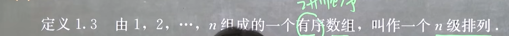

这种是有序排列，3级，因为有3个，123,321,456

要求数字个数一样，否则不是有序

标准排列：123456789

54123，大的数在小的数前面就是逆序。

5后面有几个比他小的数有几个就是有几个逆序数，5后面有4个，4后面有3个，1没有，2没有，3没有，然后加起来，4+3=7

逆序数是奇数，所以是奇排列，偶排列就是逆序数是偶数。

对换

比如把54123，对换成，54213，这就是做了一次对换

性质：

奇偶性会发生改变。