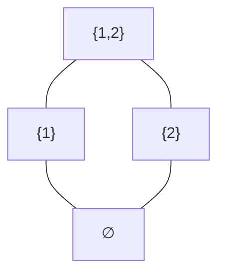
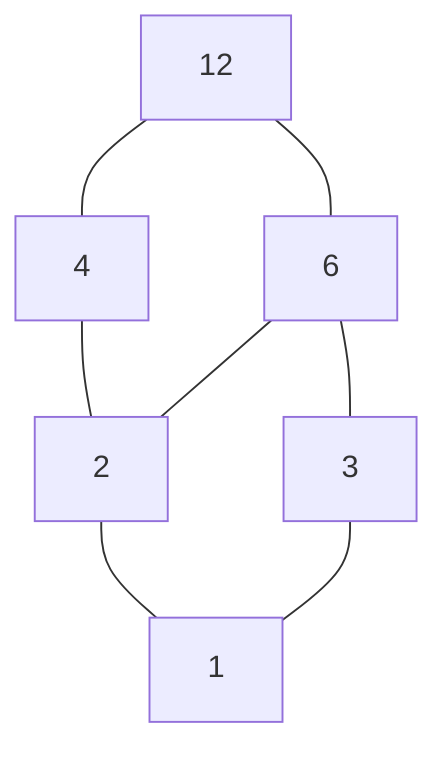
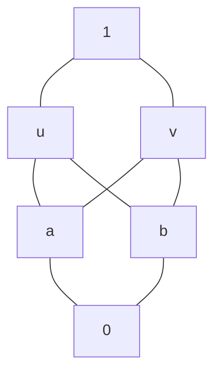
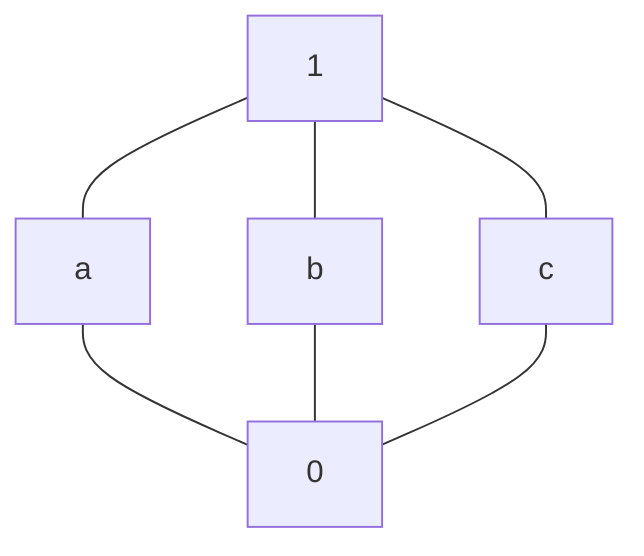

# 7格与布尔代数

- 教材页码：125
- 来源：02324《离散数学》（2014 年版）

> 本讲义根据你提供的第7章考试大纲编写，沿用第6章的讲解方式：从基础概念讲起，配完整例子、图示和判别过程，不另设练习题。上面的教材信息是原笔记信息；下面是讲解与推导，并非教材原文摘录。
>
> 记号约定：$a\wedge b$ 表示最大下界，$a\vee b$ 表示最小上界；有界格的最小元素、最大元素分别记为 $0,1$。这里的 $0,1$ 是角色名称，不一定是数字零和一。

## 本章的学习路线

$$
\text{偏序集}
\xrightarrow{\text{任意两元素有最大下界、最小上界}}
\text{格}
$$

在格的基础上，分开检查两种额外性质：

- 两个格运算满足分配律，就得到**分配格**。
- 格有最小、最大元素，且每个元素都有补元，就得到**有补格**。

同时满足分配和有补条件，就得到**布尔代数**。

分配格与有补格并不是谁一定包含谁。后面会分别给出“分配但无补”和“有补但不分配”的例子。

## 7.1 格的基本概念

### 1. 先复习偏序关系

非空集合 $P$ 上的关系 $\le$，如果满足：

1. **自反性**：对任意 $a\in P$，$a\le a$。
2. **反对称性**：若 $a\le b$ 且 $b\le a$，则 $a=b$。
3. **传递性**：若 $a\le b$ 且 $b\le c$，则 $a\le c$。

则称它为偏序关系，$(P,\le)$ 称为偏序集。

这里的 $\le$ 可以是抽象记号，不一定指数字的“小于等于”。

| 对象 | 偏序关系 | “$a\le b$”怎样理解 |
| --- | --- | --- |
| 整数 | 普通大小关系 | $a$ 不大于 $b$ |
| 集合 | 包含关系 $\subseteq$ | $a$ 的元素全部属于 $b$ |
| 正整数 | 整除关系 $\mid$ | $a$ 能整除 $b$ |

例如，在整除关系下，$2\le6$ 表示 $2\mid6$；但 $2,3$ 互不可比，因为 $2$ 不能整除 $3$，$3$ 也不能整除 $2$。

虽然普通数字大小关系中 $2<3$，也不能把这个结论带进整除偏序里。

### 2. 可比与不可比

若 $a\le b$ 或 $b\le a$，称 $a,b$ **可比**。

若两者都不成立，称它们**不可比**。

如果一个偏序集中，任意两个元素都可比，就叫**全序集**，也常称为**链**。

普通大小关系下的整数集是链；包含关系下的所有子集一般不是链，例如 $\{1\}$ 和 $\{2\}$ 不可比。

**不可比不等于“没有共同上界或下界”。** 例如 $\{1\}$、$\{2\}$ 虽然不可比，但共同上界可以是 $\{1,2\}$，共同下界可以是空集。

### 3. 最大、最小与极大、极小

设 $S$ 是偏序集 $P$ 的一个非空子集。

#### 最大元素

若 $m\in S$，并且对所有 $s\in S$ 都有 $s\le m$，则 $m$ 是 $S$ 的**最大元素**。

它必须与所有元素可比，并且处在所有元素之上。

#### 最小元素

若 $n\in S$，并且对所有 $s\in S$ 都有 $n\le s$，则 $n$ 是 $S$ 的**最小元素**。

#### 极大元素

若 $m\in S$，而且在 $S$ 中找不到严格大于 $m$ 的元素，则 $m$ 是**极大元素**。

它只要求“没有更大的元素”，不要求它大于其他所有元素。其他元素可能与它不可比。

#### 极小元素

若 $n\in S$，而且在 $S$ 中找不到严格小于 $n$ 的元素，则 $n$ 是**极小元素**。

| 概念 | 必须满足什么 | 个数 |
| --- | --- | --- |
| 最大元素 | 大于等于子集中所有元素 | 如果存在，唯一 |
| 极大元素 | 子集中没有严格更大的元素 | 可能有多个 |
| 最小元素 | 小于等于子集中所有元素 | 如果存在，唯一 |
| 极小元素 | 子集中没有严格更小的元素 | 可能有多个 |

#### 例：两个不可比的集合

取 $S=\{\{1\},\{2\}\}$，关系为包含。

两个元素都没有在 $S$ 中的严格上方元素，所以都是极大元素；它们也都是极小元素。

但没有最大元素，也没有最小元素，因为谁也不包含另一个。

**最大必然极大，极大不一定最大；最小必然极小，极小不一定最小。**

### 4. 哈斯图怎样读

有限偏序集常用哈斯图表示。

如果 $a<b$，并且不存在 $c$ 使 $a<c<b$，则称 $b$ 覆盖 $a$，图中在两者之间画线。

通常把较大的元素放在上方，较小的放在下方，不画自反关系，也不画可以通过传递性得到的多余连线。

例如，令 $U=\{1,2\}$，取它的所有子集，关系为包含：

从下向上沿线走，表示包含关系。例如空集在 $\{1\}$ 的下方，$\{1\}$ 又在 $U$ 的下方，因此空集也在 $U$ 的下方。

$\{1\}$ 与 $\{2\}$ 之间没有单调向上的路径，所以不可比。

**图上画得更高，不一定就比较大。必须有沿线向上的路径，才能说明偏序关系。**

连线交叉处如果没有标明节点，也不是新元素。

### 5. 上界和下界：要对所有元素一起成立

设 $S\subseteq P$ 非空。

若 $u\in P$ 且对所有 $s\in S$ 都有 $s\le u$，则 $u$ 是 $S$ 的**上界**。

若 $l\in P$ 且对所有 $s\in S$ 都有 $l\le s$，则 $l$ 是 $S$ 的**下界**。

注意：**上界、下界必须属于整个偏序集 $P$，但不要求属于子集 $S$。**

所有上界组成的集合记作 $\operatorname{UB}_P(S)$，所有下界组成的集合记作 $\operatorname{LB}_P(S)$。

#### 例：包含关系下的上界与下界

令 $U=\{1,2,3\}$，$P=\mathcal P(U)$，取：

$$
S=\{\{1\},\{2\}\}.
$$

上界要同时包含 $\{1\}$ 和 $\{2\}$，因此所有上界为：

$$
\operatorname{UB}_P(S)=\{\{1,2\},\{1,2,3\}\}.
$$

下界要同时包含在 $\{1\}$ 和 $\{2\}$ 中，因此只有空集：

$$
\operatorname{LB}_P(S)=\{\varnothing\}.
$$

这些上界、下界都不在 $S$ 中，但完全合法，因为它们属于 $P$。

### 6. 最小上界和最大下界

#### 最小上界

若 $u$ 是 $S$ 的上界，而且小于等于 $S$ 的每一个上界，则称它为**最小上界**，又称上确界，记作 $\sup S$。

它必须同时满足：

$$
\forall s\in S,\quad s\le u;
\qquad
\forall v\in\operatorname{UB}_P(S),\quad u\le v.
$$

也就是：**先是上界，再是所有上界中的最小元素。**

#### 最大下界

若 $l$ 是 $S$ 的下界，而且大于等于 $S$ 的每一个下界，则称它为**最大下界**，又称下确界，记作 $\inf S$。

它必须同时满足：

$$
\forall s\in S,\quad l\le s;
\qquad
\forall v\in\operatorname{LB}_P(S),\quad v\le l.
$$

也就是：**先是下界，再是所有下界中的最大元素。**

#### 接着计算前面的集合例子

对于 $S=\{\{1\},\{2\}\}$：

$$
\sup S=\{1,2\},\qquad \inf S=\varnothing.
$$

$S$ 本身没有最大、最小元素，但它在 $P$ 中有最小上界、最大下界。这四个概念不能混为一谈。

### 7. 最小上界与最大下界如果存在，必然唯一

若 $u,v$ 都是最小上界，因 $v$ 是上界，而 $u$ 小于等于所有上界，有 $u\le v$。

同理 $v\le u$。由反对称性，$u=v$。

最大下界的唯一性同理。

所以不能说“有两个不同的最小上界”。如果有两个互不可比的极小上界，可能是根本没有最小上界。

### 8. 整除关系中的完整计算例子

取 $12$ 的所有正因数：

$$
D_{12}=\{1,2,3,4,6,12\},
$$

关系为整除：$a\le b$ 表示 $a\mid b$。

哈斯图如下：

#### 计算 $\{2,3\}$ 的上下界

上界必须同时被 $2,3$ 整除，所以是共同倍数。$D_{12}$ 中的上界为 $6,12$。

因为 $6\mid12$，最小上界是 $6$。

下界必须同时整除 $2,3$，所以是共同因数。只有 $1$，故最大下界是 $1$。

因此：

$$
\sup\{2,3\}=6,\qquad\inf\{2,3\}=1.
$$

#### 计算 $\{4,6\}$ 的上下界

共同上界只有 $12$；共同下界为 $1,2$，且 $1\mid2$。

所以：

$$
\sup\{4,6\}=12,\qquad\inf\{4,6\}=2.
$$

在这个因数集合里，最小上界是最小公倍数，最大下界是最大公约数：

$$
\sup\{a,b\}=\operatorname{lcm}(a,b),\qquad
\inf\{a,b\}=\gcd(a,b).
$$

这里的 $\gcd$ 表示最大公约数，$\operatorname{lcm}$ 表示最小公倍数。

这些结果仍然是 $12$ 的因数。但如果任意删去某些因数，就不能保证最小公倍数、最大公约数仍在所给集合中，必须重新判断。

### 9. 有上界，不一定有最小上界

考虑下面的六元素偏序集：

关系由图中从下向上的路径确定：$a,b$ 不可比，$u,v$ 也不可比，但 $a,b$ 都小于 $u,v$。

对于 $\{a,b\}$，上界集合为 $\{u,v,1\}$。

$u,v$ 都是极小上界，但谁也不小于等于另一个，因此上界集合没有最小元素。

所以 $\{a,b\}$ **有上界，却没有最小上界**。

同样，$\{u,v\}$ 的下界集合为 $\{0,a,b\}$，其中 $a,b$ 是两个不可比的极大下界，因此没有最大下界。

这个偏序集即使有整体最小元素 $0$、最大元素 $1$，也不能保证每对元素都有最小上界、最大下界。

### 10. 完全没有上界的情况

取 $P=\{1,2,3\}$，关系为整除。

对于 $\{2,3\}$，$P$ 中没有同时被 $2,3$ 整除的元素，因此没有上界，更没有最小上界。

普通最小公倍数 $6$ 不在 $P$ 中，不能把它拿来当这个偏序集的最小上界。

**判断结果是否存在，必须始终留在题目指定的集合里。**

### 11. 格的第一种定义：偏序定义

非空偏序集 $(L,\le)$，如果任意两个元素 $a,b\in L$ 都有唯一的最大下界和最小上界，则称为**格**。

唯一性实际上由偏序性质保证，因此定义的关键是它们对每一对元素都存在。

记：

$$
a\wedge b=\inf\{a,b\},\qquad
a\vee b=\sup\{a,b\}.
$$

$\wedge$ 称为交、交运算或 meet；$\vee$ 称为并、并运算或 join。

这里叫“交、并”，不表示它们一定是集合交集、并集。它们的实际算法取决于偏序关系。

| 偏序集 | $a\wedge b$ | $a\vee b$ |
| --- | --- | --- |
| 链，关系为通常大小 | $\min(a,b)$ | $\max(a,b)$ |
| 幂集，关系为包含 | $a\cap b$ | $a\cup b$ |
| 一个正整数的所有正因数，关系为整除 | $\gcd(a,b)$ | $\operatorname{lcm}(a,b)$ |

**只要有一对元素缺少最大下界或最小上界，就不是格。**

### 12. 怎样判别一个有限偏序集是不是格

对每一对元素 $a,b$：

1. 找出所有共同上界。
2. 检查共同上界中有没有一个元素小于等于其他所有共同上界。
3. 找出所有共同下界。
4. 检查共同下界中有没有一个元素大于等于其他所有共同下界。

所有元素对都成功，才是格。

若 $a\le b$，则可以直接得到：

$$
a\wedge b=a,\qquad a\vee b=b.
$$

因此有限偏序集的判别，主要工作通常在**不可比元素对**上。相同元素组成的对子也自动成功，因为 $a\wedge a=a\vee a=a$。

不能只检查一两对就宣布是格；否定格则只需要一对反例。

### 13. 三个典型格

#### 例1：每一条非空链都是格

任意两个元素都可比，较小者是最大下界，较大者是最小上界。

例如整数集在普通大小关系下是格：

$$
3\wedge7=3,\qquad3\vee7=7.
$$

虽然整个整数集没有最大元素、最小元素，但每一对元素都有最大下界、最小上界。

**格不强制整个集合有最大、最小元素。**

#### 例2：幂集在包含关系下是格

对任意 $X,Y\subseteq U$，$X\cap Y$ 是最大下界，$X\cup Y$ 是最小上界。

例如 $X=\{1,2\}$、$Y=\{2,3\}$：

$$
X\wedge Y=\{2\},\qquad X\vee Y=\{1,2,3\}.
$$

#### 例3：$D_{12}$ 在整除关系下是格

任意两个 $12$ 的正因数，其最大公约数和最小公倍数仍然是 $12$ 的因数。

因此每一对元素都有所需上下界，构成格。

### 14. 格的基本运算性质

任意格的 $\wedge,\vee$ 都满足以下四类规律：

#### 幂等律

$$
a\wedge a=a,\qquad a\vee a=a.
$$

同一个元素与自己组成的对子，最大下界、最小上界都是它自身。

#### 交换律

$$
a\wedge b=b\wedge a,\qquad a\vee b=b\vee a.
$$

交换两元素的次序，不会改变它们共同的上下界。

#### 结合律

$$
(a\wedge b)\wedge c=a\wedge(b\wedge c),
$$

$$
(a\vee b)\vee c=a\vee(b\vee c).
$$

两种括号分别得到三个元素的最大下界、最小上界，结果一致。

#### 吸收律

$$
a\wedge(a\vee b)=a,\qquad
a\vee(a\wedge b)=a.
$$

因为 $a\le a\vee b$，所以这两个元素的最大下界是 $a$。

因为 $a\wedge b\le a$，所以这两个元素的最小上界也是 $a$。

注意：**每个格都有这四类规律，但不一定有分配律。**

### 15. 格的第二种定义：代数定义

非空集合 $L$ 上有两个封闭的二元运算 $\wedge,\vee$。如果这两个运算满足：

1. 幂等律。
2. 交换律。
3. 结合律。
4. 两条吸收律。

则代数系统 $(L,\wedge,\vee)$ 称为格。

这就把格从“偏序结构”变成了“带两个运算的代数系统”，与上一章衔接起来。

注意，两个运算分别满足幂等、交换、结合还不够，**必须同时检查它们之间的吸收律**。

#### 例：为什么吸收律不能漏掉

在 $L=\{0,1\}$ 上，把两个运算都定义成普通大小下的最小值：

$$
a\wedge b=\min(a,b),\qquad a\vee b=\min(a,b).
$$

两个运算各自都封闭、幂等、交换、结合。

但取 $a=1,b=0$，有：

$$
a\vee(a\wedge b)=\min(1,\min(1,0))=0\ne1=a.
$$

所以这两个规定的运算不构成格的代数系统。

虽然集合 $\{0,1\}$ 在通常大小关系下确实可以成为格，但对应的正确运算应当是 $\min$ 和 $\max$，不是两个 $\min$。

### 16. 两种定义之间的联系

#### 从偏序到运算

已知 $(L,\le)$ 是格，定义：

$$
a\wedge b=\inf\{a,b\},\qquad
a\vee b=\sup\{a,b\}.
$$

由最大下界、最小上界的性质，就能得到幂等、交换、结合、吸收四类规律。

#### 从运算到偏序

已知 $(L,\wedge,\vee)$ 满足代数定义的条件，定义关系：

$$
\boxed{a\le b\iff a\wedge b=a.}
$$

这个关系是偏序，而且原来的 $\wedge,\vee$ 正好是它的最大下界、最小上界运算。

也可以用另一个等价式定义：

$$
\boxed{a\le b\iff a\vee b=b.}
$$

这两条式子很重要：它们把“比较大小”与“运算结果”连接起来。

#### 为什么它是偏序

自反性：由幂等律，$a\wedge a=a$，因此 $a\le a$。

反对称性：若 $a\wedge b=a$ 且 $b\wedge a=b$，由交换律得到 $a=b$。

传递性：若 $a\wedge b=a$、$b\wedge c=b$，则：

$$
a\wedge c=(a\wedge b)\wedge c
=a\wedge(b\wedge c)=a\wedge b=a.
$$

所以 $a\le c$。

#### 为什么两个比较公式等价

若 $a\wedge b=a$，由交换律和吸收律：

$$
a\vee b=b\vee a=b\vee(b\wedge a)=b.
$$

反过来，若 $a\vee b=b$，则：

$$
a\wedge b=a\wedge(a\vee b)=a.
$$

#### 为什么 $a\wedge b$ 是最大下界

由结合、交换、幂等律可得：

$$
(a\wedge b)\wedge a=a\wedge b,
\qquad
(a\wedge b)\wedge b=a\wedge b.
$$

因此 $a\wedge b\le a$，$a\wedge b\le b$，它是共同下界。

若 $c\le a$ 且 $c\le b$，则：

$$
c\wedge(a\wedge b)=(c\wedge a)\wedge b
=c\wedge b=c.
$$

所以 $c\le a\wedge b$，证明它是最大的共同下界。

$a\vee b$ 是最小上界可对偶证明：它大于等于 $a,b$，而任何共同上界 $u$ 都满足：

$$
(a\vee b)\vee u=a\vee(b\vee u)=a\vee u=u,
$$

故 $a\vee b\le u$。

### 17. 格的其他常用性质

#### 上下界关系

$$
a\wedge b\le a\le a\vee b,
\qquad
a\wedge b\le b\le a\vee b.
$$

#### 单调性

若 $a\le b$，则对任意 $c$：

$$
a\wedge c\le b\wedge c,
\qquad
a\vee c\le b\vee c.
$$

意思是：保持另一个输入不变，把一个输入增大，结果不会变小。

#### 对偶性

把偏序方向反过来，最小上界与最大下界交换，$\vee$ 与 $\wedge$ 交换，最大元素与最小元素交换。

很多定理因此成对出现。例如两条吸收律互为对偶。

### 18. 有界格：整个格有最小、最大元素

若格 $L$ 中存在整体最小元素 $0$ 和整体最大元素 $1$，即：

$$
\forall a\in L,\qquad0\le a\le1,
$$

则称它为**有界格**。

在有界格中：

$$
a\wedge0=0,\quad a\vee0=a,
\qquad
a\wedge1=a,\quad a\vee1=1.
$$

联系上一章的术语：

- 对 $\vee$，$0$ 是幺元，$1$ 是零元。
- 对 $\wedge$，$1$ 是幺元，$0$ 是零元。

这些都是运算角色，不是说 $1$ 这个名字不能充当某个运算的零元。

#### 有限非空格一定有界

若 $L=\{a_1,\ldots,a_n\}$ 是有限非空格，则：

$$
0=a_1\wedge\cdots\wedge a_n,\qquad
1=a_1\vee\cdots\vee a_n.
$$

前者小于等于所有元素，后者大于等于所有元素。因此有限非空格一定有最小、最大元素。

但反过来，“有限偏序集有最小、最大元素”不保证它是格，前面的六元素例子已经说明。

无限格也未必有界。例如通常大小关系下的整数格，没有整体最小、最大元素。

## 7.2 分配格与有补格

### 1. 分配格的定义

如果一个格对任意 $a,b,c$ 都满足：

$$
a\wedge(b\vee c)=(a\wedge b)\vee(a\wedge c),
$$

$$
a\vee(b\wedge c)=(a\vee b)\wedge(a\vee c),
$$

则称为**分配格**。

第一条是 $\wedge$ 对 $\vee$ 分配，第二条是 $\vee$ 对 $\wedge$ 分配。

与普通数的加法、乘法不同，这里两个格运算相互分配。

在格中，这两条恒等式对所有元素成立是等价的。理解定义时记住两条；实际计算若能证明其中一条对任意元素成立，也可利用它们的等价性。

若有一组三个元素让其中一条失败，就不是分配格。

### 2. 例1：幂集格是分配格

在 $\mathcal P(U)$ 上，$\wedge=\cap$，$\vee=\cup$。

集合运算满足：

$$
X\cap(Y\cup Z)=(X\cap Y)\cup(X\cap Z),
$$

$$
X\cup(Y\cap Z)=(X\cup Y)\cap(X\cup Z).
$$

因此是分配格。

#### 完整计算一个例子

令 $U=\{1,2,3\}$，取：

$$
X=\{1,2\},\quad Y=\{2\},\quad Z=\{3\}.
$$

第一条分配律的左边：

$$
X\cap(Y\cup Z)=\{1,2\}\cap\{2,3\}=\{2\}.
$$

右边：

$$
(X\cap Y)\cup(X\cap Z)=\{2\}\cup\varnothing=\{2\}.
$$

两边一致。这个计算帮助理解，证明整个系统分配则依靠上述对任意集合成立的集合恒等式，不能只靠这一组例子。

### 3. 例2：每一条链都是分配格

链上的格运算分别是最小值与最大值。

例如要证明第一条分配律，任取 $a,b,c$，不妨设 $b\le c$。

则 $b\vee c=c$，而 $a\wedge b\le a\wedge c$，所以：

$$
a\wedge(b\vee c)=a\wedge c,
$$

$$
(a\wedge b)\vee(a\wedge c)=a\wedge c.
$$

两边相等。若 $c\le b$，同理。另一条分配律作对偶证明。

所以任何链都是分配格，包括普通大小关系下的整数格，以及有限链 $0<a<1$。

### 4. 例3：因数格 $D_{12}$ 是分配格

$12=2^2\cdot3$，每个正因数都可唯一写成：

$$
2^i3^j,\qquad 0\le i\le2,\quad0\le j\le1.
$$

整除关系对应“每个指数都不超过对方的指数”。

求最大公约数，就是分别取各指数的最小值；求最小公倍数，就是分别取各指数的最大值。

由于每个指数所在的链上，最小值、最大值满足分配律，合起来的因数格也满足分配律。

例如 $a=4,b=2,c=3$：

$$
4\wedge(2\vee3)=\gcd(4,6)=2,
$$

$$
(4\wedge2)\vee(4\wedge3)
=\operatorname{lcm}(2,1)=2.
$$

同样的方法可以说明：任何正整数的全部正因数，在整除关系下都构成分配格。

### 5. 反例：五元素菱形格 $M_3$ 不分配

取 $L=\{0,a,b,c,1\}$，其中 $a,b,c$ 两两不可比，且都处在 $0,1$ 之间。

它确实是格：任意两个不同的中间元素，最大下界为 $0$，最小上界为 $1$；其余元素对可比，按较小、较大者计算即可。

但是：

$$
a\wedge(b\vee c)=a\wedge1=a,
$$

$$
(a\wedge b)\vee(a\wedge c)=0\vee0=0.
$$

因为 $a\ne0$，分配律失败。因此它是格，却不是分配格。

**不要把“图看起来像菱形”直接当作不分配的证据。** 前面的四元素幂集格也是菱形形状，却是分配格。这里的反例具有三个两两不可比的中间元素。

### 6. 怎样判别分配格

1. 先确认原系统是格。
2. 确定 $\wedge,\vee$ 的实际算法或运算表。
3. 对任意三元素验证分配律，或者利用已证明的结构结论。
4. 否定时，给出一个具体三元素反例，并算清左右两边。

常用肯定结论：链、幂集格、一个正整数的全部正因数组成的格，都是分配格。

单凭“每个元素都有上下界”或“两个运算都交换、结合”，不能判定分配。

