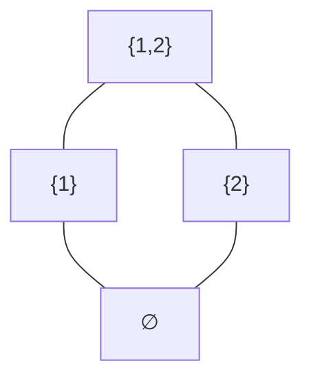
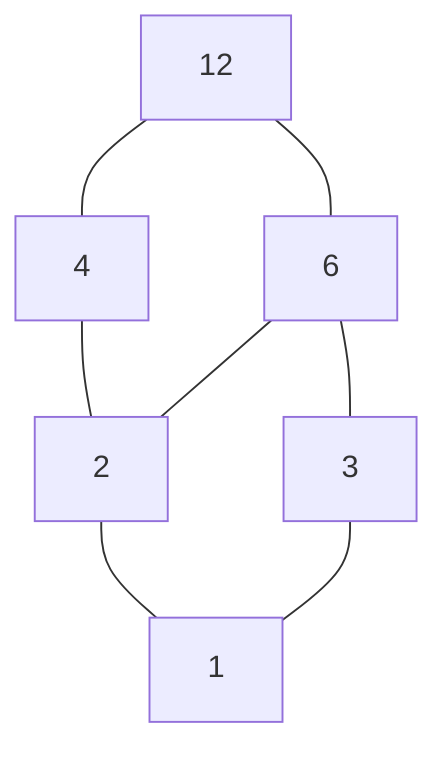
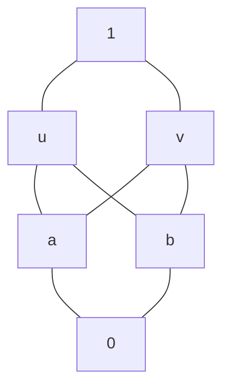

# 7格与布尔代数

- 教材页码：125
- 来源：02324《离散数学》（2014 年版）

> 本讲义根据你提供的第7章考试大纲编写，沿用第6章的讲解方式：从基础概念讲起，配完整例子、图示和判别过程，不另设练习题。上面的教材信息是原笔记信息；下面是讲解与推导，并非教材原文摘录。
>
> 记号约定：$a\wedge b$ 表示最大下界，$a\vee b$ 表示最小上界；有界格的最小元素、最大元素分别记为 $0,1$。这里的 $0,1$ 是角色名称，不一定是数字零和一。

## 本章的学习路线

$$
\text{偏序集}
\xrightarrow{\text{任意两元素有最大下界、最小上界}}
\text{格}
$$

在格的基础上，分开检查两种额外性质：

- 两个格运算满足分配律，就得到**分配格**。
- 格有最小、最大元素，且每个元素都有补元，就得到**有补格**。

同时满足分配和有补条件，就得到**布尔代数**。

分配格与有补格并不是谁一定包含谁。后面会分别给出“分配但无补”和“有补但不分配”的例子。

## 7.1 格的基本概念

### 1. 先复习偏序关系

非空集合 $P$ 上的关系 $\le$，如果满足：

1. **自反性**：对任意 $a\in P$，$a\le a$。
2. **反对称性**：若 $a\le b$ 且 $b\le a$，则 $a=b$。
3. **传递性**：若 $a\le b$ 且 $b\le c$，则 $a\le c$。

则称它为偏序关系，$(P,\le)$ 称为偏序集。

这里的 $\le$ 可以是抽象记号，不一定指数字的“小于等于”。

| 对象 | 偏序关系 | “$a\le b$”怎样理解 |
| --- | --- | --- |
| 整数 | 普通大小关系 | $a$ 不大于 $b$ |
| 集合 | 包含关系 $\subseteq$ | $a$ 的元素全部属于 $b$ |
| 正整数 | 整除关系 $\mid$ | $a$ 能整除 $b$ |

例如，在整除关系下，$2\le6$ 表示 $2\mid6$；但 $2,3$ 互不可比，因为 $2$ 不能整除 $3$，$3$ 也不能整除 $2$。

虽然普通数字大小关系中 $2<3$，也不能把这个结论带进整除偏序里。

### 2. 可比与不可比

若 $a\le b$ 或 $b\le a$，称 $a,b$ **可比**。

若两者都不成立，称它们**不可比**。

如果一个偏序集中，任意两个元素都可比，就叫**全序集**，也常称为**链**。

普通大小关系下的整数集是链；包含关系下的所有子集一般不是链，例如 $\{1\}$ 和 $\{2\}$ 不可比。

**不可比不等于“没有共同上界或下界”。** 例如 $\{1\}$、$\{2\}$ 虽然不可比，但共同上界可以是 $\{1,2\}$，共同下界可以是空集。

### 3. 最大、最小与极大、极小

设 $S$ 是偏序集 $P$ 的一个非空子集。

#### 最大元素

若 $m\in S$，并且对所有 $s\in S$ 都有 $s\le m$，则 $m$ 是 $S$ 的**最大元素**。

它必须与所有元素可比，并且处在所有元素之上。

#### 最小元素

若 $n\in S$，并且对所有 $s\in S$ 都有 $n\le s$，则 $n$ 是 $S$ 的**最小元素**。

#### 极大元素

若 $m\in S$，而且在 $S$ 中找不到严格大于 $m$ 的元素，则 $m$ 是**极大元素**。

它只要求“没有更大的元素”，不要求它大于其他所有元素。其他元素可能与它不可比。

#### 极小元素

若 $n\in S$，而且在 $S$ 中找不到严格小于 $n$ 的元素，则 $n$ 是**极小元素**。

| 概念 | 必须满足什么 | 个数 |
| --- | --- | --- |
| 最大元素 | 大于等于子集中所有元素 | 如果存在，唯一 |
| 极大元素 | 子集中没有严格更大的元素 | 可能有多个 |
| 最小元素 | 小于等于子集中所有元素 | 如果存在，唯一 |
| 极小元素 | 子集中没有严格更小的元素 | 可能有多个 |

#### 例：两个不可比的集合

取 $S=\{\{1\},\{2\}\}$，关系为包含。

两个元素都没有在 $S$ 中的严格上方元素，所以都是极大元素；它们也都是极小元素。

但没有最大元素，也没有最小元素，因为谁也不包含另一个。

**最大必然极大，极大不一定最大；最小必然极小，极小不一定最小。**

### 4. 哈斯图怎样读

有限偏序集常用哈斯图表示。

如果 $a<b$，并且不存在 $c$ 使 $a<c<b$，则称 $b$ 覆盖 $a$，图中在两者之间画线。

通常把较大的元素放在上方，较小的放在下方，不画自反关系，也不画可以通过传递性得到的多余连线。

例如，令 $U=\{1,2\}$，取它的所有子集，关系为包含：

从下向上沿线走，表示包含关系。例如空集在 $\{1\}$ 的下方，$\{1\}$ 又在 $U$ 的下方，因此空集也在 $U$ 的下方。

$\{1\}$ 与 $\{2\}$ 之间没有单调向上的路径，所以不可比。

**图上画得更高，不一定就比较大。必须有沿线向上的路径，才能说明偏序关系。**

连线交叉处如果没有标明节点，也不是新元素。

### 5. 上界和下界：要对所有元素一起成立

设 $S\subseteq P$ 非空。

若 $u\in P$ 且对所有 $s\in S$ 都有 $s\le u$，则 $u$ 是 $S$ 的**上界**。

若 $l\in P$ 且对所有 $s\in S$ 都有 $l\le s$，则 $l$ 是 $S$ 的**下界**。

注意：**上界、下界必须属于整个偏序集 $P$，但不要求属于子集 $S$。**

所有上界组成的集合记作 $\operatorname{UB}_P(S)$，所有下界组成的集合记作 $\operatorname{LB}_P(S)$。

#### 例：包含关系下的上界与下界

令 $U=\{1,2,3\}$，$P=\mathcal P(U)$，取：

$$
S=\{\{1\},\{2\}\}.
$$

上界要同时包含 $\{1\}$ 和 $\{2\}$，因此所有上界为：

$$
\operatorname{UB}_P(S)=\{\{1,2\},\{1,2,3\}\}.
$$

下界要同时包含在 $\{1\}$ 和 $\{2\}$ 中，因此只有空集：

$$
\operatorname{LB}_P(S)=\{\varnothing\}.
$$

这些上界、下界都不在 $S$ 中，但完全合法，因为它们属于 $P$。

### 6. 最小上界和最大下界

#### 最小上界

若 $u$ 是 $S$ 的上界，而且小于等于 $S$ 的每一个上界，则称它为**最小上界**，又称上确界，记作 $\sup S$。

它必须同时满足：

$$
\forall s\in S,\quad s\le u;
\qquad
\forall v\in\operatorname{UB}_P(S),\quad u\le v.
$$

也就是：**先是上界，再是所有上界中的最小元素。**

#### 最大下界

若 $l$ 是 $S$ 的下界，而且大于等于 $S$ 的每一个下界，则称它为**最大下界**，又称下确界，记作 $\inf S$。

它必须同时满足：

$$
\forall s\in S,\quad l\le s;
\qquad
\forall v\in\operatorname{LB}_P(S),\quad v\le l.
$$

也就是：**先是下界，再是所有下界中的最大元素。**

#### 接着计算前面的集合例子

对于 $S=\{\{1\},\{2\}\}$：

$$
\sup S=\{1,2\},\qquad \inf S=\varnothing.
$$

$S$ 本身没有最大、最小元素，但它在 $P$ 中有最小上界、最大下界。这四个概念不能混为一谈。

### 7. 最小上界与最大下界如果存在，必然唯一

若 $u,v$ 都是最小上界，因 $v$ 是上界，而 $u$ 小于等于所有上界，有 $u\le v$。

同理 $v\le u$。由反对称性，$u=v$。

最大下界的唯一性同理。

所以不能说“有两个不同的最小上界”。如果有两个互不可比的极小上界，可能是根本没有最小上界。

### 8. 整除关系中的完整计算例子

取 $12$ 的所有正因数：

$$
D_{12}=\{1,2,3,4,6,12\},
$$

关系为整除：$a\le b$ 表示 $a\mid b$。

哈斯图如下：

#### 计算 $\{2,3\}$ 的上下界

上界必须同时被 $2,3$ 整除，所以是共同倍数。$D_{12}$ 中的上界为 $6,12$。

因为 $6\mid12$，最小上界是 $6$。

下界必须同时整除 $2,3$，所以是共同因数。只有 $1$，故最大下界是 $1$。

因此：

$$
\sup\{2,3\}=6,\qquad\inf\{2,3\}=1.
$$

#### 计算 $\{4,6\}$ 的上下界

共同上界只有 $12$；共同下界为 $1,2$，且 $1\mid2$。

所以：

$$
\sup\{4,6\}=12,\qquad\inf\{4,6\}=2.
$$

在这个因数集合里，最小上界是最小公倍数，最大下界是最大公约数：

$$
\sup\{a,b\}=\operatorname{lcm}(a,b),\qquad
\inf\{a,b\}=\gcd(a,b).
$$

这里的 $\gcd$ 表示最大公约数，$\operatorname{lcm}$ 表示最小公倍数。

这些结果仍然是 $12$ 的因数。但如果任意删去某些因数，就不能保证最小公倍数、最大公约数仍在所给集合中，必须重新判断。

### 9. 有上界，不一定有最小上界

考虑下面的六元素偏序集：

关系由图中从下向上的路径确定：$a,b$ 不可比，$u,v$ 也不可比，但 $a,b$ 都小于 $u,v$。

对于 $\{a,b\}$，上界集合为 $\{u,v,1\}$。

$u,v$ 都是极小上界，但谁也不小于等于另一个，因此上界集合没有最小元素。

所以 $\{a,b\}$ **有上界，却没有最小上界**。

同样，$\{u,v\}$ 的下界集合为 $\{0,a,b\}$，其中 $a,b$ 是两个不可比的极大下界，因此没有最大下界。

这个偏序集即使有整体最小元素 $0$、最大元素 $1$，也不能保证每对元素都有最小上界、最大下界。

### 10. 完全没有上界的情况

取 $P=\{1,2,3\}$，关系为整除。

对于 $\{2,3\}$，$P$ 中没有同时被 $2,3$ 整除的元素，因此没有上界，更没有最小上界。

普通最小公倍数 $6$ 不在 $P$ 中，不能把它拿来当这个偏序集的最小上界。

**判断结果是否存在，必须始终留在题目指定的集合里。**

### 11. 格的第一种定义：偏序定义

非空偏序集 $(L,\le)$，如果任意两个元素 $a,b\in L$ 都有唯一的最大下界和最小上界，则称为**格**。

唯一性实际上由偏序性质保证，因此定义的关键是它们对每一对元素都存在。

记：

$$
a\wedge b=\inf\{a,b\},\qquad
a\vee b=\sup\{a,b\}.
$$

$\wedge$ 称为交、交运算或 meet；$\vee$ 称为并、并运算或 join。

这里叫“交、并”，不表示它们一定是集合交集、并集。它们的实际算法取决于偏序关系。

| 偏序集 | $a\wedge b$ | $a\vee b$ |
| --- | --- | --- |
| 链，关系为通常大小 | $\min(a,b)$ | $\max(a,b)$ |
| 幂集，关系为包含 | $a\cap b$ | $a\cup b$ |
| 一个正整数的所有正因数，关系为整除 | $\gcd(a,b)$ | $\operatorname{lcm}(a,b)$ |

**只要有一对元素缺少最大下界或最小上界，就不是格。**

### 12. 怎样判别一个有限偏序集是不是格

对每一对元素 $a,b$：

1. 找出所有共同上界。
2. 检查共同上界中有没有一个元素小于等于其他所有共同上界。
3. 找出所有共同下界。
4. 检查共同下界中有没有一个元素大于等于其他所有共同下界。

所有元素对都成功，才是格。

若 $a\le b$，则可以直接得到：

$$
a\wedge b=a,\qquad a\vee b=b.
$$

因此有限偏序集的判别，主要工作通常在**不可比元素对**上。相同元素组成的对子也自动成功，因为 $a\wedge a=a\vee a=a$。

不能只检查一两对就宣布是格；否定格则只需要一对反例。

### 13. 三个典型格

#### 例1：每一条非空链都是格

任意两个元素都可比，较小者是最大下界，较大者是最小上界。

例如整数集在普通大小关系下是格：

$$
3\wedge7=3,\qquad3\vee7=7.
$$

虽然整个整数集没有最大元素、最小元素，但每一对元素都有最大下界、最小上界。

**格不强制整个集合有最大、最小元素。**

#### 例2：幂集在包含关系下是格

对任意 $X,Y\subseteq U$，$X\cap Y$ 是最大下界，$X\cup Y$ 是最小上界。

例如 $X=\{1,2\}$、$Y=\{2,3\}$：

$$
X\wedge Y=\{2\},\qquad X\vee Y=\{1,2,3\}.
$$

#### 例3：$D_{12}$ 在整除关系下是格

任意两个 $12$ 的正因数，其最大公约数和最小公倍数仍然是 $12$ 的因数。

因此每一对元素都有所需上下界，构成格。

