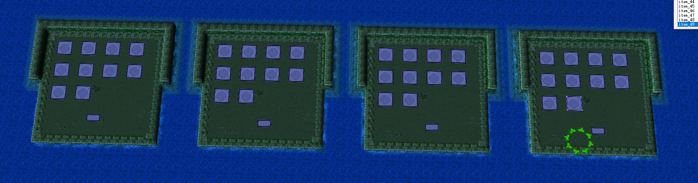
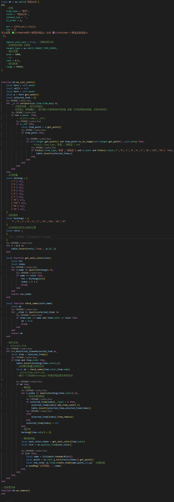
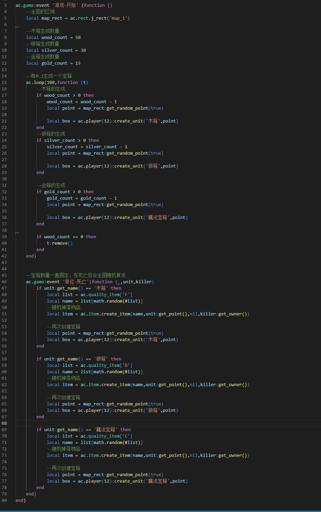

- 物品合成

- 物品一共10个等级，两个一样的使用宠物助手的技能合成后会进阶到下一个品级

- 只有相同的物品可以合成

- 英雄身上持有相同的物品会自动合成

- 这样玩家就不可以持有相同的物品

- 这样玩家会考虑更多的词条的搭配

- 会牺牲装备等级使用更低的装备词条

- 物品获取

- 全图会随机生成宝箱

- 木箱

- 开局可以慢慢打，在5分钟后要可以秒杀

- 奖励

- 掉落一个F级装备

- 银箱

- 5分钟后要可以打得动

- 奖励

- 掉落一个D级装备

- 金箱

- 数据上要求玩家在10分钟后才能打得动

- 20分钟左右可以秒杀，如果不可以则发育慢或数值有问题

- 奖励

- 掉落一个C级装备

- 宝箱生成数量

- 木箱全图生成50个

- 银箱全图生成30个

- 金箱全图生成15个

- 代码实现

