# **尤克里里是什么？**

特点：声音清脆、美妙、全年龄都可以学习、携带方便、相比吉他要明亮像八音盒

曲目：流行、扫弦、独奏、

# **尤克里里的由来？**

1879年，葡萄牙带着这个乐器去移民去到了夏威夷群岛种甘蔗，这就开始了传播。国王举办了尤克里里音乐比赛，第一名有奖励。几乎所有人都开始了乐器练习。传统吉他的制作商开始了尤克里里的制造传播了全世界。在夏威夷群岛的日本移民带着这个乐器火遍了日本之后，传播到了亚洲，包括中国。

# **尤克里里的尺寸与特点？**

第一种：26寸（综合能力较强）

第二种：23寸（常用）

第三种：21寸（小朋友用） 

# **尤克里里的琴形和选购？**

- 1.缺角型

- 2.葫芦型(常见)

- 3.菠萝型（常见）

# **尤克里里的材质和选购？**

**常见的木材：**

1. 沙比利夹板、玫瑰木做的指板（中频好、反射快）

1. 云杉沙比利夹板

1. 虎纹桃花芯（中端的）

1. 夏威夷相思木（最高端、最贵）

- 实木做的尤克里里比夹板的好。

- 背后鼓动特殊的技术，可以提高共鸣。

- 工艺技术：鲍贝镶嵌工艺

# **认识尤克里里的构造？**

- 琴头：四个旋钮

- 琴颈：

- 品丝：

- 琴弦：特别柔和、按的很轻松

- 琴枕

- 琴床

- 背板

- 内部看是单板会效果更好

# **尤克里里的常用工具？**

- 变调夹

- 背带

- 调音器

# **如何用调音器？**

1. A

1. E

1. C

1. G

# **音的排列顺序？**

**CDEFGAB**

# **尤克里里的抚琴方法？**

把尤克里里斜竖起来比较适合，眼睛要看到指板。

# **尤克里里的弹奏方法？**

- 拇指弹奏法

- 分解和弦法

- 扫弦方法

# **认识尤克里里的谱子？**

- 四条线从下往上是一弦到四弦

- 线上的数字代表品位

# **尤克里里的音阶练习？**

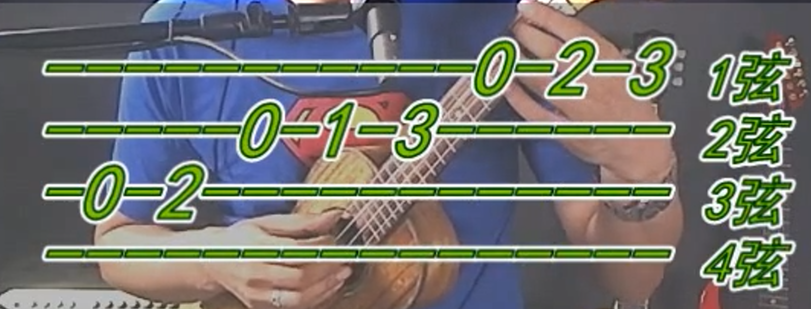

# **左右手的配合练习？**

# **单音练习圣诞铃声**

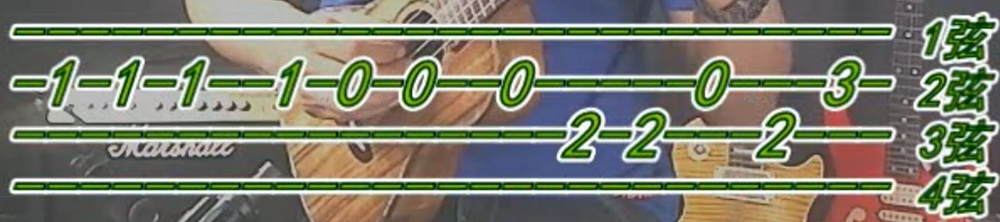

# **小星星练习**

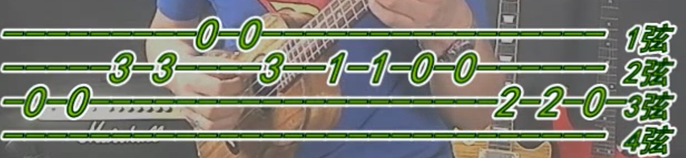

# **沁蜜蜂练习**

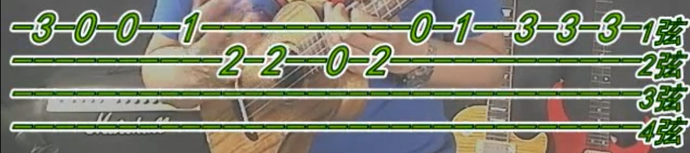

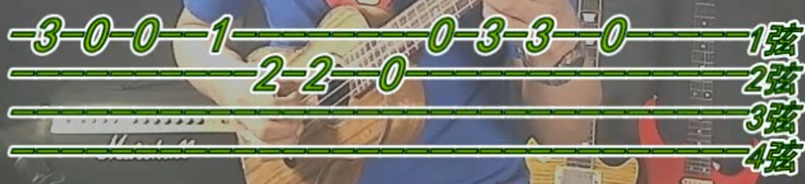

# 小毛驴旋律练习

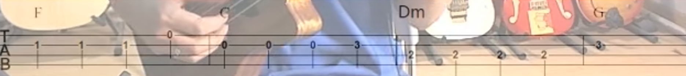

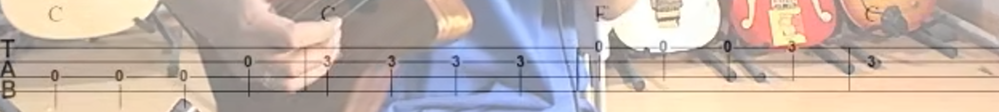

# 找朋友旋律练习

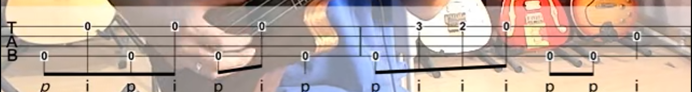

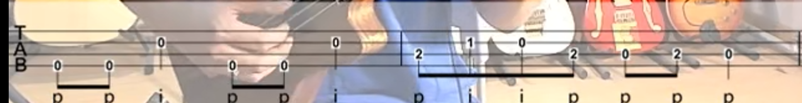

# 生日快乐

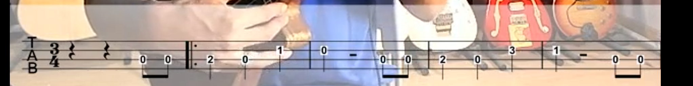

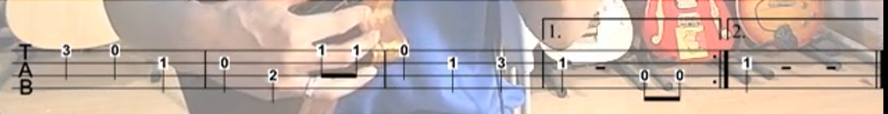

# 可惜不是你

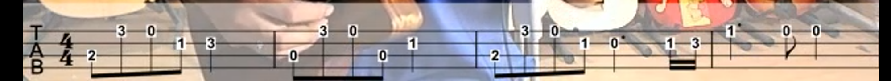

